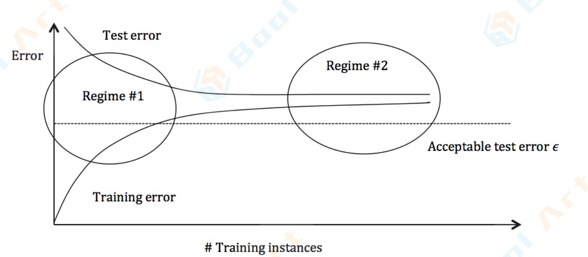

## 梯度下降

- 梯度下降 GD
- 随机梯度下降SGD

为什么可以用梯度下降法？

因为**逻辑回归的损失函数L是一个连续的凸函数**(conveniently convex)。这样的函数的特征是，**它只会有一个全局最优的点，不存在局部最优**。对于GD跟SGD最大的潜在问题就是它们可能会陷入局部最优。

然而这个问题在逻辑回归里面就不存在了，因为它的损失函数的良好特性，导致它并不会有好几个局部最优。当我们的GD跟SGD收敛以后，我们得到的极值点一定就是全局最优的点，因此我们可以放心地用GD跟SGD来求解。

## 什么是模型的可解释性

[线性回归，逻辑回归，GLM的模型可解释性](https://zhuanlan.zhihu.com/p/110886609)

模型在训练的过程中会学习到偏差（Bias），使得模型的泛化性能变差。模型的可解释性如果比较强的话，就可以协助这个debug偏差的过程，协助模型调优。

这个问题在借贷问题上的例子可以这么说：你的业务目标是要借钱给好人，但仅仅用机器学习的approach你只能做到最小化逾期率，但你同时也要考虑到需要消除对特定客群的偏见，所以我们不仅需要最小化模型的损失函数，更要在合规、低风险的情况下尽可能的促进业务增长，这仅仅用模型的损失函数来评价显然是做不到的。

### 怎么来评估模型解释性？

1. 精准性：在未知数据集也能够很好的解释问题
2. 一致性：对于不同模型相似的预测结果解释偏差不大
3. 稳定性：对于相似输入数据的预测解释偏大不大
4. 置信度：解释中包含对于预测结果的置信度
5. 重要程度：解释每个特征对于模型结果的预测影响度
6. 稀有度：当输入数据来自于之间没见过的数据集，解释是否能够体现这一点？（比如置信度低）
7. 表达性：模型的解释能覆盖到多少样本？是针对模型的解释还是只能覆盖到一小部分样本？

### 什么是（好的）模型解释性？

- **解释是有对比性的**

  在二分类选择任务中，我们往往关心的不是为什么选择这一项，而是**为什么是不选择**另一项。

  比如在贷款场景中，如果我们的进件被拒绝，我们一般关心的怎么样才能被接受，而不是为什么我们被拒绝。相对来说**对比性的解释更容易被人理解**，

  比如当解释为什么一个药物在病人身上不起作用时，完整性的解释可能是：他已经有其他疾病10年，有11个过度表达的基因，代谢速度过快等等。而对比性的解释则可以直接说，病人有11个过度表达的基因导致药物有效性减少。

  **最好的解释往往是从样本间最大的差别特征上着手的**。

- **解释应该有泛化能力**

  比如对于一个狗子来说体重越大体积越大，那么这个定律应该对于其他样本也能够适用。

### 逻辑回归的可解释性

逻辑回归最大的特点就是可解释性很强。

在模型训练完成之后，我们获得了一组n维的权重向量$$
w
$$和偏差$$b$$。

对于权重向量$$
w
$$，它的每一个维度的值，代表了这个维度的特征对于最终分类结果的贡献大小。假如这 个维度是正，说明这个特征对于结果是有正向的贡献，那么它的值越大，说明这个特征对于分类为正起 到的作用越重要。

对于偏差$$
b
$$(Bias)，一定程度代表了正负两个类别的判定的容易程度。假如$$
b
$$是0，那么正负类别是均匀 的。如果$$
b
$$大于0，说明它更容易被分为正类，反之亦然。

根据逻辑回归里的权重向量在每个特征上面的大小，就能够对于每个特征的重要程度有一个量化的清楚 的认识，这就是为什么说逻辑回归模型有着很强的解释性的原因。

## 方差和偏差

### 方差和偏差的权衡

**泛化：** 指模型在新数据上的表现。

**过度拟合**是泛化的相关概念：如果模型有很小的训练误差，但是很高的泛化误差， 这种情况往往是过度拟合

上图绘制了训练误差和测试误差，可以分为两种情况。

- 在第一种情况下（图的左侧）过拟合，训练误差低于所需的误差阈值（由$$\epsilon$$表示），但测试误差明显更高，这是因为高方差
- 在第二种情况下（图的右侧）欠拟合，测试误差非常接近训练误差，但都高于期望的$$\epsilon$$值，这是因为高偏差。

#### 高方差 —— 过拟合

表现：

- 训练误差远低于测试误差
- 训练误差低于$$\epsilon$$值 
- 测试误差大于$$\epsilon$$值

改进措施：

- 添加更多训练数据
- 降低模型复杂度——复杂模型容易出现高方差
- 集成学习Bagging

#### 高偏差 —— 欠拟合

所使用的模型不够稳健，无法产生准确的预测

表现：

- 训练误差高于$$\epsilon$$值 

改进措施

- 使用更复杂的模型（例如内核化，使用非线性模型） 
- 增加特征
- 集成学习Boosting

#### 集成算法Bagging和Boosting

[Bagging，Boosting二者之间的区别](https://www.cnblogs.com/earendil/p/8872001.html)

样本选择上：

Bagging：训练集是在原始集中有放回选取的，从原始集中选出的各轮训练集之间是独立的。

Boosting：每一轮的训练集不变，只是训练集中每个样例在分类器中的权重发生变化。而权值是根据上一轮的分类结果进行调整。

样例权重：

Bagging：使用均匀取样，每个样例的权重相等

Boosting：根据错误率不断调整样例的权值，错误率越大则权重越大。

预测函数：

Bagging：所有预测函数的权重相等。

Boosting：每个弱分类器都有相应的权重，对于分类误差小的分类器会有更大的权重。

并行计算：

Bagging：各个预测函数可以并行生成

Boosting：各个预测函数只能顺序生成，因为后一个模型参数需要前一轮模型的结果。

==**为什么说bagging是减少variance，而boosting是减少bias**== 

- Bagging：若各子模型独立，则有$$\operatorname{Var}\left(\frac{\sum X_{i}}{n}\right)=\frac{\operatorname{Var}\left(X_{i}\right)}{n}$$，此时可以显著降低variance。若各子模型完全相同，则$$Var(\frac{\sum X_i}{n})=Var(X_i)$$，此时不会降低variance。

  bagging方法得到的各子模型是有一定相关性的，属于上面两个极端状况的中间态，因此可以一定程度降低variance。

  **若子模型独立，则方差显著降低；否则方差不会降低。而bagging方法训练集重采样能给各子模型带来一定独立性的，属于上面两个极端状况的中间态，因此可以一定程度降低方差**。

- Boosting：是用forward-stagewise这种贪心算法去最小化损失函数。所谓forward-stagewise，就是在迭代的第n步，求解新的子模型f(x)及步长a（或者叫组合系数），来最小化最小化损失函数。

  因此boosting是在sequential地最小化损失函数，其bias自然逐步下降。但由于是采取这种sequential、adaptive的策略，各子模型之间是强相关的，于是子模型之和并不能显著降低variance。所以说boosting主要还是靠降低bias来提升预测精度。

  **Boosting用贪心算法根据模型损失函数的负梯度信息去最小化损失函数，使得偏差逐步下降。但由于是采取sequential顺序策略，各子模型之间是强相关的，于是子模型之和并不能显著降低方差**。

### 控制方差与偏差权衡的方法

#### L1正则化与L2正则化

L1正则化和L2正则化：

L1正则化就是在loss function后边所加正则项为L1范数，加上L1范数容易得到**稀疏**解（0比较多）。

L2正则化就是loss function后边所加正则项为L2范数的平方，加上L2正则相比于L1正则来说，得到的解比较**平滑**（不是稀疏），但是同样能够保证解中接近于0（但不是等于0，所以相对平滑）的维度比较多，降低模型的复杂度。

L2正则存在的意义就是**加速权重衰减的速度，也就是加大了对权重的惩罚**。

那么接下来我们思考一个问题。假设我们知道L1正则的稀疏性要比L2正则的稀疏性好，那么我们为什么要对这种稀疏性趋之若鹜呢？

我们对稀疏规则趋之若鹜的一个关键原因在于它能实现特征的自动选择。

一般来说，大部分特征 x_i 都是和最终的输出 y_i 没有关系或者不提供任何信息的。在最小化目标函数的时候考虑 x_i 这些额外的特征，虽然可以获得更小的训练误差，但在预测新的样本时，这些没用的特征权重反而会被考虑，从而干扰了对正确 y_i 的预测。

L1 正则化的引入就是为了完成特征自动选择的使命，它会学习地去掉这些无用的特征，也就是把这些特征对应的权重置为 0。

- ==**L1正则化可以产生稀疏权值矩阵，即产生一个稀疏模型，可以用于特征选择；一定程度上，L1也因为减少模型复杂度而防止过拟合**==。
- ==**L2正则化加大了对权重的惩罚，即防止某个特征的权重过大、模型对某个特征过分敏感，从而防止模型过拟合（overfitting）**==。

- 对于线性回归模型，使用L1正则化的模型建叫做Lasso回归（套索回归），使用L2正则化的模型叫做Ridge回归（岭回归）。

**降低过拟合程度** 

正则化之所以能够降低过拟合的原因在于，正则化是结构风险最小化的一种策略实现。

结构风险最小化：在经验风险最小化的基础上（也就是训练误差最小化)，尽可能采用简单的模型，以此提高泛化预测精度。

给loss function加上正则化项，能使得新得到的优化目标函数h=f+normal，需要在f和normal中做个权衡（trade-off)，如果还像原来只优化f的情况下，那可能得到一组解比较复杂，使得正则项normall比较大，那么h就不是最优的，因此可以看出加正则项能让解更加简单，符合奥卡姆剃刀理论，同时也比较符合在差和方差（方差表示模型的复杂度）分析中，通过降低模型复杂度，得到更小的泛化误差，降低过拟合程度。

L1正则化可以产生稀疏权值矩阵，即产生一个稀疏模型，可以用于特征选择；一定程度上，L1也因为减少模型复杂度而防止过拟合。

L2正则化加大了对权重的惩罚，即防止某个特征的权重过大、模型对某个特征过分敏感，从而防止模型过拟合（overfitting）。

#### L1为什么能稀疏并因此过拟合

1. 为什么一个小的L1规范给出了一个稀疏的解决方案？
2. 为什么稀疏解决方案能避免过拟合？
3. 为什么正规化确实可以起作用？

https://vimsky.com/article/3852.html

L2正则相当于用圆去逼近目标，而L1正则相当于用菱形去逼近目标，所以更容易引起交点在坐标轴上即得到稀疏解。

## QA

https://blog.csdn.net/weixin_45255694/article/details/116719161

https://blog.csdn.net/ChouIno/article/details/113933903

### 为什么不能直接用线性回归做分类？

- 部分理解可参考为什么不用线性回归解决分类问题； 
- 尝试从损失函数梯度的角度理解；

### 多重共线性变量会给逻辑回归带来什么问题？为什么？怎么处理？

共线性，指多元回归模型中，各自变量之中至少有两个完全或高度相关。

带来的问题和原因

- 无法拒绝一个错误的原假设。因为共线性扩大了回归系数方差，降低了t值，使得回归系数不显著。
- 影响特征的可解释性。自变量之间的强相关，可能导致回归系数的正负方向与真实的相反。

处理多重共线性的原则：

1. 多重共线性是普遍存在的，轻微的多重共线性问题可不采取措施；
2. 严重的多重共线性问题，一般可根据经验或通过分析回归结果发现。如影响系数符号，重要的解释变量t值很低。要根据不同情况采取必要措施。
3. 如果模型仅用于预测，则只要拟合程度好，可不处理多重共线性问题。存在多重共线性的模型用于预测时，往往不影响预测结果。

解决方法：

1. 加样本或使用较好质量的数据

2. 对模型施加某些约束条件；

3. 删除一个或几个共线变量；

4. 将模型适当变形；

5. PCA降维

   当采起主成分提取了新的变量后，这些变量间的组内差别小而组间差别大，起到了消除共线性的作用。

6. 逐步回归法

   将逐个引入自变量，引入的条件是该自变量经F检验是显著的，每引入一个自变量后，对已选入的变量进行逐个检验，若是原来引入的变量因为后面变量的引入而变得再也不显著，那么就将其剔除。引入一个变量或从回归方程中剔除一个变量，为逐步回归的一步，每一步都要进行F检验，以确保每次引入新变量以前回归方程中只包含显著的变量。这个过程反复进行，直到既没有不显著的自变量选入回归方程，也没有显著自变量从回归方程中剔除为止。

   第一：创建所有变量的回归方程
   第二：分别创建单独的回归方程，依照t检验和拟合度依次加入各变量来构建回归方程
   第三：判断新引入的变量，对于以前的系数影响是否显著，是否符合实际以及对于拟合度的变量，来选择是否将变量引入模型中。

7. L2正则化（岭回归）

   L2正则化加大了对权重的惩罚，可以防止某个特征的权重过大、模型对某个特征过分敏感

### L1与L2正则化会给模型带来什么影响，为什么？

- L1正则化可以产生稀疏权值矩阵，即产生一个稀疏模型，可以用于特征选择；一定程度上，L1也因为减少模型复杂度而防止过拟合。
- L2正则化加大了对权重的惩罚，即防止某个特征的权重过大、模型对某个特征过分敏感，从而防止模型过拟合（overfitting）。

### 逻辑回归本身只具备线性的表达能力，如何让模型学会非线性关系？

使用核技巧（kernel trick）

