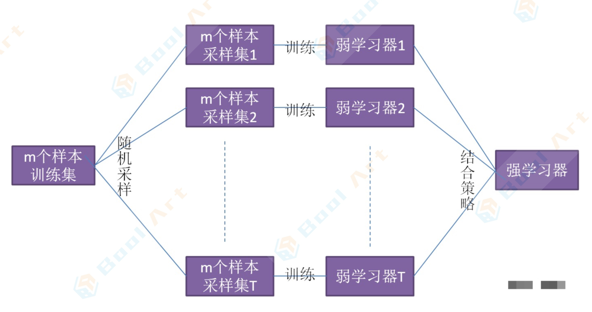

## 熵

### 信息熵

**熵**：表示随机变量的不确定性。

**条件熵**：在一个条件下，随机变量的不确定性。

**信息增益**：`熵-条件熵`。表示在一个条件下，信息不确定性减少的程度。

通俗地讲，X（明天下雨）是一个随机变量，X的熵可以算出来，Y(明天阴天)也是随机变量，在阴天情况下下雨的信息熵我们如果也知道的话（此处需要知道其联合概率分布或是通过数据估计)即是条件熵。

X的熵减去Y条件下X的熵，就是信息增益。具体解释：原本明天下雨的信息熵是2，条件熵是0.01（因为如果知道明天是阴天，那么下雨的概率很大，信息量少)，这样相减后为1.99。在获得阴天这个信息后，下 雨信息不确定性减少了1.99，不确定减少了很多，所以信息增益大。也就是说，阴天这个信息对明天下雨这一推断来说非常重要。

所以在特征选择的时候常常用信息增益，如果IG（信息增益大)的话那么这个特征对于分类来说很关键，
决策树就是这样来找特征的。

**信息熵**

衡量一种语言的效率，甚至可以定量分析。
表征符号系统中单位符号平均信息量的指标——信息熵
$$
\text { 信息熵 }=-\sum_{i=1}^{n} p_{i} \log _{2} p_{i}
$$
公式里出现的$$p_i$$：是指某种符号系统中，某个符号出现的频率。

能影响信息熵的有两个因素：一个是符号的多少，另一个是符号的频率分布。

- 为什么符号越多信息熵越大，也就是单个符号提供的信息越多。

  你可以设想，英语不是26个字母，而是有1000个字母了。那么，即使元音字母还是只有a，e，i，0，u这5个，而每个单词要求至少有一个元音字母，那么用1000个字母，你也可能构造出1000×5×2=10000个两个字母的单词。而大学英语六级的词汇量也就是6000左右，1万个单词已经非常多了。如果考虑三个字母的组合，那就够用了。

  所以，英语文章如果可以用1000个字母的系统改写，那么几乎其中所有单词都可以用3个或更少的字母的组合来表示，这本书将大大变薄，所以单个字母的信息量是不是就增加非常多？
  而汉字系统，恰恰有点像有几千个字母的拼写系统，所以中文单个字的信息熵会比字母会高。

- 为什么符号频率越均匀，信息熵越高。

  这是因为符号频率越均匀，说明符号前后出现的关联性越小，也就是每个符号都很关键，都不能丢，所以符号信息量大。反之，符号出现的关联越强，则有些符号就可以省略了，说明这些符号提供的信息少。

  比如，英语里，很多单词拼写中的字母组合是经常一起出现的，比如ing等。这些组合中，你即使丢 掉了一个字母，也不妨碍你阅读。

  而中文的话，字与字之间的关联就小多了，一句话丢掉很多字的话，这句话的意思就很难还原了。而关联小，也就是字与字之间出现的频率差距不大，你不容易猜到下一个字，这时，每个字提供的信息量就大。

为什么香农对这个表征信息量大小的这个指标命名为“信息熵”？它与物理中的“熵”有何联系？

物理中的”熵“一种直观的定义就是表征一个系统的混乱程度，越混乱，熵值越大；越有序，则熵值越低。

那在信息熵中，为什么语言越”混乱“，信息量也越大？这一点还是可以从语言的上下文关联度来考虑。比如英语单词中的字母相关度是很高的，之前提到过的ing，tion，还有等等各种前缀后缀。

因为相关度大，那么你看到ing或者在tion这样的后缀组合里拿掉一个字母，完全不影响阅读，说明这些组合中单个字母提供的信息量很小。而中文的上下文关联度就低很多，所以单个汉字信息量大。

而上下文关联度高，也可以理解为符号系统越”有序“，而关联度小就是越“无序”，所以把信息量用“熵”来命名再恰当不过了，它确实与物理中的熵有许多类似性质。

### 条件熵

信息熵是考虑该随机变量的所有可能取值，即所有可能发生事件所带来的信息量的期望。公式如下：
$$
H(X)=-\sum_{i=1}^{n} p\left(x_{i}\right) \log p\left(x_{i}\right)
$$
条件熵 *H(X|Y)* 表示在已知随机变量*Y*的条件下，随机变量 X 的不确定性。

条件熵𝐻(X|Y)相当于联合熵𝐻(𝑋,𝑌)减去单独的熵𝐻(Y)，即𝐻(X|Y)=𝐻(𝑋,𝑌)−𝐻(Y)

条件熵的定义是：在给定条件 𝑌 下，X 的条件概率分布的熵对 Y 的数学期望：
$$
\begin{aligned}
H(X \mid Y) &=\sum_{y} p(y) H(X \mid Y=y) \\
&=-\sum_{y} p(y) \sum_{x} p(x \mid y) \log (p(x \mid y)) \\
&=-\sum_{y} \sum_{x} p(x, y) \log (p(x \mid y)) \\
&=-\sum_{x, y} p(x, y) \log (p(x \mid y))
\end{aligned}
$$

### 信息增益

在决策树算法的学习过程中，信息增益定义为一个特征能够为分类系统带来多少信息，带来的信息越多，说明该特征越重要，相应的信息增益也就越大。

信息熵是代表随机变量的复杂度（不确定度）；条件熵代表在某一个条件下，随机变量的复杂度（不确定度)。

而我们的信息增益恰好是：`信息熵-条件熵`。

换句话说，信息增益代表了在一个条件下，信息复杂度（不确定性）减少的程度。

那么我们现在也很好理解了，在决策树算法中，我们的关键就是每次选择一个特征，特征有多个，那么到底按照什么标准来选择哪一个特征。

这个问题就可以用信息增益来度量。如果选择一个特征后，信息增益最大（信息不确定性减少的程度最 大)，那么我们就选取这个特征。

## 决策树

决策树（decision tree)是一个树结构（可以是二叉树或非二叉树)。

其每个非叶节点表示一个特征属性上的测试，每个分支代表这个特征属性在某个值域上的输出，而每个叶节点存放一个类别。

使用决策树进行决策的过程就是从根节点开始，测试待分类项中相应的特征属性，并按照其值选择输出分 支，直到到达叶子节点，将叶子节点存放的类别作为决策结果。 总结来说，决策树模型核心是下面几部分：

- 结点和有向边组成
- 结点有内部结点和叶结点俩种类型
- 内部结点表示一个特征，叶节点表示一个类

决策树的关键步骤是**分裂属性**。

所谓分裂属性就是**在某个节点处按照某一特征属性的不同划分构造不同的分支**，其目标是让各个分裂子集尽可能地“纯”。尽可能“纯”就是尽量让一个分裂子集中待分类项属于同一类别。

| 算法 | 支持模型   | 树结构 | 特征选择         | 连续值处理 | 缺失值处理 | 剪枝           |
| ---- | ---------- | ------ | ---------------- | ---------- | ---------- | -------------- |
| ID3  | 分类       | 多叉树 | 信息增益         | 不支持     | 不支持     | 不支持         |
| C4.5 | 分类       | 多叉树 | 信息增益比       | 支持       | 支持       | 预剪枝         |
| CART | 分类、回归 | 二叉树 | 基尼系数，均方差 | 支持       | 支持       | 独立的剪枝策略 |

### 基于信息与信息增益的`ID3`及`C4.5`决策树

#### 决策树`ID3`算法的信息论基础

H(X)度量了X的不确定性，条件熵H(XY)度量了我们在知道Y以后X剩下的不确定性。

那么`H(X)-H(Y)`呢？它度量了X在知道Y以后不确定性减少程度，这个度量我们在信息论中称为互信息，记为`I(X, Y)`。

在决策树`ID3`算法中叫做信息增益。`ID3`算法就是用信息增益来判断当前节点应该用什么特征来构建决策树。信息增益大，则越适合用来分类。

#### 决策树`ID3`算法的思路

输入的是m个样本，样本输出集合为D，每个样本有个离散特征，特征集合即为A，输出为决策树T。 

算法的过程为：

1. 初始化信息增益的阈值$$\epsilon \boldsymbol{\epsilon}$$
2. 判断样本是否为同一类输出$$D_i$$，如果是则返回单节点树T。标记类别为$$D_i$$
3. 判断特征是否为空，如果是则返回单节点树T，标记类别为样本中输出类别D实例数最多的类别。
4. 计算A中的各个特征（一共n个)对输出D的信息增益，选择信息增益最大的特征$$Ag$$
5. 如果Ag的信息增益小于阈值$$\epsilon \boldsymbol{\epsilon}$$，则返回单节点树T，标记类别为样本中输出类别D实例数最多的类别。
6. 否则，按特征$$Ag$$的不同取值Agi将对应的样本输出D分成不同的类别$$D_i$$。每个类别产生一个子节点。对应特征值为$$Agi$$。返回增加了节点的数T。
7. 对于所有的子节点，令$$D=Di，A=A-{Ag}$$递归调用2-6步，得到子树$$Ti$$并返回。

#### 决策树`ID3`算法的不足

D3算法虽然提出了新思路，但是还是有很多值得改进的地方。

- `ID3`没有考虑连续特征，比如长度，密度都是连续值，无法在`ID3`运用。这大大限制了`ID3`的用途。
- `ID3`采用信息增益大的特征优先建立决策树的节点。很快就被人发现，在相同条件下，取值比较多的特征 比取值少的特征信息增益大。比如一个变量有2个值，各为1/2，另一个变量为3个值，各为1/3，其实他们 都是完全不确定的变量，但是取3个值的比取2个值的信息增益大。如果校正这个问题呢？ 
- `ID3`算法对于缺失值的情况没有做考虑
- 没有考虑过拟合的问题
- `ID3`算法的作者昆兰基于上述不足，对`ID3`算法做了改进，这就是C4.5算法，也许你会问，为什么不叫D4，D5之类的名字呢？那是因为决策树太火爆，它的ID3一出来，别人二次创新，很快就占了D4，ID5，所以他另辟蹊径，取名C4.0算法，后来的进化版为C4.5算法。

#### 决策树`C4.5`算法的改进

`ID3`算法有四个主要的不足:

1. 不能处理连续特征
2. 用信息增益作为标准容易倾向于取值较多的特征
3. 缺失值处理的问题
4. 过拟合问题

针对以上四个问题，`C4.5`算法做了改进

1. 不能处理连续特征 —— `C4.5`的思路是将连续的特征离散化

2. 用信息增益作为标准容易倾向于取值较多的特征 —— 引入一个信息增益比的变量`IR(X，Y)`，它是信息增益和特征熵的比值。表达式：$$I_{R}(D, A)=\frac{I(A, D)}{H_{A}(D)}$$ 

   D为样本特征输出的集合，A为样本特征，$$H_{A}(D)$$为特征熵

   特征数越多的特征对应的特征熵越大，它作为分母，可以校正信息增益容易向于取值较多的特征的问题。

3. 缺失值处理的问题

   主要需要解决的是两个问题，一是在样本某些特征缺失的情况下选择划分的属性；二是选定了划分属性，对于在该属性上缺失特征的样本的处理。

   对于第一个子问题，对于某一个有缺失特征值的特征A。`C4.5`的思路是将数据分成两部分，对每个样本设置一个权重（初始可以都为1），然后划分数据，一部分是有特征值A的数据D1，另一部分是没有特征A的数据D2。然后对于没有缺失特征A的数据集D1来和对应的A特征的各个特征值一起计算加权重后的信息增益比，最后乘上一个系数，这个系数是无特征A缺失的样本加权后所占加权总样本的比例。

   对于第二个子问题，可以将缺失特征的样本同时划分入所有的子节点，不过将该样本的权重按各个子节点样本的数量比例来分配。比如缺失特征A的样本a之前权重为1，特征A有3个特征值A1,A2,A3。3个特征值对应的无缺失A特征的样本个数为2，3，4。则同时划分入A1,A2,A3。对应权重调节为2/9,3/9,4/9。

4. 过拟合问题 —— `C4.5`引入了正则化系数进行初步的剪枝。

#### 决策树`C4.5`算法的不足与思考

`C4.5`虽然改进或者改善了`ID3`算法的几个主要的问题，仍然有优化的空间。

1. 由于决策树算法非常容易过拟合，因此对于生成的决策树必须要进行剪枝。剪枝的算法有非常多，`C4.5`的剪枝方法有优化的空间。思路主要是两种，一种是预剪枝，即在生成决策树的时候就决定是否剪枝。另一个是后剪枝，即先生成决策树，再通过交叉验证来剪枝。后面在下篇CART树中将会专门讲决策树的减枝思路，主要采用的是**后剪枝+交叉验证**选择最合适的决策树。
2. **`C4.5`生成的是多叉树**，即一个父节点可以有多个节点。很多时候，在计算机中二叉树模型会比多叉树运算效率高。如果采用二叉树，可以提高效率 —— CART分类树将其优化为二叉树。
3. `C4.5`只能用于分类，如果能将决策树用于回归的话可以扩大它的使用范围。
4. `C4.5`由于使用了熵模型，里面有大量的耗时的对数运算，如果是连续值还有大量的排序运算。如果能够加以模型简化可以减少运算强度但又不牺牲太多准确性的话，那就更好了。

#### 基尼指数（基尼不纯度）

绝大部分情况下熵(entropy)和基尼指数(Gini Index)在决策树节点分裂时做出的决策都是等价的。

那为啥存在两种常用算法呢？

其实是因为一种使用了熵，而另一种使用了基尼指数，两个工作都很有开创性就都保留了下来。

先看一下如何定义节点分裂时的不纯度函数(impurity)有三种（假设有k个类别）：

1. 误分率：把当前节点n下所有样本都划分为c类的误分率，也就是$$1-\max _{c \in[1, k]} \frac{|c|}{|n|}$$ 
2. 熵：$$E(a)=-\sum_{c=1}^{k} p_{c}(n) \cdot \log _{2}\left(p_{c}(n)\right)$$ ，$$P_{c}(n)$$ 代表了当前节点n中属于c类的比例
3. 基尼指数：$$\operatorname{Gini}(a)=\sum_{c=1}^{k} p_{c}(n) \cdot\left(1-p_{c}(n)\right)$$ 

不难看出，三个函数均为凸函数(convex function)，只不过误分率（函数1）是分段线性函数(piece-wise linear)，有时候节点分裂会无法降低不纯度。所以函数2和3一般是常采用的手段，它们的优势如下：

- 二者均为凸函数
- 二者都可以微分所以便于数值计算
- 二者都可以代表的函数1的误差上界(upper bound)

正因为它们都是光滑凸函数且为训练误分函数的错误上界，所以不仅保证了每次节点分裂整体的不纯度函数会下降且更适合运算。

在绝大部分情况下，二者都是等价的。如果非要说不同的话，就是熵的计算会需要求log，所以可能预算开销更大。但是**求log是防止计算溢出的利器，特别适合用于处理极小概率的情况，所以并非只有缺点**。

基尼指数是信息熵的1阶泰勒展开；

### CART树

#### CART分类树算法的最优特征选择方法

在`ID3`算法中使用了**信息增益**来选择特征，**信息增益大的优先选择**。

在`C4.5`算法中，采用了**信息增益比**来选择特征，以减少**信息增益容易选择特征值多的特征**的问题。

但是无论是`ID3`还是`C4.5`，都是基于信息论的熵模型的，这里面会涉及大量的对数运算。能不能简化模型同时也不至于完全丢失熵模型的优点呢？

有！CART分类树算法**使用基尼系数来代替信息增益比**，**基尼系数代表了模型的不纯度**，基尼系数越小，则不纯度越低，特征越好。这和信息增益（比）是相反的。

基尼系数和熵之半的曲线非常接近，仅仅在45度角附近误差稍大。因此，基尼系数可以做为熵模型的一个近似替代。而CART分类树算法就是使用的基尼系数来选择决策树的特征。

同时，为了进一步简化，CART分类树算法每次仅仅对某个特征的值进行二分，而不是多分，这样**CART分类树算法建立起来的是二叉树，而不是多叉树**。这样一可以进一步简化基尼系数的计算，二可以建立一个更加优雅的二叉树模型。

#### CART分类树算法对于连续特征和离散特征处理的改进

对于CART分类树连续值的处理问题，其思想和`C4.5`是相同的，都是将连续的特征离散化。唯一的区别在于在选择划分点时的度量方式不同，`C4.5`使用的是信息增益比，则CART分类树使用的是基尼系数。

#### CART分类树建立算法的具体流程

CART算法的建立有一些和`C4.5`不同之处，因为CART树算法还有**独立的剪枝算法**这一步。

算法输入是训练集D，基尼系数的阈值，样本个数阈值，输出是决策树T。

算法从根节点开始，用训练集递归的建立CART树。

1. 对于当前节点的数据集为D，如果样本个数小于阈值或者没有特征，则返回决策子树，当前节点停止递归。
2. 计算样本集D的基尼系数，如果基尼系数小于阈值，则返回决策树子树，当前节点停止递归。
3. 计算当前节点现有的各个特征的各个特征值对数据集D的基尼系数，对于离散值和连续值的处理方法和基尼系数的计算见第二节。缺失值的处理方法和`C4.5`算法里描述的相同。
4. 在计算出来的各个特征的各个特征值对数据集D的基尼系数中，选择基尼系数最小的特征A和对应的特征值a。根据这个最优特征和最优特征值，把数据集划分成两部分D1和D2，同时建立当前节点的左右节点，做节点的数据集D为D1，右节点的数据集D为D2。
5. 对左右的子节点递归的调用1-4步，生成决策树。

对于生成的决策树做预测的时候，假如测试集里的样本A落到了某个叶子节点，而节点里有多个训练样本，则对于A的类别预测采用的是这个叶子节点里概率最大的类别。

#### CART回归树建立算法

CART回归树和CART分类树的建立算法大部分是类似的，所以这里我们只讨论CART回归树和CART分类
树的建立算法不同的地方。

首先，我们要明白，什么是回归树，什么是分类树。

两者的区别在于样本输出，如果样本输出是离散值， 那么这是一颗分类树。如果果样本输出是连续值，那么那么这是一颗回归树。

除了概念的不同，CART回归树和CART分类树的建立和预测的区别主要有下面两点：

1. 连续值的处理方法不同
2. 决策树建立后做预测的方式不同。

#### CART树算法的剪枝

CART回归树和CART分类树的剪枝策略除了在度量损失的时候一个使用均方差，一个使用基尼系数，算法基本完全一样，这里我们一起来讲。

由于决策时算法很容易对训练集过拟合，而导致泛化能力差，为了解决这个问题，我们需要对CART树进行剪枝，即类似于线性回归的正则化，来增加决策树的泛化能力。但是，有很多的剪枝方法，我们应该这么选择呢？

CART采用的办法是**后剪枝法**，即先生成决策树，**产生所有可能的剪枝后的CART树**，然后使用**交叉验证来检验各种剪枝的效果，选择泛化能力最好的剪枝策略**。

也就是说，CART树的剪枝算法可以概括为两步：

1. 第一步是从原始决策树生成各种剪枝效果的决策树
2. 第二步是用交叉验证来检验剪枝后的预测能力，选择泛化预测能力最好的剪枝后的数作为最终的CART树。

#### CART算法小结

上面我们对CART算法做了一个详细的介绍，CART算法相比`C4.5`算法的分类方法，采用了简化的二叉树模型，同时特征选择采用了近似的基尼系数来简化计算。

当然CART树最大的好处是还可以做回归模型，这个`C4.5`没有。

下表给出了`ID3`，`C4.5`和CART的一个比较总结。

| 算法 | 支持模型   | 树结构 | 特征选择         | 连续值处理 | 缺失值处理 | 剪枝           |
| ---- | ---------- | ------ | ---------------- | ---------- | ---------- | -------------- |
| ID3  | 分类       | 多叉树 | 信息增益         | 不支持     | 不支持     | 不支持         |
| C4.5 | 分类       | 多叉树 | 信息增益比       | 支持       | 支持       | 预剪枝         |
| CART | 分类、回归 | 二叉树 | 基尼系数，均方差 | 支持       | 支持       | 独立的剪枝策略 |

看起来CART算法高大上，那么CART算法还有没有什么缺点呢？

1. 应该大家有注意到，无论是`ID3`，`C4.5`还是CART，在做特征选择的时候都是选择最优的一个特征来做分类决策，但是大多数，分类决策不应该是由某一个特征决定的，而是应该由一组特征决定的。这样决策得到的决策树更加准确。这个决策树叫做多变量决策树(multi--variate decision tree)。在选择最优特征的时候，多变量决策树不是选择某一个最优特征，而是选择最优的一个特征线性组合来做决策。这个算法的代表是OC1，这里不多介绍。
2. 如果样本发生一点点的改动，就会导致树结构的剧烈改变。这个可以通过集成学习里面的随机森林之类的方法解决。

### 决策树算法小结

终于到了最后的总结阶段了，这里我们不再纠结于`ID3`，`C4.5`和CART，我们来看看决策树算法作为一个大类别的分类回归算法的优缺点。 

首先我们看看决策树算法的优点：

1. 简单直观，生成的决策树很直观。
2. 基本不需要预处理，不需要提前归一化，处理缺失值。 
3. 使用决策树预测的代价是$$O(log2m)$$。 m为样本数。
4. 既可以处理离散值也可以处理连续值。很多算法只是专注于离散值或者连续值。
5. 可以处理多维度输出的分类问题。
6. 相比于神经网络之类的黑盒分类模型，决策树在逻辑上可以得到很好的解释
7. 可以交叉验证的剪枝来选择模型，从而提高泛化能力。 
8. 对于异常点的容错能力好，健壮性高。 

我们再看看决策树算法的缺点：

1. 决策树算法非常容易过拟合，导致泛化能力不强。 可以通过设置节点最少样本数量和限制决策树深度来改进。
2. 决策树会因为样本发生一点点的改动，就会导致树结构的剧烈改变。这个可以通过集成学习之类的方法解决。
3. 寻找最优的决策树是一个NP难的问题，我们一般是通过启发式方法，容易陷入局部最优。可以通过集成学习之类的方法来改善。
4. 有些比较复杂的关系，决策树很难学习，比如异或。这个就没有办法了，一般这种关系可以换神经网络分类方法来解决。
5. 如果某些特征的样本比例过大，生成决策树容易向于这些特征。这个可以通过调节样本权重来改善。

## bagging模型集成与随机森林

### bagging的原理

从上图可以看出，Bagging的弱学习器之间的确没有boosting那样的联系。它的特点在“**随机采样**”。

那么什么是随机采样？

随机采样(bootsrap)就是从我们的训练集里面采集固定个数的样本，但是每采集一个样本后，都将样本放回。也就是说，之前采集到的样本在放回后有可能继续被采集到。

对于我们的Bagging算法，一般会随机采集和训练集样本数一样个数的样本。这样得到的采样集和训练集样本的个数相同，但是样本内容不同。如果我们对有个样本训练集做T次的随机采样，则由于随机性，T个采样集各不相同。

注意到这和梯度提升决策树(GBDT)的子采样是不同的。GBDT的子采样是无放回采样，而Bagging的子采样是放回采样。 

对于一个样本，它在某一次含个样本的训练集的随机采样中，每次被采集到的概率是1m。不被采集到的 概率为`1一1m`。如果m次采样都没有被采集中的概率是`(1一1m)m`。当`m→∞`时，`(1-1m)m→1e≈0.368`。

也就是说，在bagging的每轮随机采样中，训练集中大约有36.8%的数据没有被采样集采集中。

对于这部分大约36.8%的没有被采样到的数据，我们常常称之为袋外数据(Out Of Bag，简称OOB)。

这些数据没有参与训练集模型的拟合，因此可以用来检测模型的泛化能力。

bagging对于弱学习器没有限制，这和Adaboost一样。但是**最常用的一般也是决策树和神经网络**。 

bagging的集合策略也比较简单

- 对于分类问题，通常使用**简单投票法**，得到最多票数的类别或者类别之一为最终的模型输出。
- 对于回归问题，通常使用**简单平均法**，对T个弱学习器得到的回归结果进行算术平均得到最终的模型输出。

由于Bagging算法每次都进行采样来训练模型，因此泛化能力很强，对于降低模型的方差很有作用。

当然对于训练集的拟合程度就会差一些，也就是模型的偏差会大一些。

### bagging算法流程

输入为样本集D={(x，y1)，(x2，y2)，。（xm，ym)}，弱学习器算法，弱分类器迭代次数T，输出为最终的强分类器f(x)

1. 对于t=1，2，...，T：
   - 对训练集进行第t次随机采样，共采集m次，得到包含m个样本的采样集$$Dt$$
   - 用采样集$$Dt$$训练第t个弱学习器$$Gt(x)$$ 
2. 如果是分类算法预测，简单投票法，即T个弱学习器投出最多票数的类别或者类别之一为最终类别。
3. 如果是回归算法预测，简单平均法，T个弱学习器得到的回归结果进行算术平均得到的值为最终的模型输出。

### 随机森林算法

理解了bagging算法，随机森林(Random Forest，以下简称RF)就好理解了。它是Bagging算法的进化版， 也就是说，它的思想仍然是bagging，但是进行了独有的改进。

我们现在就来看看RF算法改进了什 么。

首先，RF使用了CART决策树作为弱学习器，这让我们想到了梯度提升树GBDT。

第二，在使用决策树的基础上，RF对决策树的建立做了改进，对于普通的决策树，我们会在节点上所有的个样本特征中选择一个最优的特征来做决策树的左右子树划分，但是RF通过随机选择节点上的一部分样本特征，这个数字小于n，假设为nsub，然后在这些随机选择的nsub个样本特征中，选择一个最优的特征来做决策树的左右子树划分。这样进一步增强了模型的泛化能力。

如果nsub=n，则此时RF的CART决策树和普通的CART决策树没有区别。nsub越小，则模型约健壮，当然此时对于训练集的拟合程度会变差。也就是说sub越小，模型的方差会减小，但是偏差会增大。

在实际案例中，一般会通过交叉验证调参获取一个合适的nsub的值。

除了上面两点，RF和普通的bagging算法没有什么不同。

### 随机森林的推广

由于RF在实际应用中的良好特性，基于RF，有很多变种算法，应用也很广泛，不光可以用于分类回归，还可以用于特征转换，异常点检测等。下面对于这些RF家族的算法中有代表性的做一个总结。

#### 极端随机树 Extra Trees

ExtRa Trees是Extremely Randomized Trees的缩写，意思就是极度随机树，它RF的一个变种：

1. 对于每个决策树的训练集，RF采用的是随机采样bootstrap来选择采样集作为每个决策树的训练集，而extra trees一般不采用随机采样，即每个决策树采用原始训练集。
2. 在选定了划分特征后，RF的决策树会基于基尼系数、均方差之类的原则，选择一个最优的特征值划分点，这和传统的决策树相同。但是extra trees比较的激进，它会随机选择一个特征值来划分决策树。

从第二点可以看出，由于随机选择了特征值的划分点位，而不是最优点位，这样会导致生成的决策树的规模一般会大于RF所生成的决策树。也就是说，模型的方差相对于RF进一步减少，但是偏差相对于RF进一步增大。在某些时候，extra trees的泛化能力比RF更好。

#### 完全随机树嵌入 TRTE

完全随机树嵌入(Totally Random Trees Embedding，以下简称TRTE)是一种非监督学习的数据转化方法。

它将低维的数据集映射到高维，从而让映射到高维的数据更好的运用于分类回归模型。

我们知道，在支持向量机中运用了核方法来将低维的数据集映射到高维，此处TRTE提供了另外一种方法。

TRTE在数据转化的过程也使用了类似于RF的方法，建立T个决策树来拟合数据。当决策树建立完毕以后，数据集里的每个数据在T个决策树中叶子节点的位置也定下来了。

映射到高维特征后，可以继续使用监督学习的各种分类回归算法了。

#### 孤立森林 Isolation Forest

Isolation Forest(以下简称IForest)是一种异常点检测的方法。

它也使用了类似于RF的方法来检测异常点。

对于在T个决策树的样本集，Forest也会对训练集进行随机采样，但是采样个数不需要和RF一样，对于 RF，需要采样到采样集样本个数等于训练集个数。

但是IForest不需要采样这么多，一般来说，采样个数要远远小于训练集个数？为什么呢？

因为我们的目的是异常点检测，只需要部分的样本我们一般就可以将异常点区别出来了。

对于每一个决策树的建立，`IForest`采用随机选择一个划分特征，对划分特征随机选择一个划分阈值。这点也和RF不同。

另外，`IForest`一般会选择一个比较小的最大决策树深度max_depth，原因同样本采集，用少量的异常点检测一般不需要这么大规模的决策树。

### 随机森林小结

RF的算法原理也终于讲完了，作为一个可以高度并行化的算法，RF在大数据时候大有可为。这里也对常
规的随机森林算法的优缺点做一个总结。

RF的主要优点有：

1) **训练可以高度并行化**，对于大数据时代的**大样本训练速度有优势**。个人觉得这是的最主要的优点。 
1) 由于可以随机选择决策树节点划分特征，这样在样本特征维度很高的时候，仍然能高效的训练模型。
1) 在训练后，可以给出各个特征对于输出的重要性
1) 由于采用了随机采样，训练出的模型的方差小，泛化能力强
1) 相对于Boosting系列的Adaboost和梯度上升决策树GBDT，RF实现比较简单。 
1) 对部分特征缺失不敏感。

RF的主要缺点有：

1. 在某些噪音比较大的样本集上，RF模型容易陷入过拟合。
2. 取值划分比较多的特征容易对RF的决策产生更大的影响，从而影响拟合的模型的效果。

### 随机森林参数介绍

随机森林模型优化主要是考虑如何选择子数据集个数(n_estimators)和最大特征个数(max_features)

首先增大n_estimators，提高模型的拟合能力，当模型的拟合能力没有明显提升的时候，则在增大
max_features，提高每个子模型的拟合能力，则相应的提高了模型的拟合能力。

## 拓展阅读：模型融合

**Voting**

模型融合其实也没有想象的那么高大上，从最简单的Voting说起，这也可以说是一种模型融合。假设对于一个二分类问题，有3个基础模型，那么就采取投票制的方法，投票多者确定为最终的分类。

**Averaging** 

对于回归问题，一个简单直接的思路是取平均。稍稍改进的方法是进行加权平均。权值可以用排序的方法确定。

举个例子，比如A、B、C三种基本模型，模型效果进行排名，假设排名分别是1，2，3，那么给这三个模型赋予的权值分别是3/6、2/6、1/6这两种方法看似简单，其实后面的高级算法也可以说是基于此而 产生的，Bagging或者Boosting都是一种把许多弱分类器这样融合成强分类器的思想。

**Bagging** 

Bagging就是采用有放回的方式进行抽样，用抽样的样本建立子模型，对子模型进行训练，这个过程重复多 次，最后进行融合。大概分为这样两步：

1. 重复K次
   - 有放回地重复抽样建模
   - 训练子模型
2. 模型融合
   - 分类问题：voting 
   - 回归问题：average

Bagging算法不用我们自己实现，随机森林就是基于Bagging算法的一个典型例子，采用的基分类器是决 策树。R和oython都集成好了，直接调用。

**Boosting** 

Bagging算法可以并行处理，而Boosting的思想是一种迭代的方法，每一次训练的时候都更加关心分类错误的样例，给这些分类错误的样例增加更大的权重，下一次迭代的目标就是能够更容易辨别出上一轮分类错误的样例，最终将这些弱分类器进行加权相加。

同样地，基于Boosting思想的有AdaBoost、GBDT等，在R和oython也都是集成好了直接调用。 

**Stacking** 

Stacking方法其实弄懂之后应该是比Boosting要简单的，毕竟小几十行代码可以写出一个Stacking算法。 

## QA

### 采用信息增益、信息增益率作为决策树生长策略，有什么区别；

`ID3`采用信息增益作为评价标准，会**倾向于选择取值较多的特征**。因为，信息增益反映的是给定条件以后不确定性减少的程度，特征取值越多就意味着确定性越高，也就是条件熵越小，信息增益越大。

`C4.5`对`ID3`进行优化，通过引入信息增益比，一定程度上**对取值较多的特征进行惩罚**，避免`ID3`出现过拟合的特性，提升决策树的泛化能力。

### 其他条件一致，对样本某变量进行单调非线性变化，是否会影响决策树生长，为什么；

不会，不影响信息增益。非线性变化以后，变量中的字符或数字出现的频率也不会发生变化。如果频率不变，那么信息熵也没改变，则信息增益也不会变动。因此不影响决策树生长。

### 随机森林参数有哪些重要的参数，分别的作用试什么？

随机森林是基于bagging框架的决策树模型，因此随机森林的参数择优包括两部分:

- RF框架的参数择优:

  n_estimators:对原始数据集进行有放回抽样生成的子数据集个数，即决策树的个数。

  若n_estimators太小容易欠拟合，太大不能显著的提升模型，所以n_estimators选择适中的数值。RF框架的参数很少，框架参数择优一般是调节n_estimators值，即**决策树个数**。

- RF决策树的参数择优:

  max_features：构建决策树最优模型时考虑的最大特征数。默认是"auto"，表示最大特征数是N的平方根;

  sqrt：表示最大特征数是$$\sqrt{N}$$。如果是整数，代表考虑的最大特征数；如果是浮点数，表示对`(N * max_features)`取整。其中N表示样本的特征数。

  max_depth：决策树最大深度。若等于None，表示决策树在构建最优模型的时候不会限制子树的深度。如果模型样本量多，特征也多的情况下，推荐限制最大深度；若样本量少或者特征少，则不限制最大深度。

### 多个模型预测结果做Average融合，模型间具备怎样的特点会取得更好的效果？

模型间的误差越独立，效果越好。

### 随机森林并行化

**并行化实现**

使用multiprocessing创建进程、应用进程池Pool

创建4个进程来创建树，将总的树的数目平均分成4部分给各个进程分担；得到创建后树的列表之后，再创建4个进程，将测试数据的样本数平均分担给这4个进程。当使用multiprocessing时，用multiprocessing的queue来进行主进程与子进程之间的数据传递；用进程池Pool时用它自己的get()来获得子进程的结果。

**并行化步骤** 

1. 要创建t棵树，创建4个进程，每个进程负责创建t/4棵决策树，创建好的t/4棵决策树以列表的形式返回到主进程。
2. 分别得到4个子进程的决策树列表之后，将4个子列表整合到一个长度为t的决策树列表L。
3. 创建4个分类进程，将决策树列表复制4份分别传递到4个分类进程，同时将测试数据分成4份，[0,388]行为第1部分，[389,777]行为第2部分，[778,1166]行为第3部分，[1167,1558]行为第4部分，分别传递到4个分类子进程。
4. 第一个子进程以列表的形式返回[0,388]行的分类结果，第二个子进程以列表的形式返回[389,777]行的分类结果，第三个子进程以列表的形式返回[778,1166]行的分类结果，第四个子进程以列表的形式返回[1167,1558]行的分类结果。
5. 分别得到4个子进程的标签列表之后，将4个子列表整合到一个长度为1559的结果标签列表。

