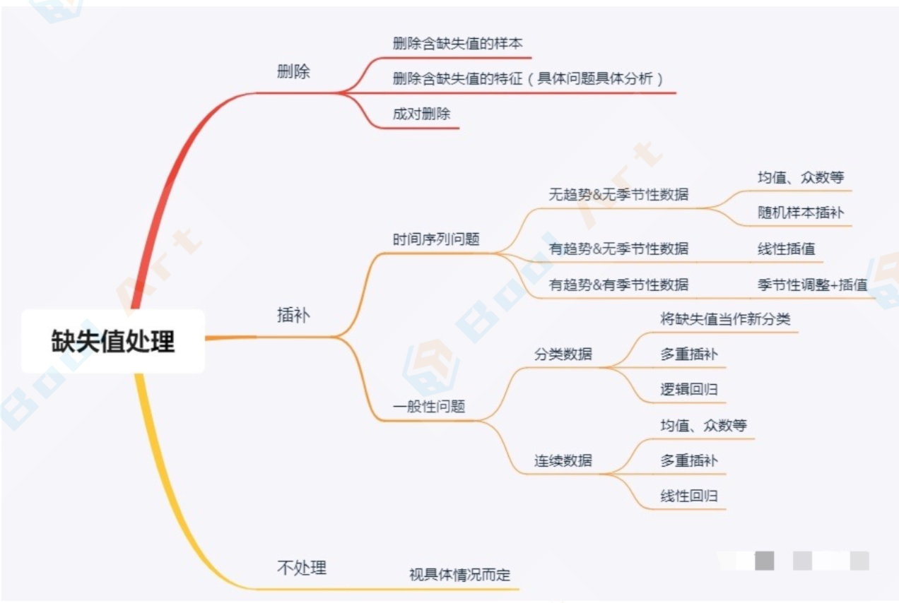

## 数据类型

在表格类数据建模过程中，常常需要处理的数据类型：

1. 文本
   - 需要做特征表示；（词袋模型、tf-idf等)
2. 类别变量；
   - 类别数量较少可直接onehot；
   - 类别数量较多可以尝试**均值编码**target label等方案；
   - lightgbm可以支持直接的类别型特征输入，xgb等其他模型需要onehot；
3. 排序变量；
   - 一般可以按照连续性变量处理；
4. 连续变量；
   - 线性模型、逻辑回归等需要进行标准化、缺失处理；
   - 树模型不需要进行标准化，一般不需要处理缺失；


## 数据流程

一般在数据处理与特征工程的工作流程为：

1. 异常值处理；
2. 特征构造；
3. 分布调整与标准化
4. 缺失处理；

在具体项目中2、3、4可以调整顺序；


## 数据处理

### 为什么要处理缺失 ⭐️

#### 决策树模型怎么处理缺失值

方法1（快速简单但效果差）

- 把数值型变量(numerical variables)中的缺失值用其所对应的类别中 (class)的中位数(median)替换。
- 把描述型变量(categorical variables)缺失的部分用所对应类别中出现最多的数值替代(most frequent non-missing value)。

方法2（耗时费力但效果好）

虽然依然是使用中位数和出现次数最多的数来进行替换，方法2引入了权重。

即对需要替换的数据先和其他数据做相似度测量(proximity measurement)，在补全缺失点是相似的点的数据会有更高的权重W。

#### XGBoost怎么处理缺失值

xgboost处理缺失值的方法和其他树模型不同。

xgboost把缺失值当做稀疏矩阵来对待，本身的在节点分裂时不考虑的缺失值的数值。缺失值数据会被分到左子树和右子树分别计算损失，选择较优的那一个。

如果训练中没有数据缺失，预测时出现了数据缺失，那么默认被分类到右子树。

#### 什么样的模型对缺失值更敏感

缺失值补全(missing value imputation)是一个非常大的方向，推荐深入了解。

1. 树模型对于缺失值的敏感度较低，大部分时候可以在数据有缺失时使用。
2. 涉及到距离度量(distance measurement)时，如计算两个点之间的距离，缺失数据就变得比较重
   要。因为涉及到“距离“这个概念，那么缺失值处理不当就会导致效果很差，如K近邻算法(KNN)和
   支持向量机(SVM)。
3. 线性模型的代价函数(loss function)往往涉及到距离(distance)的计算，计算预测值和真实值之间 的差别，这容易导致对缺失值敏感。
4. 神经网络的鲁棒性强，对于缺失数据不是非常敏感，但一般没有那么多数据可供使用。
5. 贝叶斯模型对于缺失数据也比较稳定，数据量很小的时候首推贝叶斯模型。 

总结来看，对于有缺失值的数据在经过缺失值处理后：

- 数据量很小，用朴素贝叶斯
- 数据量适中或者较大，用树模型，优先xgboost
- 数据量较大，也可以用神经网络
- 避免使用距离度量相关的模型，如KNN和SVM

### 缺失值处理

#### 理论及部分概念介绍

**完全变量和不完全变量**

在数据集中，我们常将不含缺失值的变量称为完全变量，数据集中含有缺失值的变量称为不完全变量。 

**缺失数据的类型**

随机丢失(MAR，Missing at Random)

随机丢失意味着数据丢失的概率与丢失的数据本身无关，而仅与部分已观测到的数据有关。也就是说，数据的缺失不是完全随机的，该类数据的缺失依赖于其他完全变量。 

完全随机丢失(MCAR，Missing Completely at Random)

数据的缺失是完全随机的，不依赖于任何不完全变量或完全变量，不影响样本的无性。简单来说，就是 数据丢失的概率与其假设值以及其他变量值都完全无关。 

非随机丢失(MNAR，Missing not at Random)

数据的缺失与不完全变量自身的取值有关。分为两种情况：

- 缺失值取决于其假设值（例如，高收入人群通常不希望在调查中透露他们的收入)；
- 或者，缺失值取决于其他变量值（假设女性通常不想透露她们的年 龄，则这里年龄变量缺失值受性别变量的影响)。

在前两种情况下可以根据其出现情况删除缺失值的数据，同时，随机缺失可以通过已知变量对缺失值进行 估计。

在第三种情况下，删除包含缺失值的数据可能会导致模型出现差，同时，对数据进行填充也需要格外谨 慎。

正确判断缺失值的类型，能给我们的工作带来很大的便利，但目前还没有一套规范的缺失值类型判定标 准。大多是依据经验或业务进行判断。

**造成缺失值的原因**

- 信息暂时无法获取。如某种产品的收益等具有滞后效应。
- 数据因人为因素没有被记录、遗漏或丢失，这个是数据缺失的主要原因。
- 数据采集设备的故障、存储介质、传输媒体故障而造成数据丢失。
- 获取这些信息的代价太大。
- 有些对象的某个或某些属性是不可用的；如：未婚者的配偶姓名、儿童的固定收入状况等。
- 系统实时性能要求较高，即要求得到这些信息前迅速做出判断或决策。

**缺失值在数据分析（挖掘）中存在哪些影响**

- 使系统丢失大量的有用信息；
- 使系统中所表现出的不确定性更加显著，系统中蕴涵的确定性成分更难把握；
- 包含空值的数据会使数据挖掘过程陷入混乱，导致不可靠的输出。

#### 缺失值处理方法



##### 删除 

将存在遗漏信息属性值的样本（行）或特征（列）删除，从而得到一个完整的数据表。 

具体做法参考：[如何填补Pandas中的缺失值(机器学习入门篇)](https://zhuanlan.zhihu.com/p/115103738)

优点：简单易行，在对象有多个属性缺失值、被删除的含缺失值的对象与初始数据集的数据量相比较小的 情况下非常有效。

缺点：当缺失数据所占比例较大，特别当遗漏数据非随机分布时，这种方法可能导致数据发生分离，从而引出错误的结论。

补充：什么是成对删除。

在重要变量存在的情况下，成对删除只会删除相对不重要的变量行。这样可以尽可能保证充足的数据。该方法的优势在于它能够帮助增强分析效果，但是它也有许多不足。它假设缺失数据服从完全随机丢失(MCAR)。如果你使用此方法，最终模型的不同部分就会得到不同数量的观测值，从而使得模型解释非常困难。 

##### 插补（重点） 

**人工填写(filling manually)**

当你对自己手头的数据集足够了解时，可以选择自己填写缺失值。然而一般来说，该方法很费时，当数据规模很大、空值很多的时候，该方法是不可行的。

**特殊值填充(Treating Missing Attribute values as Special values)**

将空值作为一种特殊的属性值来处理，它不同于其他的任何属性值。如所有的空值都用“unknown”填充。一般作为临时填充或中间过程。有时可能导致严重的数据分离。 

**平均值填充(Mean/Mode Completer)**

将初始数据集中的属性分为数值属性和非数值属性来分别进行处理。

- 如果空值是数值型的，就根据该属性在其他所有对象的取值的平均值来填充该缺失的属性值；
- 如果空值是非数值型的，就根据统计学中的众数原理，用该属性在其他所有对象的取值次数最多的值（即出现频率最高的值)来补齐该缺失的属性值。

与其相似的另一种方法叫**条件平均值填充法**(Conditional Mean Completer)。在该方法中，用于求平均的值并不是从数据集的所有对象中取，而是**从与该对象具有相同决策属性值的对象**中取得。

这两种数据 的补齐方法，其基本的出发点都是一样的，**以最大概率可能的取值来补充缺失的属性值**，只是在具体方法上有一点不同。与其他方法相比，它是用现存数据的多数信息来推测缺失值。 

参考：[如何处理Pandas里的缺失值(入门篇2)](https://zhuanlan.zhihu.com/p/109434512)

**热卡填充(Hot deck imputation，或==就近补齐==)**

对于一个包含空值的对象，热卡填充法在完整数据中找到一个与它最相似的对象，然后用这个相似对象的值来进行填充。不同的问题可能会选用不同的标准来对相似进行判定。该方法概念上很简单，且利用了数 据间的关系来进行空值估计。这个方法的缺点在于**难以定义相似标准，主观因素较多**。 

**K最近距离邻法(K-means clustering)**

先根据欧式距离或相关分析来确定距离具有缺失数据样本最近的K个样本，将这K个值加权平均来估计该样本的缺失数据。在本方法中，先根据某种距离度量选择出k个“邻居”，它们的均值就被用于插补缺失数据。这个方法要求我 们选择k的值（最近邻居的数量），以及距离度量。KNN既可以预测**离散属性(k近邻中最常见的值)**也可以预测**连续属性(k近邻的均值)**。

根据数据类型的不同，距离度量也不尽相同：

- 连续数据：最常用的 距离度量有欧氏距离，曼哈顿距离以及余弦距离。
- 分类数：汉明(Hamming)距离在这种情况比较常用。对于所有分类属性的取值，如果两个数据点的值不同，则距离加一。汉明距离实际上与属性间不同取值的数量一致。

KNN算法最吸引人的特点之一在于，它易于理解也易于实现。其非参数的特性在某些数据非常“不寻常”的情况下非常有优势。KNN算法的一个明显缺点是，在分析大型数据集时会变得非常耗时，因为它会在整个数据集中搜索相似数据点。此外，在高维数据集中，最近与最远邻居之间的差别非常小，因此KNN的准确性会降低。

**使用所有可能的值填充(Assigning All Possible values of the Attribute)**

用空缺属性值的所有可能的属性取值来填充，能够得到较好的补齐效果。但是，当数据量很大或者遗漏的属性值较多时，其计算的代价很大。 

**回归(Regression)** ⭐️

基于完整的数据集，建立回归方程，或利用机器学习中的回归算法。对于包含空值的对象，将已知属性值代入方程来估计未知属性值，以此估计值来进行填充。当变量不是线性相关时，会导致有偏差的估计。

较常用，但是要注意防止过拟合。

**期望值最大化方法(Expectation maximization，EM)**

EM算法是一种在不完全数据情况下计算极大似然估计或者后验分布的迭代算法。

在每一迭代循环过程中交替执行两个步骤：

- E步(Excepctaion step，期望步)，在给定完全数据和前一次迭代所得到的参数估计的 情况下计算完全数据对应的对数似然函数的条件期望；
- M步(Maximzation step，极大化步)，用极大化对数似然函数以确定参数的值，并用于下步的迭代。

算法在E步和M步之间不断迭代直至收敛，即两次迭代之间的参数变化小于一个预先给定的阈值时结束。该方法可能会陷入局部极值，收敛速度也不是很快，并且计算很复杂。

**多重插补(Multiple Imputation，Ml)**  ⭐️

多重填补方法分为三个步骤：

1. 插补：将不完整数据集缺失的观测行估算填充次。请注意，填充值是从某种分布中提 取的。模拟随机抽取并不包含模型参数的不确定性。更好的方法是采用马尔科夫链蒙特卡洛模拟 (MCMC，Markov Chain Monte Carlo Simulation)。这一步骤将生成m个完整的数据集。
2. 分析：分别对（m个）每一个完整数据集进行分析。
3. 合并：对来自各个填补数据集的结果进行综合，产生最终的统计推断，这一推断考虑到了由于数据填补而产生的不确定性。

该方法将空缺值视为随机样本， 这样计算出来的统计推断可能受到空缺值的不确定性的影响。

**C4.5方法**

通过寻找属性间的关系来对遗失值填充。它寻找之间具有最大相关性的两个属性，其中没有遗失值的一个 称为代理属性，另一个称为原始属性，用代理属性决定原始属性中的遗失值。

这种基于规则归纳的方法只能处理基数较小的名词型属性。

**小结**

在上述方法中，比较推荐是的多重插补和回归；

同时，针对某顶特征数据大量缺失时，随机森林回归十分有效；

当数据存在明显的线性关系时，线性回归也有很好的效果。

#### 不处理缺失值

不处理缺失值，直接在包含空值的数据上进行数据挖掘的方法。其中包括：贝叶斯网络和人工神经网络等。

贝叶斯网络提供了一种自然的表示变量间因果信息的方法，用来发现数据间的潜在关系。在这个网络中， 用节点表示变量，有向边表示变量间的依赖关系。

贝叶斯网络仅适合于对领域知识具有一定了解的情况， 至少对变量间的依赖关系较清楚的情况。否则测直接从数据中学习贝叶斯网的结构不但复杂性较高（随着变 量的增加，指数级增加)，网络维护代价昂贵，而且它的估计参数较多，为系统带来了高方差，影响了它的预测精度。

人工神经网络也类似。

参考https://blog.csdn.net/lujiandong1/article/details/52654703

### 数据标准化

https://www.cnblogs.com/bind/p/11956280.html

**数据特征缩放（Feature Scaling）**是一种将数据的不同变量或特征的方位进行标准化的方法。在数据处理中较为常用，也被称之为数据标准化（Data Normalization）。其中最典型的就是数据的归一化处理，即将数据统一映射到[0,1]区间上。主要有以下两种作用：

- **数据同趋化处理**：把数据变成固定区间(0,1)或者(-1,1)之间的小数，将数据映射到固定范围之内处理，更加方便快捷；
- **无量纲化处理**：把有量纲的表达式变成无量纲的表达式，便于不同单位或量级的参数进行比较和加权。

**归一化和标准化的区别** 

归一化和标准化都是对数据做变换的方式，将原始的一列数据转换到某个范围，或者某种形态，具体的：

- 归一化（normalization）：归一化是将样本的特征值**转换到同一量纲**下，把数据映射到[0,1]或者[-1, 1]区间内，广义的讲可以是各种区间。该方法仅**由变量的极值决定**。

- 标准化（standardization）：标准化是按照特征矩阵的列处理数据，通过Z-score方法（将样本的特征值**转换为标准值（z值）**），将样本特征值转换为均值为0，标准差为1的分布。

  切记，分布并非一定是正态的，而是完全取决于原始数据是什么分布。因为**该方法和整体样本的分布相关，每一个样本点都能对标准化产生影响**。z-score标准化方法适用于属性A的**最大值和最小值未知**的情况，或有**超出取值范围的离群数据**的情况。

它们的相同点在于都能取消由于量纲不同引起的误差，都是一种线性变化，都是对着向量x按照比例压缩在进行平移。

- 中心化：另外，还有一种处理叫做中心化，也叫零均值处理。就是将每个原始数据减去这些数据的均值

#### 为什么要进行特征缩放

- **统一特征的权重&提升模型准确性**

  如果某个特征的取值范围比其他特征大很多，那么数值计算（比如说计算欧式距离）就受该特征的主要支配。但实际上并不一定是这个特征最重要，通常需要把每个特征看成同等重要。归一化/标准化数据可以使不同维度的特征放在一起进行比较，可以大大提高模型的准确性。

- **提升梯度下降法的收敛速度**

  在使用梯度下降法求解最优化问题时， 归一化/标准化数据后可以加快梯度下降的求解速度。

#### 具体使用哪种方法进行特征缩放

- 在需要使用距离来度量相似性的算法中，或者使用PCA技术进行降维的时候，通常使用标准化（standardization）或均值归一化（mean normalization）比较好。
- 如果数据分布不是正态分布或者标准差非常小，以及需要把数据固定在 [0, 1] 范围内，那么使用**最大最小值归一化（min-max normalization）**比较好（min-max 常用于归一化图像的灰度值）。但是min-max比较容易受异常值的影响，如果数据集包含较多的异常值，可以考虑使用**稳键归一化（robust normalization）**。
- 对于已经中心化的数据或稀疏数据的缩放，比较推荐使用**最大绝对值归一化（max abs normalization ）**，因为它会保住数据中的０元素，不会破坏数据的稀疏性（sparsity）。

#### 哪些机器学习模型必须进行特征缩放 ⭐️

- ==**通过梯度下降法求解的模型**==需要进行特征缩放，这包括线性回归（Linear Regression）、逻辑回归（Logistic  Regression）、感知机（Perceptron）、支持向量机（SVM）、神经网络（Neural  Network）等模型。
- 需要==**根据数据间的距离来划分数据的算法**==也需要进行特征缩放，比如近邻法（KNN），K均值聚类（K-Means）等。
- 需要==**计算特征的方差的算法**==也会受到特征缩放的影响，包括主成分分析（PCA），线性判别分析（LDA）等。

决策树（Decision Tree）、随机森林（Random Forest）等**基于树的模型不需要进行特征缩放，因为==特征缩放不会改变样本在特征上的信息增益==**。

#### 进行特征缩放的注意事项 

在建模阶段，需要先把数据拆分成训练集与验证集，在训练集上计算出需要的数值（如均值和标准值），对训练集数据做标准化/归一化处理（==**不要在整个数据集上做标准化/归一化处理**，因为这样**会将验证集的信息和规则带入到训练集**中，这是一个非常容易犯的错误==），然后再用之前计算出的数据（如均值和标准值）对验证集数据做相同的标准化/归一化处理。

https://blog.csdn.net/matlab2007/article/details/104304669?spm=1001.2101.3001.6650.1&utm_medium=distribute.pc_relevant.none-task-blog-2%7Edefault%7ECTRLIST%7ERate-1.pc_relevant_antiscanv2&depth_1-utm_source=distribute.pc_relevant.none-task-blog-2%7Edefault%7ECTRLIST%7ERate-1.pc_relevant_antiscanv2&utm_relevant_index=2


## 特征挖掘

### 特征工程是什么

特征工程就是通过X，创造新的X‘。基本的操作包括，衍生（升维），筛选（降维）。说起来简单，实际中，衍生和筛选都是困难重重，甚至需要非常专业的专家知识。

Kaggle上有一句非常经典的话，数据和特征决定了机器学习的上限，而模型和算法只是逼近这个上限而 已。

- 类别特征

  one-hot encoding、hash encoding、label encoding、count encoding、label-count encoding、target encoding、category embedding、Nan encoding、polynomial encoding、expansion encoding、consolidation encoding

- 数值特征

  rounding、binning、scaling、imputation、interactions、no linear encoding、row statistics

- 时间特征、空间特征、自然语言处理、深度学习/NN、Leakage


### 文本特征稀疏

文本特征稀疏表示：`词袋`、`ngram`、`tf-idf`

#### 离散表示

##### One-hot

One-hot表示很容易理解。在一个语料库中，给每个字/词编码一个索引，根据索引进行one-hot表示。

```python
1 John likes to watch movies.Mary likes too. 
2 John also likes to watch football games.
```

如果只需要表示出上面两句话中的单词，可以只对其中出现过的单词进行索引编码：

```python
1{"John":1,"1ikes":2,"to":3, 
2 "watch":4,"movies":5,"also":6,
3 "football":7,"games":8,"Mary":9,"too":10}
```

#### 分布式表示


## 特征选择概览

特征处理是特征工程的核心部分，sklearn提供了较为完整的特征处理方法，包括数据预处理，特征选择， 降维等。

### 数据预处理

通过特征提取，我们能得到未经处理的特征，这时的特征可能有以下问题：

- 不属于同一量纲：即特征的规格不一样，不能够放在一起比较。无量纲化可以解决这一问题。
- 信息冗余：对于某些定量特征，其包含的有效信息为区间划分，例如学习成绩，假若只关心“及格”或 不“及格”，那么需要将定量的考分，转换成“1”和“0”表示及格和未及格。二值化可以解决这一问题。
- 定性特征不能直接使用：某些机器学习算法和模型只能接受定量特征的输入，那么需要将定性特征转换 为定量特征。最简单的方式是为每一种定性值指定一个定量值，但是这种方式过于灵活，增加了调参的工作。
  通常使用哑编码的方式将定性特征转换为定量特征：假设有N种定性值，则将这一个特征扩展为N种特征，当原始特征值为第种定性值时，第i个扩展特征赋值为1，其他扩展特征赋值为0。哑编码的方式相比直接指定的方式，不用增加调参的工作，对于线性模型来说，使用哑编码后的特征可达到非线性的效果。
- 存在缺失值：缺失值需要补充。
- 信息利用率低：不同的机器学习算法和模型对数据中信息的利用是不同的，之前提到在线性模型中，使用对定性特征哑编码可以达到非线性的效果。类似地，对定量变量多项式化，或者进行其他的转换，都能达到非线性的效果。

我们使用sklearn中的oreproccessing库来进行数据预处理，可以覆盖以上问题的解决方案。

#### 无量纲化

无量纲化使不同规格的数据转换到同一规格。

常见的无量纲化方法有标准化和区间缩放法。区间缩放法利用了边界值信息，将特征的取值区间缩放到某个特点的范围，例如[0, 1]等。

#### 对定量特征二值化

定量特征二值化的核心在于设定一个阈值，大于阈值的赋值为1，小于等于阈值的赋值为0。

使用preproccessing库的Binarizer类对数据进行二值化的代码如下:

```python
from sklearn.preprocessing import Binarizer 
#二值化,阈值设置为3,返回值为二值化后的数据
Binarizer(threshold=3).fit_transform(iris.data)
```

#### 对定性特征哑编码

由于RIS数据集的特征皆为定量特征，故使用其目标值进行哑编码（实际上是不需要的）。

使用preproccessing库的OneHotEncoder类对数据进行哑编码的代码如下：

```python
from sklearn.preprocessing import OneHotEncoder
#哑编码,对IRIS数据集的目标值,返回值为哑编码后的数据
OneHotEncoder().fit_transform(iris.target.reshape((-1,1)))
```

#### 缺失值计算

由于IRIS数据集没有缺失值，故对数据集新增一个样本，4个特征均赋值为NaN，表示数据缺失。使 用preproccessing库的Imputer类对数据进行缺失值计算的代码如下：

```python
from numpy import vstack,array,nan
From sklearn.preprocessing import Imputer 
#缺失值计算,返回值为计算缺失值后的数据
#参数nissing_value为缺失值的表示形式,默认为NaN 
#参数strategy为缺失值填充方式,默认为mean(均值)
Imputer().fit transform(vstack((array([nan,nan,nan,nan]),iris. data)))
```

#### 数据变换

常见的数据变换有基于多项式的、基于指数函数的、基于对数函数的。

使用preproccessing库的PolynomialFeatures类对数据进行多项式转换的代码如下

```python
from sklearn.preprocessing import PolynomialFeatures
#多项式转换
#参数deg ree为度,默认值为2
PolynomialFeatures().fit_transform(iris.data)
```

基于单变元函数的数据变换可以使用一个统一的方式完成，使用preproccessing库的FunctionTransformer对数据进行对数函数转换的代码如下：

```python
from numpy import log1p
from sklearn.preprocessing import FunctionTransformer 
#自定义转换函数为对数函数的数据变换 
#第一个参数是单变元函数
FunctionTransformer(log1p).fit_transform(iris.data)
```


### 特征的选择

当数据预处理完成后，我们需要选择有意义的特征输入机器学习的算法和模型进行训练。通常来说，从两个方面考虑来选择特征：

- 特征是否发散

  如果一个特征不发散，例如方差接近于0，也就是说样本在这个特征上基本上没有差异，这个特征对于样本的区分并没有什么用。

- 特征与目标的相关性

  这点比较显见，与目标相关性高的特征，应当优选选择。除方差法外，其他方法均从相关性考虑。

根据特征选择的形式又可以将特征选择方法分为3种：

- Filter：过滤法

  按照发散性或者相关性对各个特征进行评分，设定阈值或者待选择阈值的个数，选择特征。

- Wrapper：包装法

  根据目标函数（通常是预测效果评分），每次选择若干特征，或者排除若干特征。

- Embedded：嵌入法

  先使用某些机器学习的算法和模型进行训练，得到各个特征的权值系数，根据系数从大到小选择特征。类似于Filter方法，但是是通过训练来确定特征的优劣。 我们使用sklearn中的feature_selection库来进行特征选择。

#### 过滤( filter)特征选择

**方差选择法**

使用方差选择法，先要计算各个特征的方差，然后根据阈值，选择方差大于阈值的特征。使用 feature_selection库的VarianceThreshold类来选择特征的代码如下：

```python
from sklearn.feature_selection import VarianceThreshold 
#方差选择法,返回值为特征选择后的数据
#参数threshold为方差的阈值
VarianceThreshold(threshold=3).fit transform(iris.data)
```

**相关系数法** 

使用相关系数法，先要计算各个特征对目标值的相关系数以及相关系数的P值。用
feature_selection。库的SelectKBest类结合相关系数来选择特征的代码如下：

```python
from sklearn.feature_selection import SelectKBest from scipy.stats import pearsonr
#选择K个最好的特征,返回选择特征后的数据
#第一个参数为计算评估特征是否好的函数,该函数输入特征矩阵和目标向量,输出二元组(评分,P值)的数组,数组第项为第1个特征的评分和P值.在此定义为计算相关系数
#参数k为选择的特征个数
SelectKBest(lambda X,Y:array(map(lambda x:pearsonr(x,Y),X.T)).
T,k=2).fit_transform(iris.data,iris.target)
```

**卡方检验**

经典的卡方检验是检验定性自变量对定性因变量的相关性。用feature_selection库的
SelectKBest类结合卡方检验来选择特征的代码如下：

```python
from sklearn.feature_selection import SelectKBest from sklearn.feature_selection import chi2
#选择K个最好的特征,返回选择特征后的数据
SelectKBest(chi2,k=2).fit transform(iris.data,iris.target)
```

**互信息法**

经典的互信息也是评价定性自变量对定性因变量的相关性的。使用feature_selection。库的SelectKBest类结合最大信息系数法来选择特征的代码如下：

```python
from sklearn.feature selection import SelectKBest from minepy import MINE
#由于MINE的设计不是函数式的,定义mic方法将其为函数式的,返回一个二元组,二元
组的第2项设置成固定的P值0.5
def mic(x,y):
m MINE()
m.computescore(x,y) return (m.mic(),0.5)
#选择K个最好的特征,返回特征选择后的数据
SelectKBest(lambda X,Y:array(map(lambda x:mic(x,Y),X.T)).T,
k=2).fit_transform(iris.data,iris.target)
```

#### 包装(wrapper)特征选择

**递归特征消除法** 

递归消除特征法使用一个基模型来进行多轮训练，每轮训练后，消除若干权值系数的特征，再基于 新的特征集进行下一轮训练。使用feature_selection库的RFE类来选择特征的代码如下：

```python
from sklearn.feature_selection import RFE
from sklearn.linear_model import LogisticRegression
#递归特征消除法,返回特征选择后的数据 
#参数estimator为基模型
#参数n_features_to_select为选择的特征个数
RFE(estimator=LogisticRegression(),n_features_to_select=2).fit_tr ansform(iris.data,iris.target)
```

#### 嵌入(Embedded)特征选择

**基于惩罚项的特征选择法** 

使用带惩罚项的基模型，除了筛选出特征外，同时也进行了降维。使用feature selection库的
SelectFromModel：类结合带L1惩罚项的逻辑回归模型，来选择特征的代码如下：

```python
from sklearn.featureselection import SelectFromModel from sklearn.linear_model import LogisticRegression
#带L1惩罚项的逻辑回归作为基模型的特征选择
SelectFromModel(LogisticRegression(penalty="11",C=0.1)).fit_transform(iris.data, iris.target)
```

实际上，L1惩罚项降维的原理在于保留多个对目标值具有同等相关性的特征中的一个，所以没选到的特征不代表不重要。故可结合L2惩罚项来优化。具体操作为：若一个特征在L1中的权值为1，选择在L2中权值差别不大且在L1中权值为0的特征构成同类集合，将这一集合中的特征平分L1中的权值，故需要构建一个新的逻辑回归模型。

使用feature_selection。库的SelectFromModel类结合带L1以及L2惩罚项的逻辑回归模型，来选择特征的代码如下：

```python
from sklearn.feature selection import SelectFromModel
#带L1和L2惩罚项的逻辑回归作为基模型的特征选择
#参数threshold为权值系数之差的阈值
SelectFromModel(LR(threshold=0.5,C=0.1)).fit transform(iris.data, iris.target)
```

**基于树模型的特征选择法** 

树模型中GBDT也可用来作为基模型进行特征选择，使用feature_。selection库的SelectFromModel
类结合GBDT模型，来选择特征的代码如下：

```python
from sklearn.feature_selection import SelectFromModel from sklearn.ensemble import GradientBoostingclassifier
#GBDT作为基模型的特征选择
SelectFromModel(GradientBoostingclassifier()).fittransform(iris.data, iris.target)
```

### 降维

当特征选择完成后，可以直接训练模型了，但是可能由于特征矩阵过大，导致计算量大，训练时间长的问题，因此降低特征矩阵维度也是必不可少的。常见的降维方法除了以上提到的基于L1惩罚项的模型以外，另外还有主成分分析法(PCA)和线性判别分析(LDA)，线性判别分析本身也是一个分类模型。PCA和
LDA有很多的相似点，其本质是要将原始的样本映射到维度更低的样本空间中，但是PCA和LDA的映射目标不一样：

- PCA是为了让映射后的样本具有最大的发散性；
- 而LDA是为了让映射后的样本有最好的分类性能。

所以说PCA是一种无监督的降维方法，而LDA是一种有监督的降维方法。

#### 主成分分析法（PCA)

使用decomposition库的PCA类选择特征的代码如下：

```python
from sklearn.decomposition import PCA
#主成分分析法,返回降维后的数据 
#参数n_components为主成分数目
PCA(n_components=2).fit_transform(iris.data)
```

#### 线性判别分析法 (LDA)

使用Ida库的LDA类选择特征的代码如下：

```python
from sklearn.lda import LDA
#线性判别分析法,返回降维后的数据 
#参数n components为降维后的维数
LDA(n_components=2).fit_transform(iris.data,iris.target)
```


## 辨析

### sklearn中fit、fit_transform、transform的区别

[sklearn中fit、fit_transform、transform的区别](https://blog.csdn.net/liuweiyuxiang/article/details/83028667) 

- **fit**：原义指的是安装、使适合的意思，其实有点train的含义但是和train不同的是，它并不是一个训练的过程，而是一个**适配的过程**，过程都是定死的，最后只是得到了一个**统一的转换的规则模型**。
- **transform**：是将数据进行转换，比如**数据的归一化和标准化**，将测试数据按照训练数据同样的模型进行转换，得到特征向量。
- **fit_transform**：可以看做是fit和transform的结合，如果训练阶段使用fit_transform，则在测试阶段只需要对测试样本进行transform就行了。


## QA

**两个类别型变量构造笛卡尔特征组合为什么能提升模型表现？**

笛卡尔乘积是指在数学中，两个集合X和Y的笛卡尓积，第一个对象是X的成员而第二个对象是 Y 的所有可能有序对的其中一个成员。假设集合 A={a, b} ，集合 B={0, 1, 2} ，则两个集合的笛卡尔积为` {(a, 0), (a, 1), (a, 2), (b, 0), (b, 1), (b, 2)}`。

通过将单独的特征求笛卡尔乘积的方式来组合2个或更多个特征，从而构造出组合特征，最终获得的预测能力将远远超过任一特征单独的预测能力。


