# 时间序列基础

[时间序列分析（1） 基本概念与实战](https://zhuanlan.zhihu.com/p/60023855?utm_source=wechat_session) 

[写给你的金融时间序列分析：基础篇](https://zhuanlan.zhihu.com/p/38320827) 

[写给你的金融时间序列分析：初级篇](https://zhuanlan.zhihu.com/p/38321845) 

[写给你的金融时间序列分析：进阶篇](https://zhuanlan.zhihu.com/p/38322333) 

[写给你的金融时间序列分析：应用篇](https://zhuanlan.zhihu.com/p/38322638) 


## 协方差与相关系数

### 协方差

可以通俗的理解为：两个变量在变化过程中是同方向变化？还是反方向变化？同向或反向程度如何？你变大，同时我也变大，说明两个变量是同向变化的，这时协方差就是正的；你变大，同时我变小，说明两个变量是反向变化的，这时协方差就是负的。从数值来看，协方差的数值越大，两个变量同向程度也就越大。反之亦然。

咱们从公式出发来理解一下：
$$
\operatorname{Cov}(X, Y)=E\left[\left(X-\mu_{x}\right)\left(Y-\mu_{y}\right)\right]
$$
公式简单翻译一下是：如果有X，Y两个变量，每个时刻的“X值与其均值之差“乘以“Y值与其均值之差“得到一个乘积，再对这每时刻的乘积**求和**并求出均值（其实是求”期望”，但就不引申太多新概念了，简单认为就是求均值了)。

将每一时刻$$X-\mu_{x}$$与$$Y-\mu_{y}$$的乘积加在一起，其中的正负项就会抵消掉，最后求平均得出的值就是协方
差，通过协方差的数值大小，就可以判断这两个变量同向或反向的程度了。

所以，$$X-\mu_{x}$$与$$Y-\mu_{y}$$的乘积为正的越多，说明同向变化的次数越多，也即同向程度越高，反之亦然。

总结一下，如果协方差为正，说明X、Y同向变化，协方差越大说明同向程度越高；如果协方差为负，说明X、Y反向运动，协方差越小说明反向程度越高

### 相关系数

一般情况下，相关系数的公式为：
$$
\rho=\frac{\operatorname{Cov}(X, Y)}{\sigma_{X} \sigma_{Y}}
$$
翻译一下：就是用X、Y的协方差除以X的标准差和Y的标准差。

所以，相关系数也可以看成协方差：一种剔除了两个变量量纲影响、标准化后的特殊协方差。

 既然是一种特殊的协方差，那它：

- 也可以反映两个变量变化时是同向还是反向，如果同向变化就为正，反向变化就为负。
- 由于它是标准化后的协方差，因此更重要的特性来了：它消除了两个变量变化幅度的影响，而只是单纯反应**两个变量每单位变化时的相似程度**。


## 自然协方差/自相关系数/偏自相关系数

以$$Z_t$$：表示一组数据，或一个时间序列。

### 通用的几个概念

均值、方差、标准差、协方差、相关系数

**均值**

均值（期望）是统计学中最常用的统计量，用来表明**数据集中相对集中较多的中心位置**。
$$
u_t = E(Z_t)
$$
**方差** 

方差是用来度量一组数据的离散程度。概率论中方差用来**度量随机变量和其期望（即均值）之间的偏离程度**。统计中的方差（样本方差）是**每个样本值与全体样本值的平均数之差的平方值的平均数**。
$$
\delta_{t}^{2}=E\left(Z_{t}-u_{t}\right)^{2}
$$
**标准差** 

标准差（均方差)，是离均差平方的算术平均数的平方根，用σ表示。标准差是方差的算术平方根。标准差能反映一个**数据集的离散程度**。
$$
\delta_{t}=\sqrt{\delta_{t}^{2}}
$$
**协方差**

协方差用来**度量两个变量各个维度离其均值的程度**，这与只表示一个变量误差的方差不同。

协方差的值 如果为正值，则说明两者是正相关的（从协方差可以引出“相关系数”的定义），结果为负值就说明负相关 的，**如果为0，也是就是统计上说的“相互独立”**。
$$
\operatorname{cov}\left(Z_{t 1}, Z_{t 2}\right)=E\left(Z_{t 1}-u_{t 1}\right)\left(Z_{t 2}-u_{t 2}\right)
$$
假设有两个随机变量X、Y，大致上有：

- 若协方差为正数：X增大，Y增大；X减小，Y减小，即变化趋势相同。
- 若协方差为负数：X增大，Y减小；X减小，Y增大，即变化趋势相反。
- 若协方差为零：X与Y的变化没有任何关系。

**相关系数** 

相关系数是研究**变量之间线性相关程度**的量。

求出协方差之后，我们考虑一个问题就是协方差对应这每一个“协”关系，它们对应得比值是多少，所谓对应的比值可以理解为每一个“协”距离整体的距离比值是百分之几？两个的“协”对应它们的整体距离的比值是百分之几就能够表示它们之间有多相关，这个相关系数越大，表示这两个数值越有关系。

可以理解为，如果两个序列，一个是3000多这个基数去变动，一个是10000多这个基数去变动，它们的绝对数据肯定是不一样的，但是它们的变动比率是一样的。所谓相关性也可以理解为把两个值统一化，在同一个维度来评价这两个值的协方差关系，因此**在同一个维度来衡量这两个值的协方差关系就叫做相关系数**。
$$
r\left(Z_{t_{1}}, Z_{t_{2}}\right)=\frac{\operatorname{cov}\left(Z_{t_{1}}, Z_{t_{2}}\right)}{\sqrt{\delta_{t 1}^{2}} \sqrt{\delta_{t 2}^{2}}}
$$
相关系数的绝对值越大，相关性越强：相关系数越接近于1或-1，相关度越强，相关系数越接近于0，相关 度越弱。通常情况下通过以下取值范围判断变量的相关强度：

- 0.8-1.0 极强相关
- 0.6-0.8 强相关
- 0.4-0.6 中等程度相关
- 0.2-0.4 弱相关
- 0.0-0.2 极弱相关或无相关

时间序列的特点是一维，因此如果借用统计学上面的指标衡量，有些不太适宜。

根据时间序列的特点，形成了自协方差、自相关函数、 自相关函数。看到前面都加了一个“自”，原因是时间序列没法在找到一个别的数据和自己来进行比较；只能自己和自己来比较，自己和自己慢几拍（后期)的这些数据进行比较，所以加入了一个“自”。


### 时间序列自有的几个基本概念

自协方差、自相关系数、自相关系数

#### 自协方差 

在统计学中，特定时间序列或者连续信号$$Z_t$$的自协方差是**信号**与**其经过时间平移的信号**之间的协方差。
$$
r(k)=\frac{1}{n} \Sigma_{t=k+1}^{n}\left(Z_{t}-\bar{Z}\right)\left(Z_{t-k}-\bar{Z}\right)
$$
可以认为自协方差是某个信号与其自身经过一定时间平移之后的相似性，自协方差$$r(k)$$就表示了在那个时延的相关性。

#### 自相关系数 ACF  

自相关系数度量的是**同一事件在两个不同时期之间的相关程度**，形象的讲就是**度量自己过去的行为对自己现在的影响**。
$$
A C F(k)=\Sigma_{t=k+1}^{n} \frac{\left(Z_{t}-\bar{Z}\right)\left(Z_{t-k}-\bar{Z}\right)}{\Sigma_{t=1}^{n}\left(Z_{t}-\bar{Z}\right)^{2}}
$$

#### 自相关(autocorrelation)

也叫序列相关，是一个信号于其自身在不同时间点的相关度。

非正式地来说，它就是两次观察之间的相似度对它们之间的时间差的函数。它是找出重复模式（如被噪声掩盖的周期信号)，或识别隐含在信号谐波频率中消失的基频的数学工具。它常用于信号处理中，用来分析函数或一系列值，如时域信号。

#### 偏自相关系数 PACF

为了能单纯测度Z(t-k)对Z(t)的影响，引进偏自相关系数(PACF)的概念

某一个要素对另一个要素的影响或相关程度时，把其它要素的影响视为常数，即暂不考虑其它要素的影响，而单独研究那两个要素之间的相互关系的密切程度时，称为偏相关。

在多要素所构成的系统中，当研究某一个要素对另一个要素的影响或相关程度时，把其他要素的影响视作常数（保持不变），即暂时不考虑其他要素影响，单独研究两个要素之间的相互关系的密切程度，所得数值结果为偏相关系数。

**总结** 

时间序列借用统计学的数据结构分析公式

- 期望 = 期望
- 自协方差 = 协方差 （期望用整个时间序列的期望，一个期望）
- 自相关系数 = 相关系数（期望用整个时间序列的期望，一个期望）
- 偏自相关系数 = 偏相关系数（期望用各自序列的期望，两个期望）


## 时间序列分解

### 朴素分解

一个时间通常由长期趋势，季节变动，循环波动，不规则波动几部分组成。 

- **长期趋势**指现象在较长时期内持续发展变化的一种趋向或状态。 
- **季节波动**是由于季节的变化引起的现象发展**水平的规则变动**。
- **循环波动**指在某段时间内，**不具严格规则的周期性连续变动**。 
- **不规则波动**指由于**众多偶然因素对时间序列造成的影响**。

分解模型又分为加法模型和乘法模型。

- 加法模型指的是时间序分的组成是相互独立的，四个成分都有相同的量纲。
  $$
  Y[t]=T[t]+S[t]+C[t]+I[T]
  $$

- 乘法模型输出部分和趋势项有相同的量纲，季节项和循环项是比例数，不规则变动项为独立随机变量序列，服从正态分布。
  $$
  Y[t]=T[t] * S[t] * C[t] * I[t]
  $$
  乘法模型可以通过取对数变换为加法模型
  $$
  \log (Y[t])=\log (T[t])+\log (S[t])+\log (C[t])+\log (I[t])
  $$

- 混合模型
  $$
  \begin{aligned}
  &Y[t]=T[t] * C[t] * S[t]+I[t] \\
  &Y[t]=T[t]+C[t] * S[t] * I[t]
  \end{aligned}
  $$

#### 因素分解

**移动平均** 
$$
\hat{T}_{t}=\frac{1}{m} \sum_{j=-k}^{k} y_{t+j}
$$
选取当前观测及其过去的k个数据还有未来k个数据去平均，m=2k+1，称为m阶移动平均(m-MA)，

一般来说，阶数越高，曲线越平滑。

随机性是围绕中间值波动的，用平均刚好可以在一定程度上抵消随机性，也没有季节性因素。所以可以认为此序列只包含长期趋势和循环变动两部分(T‘C或T+C)。

此外，当阶数为偶数时，移动平均线是非对称的。为了达到对称性的要求，可以使用中心化移动平均
(centred moving average)。以2×4-MA为例子，意思是4阶移动平均后再来一次二阶平均。
$$
\begin{aligned}
T_{t} &=\frac{1}{2}\left[\frac{1}{4}\left(y_{t-2}+y_{t-1}+y_{t}+y_{t+1}\right)+\frac{1}{4}\left(y_{t-1}+y_{t}+y_{t+1}+y_{t+2}\right)\right] \\
&=\frac{1}{8} y_{t-2}+\frac{1}{4} y_{t-1}+\frac{1}{4} y_{t}+\frac{1}{4} y_{t+1}+\frac{1}{8} y_{t+2}
\end{aligned}
$$
通常，一个2Xm-MA等价于一个所有权重都取1/m，除了第一个和最后一个项取权重1/2m的m+1阶移动平均。所以，如果季节周期是偶数且阶数为m，我们使用2x-MA来估计趋势-循环。如果季节周期是奇数且阶数为m，使用m-MA来估计趋势-循环。比如，2x12-MA可用于估计月度数据的趋势-循环；7-MA可用于估计带有周季节性的日数据趋势。

假设原始数据是具有季节性的，那如果移动平均的阶数没选好，就会被数据中的季节性所污染。

ps：移动平均后前k个和后k个数据是null。

**季节因素** 

直接带入上述加法或乘法模型，除以`T*C`或减去`T+C`，便得到`S*I`或`S+I`。将随机因素去掉，剩下的就是季节因素了。

随机性，顾名思义，具有随机性，没有固定的模式，可以通过平均来消除一定的随机性。

以一年的数据为例，分别对每个季节的去趋势数据`(S+I)`做平均，则可得到四个平均数代表季节性，还有一个概念是季节修正平均数。
$$
\begin{array}{|l|l|l|l|l|}
\hline {\text { 年份 }} & {\text { 各季度季节指数 }} \\
\hline & \text { 第一季度 } & \text { 第二季度 } & \text { 第三季度 } & \text { 第四季度 } \\
\hline 1991 & - & - & 76.40 & 100.15 \\
\hline 1992 & 115.49 & 111.36 & 73.05 & 104.03 \\
\hline 1993 & 111.29 & 113.74 & 76.54 & 106.51 \\
\hline 1994 & 111.02 & 110.82 & 72.16 & 103.67 \\
\hline 1995 & 115.01 & 108.44 & 76.71 & 102.39 \\
\hline 1996 & 114.78 & 108.61 & 75.70 & 107.94 \\
\hline 1997 & 112.75 & 107.10 & 75.32 & 106.15 \\
\hline 1998 & 111.34 & 105.16 & 76.03 & 105.69 \\
\hline 1999 & 111.53 & 109.50 & 78.73 & 102.72 \\
\hline 2000 & 111.81 & 110.78 & 77.26 & 104.16 \\
\hline 2001 & 110.89 & 111.45 & 77.17 & 99.03 \\
\hline 2002 & 111.84 & 111.78 & 80.26 & - \\
\hline \text { 平均数 } & 112.72 & 109.88 & 76.28 & 103.86 \\
\hline \text { 修正平均数 } & 111.95 & 109.13 & 75.76 & 103.16 \\
\hline
\end{array}
$$
用这个数据作为例子，得到了每一年的四季度的平均数，如何更好的体现出季度的变化呢，可以修正平均值。

> “如果400被合计数402,74来除，结果是0.9932。
>
> 以0.9932乘以各季节的平均数得到111.95，109.13，75.76，103.16等（见表中最后一行)。
>
> 现在这四个季节指数的和为400，它们的含义就更加清楚了，例如第二季度的109.13就表示第二季度比全年平均数高出9.13%，第三季度的75.76表示第三季度比全年低24.24%
>
> 一一MBA智库”

**长期趋势**

循环因子比较复杂，通常只需要使用移动平均的得到T-C项，将循环变动也归入趋势中。不过也有需要将循环变动分离出来的情况。

分离长期趋势可以用趋势外推法（根据预测变量的历史时间序列揭示出的变动趋势外推将来），有线性外推，指数曲线，生长曲线等趋势外推法。

#### 季节分解

**季节调整数据** 

如果季节性引起的变化不是主要的考虑，则季节性调整的数据可能有用。例如，

- 每月的失业数据通常是季节性调整，以便突出由于经济的基本状态而不是季节变化引起的变化。

- 辍学者找工作造成的失业增加是季节性变化的，而经济衰退造成的失业增加是非季节性的。

大多数研究失业数据的经济分析师对非季节性变化更感兴趣。因此，就业数据（和许多其他经济系列）通常是季节调整数据。

季节调整序列包含趋势周期和余项。因此，它们不是“平稳”的，而“下降”或“上升”可能会误导人。如果目的是寻找一系列的转折点，并解释方向上的任何变化，那么最好使用趋势周期成分，而不是季节性调整的数据。


### STL分解

STL分解是时间序列分解里常用的方法，基于LOESS（局部加权回归)将时间序列分解成趋势分量、季节
分量和余项。
$$
Y[t]=T[t]+S[t]+R[t]
$$
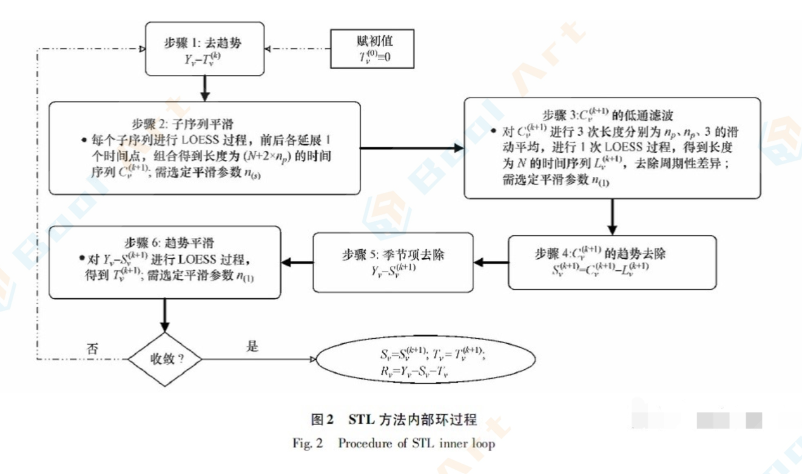

STL的优势

- 可以处理任何类型的季节性
- 允许季节成分随时间变化，并且变化的速率可以变化
- 季节随时间变化速率以及TC的平滑性都可以自定义
- 对异常值不敏感 

缺点：

- 只有加法模式
- 不能自动处理日历变动或交易日影响

**代码** 

```python
#官方示例因
#将C02数据分解为水平,季节和残差

from statsmodels.datasets import co2 
import matplotlib.pyplot as plt
from pandas.plotting import register_matplotlib_converters 
register_matplotlib_converters() 
data co2.load(True).data
data data.resample('M').mean().ffill()
from statsmodels.tsa.seasonal import s
res STL(data).fit() 
res.plot()
plt.show()
```


### 其它分解方法

#### `X11`分解

X11方法中，时间序列由四个因素组成，分别是

- 趋势—循环
- 季节变动
- 不规则波动
- 周工作日变动

#### SEATS分解

Seasonal Extraction in ARIMA Time Series，由西班牙银行发明的方法，用于分析季度和月度数据。


### 趋势与季节度量

以时间序列分解为例，不限于一种方法，其他分解方法也可以用类似的数学方法进行度量
$$
y[t]=T[t]+S[t]+R[t]
$$
T，S，R分别代表平滑后的趋势项，季节项，余项。

如果某时间序列趋势性很很强，例如是上升的趋势，去除季节性后，趋势的方差理论上是要比余项Resid要大的（具体情况具体分析)，所以我们可以定义趋势强度为
$$
F_{t}=\max \left(0,1-\frac{\operatorname{Var}\left(R_{t}\right)}{\operatorname{Var}\left(T_{r}+R_{r}\right)}\right)
$$
因为有时候余项是可能比季节变换后的序列的方法更大的，有可能随机波动特别大。所以取趋势区间为`0-1`。

季节强度也可以用类似的方法，但是要去趋势才能做
$$
F_{t}=\max \left(0,1-\frac{\operatorname{Var}\left(R_{t}\right)}{\operatorname{Var}\left(S_{r}+R_{r}\right)}\right)
$$
同理，使用均值或标准差也有一定参考价值。


## 时间序列基础概念

### 前言

时间序列是指将同一统计指标的数值按其发生的时间先后顺序排列而成的数列。

正如人们常说，人生的出场顺序很重要，时间序列中隐藏着一些过去与未来的关系。时间序列分析试图通过研究过去来预测未来。

时间序列分析在工程、金融、科技等众多领域有着广泛的应用。在大数据时代，时间序列分析已经成为`AI`技术的一个分支，通过将时间序列分析与分类模型相结合，更好的应用于数据检测、预测等场景。 

作为一篇入门介绍，本文将结合具体数据，讲解时间序列分析中的基本概念。

数据集：余额宝在2014-02-01~2014-07-31期间每日申购的总金额（数据来自天池大赛)

数据下载地址：https://tianchi.aliyun.com/competition/entrance/231573/information

首先我们对user_balance_table.csv文件进行处理，取出从2014-02-01到2014-07-31每日申购的总金 额。


### 趋势/季节变化/相关性/随机噪声

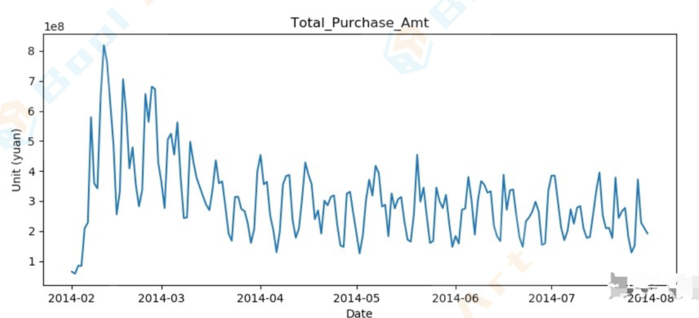

**趋势** 

趋势是时间序列在某一方向上持续运动，现象是在较长时期内受某种根本性因素作用而形成的总的变动趋势。上图中可以看到从2014年2月到2014年4月，余额宝的申购资金一路下降，这是一个明显的趋势。

**季节变化** 

许多时间序列中包含季节变化，现象是在一年内随着季节的变化而发生的有规律的周期性变动。如上图肉眼很难看出时间序列随季节变化，将通过时间序列分解(STL)来展示序列中的季节变化。

**序列相关性 **

时间序列的一个最重要特征是序列相关性，又称为自相关性。上图中可以看到，数据之间存 在一定的正相关与负相关。例如某天的数据上升，它的前一天或者后一天也上升或者下降。自相关性是时 间序列可以预测未来的前提（序列中存在的规律），如果没有自相关性，就变成了白噪声（无规律)。 

**随机噪声**

它是时间序列中除去趋势、季节变化和自相关性之后的剩余随机扰动。由于时间序列存在不确 定性，随机噪声总是夹杂在时间序列中，致使时间序列表现出某种震荡式的无规律运动。

时间序列分析的核心就是挖掘该时间序列中的自相关性。


### 时间序列分解

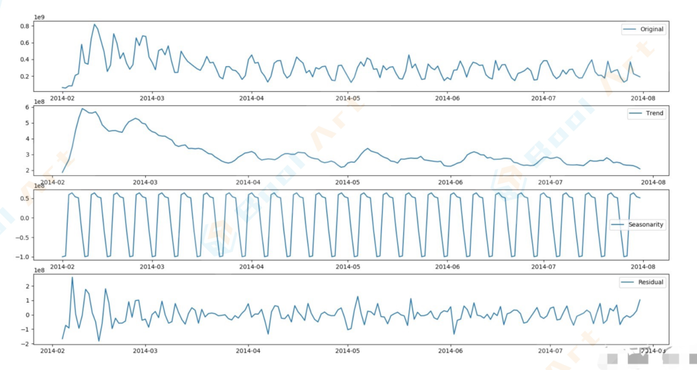

四个序列从上到下依次表示：原始序列、趋势序列、季节序列、残差序列

上图中可以看出，从2014年2月开始，余额宝的申购总金额是呈现出一个逐步下降的趋势（如果大家结合余额宝和银行的利率曲线可以了解到，其实在这段时间内，相比于2013年末到2014年初，余额宝和银行的利息都降低了不少)。

原始序列具有强烈的季节变化（或者称为周期性），几乎是每个月四个周期，也就是以星期为一个周期波动（这一点也很好理解，人们对于资金的存取习惯，跟工作日与节假日有密切的关系)。

最后一项是残差序列，也就是原始序列中去除趋势和季节变化后的序列，这一部分是序列中的不稳定因素，具有一定的随机性，需要做进一步分析。

时间序列分解的成功与否，取决于两个因素：

- 一是数据序列本身是隐藏着规律的，不可预测的部分只是其中的一小部分；
- 二是分解的方法要合适，尤其是周期的判断要准确。


### 时间序列的平稳性

经典回归分析的一个重要假设是：**数据是平稳的**。非平稳数据往往导致“虚假回归”，表现为"两个没有任何因果关系的变量却有很高的相关性"。比如在时间序列中，本来没有自相关性的两个时间点，产生了相关性。因此平稳性是时间序列分析的基础。

**平稳性定义（弱平稳）**

- 第一，均值`u`是与时间`t`无关的常数
- 第二，对于任意时刻`t`和任意时间间隔`k`，时间序列$$z_t$$与$$z_{t-k}$$的自协方差$$r_k$$只与时间间隔`k`有关，与时刻`t`无关。

从统计学的角度讲，平稳性的要求就是对于一个时间序列（分布未知)，这个时间序列的取值一定满足一 个确定的分布。比如我们知道任意一个时间点的取值只能为集合（1, 2, 3)中的某一个数字，取值概率分 别为（0.3, 0.3, 0.4)，那么我们认为这个时间序列是平稳的。但是如果在某一个时间点出现了数字4， 则从该时刻开始，我们认为时间序列就不是平稳的了。

平稳性对于我们分析时间序列至关重要。如果一个时间序列不是平稳的，通常需要通过差分的方式将其转化为平稳时间序列。

举一个例子

> “假设我们想知道2017年5月16日这天上证指数收益率的均值是多少，而且我们假设它是来自一个未知的分布。也许你会马上说“查一下Wind不就知道了？上证指数那天的收益率是0.74%”。注意，0.74%这个数值仅仅是那天上证指数未知收益率分布的一个实例！它不是均值，因此从时间序列分析的角度来说仅仅知道0.74%远远不够。
>
> 对于一般的未知概率分布，只要通过进行大量重复性实验，就可以有足够多的独立观测点来进行统计推断（计算均值和方差这些统计量）。按照这个思路，我们必须把 2017年5月16日这一天经历许多遍，得到许多个那天的收益率观测值，然后用这些观测值计算出收益率的均值。不幸的是，历史只发生一次，时间也一去不复返，我们只能实实在在的经历一遍2017年5月16 日，只能得到一个收益率的观测点，即0.74%。
>
> 然而，如果我们假设上证指数的收益率序列满足弱平稳，就柳暗花明了。根据弱平稳假设，上证指数的日收益率序列{$$r_t$$}的均值是一个与时间无关的常数，即$$E[r_t]=\mu$$。这样便可以利用一段时间的历史数据来计算出日收益率的均值。比如我们可以对上证指数在2017年交易日的日收益率序列取平均，把它作为对总体均值的一个估计。根据弱平稳性，该平均值也正是2017年5月16日的收益率均值。
>
> 同样的道理，在弱平稳的假设下，可以根据历史数据方便的对时间序列的诸多统计量进行推断。

#### ADF检验

对于一个时间序列，如何确定它**是否满足平稳性要求**？通常采用 **ADF 检验**。

先来看两个特殊的时间序列：

- 对于时间序列$$w_t : t = 1, ..., n$$。如果该序列的成分$$w_t$$满足均值为0，方差$$\sigma^{2}$$，且对于任意的`k>=1`，自相关系数$$p^k$$均为0，则称该时间序列为一个离散的白噪声。
  $$
  X_{t}=w_{t}, w_{t}\left(0, \sigma^{2}\right)
  $$
  

- 对于时间序列$$w_t$$，如果它满足心$$x_{t}=x_{t-1}+w_{t}$$，其中$$w_t$$是一个均值为0、方差为$$\sigma^{2}$$的白噪声，则序列$$x_t$$为一个随机游走。
  $$
  X_{t}=X_{t-1}+w_{t}, X_{t}\left(0, t \sigma^{2}\right)
  $$
  

显然对于白噪声序列，它满足正态分布，均值与方差都是与时间`t`无关的函数，它满足平稳性要求。

对于随机游走，它的均值为0，方差与时间`t`有关，它不满足平稳性要求。

**ADF大致的思想就是基于随机游走的**，对$$Xt$$回归，如果发现p=1，说明序列满足随机游走，就是非平稳的。

1. $$X_{t}=X_{t-1}+u_{t}$$随机游走，非平稳
2. $$X_{t}=pX_{t-1}+u_{t}$$对待估计的时间序列回归， 如果发现p=1，则称X有一个单位根

通过上式判断$$X_t$$是否具有单位根，来确定是否平稳。

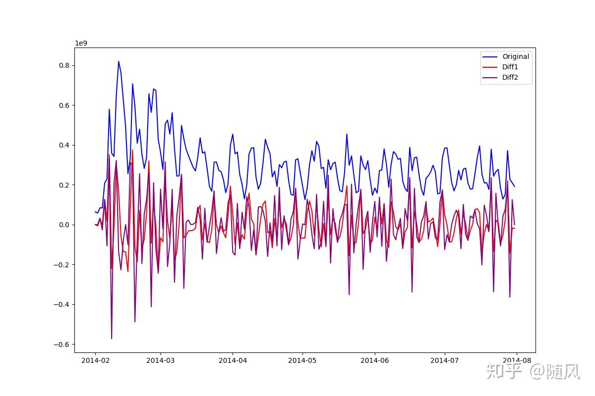

从上图中可以看出，经过一阶差分，原序列的趋势（**有趋势一定是非平稳的**）被消除了，整个序列基本围绕确定的均值震荡。经过二阶差分，与一阶差分相比，只是在震荡幅度上扩大了，因此对于该序列，采用一阶差分比较合适。一**般情况下，采用一阶、二阶差分就可以使序列变得平稳。**

再来看一下ADF计算的结果，首先解释一下主要参数的含义，以 `timeseries_adf` 为例：

第一个参数 `-1.742812211577193`： T检验，假设检验值。

第二个参数 `0.4092001716091834`： P-value：假设检验结果。

第三个参数` {'10%': -2.5760826967621644, '1%': -3.470126426071447, '5%': -2.8790075987120027}` :  不同程度拒绝原假设的统计值。

```python
timeseries_adf :  (-1.742812211577193, 0.4092001716091834, 13, 167, {'10%': -2.5760826967621644, '1%': -3.470126426071447, '5%': -2.8790075987120027}, 6462.731450458982)
timeseries_diff1_adf :  (-10.06109433503844, 1.332927648174115e-17, 12, 168, {'10%': -2.5760266680839004, '1%': -3.4698858990744115, '5%': -2.8789026251889647}, 6463.521915345894)
timeseries_diff2_adf :  (-8.369488957177882, 2.686267936266921e-13, 14, 166, {'10%': -2.576139407751488, '1%': -3.4703698981001665, '5%': -2.8791138497902193}, 6490.52295323287)
```

如何确定该序列是否平稳呢？

1. 1%、%5、10%不同程度拒绝原假设的统计值和 ADF 假设检验值比较，ADF 假设检验值同时小于1%、5%、10%即说明非常好地拒绝该假设。
2. P-value是否非常接近0。

本数据中，原序列的 ADF 假设检验值为`-1.742812211577193`， 大于三个level的统计值，所以是非平稳的。而一阶差分序列的 ADF  假设检验值为`-10.06109433503844`，小于三个level的统计值，再来看P-value的值为`1.332927648174115e-17`，接近0，所以是平稳的。

ADF检验的原假设是存在单位根，只要这个统计值是小于1%水平下的数字就可以极显著的拒绝原假设，认为数据平稳。注意，ADF值一般是负的，也有正的，但是它**只有小于1%水平下才能认为是及其显著的拒绝原假设**。
对于ADF结果在1% 以上 5%以下的结果，也不能说不平稳，关键看检验要求是什么样子的。


### 自相关系数ACF/偏自相关系数PACF

首先介绍一下协方差，假设两个随机变量 **X** 和 **Y** 满足未知的概率分。**X** 和 **Y** 的**协方差**为：
$$
\operatorname{Cov}(X, Y)=\mathrm{E}\left[\left(X-\mu_{X}\right)\left(Y-\mu_{Y}\right)\right]
$$
其中，$$\mu_{X}$$和$$\mu_{y}$$分别为 **X** 和 **Y** 的**均值**。

在实际中，由于总体的概率分布未知，我们只能通过 **X** 和 **Y** 的观测值来计算**样本均值**。假设我们各有 **X** 和 **Y** 的观测值`n`个，则它们的**样本协方差**为：
$$
\frac{1}{n-1} \sum_{i=1}^{n}\left(X_{i}-\bar{X}\right)\left(Y_{i}-\bar{Y}\right)
$$
其中，$$\bar{X}$$和$$\bar{Y}$$为 **X** 和 **Y** 的样本均值。上面公式中右侧之所以除以 n-1 而非 n 的原因是，这么做可以保证样本协方差是总体协方差的一个**无偏估计**。

对于**无偏估计**，大致的意思就是我们需要计算总体的均值和方差，然而我们拿到的数据是对总体的采样，因此得到的均值与方差是对采样样本而言的，而不是总体的均值与方差。可以证明样本的方差比总体方差小$$\frac{\sigma^{2}}{n}$$，因此在计算方差的时候，分母取`n-1`而不是`n`。

然而用协方差来衡量变量之间的相关性是有问题的，比如计算变量 **X** 和 **Y** 的协方差为100。我们考虑变量 `10*X `与 `10*Y `之间的协方差，应该为10000，相关性提升了100倍！显然我们知道 **X** 和 **Y** 之间的相关性与 `10*X `与 `10*Y `之间的相关性是一样的，只是两个变量都放大了10倍。

上面的例子说明使用协方差衡量变量相关性的**致命缺点：协方差是有量纲的，因此它的大小受随机变量本身波动范围的影响**。**最简单的做法就是用变量自身的波动对协方差进行标准化。相关系数便由此得来。**

令$$\rho$$表示 **X** 和 **Y** 的**总体相关系数**，它的定义为：
$$
\rho(X, Y)=\frac{\mathrm{E}\left[\left(X-\mu_{X}\right)\left(Y-\mu_{Y}\right)\right]}{\sigma_{X} \sigma_{Y}}=\frac{\operatorname{Cov}(X, Y)}{\sigma_{X} \sigma_{Y}}
$$
其中$$\sigma_{X}$$和$$\sigma_{Y}$$分别为 **X** 和 **Y** 的**总体标准差**。通过使用 **X** 和 **Y** 的标准差对它们的协方差归一化，$$\rho$$的取值范围在 -1 到 +1 之间，即 [-1, +1]：

- $$\rho(X, Y)=1$$表示X和Y之间存在确切的线性正相关； 
- $$\rho(X, Y)=0$$表示X和Y之间不存在任何线性相关性； 
- $$\rho(X, Y)=-1$$表示X和Y之间存在确切的线性负相关。

值得一提的是，**相关系数仅仅刻画** **X 和 Y** **之间的线性相关性；它不描述它们之间的（任何）非线性关系**。

在实际中，由于总体的概率分布未知，我们只能通过 **X** 和 **Y** 的观测值来计算 **X** 和 **Y** 的**样本相关系数**：
$$
\hat{\rho}(X, Y)=\frac{\sum_{i=1}^{n}\left(X_{i}-\bar{X}\right)\left(Y_{i}-\bar{Y}\right)}{\sqrt{\sum_{i=1}^{n}\left(X_{i}-\bar{X}\right)^{2} \sum_{i=1}^{n}\left(Y_{i}-\bar{Y}\right)^{2}}}
$$
时间序列的特点是一维，因此如果借用上面的指标衡量，有些不太适宜。**根据时间序列的特点，形成了自相关函数、偏自相关函数**。看到前面都加了一个“自”，原因是时间序列没法在找到一个别的数据和自己来进行比较；**只能自己和自己来比较，自己和自己慢几拍（滞后期）的这些数据进行比较，所以加入了一个“自”。** 

#### 自相关系数 ACF

`自相关系数`度量的是同一事件在两个不同时期之间的相关程度，形象的讲就是度量自己过去的行为对自己现在的影响
$$
A C F(k)=\Sigma_{t=k+1}^{n} \frac{\left(Z_{t}-\bar{Z}\right)\left(Z_{t-k}-\bar{Z}\right)}{\Sigma_{t=1}^{n}\left(Z_{t}-\bar{Z}\right)^{2}}
$$
**自相关（autocorrelation），也叫序列相关，是一个信号于其自身在不同时间点的相关度。**非正式地来说，它就是两次观察之间的相似度对它们之间的时间差的函数。它是找出重复模式（如被噪声掩盖的周期信号），或识别隐含在信号谐波频率中消失的基频的数学工具。它常用于信号处理中，用来分析函数或一系列值，如时域信号。

#### 偏自相关系数 PACF

根据ACF求出滞后k自相关系数$$A C F(k)$$时，实际上得到并不是Z(t)与Z(t-k)之间单纯的相关关系。

因为Z(t)同时还会受到中间k-1个随机变量Z(t-1)、Z(t-2)、……、Z(t-k+1)的影响，而这k-1个随机变量又都和z(t-k)具有相关关系，所以自相关系数里面实际掺杂了其他变量对Z(t)与Z(t-k)的影响。

为了能单纯测度Z(t-k)对Z(t)的影响，引进偏自相关系数（PACF）的概念。对于平稳时间序列$${Z(t)}$$，所谓滞后k偏自相关系数指在给定中间k-1个随机变量Z(t-1)、Z(t-2)、……、Z(t-k+1)的条件下，或者说，在剔除了中间k-1个随机变量Z(t-1)、Z(t-2)、……、Z(t-k+1)的干扰之后，Z(t-k)对Z(t)影响的相关程度。
$$
P A C F(k)=\frac{E\left(Z_{t}-E Z_{t}\right)\left(Z_{t-k}-E Z_{t-k}\right)}{\sqrt{E\left(Z_{t}-E Z_{t}\right)^{2}} \sqrt{E\left(Z_{t-k}-E Z_{t-k}\right)^{2}}}=\frac{\operatorname{cov}\left[\left(Z_{t}-\bar{Z}_{t}\right),\left(Z_{t-k}-Z_{t-k}^{-}\right)\right]}{\left.\sqrt{\left.\operatorname{var}\left(Z_{t}-\bar{Z}_{t}\right)\right)} \sqrt{\operatorname{var}\left(Z_{t-k}-Z_{t-k}^{-}\right.}\right)}
$$
计算某一个要素对另一个要素的影响或相关程度时，**把其他要素的影响视为常数，即暂不考虑其他要素的影响**，而**单独研究那两个要素之间的相互关系的密切程度**时，称为偏相关。

对时间序列建模，最重要的就是挖掘出该序列中的不同间隔`k`的自相关性。相关图可以帮助我们判断模型是否合适。这是因为**时间序列的特征中往往包括相关性和随机噪声**。如果模型很好的捕捉了自相关性，那么**原始时间序列与模型拟合的时间序列之间的残差应该近似的等于随机噪声**。**残差序列自然也是一个时间序列**，因此可以对它画出相关图。一个**标准随机噪声的自相关满足**$$\rho_0=1$$以及$$\rho_k=0, k=1,2,3,...$$，即**对于任意不为 0 的间隔，随机噪声的自相关均为 0**。


## ARIMA/AR/MA模型

### Auto Regression模型

**自回归模型**描述当前值与历史值之间的关系，用变量自身的历史时间数据对自身进行预测。

一般的P阶自回归模型AR：
$$
X_{t}=\alpha_{1} X_{t-1}+\alpha_{2} X_{t-2}+\ldots+\alpha_{p} X_{t-p}+u_{t}
$$
如果随机扰动项是一个白噪声$$\left(u_{t}=\varepsilon_{t}\right)$$，则称为一个纯AR（p)过程，记为：
$$
X_{t}=\alpha_{1} X_{t-1}+\alpha_{2} X_{t-2}+\ldots+\alpha_{p} X_{t-p}+\varepsilon_{t}
$$
自回归模型首先需要确定一个阶数ρ，表示用几期的历史值来预测当前值。 

自回归模型有很多的限制：

- 自回归模型是用自身的数据进行预测
- 时间序列数据必须具有平稳性
- 自回归只适用于预测与自身前期相关的现象（时间序列的自相关性）


### Moving Average模型

在AR模型中，如果$$\mu_t$$不是一个白噪声，通常认为它是一个q阶的移动平均。即

$$u_{t}=\varepsilon_{t}+\beta_{1} \varepsilon_{t-1}+\ldots+\beta_{q} \varepsilon_{t-q}$$，其中$$\varepsilon_{t}$$表示白噪声序列。

特别的，当$$X_t = \mu_t$$，即时间序列当前值与历史值没有关系，而只依赖于历史白噪声的线性组合，就得到MA模型：
$$
X_{t}=\varepsilon_{t}+\beta_{1} \varepsilon_{t-1}+\ldots+\beta_{q} \varepsilon_{t-q}
$$
需要指出一点，AR模型中历史白噪声的影响是间接影响当前预测值的（通过影响历史时序值）。


### ARMA模型

将AR(p)与MA(q)结合，得到一个一般的**自回归移动平均模型ARMA**（p，q)：
$$
X_{t}=\alpha_{1} X_{t-1}+\alpha_{2} X_{t-2}+\ldots+\alpha_{p} X_{t-p}+\varepsilon_{t}+\beta_{1} \varepsilon_{t-1}+\ldots+\beta_{q} \varepsilon_{t-q}
$$
该式表明：

- **一个随机时间序列可以通过一个自回归移动平均模型来表示**，即该序列**可以由其自身的过去或后值 以及随机扰动项来解释**。
- **如果该序列是平稳的**，即它的行为并不会随着时间的推移而变化，那么我们就**可以通过该序列过去的行为来预测未来**。


### ARIMA模型

将自回归模型（AR)、移动平均模型(MA)和差分法结合，我们就得到了差分自回归移动平均模型
ARIMA(p、d、q)，其中d是需要对数据进行差分的阶数。

ARIMA模型的基本思想

**将预测对象随时间推移而形成的数据序列视为一个随机序列，用一定的数学模型来近似描述这个序列**。这个模型一旦被识别后就可以从时间序列的过去值及现在值来预测未来值。现代统计方法、计量经济模型在某种程度上已经能够帮助企业对未来进行预测。

ARIMA模型建立在历史数据的基础上，故搜集的历史数据越多，模型越准确。

比如，每月储蓄数据可以看作是随着时间的推移而形成的一个随机时间序列，通过对该时间序列上储蓄值的随机性、平稳性以及季节性等因素的分析，将这些单月储蓄值之间所具有的相关性或依存关系用数学模型描述出来，从而达到利用过去及现在的储蓄值信息来预测未来储蓄情况的目的。


### ARIMA实战

生成ARIMA模型的基本步骤：

- 对序列绘图，**进行ADF检验**，观察序列是否平稳；对于**非平稳时间序列要先进行d阶差分**，转化为平稳时间序列；
- 经过第一步处理，已经得到平稳时间序列。要**对平稳时间序列分别求得其自相关系数ACF和偏自相关系数PACF**，通过对自相关图和自相关图的分析，得到最佳的阶数p、q；
- 由以上得到的d、q、p，得到ARMA模型，然后开始对得到的模型进行模型检验。

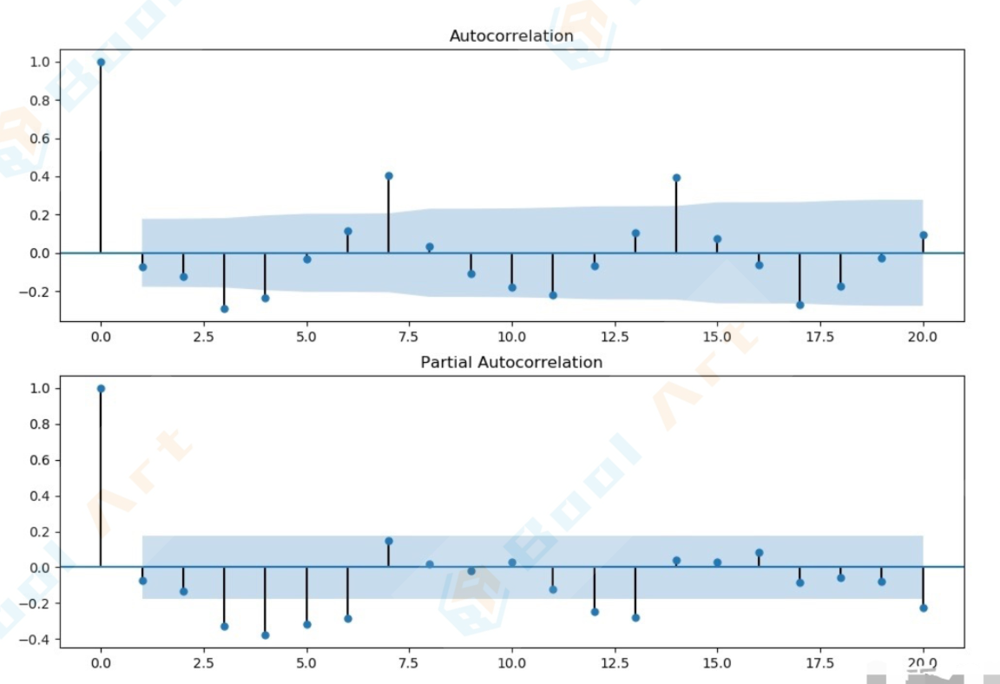

如何确定AR(p)的p值，MA(q)的q值？

拖尾和截尾拖尾指序列以指数率单调递减或震荡衰减，而截尾指序列从某个时点变得非常小：

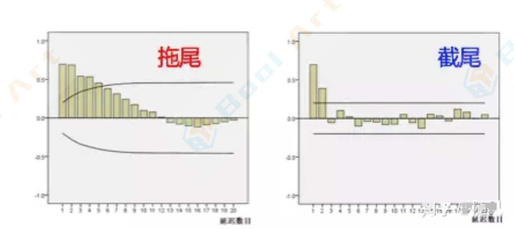

p，q阶数的确定：

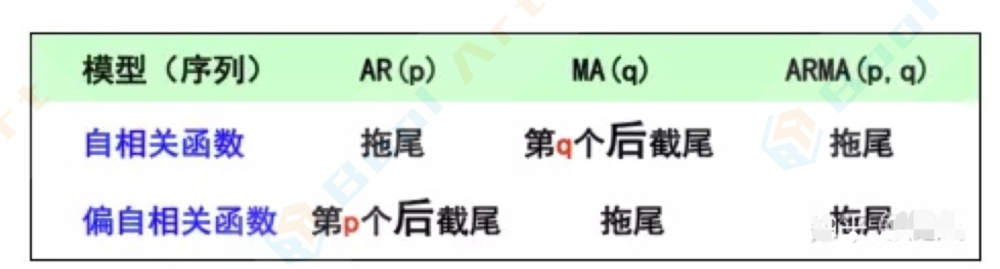

从序列ACF、PACF的图中没有发现明显的拖尾或截尾，说明对于这样的序列，并不适合用ARIMA模型
来拟合。如何用ARMA模型来拟合这样的曲线呢？这里我们将先通过对时间序列分解(STL)，再采用
ARIMA模型来拟合趋势序列与残差序列。

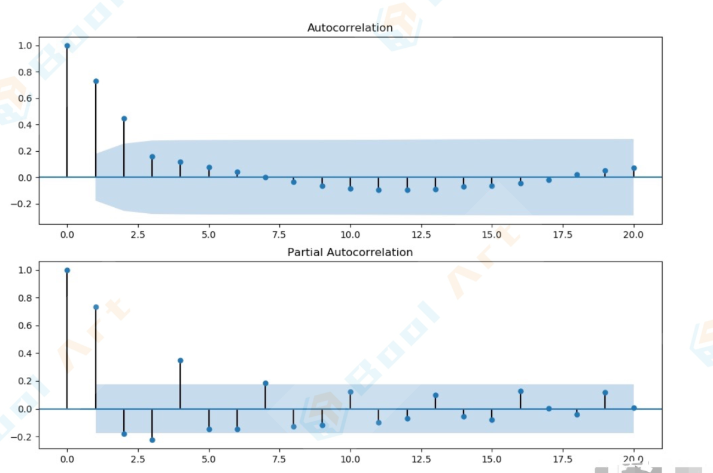

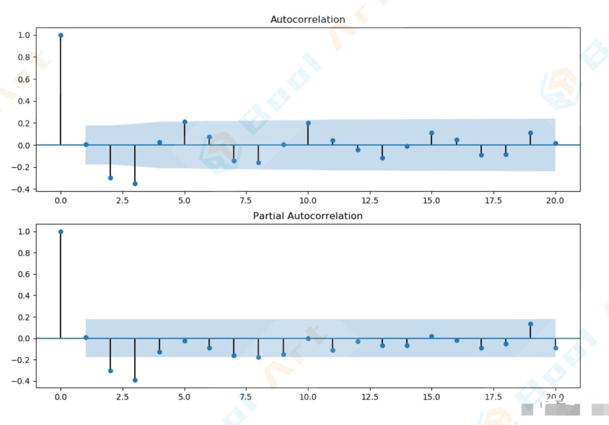

从上图可以看到：

- 趋势序列ACF有3阶截尾，PACF有2阶拖尾。因此可以选p=2，q=3。
- 残差序列ACF有4阶拖尾，PACF有4阶截尾。因此可以选p=4，q=4。

通过拖尾和截尾对模型定阶，具有很强的主观性。回顾一下我们对于模型参数估计得方法，是通过对损失和正则项的加权评估。我们在参数选择的时候，需要平衡预测误差与模型复杂度。我们可以根据信息准则函数法，来确定模型的阶数。这里介绍AIC、BIC准则。

#### AIC准则

AIC准则全称是**最小化信息量准则**（Akaike Information Criterion)

`AIC=-2ln(L)+2K`，其中L表示模型的极大似然函数，K表示模型参数个数。

AIC准则存在一定的不足。当样本容量很大时，在AIC准则中拟合误差提供的信息就要受到样本容量的放
大，而参数个数的惩罚因子却和样本容量没关系（一直是2），因此当样本容量很大时，使用AIC准则的
模型不收敛于真实模型，它通常比真实模型所含的未知参数个数要多。

#### BIC准则

BIC(Bayesian InformationCriterion)贝叶斯信息准则弥补了AIC的不足

`BIC=-2ln(L)+Kln(n)`，其中n表示样本容量。

显然，这两个评价指标越小越好。我们通过网格搜索，确定AIC、BIC最优的模型(p、q)

```python
decomposition = seasonal_decompose(purchase_seq_train) 
trend = decomposition.trend
seasonal = decomposition.seasonal 
residual = decomposition.resid

trend = trend.fillna(0)
seasonal = seasonal.fillna(0) 
residual = residual.fillna(0)

trend_evaluate = sm.tsa.arma_order_select_ic(trend,ic=['aic','b ic'],trend='nc',max_ar=4, max_ma=4)

print('trend AIC',trend_evaluate.aic_min_order) 
print('trend BIC',trend_evaluate.bic_min_order)

residual_evaluate = sm.tsa.arma_order_select_ic(residual,ic=['aic','bic'],trend='nc',max_ar=4, max_ma=4)
print('residual AIC',residualevaluate.aic_min_order)
print('residual BIC',residual_evaluate.bic_min_order)

trend AIC (1,0) 
trend BIC (1,0)
residual AIC (2,1) 
residual BIC (2,1)
```

从评价准则的结果看（这里采用AIC结果）：

- 对趋势序列，p=1，q=0
- 对残差序列，p=2，q=1

下面我们将分别训练趋势序列和残差序列的ARMA模型，并结合原序列的周期，拟合训练集数据，并预
测测试集数据。

- 对于训练集，`拟合序列=周期序列+趋势序列（ARIMA拟合）+残差序列（ARIMA拟合）`  
- 对于测试集，`预测序列=周期序列+趋势序列（ARIMA预测）+残差序列（ARIMA预测）` 

实际上，“**序列的线性自相关性不强**，**受随机噪声影响较大**”的数据集不适合用ARMA模型来拟合，但是这里我们采用了时间序列分解的方法，暂且预测了一个序列的趋势。


## 时间序列平稳

[如何深入理解时间序列分析中的平稳性？](https://www.zhihu.com/question/21982358/answer/21442305) 

### 为何要平稳`stationary` 

每一个统计学问题，我们都需要对其先做一些基本假设。如在一元线性回归中（$$y_{i}=\beta_{0}+\beta_{1} x_{i}+\varepsilon_{i}$$ ）我们要假设：1. $$x_i$$不相关切非随机（是固定值或当做已知）2. $$\varepsilon_{i}$$独立同分布服从正态分布（均值为0，方差恒定）。

在时间序列分析中，我们考虑了很多**合理**且**可以简化问题**的假设。而其中最重要的假设就是平稳。

> The basic idea of stationarity is that the probability laws that govern the behavior of the process do not change over time.
> **平稳的基本思想是：==时间序列的行为并不随时间改变==**.

正因此，我们定义了两种平稳：

> **强平稳**过程：对于所有可能的n，所有可能的t1，t2，·，tn和所有可能的k，当Zt1，Zt2，，
> Ztn的联合分布与Z1-k，Z2-k，·，Zn-k相同时，我们称其强平稳。
>
> **弱平稳**过程：当==**均值函数是常数函数**==且==**协方差函数仅与时间差相关**==，我们才称其为弱平稳。


### 为何要弱平稳`weak stationary` 

我们先来说说两种平稳的差别：

两种平稳过程并没有包含关系，即弱平稳不一定是强平稳，强平稳也不一定是弱平稳。

- 一方面，虽然看上去强平稳的要求好像比弱平稳强，但强平稳并不一定是弱平稳，因为其矩不一定存在例子：{Zt}独立服从柯西分布。{Zt}是强平稳，但由于柯西分布期望与方差不存在，所以不是弱平稳。（之以不存在是因为其并非绝对可积)
- 另一方面，弱平稳也不一定是强平稳，因为二阶矩性质并不能确定分布的性质。 例子：`Z1~N(1，1)`，`Z2~Exp(1)`，`Z3~Poi(1)`互相独立。这是弱平稳却不是强平稳。 

知道了这些造成差别的根本原因后，我们也可以写出两者的一些联系：

- **一阶矩和二阶矩存在时，强平稳过程是弱平稳过程**。条件可简化为二阶矩存在，因为$$\left.E\left(X^{2}\right) \geq E(|X|)^{2}\right)$$
- **当联合分布服从多元正态分布时，两平稳过程等价**。多元正态分布的二阶矩可确定分布性质。

而**为什么用弱平稳而非强平稳**？主要原因是：**强平稳条件太强**，无论是从理论上还是实际上。

理论上，证明一个时间序列是强平稳的一般很难。当分布很复杂的时候，不仅很难比较所有可能性，也可能很难写出其联合分布函数。

实际上，对于数据，我们也只能估算出它们均值和二阶矩，我们没法知道它们的分布。所以我们在以后的模型构建和预测上都是在用ACF，这些性质都和弱项和性质有关。

而且，教我时间序列教授“General linear process(weak stationarity，linearity，causality)covers about 10%of the real data。“（一般线性过程（弱平稳性、线性、因果性）覆盖真实数据的10%左右），如果考虑的是强平稳，我觉得可能连5%都没有了。


## 卡尔曼滤波

[史上最详细的Kalman滤波解读与实践(python)](https://blog.csdn.net/u010712012/article/details/90294295) 

### 什么是卡尔曼滤波

卡尔曼滤波(Kalman filter)是一种**高效的==自回归==滤波器**，它能在**存在诸多不确定性情况的组合信息**中**估**
**计动态系统的状态**。

对于这个滤波器，我们几乎可以下这么一个定论：**只要是存在不确定信息的动态系统，卡尔曼滤波就可以对系统下一步要做什么做出有根据的推测**。即便有噪声信息干扰，卡尔曼滤波通常也能很好的弄清楚究竟发生了什么，找出现象间不易察觉的相关性。

因此卡尔曼滤波非常适合不断变化的系统，它的优点还有内存占用较小（只需保留前一个状态)、速度 快，是实时问题和嵌入式系统的理想选择。


### 卡尔曼滤波能做什么

让我们为个例子：你造了一个可以在树林里四处溜达的小机器人，为了让它实现导航，机器人需要知道自己所处的位置。也就是说，机器人有一个包含位置信息和速度信息的状态$$\vec{x}_{k}$$：
$$
\overrightarrow{x_{k}}=(\vec{p}, \vec{v})
$$
注意，在这个例子中，状态是位置和速度，放进其他问题里，它也可以是水箱里的液体体积、汽车引擎温 度、触摸板上指尖的位置，或者其他任何数据。

我们的小机器人装有GPS传感器，定位精度10米。虽然一般来说这点精度够用了，但我们希望它的定位误差能再小点，毕竟树林里到处都是土坑和陡坡，如果机器人稍稍了那么几米，它就有可能滚落山坡。所以GPS提供的信息还不够充分。

我们也可以预测机器人是怎么移动的：它会把指令发送给控制轮子的马达，如果这一刻它始终朝一个方向 前进，没有遇到任何障碍物，那么下一刻它可能会继续坚持这个路线。但是机器人对自己的状态不是全知的：它可能会逆风行驶，轮子打滑，滚落颠簸地形……所以车轮转动次数并不能完全代表实际行驶距离，基于这个距离的预测也不完美。

这个问题下，GPS为我们提供了一些关于状态的信息，但那是间接的、不准确的；我们的预测提供了关于机器人轨迹的信息，但那也是间接的、不准确的。

但以上就是我们能够获得的全部信息，在它们的基础上，我们是否能给出一个完整预测，让它的准确度比机器人搜集的单次预测汇总更高？用了卡尔曼滤波，这个问题可以迎刃而解。


### 卡尔曼滤波眼中的机器人问题

还是上面这个问题，我们有一个状态，它和速度、位置有关
$$
\vec{x}=\left[\begin{array}{l}
p \\
v
\end{array}\right]
$$
我们不知道它们的实际值是多少，但掌握着一些速度和位置的可能组合，其中某些组合的可能性更高：

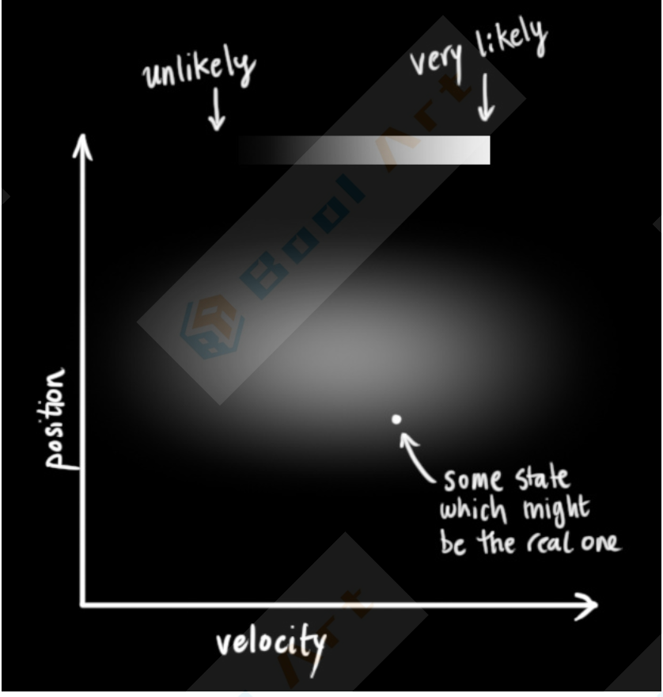

卡尔曼滤波假设两个变量（在我们的例子里是位置和速度）都应该是随机的，而且符合高斯分布。

每个变量都有一个均值$$\mu$$，它是随机分布的中心；有一个方差$$\delta^2$$，它衡量组合的不确定性。

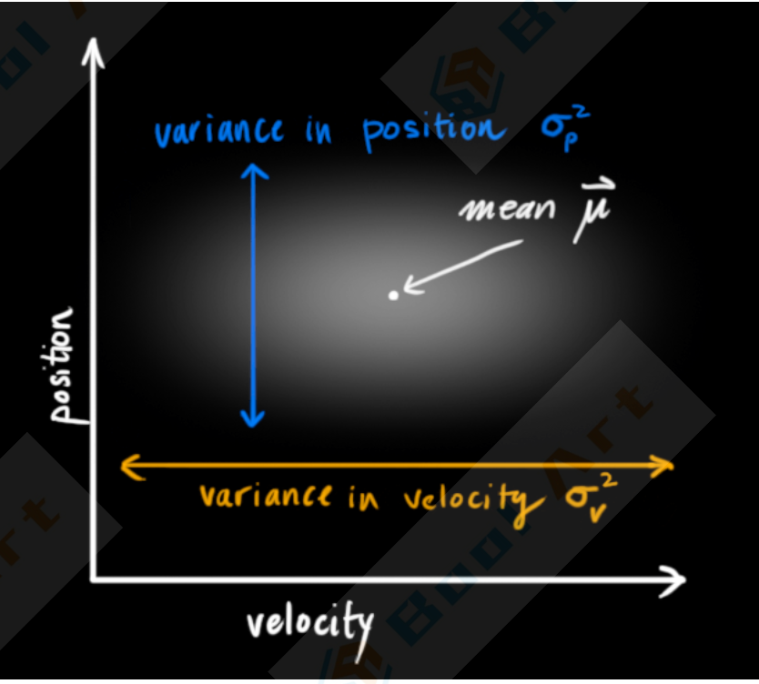

在上图中，位置和速度是不相关的，这意味着我们不能从一个变量推测另一个变量。 

那么如果位置和速度相关呢？机器人前往特定位置的可能性取决于它拥有的速度。

这不难理解，如果基于引旧位置估计新位置，我们会产生这两个结论：如果速度很快，机器人可能移动得更远，所以得到的位置会更远；如果速度很慢，机器人就走不了那么远。

这种关系对目标跟踪来说非常重要，因为它提供了更多信息：一个可以衡量可能性的标准。这就是卡尔曼滤波的目标：从不确定信息中挤出尽可能多的信息！

为了捕获这种相关性，我们用的是协方差矩阵。简而言之，矩阵的每个值是第`i`个变量和第`j`个变量之间的相关程度（由于矩阵是对称的，`i`和`j`的位置可以随便交换)。我们用$$\Sigma$$表示协方差矩阵，在这个例子中，就是$$\Sigma_{i j}$$。

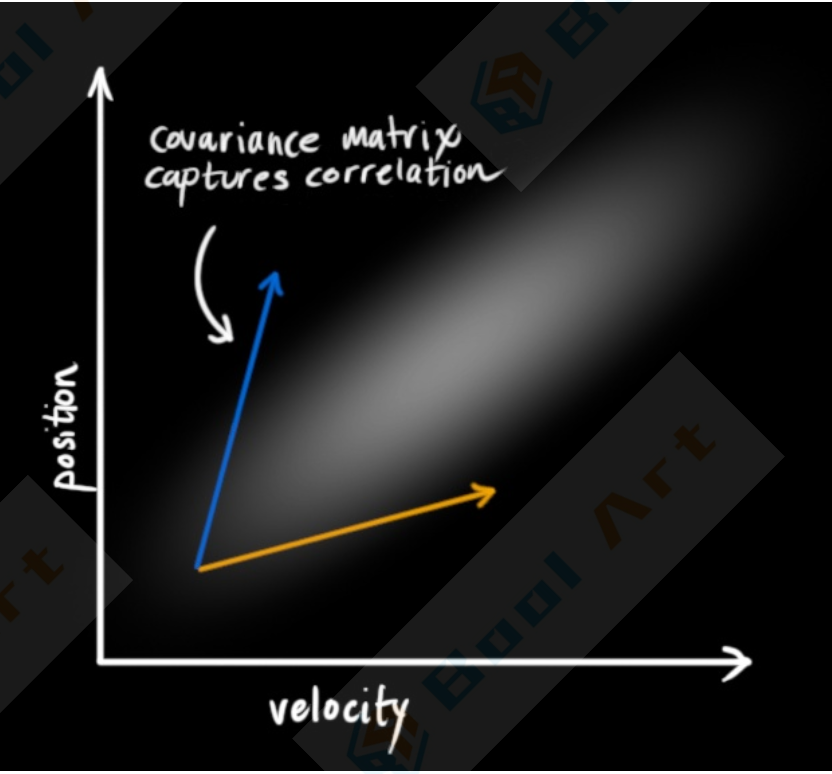


### 用矩阵描述问题

#### 外部影响

#### 外部不确定性

### 通过测量来细化估计值

### 结合高斯


## 时间序列预测算法Prophet

[Facebook 时间序列预测算法 Prophet 的研究](https://zhuanlan.zhihu.com/p/52330017) 

### Prophet简介

Facebook 所提供的 prophet  算法不仅可以处理时间序列存在一些异常值的情况，也可以处理部分缺失值的情形，还能够几乎全自动地预测时间序列未来的走势。

从论文上的描述来看，这个 prophet 算法是基于时间序列分解和机器学习的拟合来做的，其中在拟合模型的时候使用了 pyStan 这个开源工具，因此能够在较快的时间内得到需要预测的结果。

除此之外，为了方便统计学家，机器学习从业者等人群的使用，prophet 同时提供了 R  语言和 Python 语言的接口。从整体的介绍来看，如果是一般的商业分析或者数据分析的需求，都可以尝试使用这个开源算法来预测未来时间序列的走势。

### Prophet算法原理

#### Prophet数据的输入与输出

#### Prophet的算法实现

#### 趋势项模型

#### 变点的选择Changepoint Selection

#### 对未来的预估Trend Forecast Uncertainty

#### 季节性趋势

#### 节假日效应holidays and events

#### 模拟拟合Model Fitting

#### Prophet中可以设置的参数

### Prophet的实际使用

#### Prophet的简单使用

#### Prophet的参数设置

#### 增长函数的设置

#### 变点的设置

#### 周期性的设置

#### 节假日的设置


# kNN

## 距离度量

在软件开发和数据分析的过程中，有很多不同的距离的计算方法，如欧氏距离，马氏距离，等等。对这些距离的理解，有助于我们更好的建立模型，规划数据平台的存储和索引功能。

首先，我们需要对”距离”本身进行一些约束。我们所描述的距离，指的是度量空间(Metric space)的距 离。良好的测距函数应具备以下特征：

- 距离大于等于0；
- 距离是对称的，即a到b的距离应等于b到a的距离；
- 相同的输入，距离为0； 
- 满足三角不等式；

本文对一系列常见的，满足上述原则的距离定义，作以下分类：

### 连续m维空间中点和点的距离

闵可夫斯基距离（明氏距离）适用于**多维连续空间中两个点位置**的判断。**每个空间内的数值必须是连续的**。这一类距离定义包括：欧几里得距离（欧氏距离），曼哈顿距离，切比雪夫距离。

而这一族距离的定 义，统称为闵可夫斯基距离。定义如下：

连续n维空间中两点$$P=\left(x_{1}, x_{2}, \ldots, x_{n}\right) \text { and } Q=\left(y_{1}, y_{2}, \ldots, y_{n}\right) \in \mathbb{R}^{n}$$ 

之间的明氏距离（闵可夫斯基距离）公式为：
$$
\left(\sum_{i=1}^{n}\left|x_{i}-y_{i}\right|^{p}\right)^{1 / p}
$$
p取1或2时的明氏距离是最为常用的：

- p=2即为欧氏距离

- p=1时则为曼哈顿距离

- 当p取无穷时的极限情况下，可以得到切比雪夫距离：
  $$
  D_{\text {Chebyshev }}(p, q):=\max _{i}\left(\left|p_{i}-q_{i}\right|\right)
  $$

欧氏距离是这里面我们最熟悉的类型，以2维空间为例，

- 欧氏距离即**两点之间的直线距离** 
- 曼哈顿距离就是**各坐标差**的**绝对值之和** 
- 切比雪夫距离则是各坐标差的绝对值的**最大值 **

闵氏距离，包括曼哈顿距离、欧氏距离和切比雪夫距离都存在一些缺点：

1. 各个分量的单位必须是等价的。如果有量纲不相等的维度，就无法适用。

   例如，考虑楼宇内的定位问题：水平方向上的单位是米，垂直方向的单位是”层“，在这种情况下就无法直接使用闵氏距离。通常这种情况下需要对数据做正规化；

2. 没有考虑各个分量的分布（期望，方差等）可能是不同的；

3. 各个维度必须是互相独立的，也就是“正交”的；

马哈拉诺比斯距离（马氏距离）针对上述第1，3个缺点做出了改进。Wki描述如下：

> “它是一种有效的计算两个未知样本集的相似度的方法。与欧氏距离不同的是它考虑到各种特性之间的联系 (例如：一条关于身高的信息会带来一条关于体重的信息，因为两者是有关联的)并且是尺度无关的(scale--invariant)，即独立于测量尺度。对于一个均值为$$\mu=\left(\mu_{1}, \mu_{2}, \mu_{3}, \ldots, \mu_{p}\right)^{T}$$，协方差矩阵为的多变量向量$$x=\left(x_{1}, x_{2}, x_{3}, \ldots, x_{p}\right)^{T}$$。

马氏距离为：
$$
D_{M}(x)=\sqrt{(x-\mu)^{T} \Sigma^{-1}(x-\mu)}
$$
如果协方差矩阵为单位矩阵，马哈拉诺比斯距离就简化为欧氏距离。


### 连续m维空间中向量和向量的距离

向量和向量之间的相似度，包含了两层概念：角度的相似度，和大小的相似度。常见的向量距离计算方法是余弦距离（余弦相似度)。

两个向量A和B之间的余弦相似度定义如下：
$$
\text { similarity }=\cos (\theta)=\frac{A \cdot B}{\|A\|\|B\|}=\frac{\sum_{i=1}^{n} A_{i} \times B_{i}}{\sqrt{\sum_{i=1}^{n}\left(A_{i}\right)^{2}} \times \sqrt{\sum_{i=1}^{n}\left(B_{i}\right)^{2}}}
$$
这里的$$A_i$$和$$B_i$$分别代表向量A和B的各分量。

余弦距离常被用于文本相似度的比较，如TF-DF权重的比较中。


### m维无序离散空间中的距离

这类的距离，度量的是`m`维离散，无序空间中两个变量之间的差异。两个变量之间，只有距离的大小，没有绝对值大小的区别。这里的变量的实际形式，可以是一组标签，一个字符串等等。这类距离中比较常见的有：

**编辑距离** 

编辑距离是一组定义的集合，指的是给定2个字符串a，b，将a转换为b的最少操作次数。 

通常我们所说的编辑距离，指的是**莱文斯坦距离**，字符操作只允许如下3种： 

- 插入一个字符，例如：fj->fxj 
- 删除一个字符，例如：fxj->fj
- 替换一个字符，例如：jxj->fyj

对编辑距离的计算需要使用动态规划法，时间复杂度为O(mm)

另外，Hamming distance海明/汉明距离也是编辑距离的一种，但必须作用在等长字符串上。典型的应 用，有判断图像的相似度，先将图像变为相同尺寸的黑白图再计算。

**Jaccard距离** 

判断两个集合的相似度。

这类距离的索引，是软件实现的噩梦，而噩梦的名称就叫做维数灾难。


## kNN介绍

### kNN算法概述

KNN可以说是最简单的分类算法之一，同时，它也是最常用的分类算法之一，注意KNN算法是有监督学习中的分类算法，它看起来和另一个机器学习算法Kmeans有点像(Kmeans是无监督学习算法)，但却是有本质区别的。那么什么是KNN算法呢，接下来我们就来介绍介绍吧。


### kNN算法介绍

KNN的全称是K Nearest Neighbors，意思是K个最近的邻居.

KNN的原理就是当预测一个新的值X的时候，根据它距离最近的K个点是什么类别来判断x属于哪个类别

#### 距离计算

要度量空间中点距离的话，有好几种度量方式，比如常见的曼哈顿距离计算，欧式距离计算等等。不过通常KNN算法中使用的是欧式距离。

KNN算法最简单粗暴的就是将预测点与所有点距离进行计算，然后保存并排序，选出前面K个值看看哪些类别比较多。但其实也可以通过一些数据结构来辅助，比如最大堆。


### k值选择

如何确定K取多少值呢？

答案是通过交叉验证（将样本数据按照一定比例，拆分出训练用的数据和验证用的数据，比如6：4拆分出部分训练数据和验证数据)，从选取一个较小的K值开始，不断增加K的值，然后计算验证集合的方差，最终找到一个比较合适的K值。


### kNN特点

KNN是一种非参的、惰性的算法模型。

- 非参的意思并不是说这个算法不需要参数，而是意味着这个**模型不会对数据做出任何的假设**，与之相对的是线性回归（我们总会假设线性回归是一条直线)。也就是说KNN建立的模型结构是根据数据来决定的，这也比较符合现实的情况，毕竟在现实中的情况往往与理论上的假设是不相符的。
- 惰性又是什么意思呢？想想看，同样是分类算法，逻辑回归需要先对数据进行大量训练(tranning)，最后才会得到一个算法模型。而KN算法却不需要，它**没有明确的训练数据的过程，或者说这个过程很快**。

#### kNN算法优点

- 简单易用，相比其他算法，KN算是比较简洁明了的算法。即使没有很高的数学基础也能搞清楚它的原理。
- 模型训练时间快，上面说到KNN算法是惰性的，这里也就不再过多讲述。
- 预测效果好。
- 对异常值不敏感

#### kNN算法缺点

- 对内存要求较高，因为该算法存储了所有训练数据 
- 预测阶段可能很慢
- 对不相关的功能和数据规模敏感


## kNN案例

### Sklearn kNN参数概述

### kNN代码实例

### kNN和Kmeans

前面说到过，KNN和Kmeans听起来有些像，但本质是有区别的，这里我们就顺便说一下两者的异同吧。 

相同：

- K值都是重点
- 都需要计算平面中点的距离

相异：

Knn和Kmeans的核心都是通过计算空间中点的距离来实现目的，只是他们的目的是不同的。

KNN 的最终目的是分类，而Kmeans的目的是给所有距离相近的点分配一个类别，也就是聚类。

简单说，就是画一个圈，KNN是让进来圈子里的人变成自己人，Kmeans是让原本在圈内的人归成一类 人。


## kNN花式用法

### 第一种：分类

### 第二种：回归

### 第三种：One-class识别

### 第四种：搭配核函数

### 第五种：搭配空间分割技术

### 第六种：超球体空间分割

### 第七种：冗余样本剔除


## [竞赛]启发式搜索weighted kNN


## [竞赛]时间序列预测`TOP3 kNN`方案


# 工具

## scpiy时间序列分建模案例

### 时间序列常用模型

平滑法：用于趋势分析与预测，削弱短息随机波动对序列的影响，平滑技术有移动平均法和指数平滑法 

趋势拟合法：把时间作为自变量，观察序列值为因变量，建立回归模型，具体可分为线性和曲线拟合组合模型：时间序列趋势主要收到长期趋势(T)、季节变动(S)、周期波动(C)和不规则波动（ε）

四个因素影响，可构建加法模型：$$x_{t}=T_{t}+S_{t}+C_{t}+\varepsilon_{t}$$；乘法模型：$$x_{t}=T_{t} * S_{t} * C_{t} * \varepsilon_{t}$$ 

AR模型：$$x_{t}=\phi_{0}+\phi_{1} x_{t-1}+\phi_{2} x_{t-2}+\ldots+\phi_{p} x_{t-p}+\varepsilon_{t}$$；以前p期的序列值$$x_{t-1} 、 x_{t-2} 、 x_{t-p}$$为自变量，$$x_t$$为其线性模型

MA模型：$$x_{t}=\mu+\varepsilon_{t}-\theta_{1} \varepsilon_{t-1}-\theta_{2} \varepsilon_{t-2}-\ldots-\theta_{q} \varepsilon_{t-q}$$与以前各期的序列值无关，是前q期的随机扰动项的
线性回归模型

ARMA模型：$$x_{t}=\phi_{0}+\phi_{1} x_{t-1}+\phi_{2} x_{t-2}+\ldots+\phi_{p} x_{t-p}+\varepsilon_{t}-\theta_{1} \varepsilon_{t-1}-\theta_{2} \varepsilon_{t-2}-\ldots-\theta_{q} \varepsilon_{t-q} x_{t}$$不仅与前各期序列值有关，还与随机扰动项有关

**ARIMA模型：许多非平稳序列差分后会显示平稳序列的性质，称这个非平稳为差分平稳序列。对查分平稳用ARIMA模型进行拟合**。

ARCH模型：ARCH模型能准确地模拟时间序列变量的波动性的变化，适用于序列具有异方差性质且异方
差函数短期自相关

GARCH模型及衍生模型：GARCH模型称为广义ARCH模型，是ARCH模型的拓展。相比ARCH模型，
GARCH模型及其衍生模型更能反映实际序列中的长期记忆性、信息的非对称性等性质。


### 时间序列预处理

纯随机性和平稳性检验（时间序列预处理)

- 纯随机序列又称白噪声序列，序列的各项没有任何关系。白噪声序列是没有信息可提取的平稳序列。
- 对于平稳的非白噪声序列，它的均值和方差是常数，**ARMA是最常用的平稳序列拟合模型**。
- **非平稳序列，均值方差不稳定，一般将其转为平稳序列，这样可以用如ARMA。如果一个序列差分后具有平稳性，则该序列为差分平稳序列，可用ARIMA**。

#### 平稳性检验

- 时序图检验：根据平稳时间序列的均值和方差都为常数的性质，平稳时间序列的时序图显示该序列始终在一个常数值附近随机波动，而且波动有界。
- 自相关检验：；平稳时间序列具有短期相关性，这表明平稳时间序列通常只有近期的序列值对现在的值影响较明显。随着延迟期数k的增加，平稳序列的自相关系数会衰减趋向于零，并在零附近随机波动，而非 平稳序列的的自相关系数衰减速度较慢。
- 单位根检验：如果存在单位根就是非平稳时间序列了。

#### 纯随机性检验

如果一个序列式是纯随机序列，满足$$\gamma(k)=0$$。实际上纯随机序列的样本自相关系数不会绝对为零，但很接近零并在零附近随机扰动。

纯随机性检验又称白噪声检验，一般是构造检验统计量：Q统计量和LB统计量。


### 平稳时间序列分析

#### AR模型

#### MA模型

#### ARMA模型

#### 平稳时间序列建模

1. 平稳非白噪声序列
2. 计算ACF，PACF
3. ARMA模型识别【模型定阶，根据ACF，PACF的拖尾与截尾性质】
4. 估计模型中未知参数的值
5. 模型检验(Y进入第六步，N返回第三步)
6. 模型优化
7. 预测将来趋势


### 非平稳时间序列分析

对非平稳时间的序列的分析方法，可以分为确定性因素分解的时间序列分析和随机时间序列分析的两大类。

确定性因素分解把时间序列变化归结为4个因素（长期趋势，季节变动，循环变动和随机波动）的综合影响。

随机时序分析可以建立的模型有ARMA模型、残差自回归模型、季节模型、异方差模型

#### 差分运算

- p阶差分运算相距一期的两个序列值之间的减法运算称为1阶差分运算
- k步差分相距k期的两个序列值之间的减法运算称为k步差分运算

#### ARIMA模型

许多非平稳序列差分后会显示出平稳序列的性质，这时这个非平稳序列为差分平稳序列。对差分平稳序列用ARIMA模型进行拟合。ARIMA模型的实质就是差分运算和ARMA模型的组合。

步骤：

1. 获取观察值序列
2. 平稳性检验（平稳则跳过第三步)
3. 差分运算
4. 白噪声检验（纯随机性检验，Y退出分析，N进入下一步)
5. ARIMA拟合


### 案例：2015/1/1~2015/2/6某餐厅销售数据进行建模

### python主要的时间序列模式算法函数


## Pandas时间序列数据处理

### 时间相关的数据类型

Pandas时序处理中最常见的两种数据类型为datetime和timedelta.

datetime顾名思义就是既有日期date也有时间time，表示一个具体的时间点（时间戳）。

timedelta则表示两个时间点之间的差，比如2020-01-01和2020-01-02之间的timedelta即为一天，相信并不难理解。

#### 将时间列转换为时间格式

运用pd.to_datetime(),可以将对应的列转换为Pandas中的datetime64类型,便于后期的处理.

`data ["trade date"]pd.to_datetime(data.trade_date)` 

#### 时间序列的索引

时间序列中索引和Pandas普通的索引类似，大多时候调用`.loc[index, columns]`进行相应的索引

`data1.loc [2019-06].head()` 

`data1.l0c["2019-06":"2019-08"].tai1()` 

#### 提取出时间/日期的属性

在时序数据处理过程中，经常需要实现下述需求： 

- 求某个日期对应的星期数（2019-06-05是第几周)

- 判断一个日期是周几（2020-01-01是周几)
- 判断某一日期是第几季度（2019-07-08属于哪个季度)

当数据中的时间列（本数据中为trade_date列）已经转换为datetime64格式时，仅需调用`.dt`接口，即可快速求得想要的结果。


### resample

resample翻译过来是重采样的意思，官方文档中是这么描述resample的 

> resample() is atime-basedgroupby

翻译过来就是基于时间的groupby操作，个人认为这是Pandas时间序列处理中最重要的功能。

根据采样是从低频到高频还是从高频到低频可以分为升采样和降采样两种方式

#### 降采样

从日级别数据求季度级别数据，是从高频到低频的聚合操作，其实就类似于groupby按季度进行操作，用 resample来写是这样子

`data.resample('Q',on='trade_date')["close"].mean` 

其中‘Q‘是以季度为频率进行采样，on指定datetime列（如果索引为Datetimeindex，则on不需要指定， 默认依据索引进行降采样)。整个过程图解如下：

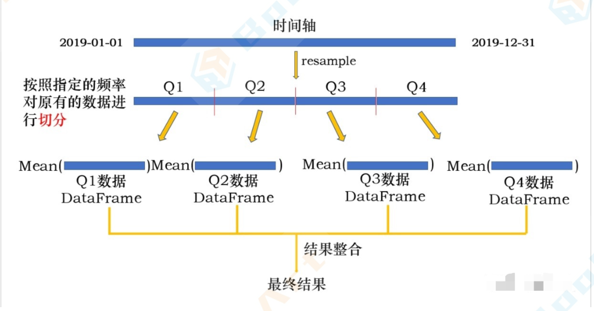

整个过程其实就是一个groupby过程：

1. 对原有的数据按照指定的频率进行切分，分到不同的group中
2. 对不同的group执行操作 
3. 整合操作结果

其中切分的频率可以为任何时间频率，可以为季度Q、月度M、星期W、N天ND，也可以为时H、分T。

当然，如果切分后的频率小于原有的时间频率，就是我们下面要讲的升采样。

#### 升采样

当采样的频率低于原有的频率时，即为升采样。

升采样是对原有的时间粒度更为细粒度的划分，所以升采样时会产生缺失值。

resample可以对原有的时间序列进行任何频率freq的采样，如果从低频到高频为升采样，高频到低频为降采样。整个操作过程和groupby基本一致，所以也可以对resample后的对象进行applya和transform等操作。


# QA

## 1. KNN的K值怎么选取？

通过交叉验证从选取一个较小的K值开始，不断增加K的值，然后计算验证集合的方差，最终找到一个比较合适的K值。

## 2. KNN使用是否需要进行标准化，有什么效果？

KNN算法中的距离度量既可以采用欧式距离，也可以采用余弦距离（文本分类任务），欧氏距离会受到特征量级大小的影响，因而需要在训练前进行数据标准化。

## 3. KNN在特征维度加权有什么效果？

采用Gaussian函数进行不同距离的样本的权重优化，当训练样本与测试样本距离增加，该距离值权重下降。

给更近的邻居分配更大的权重(你离我更近，那我就认为你跟我更相似，就给你分配更大的权重)，而较远的邻居的权重相应地减少，取其加权平均。

## 4. 不平稳时间序列如何处理？

进行ADF检验，对不能显著拒绝原假设的序列采用一阶、二阶差分使得序列变得平稳。

- ADF检验（增补迪基-福勒检验）

  迪基-福勒（Dickey Fuller）检验是最流行的统计检验方法之一，可以用它来确定序列中单位根的存在，从而帮助判断序列是否是平稳。这一检验的原假设与备择假设如下：

  **原假设：**序列有一个单位根(a=1的值)

  **备择假设：**该序列没有单位根。

  如果不能拒绝原假设，则该序列是非平稳的，这意味着序列可以是线性的，也可以是差分平稳的。

  **ADF检验结果：**ADF检验的统计量为1%，p值为5%，临界值为10%，置信区间为10%

  平稳性检验：如果检验统计量小于临界值，我们可以拒绝原假设(也就是序列是平稳的)。当检验统计量大于临界值时，不能拒绝原假设(这意味着序列不是平稳的)。

  **ADF检验有线性平稳或差分平稳的备择假设**

- **差分法**：当前值和历史值做减法。

  - 一阶差分：t2-t1，t3-t2。
  - 二阶查分：在一阶差分的基础上再做一次差分


