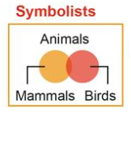
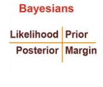
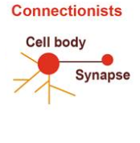
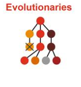
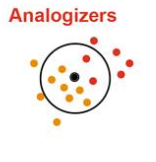

# 炼丹调参 —— 随机数种子

## 网格搜索

暴力搜索的近似，将搜索空间离散化，分辨率越高精度越高，但速度越慢。

优点：确定性、全局性。缺点：低效。

适合参数较少的场景，例如SVM(C、kernel、gamma)。

### 网格搜索使用参考

**使用GridSearchCV(网格搜索)，快速选择超参数**。

在机器学习模型中，需要人工选择的参数称为超参数。

比如随机森林中决策树的个数，人工神经网络模型中的隐藏层层数和每层的节点个数，正则项中常数大小等等，它们都需要事先指定。超参数选择不恰当，就会出现欠拟合或者过拟合的问题。

 我们在选择超参数有两个途径：

- 凭经验
- 选择不同大小小的参数，带入到模型中，挑选表现最好的参数。通过途径2选择超参数时，可以使用Python中的GridSearchCV方法，自动对输入的参数进行排列组合，并一一测试，从中选出最优的一组参数。

```python
from sklearn.model_selection import train_test_split 
from sklearn import datasets,svm
from sklearn.model selection import GridsearchCV 
from sklearn.metrics import accuracy_score
#使用sklearn库中自带的iris数据集作为示例
iris = datasets.load_iris()
X_train,X_test,y_train,y_test train_test_split(iris.data,iri
s.target,test_size=0.2,random_state=0)#分割数据集
```

设置参数调整的范围及配置，这里的参数都是人为指定的。用嵌套字典的列表的格式表示。

```python
param_grid = [
  {'C':[1,10,100,1000],'kerne1':['1 inear']},
  {'C':[1,10,100,1000],'gamma':[0.001,0.0001],'kerne1':[ rbf']},
]
```

将超参数配置及模型放入GridSearch中进行自动搜索

```python
svm_model svm.SVC()
clf = GridSearchCV(svm_model,param_grid,cv=5) 
clf.fit(X_train,y_train)
```

获取选择的最优模型

```python
best_model clf.best_estimator_
```

查看选择的最优超参数配置

```python
print(clf.best_params_)
```

预测

```python
y_pred best_model.predict(X test) print('accuracy',accuracy_score(y_test,y_pred))
```


## 随机优化

随机搜索提供了一种更高效的解决方法（特别是参数数量多的情况下），Randomized Search为每个参数 定义了一个分布函数并在该空间中采样(sampling)，论文Random search for hyper-.parameter optimization进行了分析和实验.

### 代码案例

https://scikit-learn.org/stable/auto_examples/model_selection/plot_randomized_search.html#sphx-glr-auto-examples-model-selection-plot-randomized-search-py

用法完全类似网格搜索，但需要定义采用概率分布。


## 贝叶斯优化

### 贝叶斯优化直觉理解

许多机器学习算法都涉及大量的超参数。为了高效地使用这些算法，我们需要选择合适的超参数值。这里我们将讨论贝叶斯优化，它是一种常用于调整超参数的技术。更通俗地说，贝叶斯优化可用于任何黑盒函数的优化。

#### 挖金子

问题1：黄金分布的最佳估计（主动学习)

在这个问题中，我们要准确估算新土地上的金子分布。由于成本过高，我们无法在每个位置进行钻探。相反我们应该在能提供更多金矿分布信息的位置进行尝试。这个问题类似于主动学习。

问题2：最大金矿的位置（贝叶斯优化)

在这个问题中，我们要找到最大金矿的位置，但同样不能在每个位置都进行钻探，而是应该重点关注金子含量高的位置。这个问题类似于贝叶斯优化。我们将很快看到这两个问题是如何关联的，但他们并不是同一问题。

### 主动学习

https://www.zhihu.com/question/352299820

在许多机器学习问题中，我们都可以轻易获得未标记的数据。但是标记（或查询)通常要花费很多精力。 例如对于语音转文本的任务，注释需要专家手动标记单词和句子。同样在我们的金矿开采问题中，钻孔 (类似于标记)也非常昂贵。

主动学习可最大程度地减少标记的成本，同时尽可能提高建模精度。尽管主动学习中有多种方法，但我们要着眼于减少不确定性。该方法建议标记模型不确定性最高的点，我们通常用方差来度量不确定性。 由于我们仅知道函数在几个点上的真实值，因此我们需要一个代理模型来确定函数在其他地方的取值。该代理模型应该能足够灵活以对真实函数进行建模。

使用高斯过程(GP)是一种常见的选择，这既因为它具有灵活性，又可以为我们提供不确定性估计。

我们的代理模型以(x)的先验开始一一对于黄金，我们假设先验是平稳分布。在评估点（钻探）时，我们会获取更多数据供代理模型学习，并根据贝叶斯规则进行更新。

每个新数据点都会更新我们的代理模型，从而使模型更接近于真实情况。黑线和灰色阴影区域表示钻孔前 后金子分布估算中的平均值($$\mu$$)和不确定性(u±σ)。

上例中我们从均匀分布的不确定性开始。但是在我们第一次更新之后，后验肯定在x=0.5附近并且不确定性降低。我们可以继续添加更多的训练点，并获得更准确的f(x)的估计。但我们要尽量减少评估次数。 

因此我们应该使用主动学习“聪明地”选择下一个查询点。尽管有很多方法可以选择恰当的点，但我们将选择最不确定的点。这为我们提供了以下主动学习程序：

1. 选择不确定性最高的点并将其添加到训练集中（通过查询/标记该点）；
2. 在新的训练集上训练模型；
3. 跳转回第一步，直到收敛或预算用尽。

### 贝叶斯优化

https://blog.csdn.net/lgzlgz3102/article/details/109376786

贝叶斯优化的执行方式为：

1. 初始化一个高斯过程「代理函数」先验分布。
2. 选择几个数据点 x 使得获取函数 a(x) 在当前先验分布上的结果是最大的。
3. 在目标成本函数 c(x) 中评估数据点 x 并获取其结果 y。
4. 使用新数据更新高斯过程先验分布，得到一个后验分布（这将作为下一步的先验分布）。
5. 重复第 2-5 步并多次迭代。
6. 解读当前的高斯过程分布（成本很低），找到全局最小值。

贝叶斯优化最常见的应用领域还是机器学习，尤其是超参数优化任务。

举个例子，如果我们要训练一个梯度上升分类器，则会遇到几十个超参数，从学习率到最大深度再到最小不纯度拆分值。在这里，x 表示模型的超参数，c(x) 表示模型在给定超参数 x 下的表现。

使用贝叶斯优化的主要动机是：在有些场景中，评估输出的成本非常高。首先，需要使用这些参数构建一整个集成树；其次，它们需要运行并完成几次预测，这对于集成方法来说成本高昂。

可以这样说，在给定一组参数的条件下，使用神经网络来评估损失函数的速度更快：只是重复执行矩阵乘法，这是非常快的，尤其是使用专用计算硬件时。这是使用梯度下降的原因之一，也就是反复查询以找到前进的方向。

总结

- 代理优化是使用一个代理函数或近似函数来通过采样估计目标函数。
- 贝叶斯优化是通过将代理函数表示成概率分布而将代理优化放入一个概率框架中，然后再使用新信息更新这个分布。
- 获取函数则是用于基于已知的先验，评估利用空间中的某个特定点得到「好」结果的概率。其关键在于探索与利用的平衡。
- 贝叶斯优化的主要使用场景是目标函数评估成本高的任务，比如超参数调节。有一些用于该任务的软件库，比如 HyperOpt。


## 遗传算法

https://zhuanlan.zhihu.com/p/35986593


## 粒子群算法

### [粒子群算法直觉理解](如何直观形象地理解粒子群算法？ - 数学建模andMATLAB的回答 - 知乎 https://www.zhihu.com/question/23103725/answer/365298309) 

### [遗传算法可视化](https://camo.githubusercontent.com/0548c4a8dd87583d34d337a2f0764ba9d3df6a234284d3c233dced16d545fe51/68747470733a2f2f696d67312e6769746875622e696f2f6865757269737469635f616c676f726974686d2f70736f2e676966) 

### [拓展——遗传画师](https://github.com/anopara/genetic-drawing) 


## Optuna

强烈推荐，深度学习&机器学习量身定制的参数优化库。

- 项目地址：https://github.com/optuna/optuna

有没有什么可以节省大量时间的 Deep Learning 效率神器？ - 崔权的回答 - 知乎 https://www.zhihu.com/question/384519338/answer/1206812752

### Quick Start Example

### Optuna简介

### PyTorch Example Code

### 使用Optuna的思路

1. sample个靠谱的子数据集；
2. 大概写个objective函数的训练和测试代码，objective函数返回一个需要优化的metric； 
3. 把要优化的变量定义成optunal的parameter(通过trial。suggest_xxx)； 
4. copy个main部分代码，开始搜超参；
5. 用最优的参数在整个数据集上跑跑效果；


## 项目

https://blog.csdn.net/fengdu78/article/details/117719952

https://www.kaggle.com/howeverforever/titanic-lgbm-optuna


## 机器学习五大流派

### 符号主义（Symbolists）



名称：符号主义（Symbolists）

起源：逻辑学、哲学

核心思想：**认知即计算，通过对符号的演绎和逆演绎进行结果预测**

问题：**知识结构**

代表算法：**逆演绎算法**（Inverse deduction）

代表应用：**知识图谱** 

代表人物：Tom Mitchell、Steve Muggleton、Ross Quinlan

### 贝叶斯派（Bayesians）



名称：贝叶斯派（Bayesians）

起源：统计学

核心思想：**主观概率估计，发生概率修正，最优决策**

问题：**不确定性**

代表算法：**概率推理（Probabilistic inference）**

代表应用：**反垃圾邮件、概率预测**

代表人物：David Heckerman、Judea Pearl、Michael Jordan

### 联结主义（Connectionist）



名称：联结主义（Connectionist）

起源：神经科学

核心思想：**对大脑进行仿真**

问题：**信度分配**

代表算法：**反向传播算法（Backpropagation）、深度学习（Deep learning）**

代表应用：**机器视觉、语音识别**

代表人物：Yann LeCun、Geoff Hinton、Yoshua Bengio

### 进化主义（Evolutionaries）



名称：进化主义（Evolutionaries）

起源：进化生物学

核心思想：**对进化进行模拟，使用遗传算法和遗传编程**

问题：**结构发现**

代表算法：**基因编程（Genetic programming）**

代表应用：**海星机器人**

代表人物：John Koda、John Holland、Hod Lipson

### 行为类比主义（Analogizer）



名称：行为类比主义（Analogizer）

起源：心理学

核心思想：**新旧知识间的相似性**

问题：**相似性**

代表算法：**核机器（Kernel machines）、近邻算法（Nearest Neightor）**

代表应用：**Netflix推荐系统**

代表人物： Peter Hart、Vladimir Vapnik、Douglas Hofstadter


