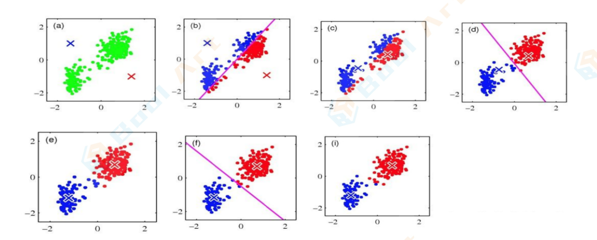

## 学习目标

- 掌握K-means聚类算法并了解OBSCAN、GMM、层次聚类算法的原理。 

- 会用scikit-learn机器学习库实现和使用聚类算法

- 能在真实场景中应用聚类算法解决问题

## 聚类算法概论

### 介绍

机器学习的分类：

监督式学习：训练集有明确答案。监督学习就是寻找”问题“（又称输入、特征、自变量）与”答案“（又称输出、 目标、因变量)之间关系的学习方式。监督学习模型有两类，分类和回归。

- 分类模型：目标变量是**离散的分类型变量**；
- 回归模型：目标变量是**连续性数值型变量**。

无监督学习：**只有数据，无明确答案，即训练集没有标签**。

常见的无监督学习算法有聚类(clustering)，由计算机 自己找出规律，把有相似属性的样本放在一组，每个组也称为簇(cluster)。

最早的聚类分析是在考古分类、昆虫分类研究中发展起来的，目的是找到隐藏于数据中客观存在的“自然小类”， “自然小类”具有类内结构相似、类间结构差异显著的特点，通过刻画“自然小类”可以发现数据中的规律、揭示数据的内在结构。

### 距离和相似度

聚类是把相似的物体聚在一起，这个相似度（或者距离）是用什么来度量的呢？距离（相异度）和相似度是构造聚类算法的基础。对于定量数据特征，最好使用距离来识别数据之间的关系。而在定性处理时则优先考虑相似性。

定量数据特征的常用距离函数为例：

- 明可夫斯基距离$\left(\sum_{l=1}^{d}\left|x_{i l}-x_{j l}\right|^{2}\right)^{\frac{1}{n}}$
- 欧氏距离$\left(\left(\sum_{l=1}^{d}\left|\frac{x_{i}-x_{j l}}{s l}\right|^{2}\right)^{1 / 2}\right.$
- 余弦距离$1-\cos \alpha=\frac{x_{l}^{T} x_{j}}{\left\|x_{i}\right\|\left\|x_{j}\right\|}$

定性数据特征的常用相似度函数为例：
$$
\text { Jaccard相似度 } J(A) B)=\frac{|A \cap B|}{|A \cup B|}
$$

## 数据科学家需要了解的4种聚类算法

在数据科学中，我们可以通过聚类分析观察使用聚类算法后这些数据点分别落入了哪个组，并从中获得一些有价值的信息，例如根据用户的行为对用户进行分组。

目前有很多种聚类算法，接下来就看看数据科学家需要掌握的4种实用聚类算法以及它们的优缺点。

### K-Means聚类

K-Means(k-平均或k-均值)可以称的上是知名度最高的一种聚类算法，它常出现在许多有关数据科学和机器学习的课程中。在代码中也非常容易理解和实现！

#### K-Means算法步骤

K-Means聚类步聚是一个循环迭代的算法：

1. 假定我们要对N个样本观测做聚类，要求聚为K类，首先选择K个点作为初始中心点；
2. 接下来，按照距离初始中心点最小的原则，把所有样本分到各中心点所在的类中；
3. 每类中有若干个样本，计算K个类中所有样本点的均值，作为第二次迭代的K个中心点；
4. 然后根据这个中心重复第2、3步，直到收敛（中心点不再改变或达到指定的迭代次数），聚类过程结束。

以二维平面中的点$\left.\left.\left.\left.X_{i}=\left(x_{i 1}\right) x_{i 2}\right)\right) i=1\right) \ldots\right) n$为例，用图片展示K=2时的迭代过程：

1. 现在我们要将$(a)$图中的n个绿色点聚为2类，先随机选择蓝叉和红叉分别作为初始中心点；
2. 分别计算所有点到初始蓝叉和初始红叉的距离，$X_i=(x_{i1})x_{i2})$距离蓝叉更近就涂为蓝色，距离红叉更近就 涂为红色，遍历所有点，直到全部都染色完成，如图$(b)$；
3. 现在我们不管初始蓝叉和初始红叉了，对于已染色的红色点计算其红色中心，蓝色点亦然，得到第二次迭代的中心，如图$(c)$；
4. 重复第2、3步，直到收敛，聚类过程结束。

看完K-Means算法步聚的文字描述，你可能会有以下疑问：

- 第1步中的初始中心点怎么确定？
- 第2步样本到初始中心点间的距离用什么来定义？
- K怎么选择？

下面回答这3个问题

#### 确定初始中心点

先随便选个点作为第1个初始中心C0，接下来计算所有样本点与C0的距离，距离最大的被选为下一个中心C1，直到选完K个中心。

先找所有样本点的均值点，计算每个点与均值点的距离，选取最远的K个点作为K个初始中心。

#### 欧式距离

样本到初始中心点间的距离就是欧式距离：给定两个样本$X=(x_1)...)x_n)$与$Y=(y_1)...)y_n)$，其中n表示征数，X和Y两个向量间的欧氏距离(Euclidean Distance)表示为:
$$
\operatorname{dist}_{e d}(X, Y)=\|X-Y\| 2=\sqrt[2]{\left(x_{1}-y_{1}\right)^{2}+\ldots+\left(x_{n}-y_{n}\right)^{2}}
$$
其中X和Y表示不同的两个样本，n表示样本的维度(特征的数量)。**基于欧几里得距离，K-Means算法需要优化的问题就是，使得==簇内误差平方和(within-cluster sum of squared errors,SSE)==最小，也叫簇惯性(cluster intertia)**。

#### 确定k值——肘部法则

确定K值的一个主流方法叫“肘部法则”。

如果我们拿到的样本，客观存在J个“自然小类”，这些真实存在的小类是隐藏于数据中的。三维以下的数据我们还能画图肉眼分辨一下J的大概数目，更高维的就不能直观地看到了，我们只能从一个比较小的K，譬如K=2开始尝试，去逼近这个真实值J。

- 当K小于样本真实簇数J时，K每增大一个单位，就会大幅增加每个簇的聚合程度，这时SSE的下降幅度会很大；
- 当K接近J时，再增加K所得到的聚合程度回报会迅速变小，SSE的下降幅度也会减小；
- 随着K的继续增大，SSE的变化会趋于平缓。

例如下图，真实的J我们事先不知道，那么从K=1开始尝试，发现K=2时，SSE大幅下降，K=3时，SSE下降幅度稍微小了点，K=5时，下降幅度急速缩水，再后面就越来越平缓。所以我们认为J应该为3，因此可以将K设定为3。

#### 计算新的聚类中心点

k-means算法是把数据给分成不同的簇，目标是同一个簇中的差异小，不同簇之间的差异大，这个目标怎么用数学语言描述呢？

#### K-means两大优化

Kmeans聚类算法，原理简单，容易实现，聚类效果也不错，但是每一次迭代都需要遍历全量的数据，一旦数据量 过大，由于计算复杂度过大迭代的次数过多，会导致收敛速度非常慢。

下面，我们就上面提到的两个关键点各介绍一个优化方法。

##### mini batch

mini batch的思想是既然全体样本当中数据量太大，会使得我们迭代的时间过长，那么我们就缩小数据规模。也就是随机从整体当中做一个抽样，选取出一小部分数据来代替整体。

虽然mini batch的原理很简单，但是它的的确确非常重要，不仅重要而且在机器学习领域广为使用。在大数据的场景下，几乎所有模型都需要做mini batch优化。

但我们不禁又有一个问题，这个方案全靠随机，看起来非常不靠谱，会不会出现我们选出来的结果偏差特别大的情况，比如刚好都在一个簇当中？从理论上来看，这当然是可能的，所以为了谨慎起见，我们可以

- 重复多次采样，再对计算到的类簇坐标计算均值，直到簇中心趋于稳定为止。
- 或者可以人工设置迭代次数，直到满足迭代次数要求时停止。

##### K-means ++

直接在K-means算法本身上做优化，因此被称为K-means++。

优化K-means算法的效率问题，大概有两个入手点。一个是样本数量太大，另一个是迭代次数过多。

上面我们介绍的mini batch针对的是样本数量过多的情况，K- means++的方法则是针对迭代次数。我们通过某种方法降低收敛需要的迭代次数，从而达到快速收敛的目的。

这个思路很明确，但是操作却不简单，迭代次数和收敛效果是相关的。也就是说在达到收敛之前，迭代次数是不能减少的，否则就会导致不收敛。而且聚类问题和分类问题不同，我们在分类问题当中有一个明确的损失函数用来优化。在我们使用梯度下降法的时候，还可以将梯度前的学习率设置得稍稍大一些，从而加快收敛的速度。但是聚类问题不同，尤其是K-means算法，我们的依次迭代，坐标变换的值是通过求平均坐标也就是质心的坐标得到的。除非我们修改迭代的逻辑，否则没办法加快迭代。

我们从算法运作的思路出发的确会得到这个结论，这个结论也是没问题的，但是有的问题的是收敛的速度除了取决于每次迭代的变化率之外，还有另外一个重要的指标，即**迭代起始的位置**。

我们来分析一下，其实可以得到很多结论。

首先，如果我们==**随机选择K个样本点作为起始的簇中心**==，效果比随机K个坐标点更好。原因也很简单，因为我们随机坐标对应的是在最大和最小值框成的矩形面积当中选择K个点，而我们从样本当中选K个点的范围则要小得多。我们可以单纯从面积的占比就可以看得出来。由于样本具有聚集性，我们在样本当中选择起始状态，选到接近类簇的可能性要比随机选大得多。

但是还有一个小问题，比如说在上面的例子当中类簇是3，我们随机选择3个样本作为起始状态。但是问题来了， 如果我们刚好选的3个点在一个类簇当中怎么办，那样到收敛状态不也需要很久吗？

这个时候需要用到聚类的另一个性质，簇是有向心性的。也就是说在同一个簇附近的点都会被纳入这个簇的范围内，反过来说就是两个离得远的点属于不同簇的可能性比离得近的大。

Kmeans++的思路正是基于上面的这两点。

**算法原理** 

首先，其实的簇中心是我们通过在样本当中随机得到的。不过我们并不是一次性随机K个，而是只随机1个。

接着，我们要从剩下的-1个点当中再随机选出一个点来做下一个簇中心。但是我们的随机不是盲目的，我们希望 设计一个机制，使得距离所有簇中心越远的点被选中的概率越大，离得越近被随机到的概率越小。

重复上述的过程，直到一共选出了K个簇中心为止。

**轮盘法** 

如何根据权重来确定概率，实现这点的算法有很多，其中比较简单的是轮盘法。

转盘抽奖命中结果的概率和轮盘上对应的面积有关，面积越大抽中的概率也就越大，否则抽中的概率越小。用公式表示，对于每一个点被选中的概率是：
$$
P\left(x_{i}\right)=\frac{f\left(x_{i}\right)}{\sum_{j=1}^{n} f\left(x_{j}\right)}
$$
其中$f(x_i)$是每个点到所有类簇的最短距离，$P(x_i)$表示点$x_i$被选中作为类簇中心的概率。

轮盘法其实就是一个模拟转盘抽奖的过程，只不过我们用数组模拟了转盘。我们把转盘的扇形拉平，拉成条状，原来的每个扇形就对应了一个区间。扇形的面积就对应了区间的长度，显然长度越长，抽中的概率越大。然后我们来进行抽奖，我们用区间的长度总和乘上一个0-1区间内的数。

我们找到这个结果落在的区间，就是这次轮盘抽中的结果。这样我们就实现了控制随机每个结果的概率。

当然K-means++本身也具有随机性，并不一定每一次随机得到的起始点都能有这么好的效果，但是通过策略，我们可以保证即使出现最坏的情况也不会太坏。

### 具有噪声的基于密度的聚类方法(DBSCAN)

DBSCAN是一种基于密度的聚类算法。

1. 首先，DBSCAN算法会以任何尚未访问过的任意起始数据点为核心点，并对该核心点进行扩充。这时我们给定一个半径/距离，任何和核心点的距离小于ε的点都是它的相邻点。
2. 如果核心点附近有足够数量的点，则开始聚类，且选中的核心点会成为该聚类的第一个点。如果附近的点不够，那算法会把它标记为噪声（之后这个噪声可能会成为簇中的一部分）。在这两种情形下，选中的点都会被标记为“已访问”。
3. 一旦聚类开始，核心点的相邻点，或者说以该点出发的所有密度相连的数据点（注意是密度相连）会被划分进同一聚类。然后我们再把这些新点作为核心点，向周围拓展ε，并把符合条件的点继续纳入这个聚类中。 
4. 重复步骤2和3，直到附近没有可以扩充的数据点为止，即簇的邻域内所有点都已被标记为“已访问”。
5. 一旦我们完成了这个集群，算法又会开始检索未访问过的点，并发现更多的聚类和噪声。**一旦数据检索完毕，每个点都被标记为属于一个聚类或是噪声**。

### GMM聚类

> ==**均值→质心，方差→椭圆聚类，权重→聚类大小**。==

#### 单高斯模型 

当样本数据X是一维数据(Univariate)时,高斯分布遵从下方概率密度函数(Probability Density Function)：
$$
P(x \mid \theta)=\frac{1}{\sqrt{2 \pi \sigma^{2}}} \exp \left(-\frac{(x-\mu)^{2}}{2 \sigma^{2}}\right)
$$
其中$\mu$为数据均值（期望）,$\sigma$为数据标准差(Standard deviation).

当样本数据X是多维数据(Multivariate)时，高斯分布遵从下方概率密度函数：
$$
P(x \mid \theta)=\frac{1}{(2 \pi)^{\frac{D}{2}}|\Sigma|^{\frac{1}{2}}} \exp \left(-\frac{(x-\mu)^{T} \Sigma^{-1}(x-\mu)}{2}\right)
$$
其中，$\mu$为数据均值（期望），$\Sigma$为协方差(Covariance)，$D$为数据维度。

#### 高斯混合模型 

高斯混合模型可以看作是由K个单高斯模型组合而成的模型，这K个子模型是混合模型的隐变量(Hidden variable)。一般来说，一个混合模型可以使用任何概率分布，这里使用高斯混合模型是因为高斯分布具备很好的数学性质以及良好的计算性能。

举个不是特别稳妥的例子，比如我们现在有一组狗的样本数据，不同种类的狗，体型、颜色、长相各不相同，但都属于狗这个种类。此时单高斯模型可能不能很好的来描述这个分布，因为样本数据分布并不是一个单一的椭圆，所以用混合高斯分布可以更好的描述这个问题，如下图所示：

#### 模型参数学习 

对于单高斯模型，我们可以用最大似然法(Maximum likelihood)估算参数$\theta$的值，
$$
\theta=\operatorname{argmax}_{\theta} L(\theta)
$$
这里我们假设了每个数据点都是独立的(Independent)，似然函数由概率密度函数给出。
$$
L(\theta)=\prod_{j=1}^{N} P\left(x_{j} \mid \theta\right)
$$
由于每个点发生的概率都很小，乘积会变得极其小，不利于计算和观察，因此通常我们用`Maximum Log-Likelihood`来计算（因为Log函数具备单调性，不会改变极值的位置，同时在0-1之间输入值很小的变化可以引 起输出值相对较大的变动)：
$$
\log L(\theta)=\sum_{j=1}^{N} \log P\left(x_{j} \mid \theta\right)
$$
对于高斯混合模型，Log-Likelihood函数是:
$$
\log L(\theta)=\sum_{j=1}^{N} \log P\left(x_{j} \mid \theta\right)=\sum_{j=1}^{N} \log \left(\sum_{k=1}^{K} \alpha_{k} \phi\left(x \mid \theta_{k}\right)\right)
$$
如何计算高斯混合模型的参数呢？这里我们无法像单高斯模型那样使用最大似然法来求导求得使likelihood最大的参数，因为对于每个观测数据点来说，事先并不知道它是属于哪个子分布的(hidden variable)，因此log里面还有求和，对于每个子模型都有未知的$\left.\left.\theta=\left(\mu_{k}\right) \theta_{k}\right) \alpha_{k}\right)$，直接求导无法计算。需要通过迭代的方法求解。

#### 高斯混合模型聚类

之前讲到的K-Means算法的主要缺点之一是它直接用了距离质心的平均值。我们可以从下图中看出这样做为什么不好。

- 图的左侧是两个半径不同的同心圆，K-Meansi没法处理这个问题，因为这些聚类的平均值非常接近；
- 图的右侧是一个中心对称的非圆形分布，K-Means同样解决不了它，因为如果单纯依靠均值判断，算法无法捕捉更多特征。

高斯混合模型(GMM)比K-Means算法具有更好的灵活性。它是**多个高斯分布函数的线性组合**，理论上可以拟合出任意类型的分布，通常用于解决同一集合下的数据包含多个不同的分布的情况。

对于GMM，我们假设数据点满足不同参数下的高斯分布——比起均值，这是一个限制较少的假设。我们用两个参数来描述聚类的形状：均值和标准差。

以二维分布为例，标准差的存在允许聚类的形状可以是任何种类的椭圆形。因此这个算法的思想是：**如 果数据点符合某个高斯分布，那它就会被归类为那个聚类**。

下图是高斯混合模型的聚类过程：

1. 首先，我们确定聚类的数量（如K-Means)，并**随机初始化每个聚类的高斯分布参数**。你也可以尝试通过快速查看数据来为初始参数提供更好的猜测，但从上图可以看出，这其实不是很必要，因为算法会很快进行优化。
2. 其次，**根据每个聚类的高斯分布，计算数据点属于特定聚类的概率**。如果数据点越接近高斯质心，那它属于该聚类的概率就越高。这很直观，因为对于高斯分布，我们一般假设大部分数据更靠近聚类质心。
3. 在这些概率的基础上，我们**为高斯分布计算一组新的参数，使聚类内数据点的概率最大化**。我们**用数据点位置的加权和来计算这些新参数，其中权重就是数据点属于聚类的概率**。为了可视化这个过程，我们可以看看上面的图片，特别是黄色的聚类。第一次迭代中，它是随机的，大多数黄点都集中在该聚类的右侧。当我们按概率计算加权和后，虽然聚类的中部出现一些点，但右侧的比重依然很高。随着迭代次数增加，黄点在聚类中的位置也完成了“右下→左下”的移动。因此，标**准差的变化调整着聚类的形状，以使它能更适合数据点的分布**。
4. 迭代步骤2和步骤3，直至收敛。

> 对于上述第3步，请结合混合高斯模型定义公式理解。如果我们设K为模型的个数，πk为第k个高斯的权重，即第k个高斯的概率密度函数，其均值为k，方差为σk。我们对此概率密度的估计就是要求πk、k和σk各个变量。当求出的表达式后，求和式的各项的结果就分别代表样本x属于各个类的概率。在做参数估计的时候，常采用的方法是最大似然。
>
> 一一引自姜文晖《聚类(1)一一混合高斯模型》

#### EM优化算法

为了找到每个聚类的高斯参数，我们要用到一种名为期望最大化(EM)的优化算法。

EM算法是一种**迭代算法，用于含有隐变量(Hidden variable)的概率模型参数的最大似然估计**。

至此，我们就找到了高斯混合模型的参数。需要注意的是，M算法具备收敛性，但并不保证找到全局最大值，有可能找到局部最大值。解决方法是**初始化几次不同的参数进行迭代，取结果最好的那次**。

### 层次聚类 

层次聚类实际上可以被分为两类：自上而下和自下而上。

其中自下而上算法(Bottom-up algorithms)首先会将每个数据点视为单个聚类，然后连续合并（或聚合）成对的聚类，直到所有聚类合并成包含所有数据点的单个聚类。它也因此会被称为hierarchical agglomerative clustering或HAC。

该算法的聚类可以被表示为一幅树状图，树根是最后收纳所有数据点的单个聚类，而树叶则是只包含一个样本的聚类。

- 首先，我们把每个数据点看作是一个聚类，即如果数据集中有X个数据点，它就有X个聚类。然后我们设置一个阈值作为衡量两个聚类间距离的指标：如果距离小于阈值，则合并；如果距离大于阈值，迭代终止。 
- 在每轮迭代中，我们会把两个聚类合并成一个聚类。这里我们可以用到average linkage，它的思路是计算所 有分属于两个目标聚类的数据点之间距离，然后求一个平均值。每次我们会根据设定的阈值选取平均距离最 小的两个聚类，然后把它们合并起来，因为按照我们的标准，它们是最相似的。
- 重复第二个步骤，直到我们到达树根，即最后只有一个包含所有数据点的聚类。通过这种方式，我们可以选 择要几个聚类，以及什么时候停止聚类。

层次聚类不要求我们指定聚类的数量，由于这是一个构建树的过程，我们甚至可以选择那种聚类看起来更合适。另外，**该算法对距离阈值的选择不敏感**，无论怎么定，算法始终会倾向于给出更好地聚类结果，而**不像其他算法很依赖参数**。根据层次聚类的特点，我们可以看出它非常适合具有层次结构的数据，尤其是当你的目标是为数据恢复层次时。这一点是其他算法无法做到的。

与K-Means和GMM的线性复杂性不同，层次聚类的优势是以较低的效率为代价，因为它具有$O(n^3)$的时间复杂度。

### 辨析

**K-Means** 

K-Means优点在于原理简单，容易实现，聚类效果好。

K-Meansi缺点：

- K值、初始点的选取不好确定；
- 得到的结果只是局部最优；
- 受离群值影响大。

**DBSCAN** 

DBSCAN的优点：

- 不需要输入要划分的聚类个数
- 即使数据点非常不同，它也会将它们纳入聚类中。DBSCAN能将异常值识别为噪声，这就意味着它可以在需要时输入过滤噪声的参数。
- 它对聚类的形状没有偏倚，可以找到任意大小和形状的簇

DBSCAN的缺点：

- 当聚类的密度不同时，DBSCAN的性能会不如其他算法。这是因为当密度变化时，用于识别邻近点的距离阈值ε和核心点的设置会随着聚类发生变化。而这在高维数据中会特别明显，因为届时我们会很难估计ε。

**GMM** 

GMM优点：

- 比K-Means更灵活。由于标准差的引入，最后聚类的形状不再局限于圆形，它还可以是大小形状不一的椭圆形——K均值实际上是GMM的一个特例，其中每个聚类的协方差在所有维上都接近0。
- 其次，权重的引入为同一点属于多个聚类找到了解决方案。如果一个数据点位于两个聚类的重叠区域，那我们就可以简单为它定义一个聚类，或者计算它属于X聚类的百分比是多少，属于Y聚类的百分比是多少。简而言之，GMM支持混合“成员”。

GMM缺点：

和K-Means相比，GMM每一步迭代的计算量比较大。另外，它的求解办法基于EM算法，因此有可能陷入局部极值，需要经过多次迭代。

## 使用Python做聚类分析

### 安装scikit-learn学习库 

### 创建数据集

### K-Means：聚类

### 具有噪声的基于密度的聚类方法(DBSCAN)

### GMM聚类

### 层次聚类

## 聚类分析实例练习参考

### 加载数据集 

### 数据可视化分析 

### 聚类分析

#### Kmeans聚类分析 

#### 层次聚类分析 

#### 基于客户群年龄聚类

##### K-means聚类分析

