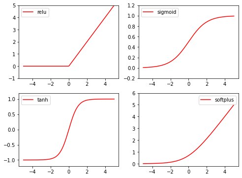

## 一、`Pytorch` 基础

[pytorch入坑前言](https://zhuanlan.zhihu.com/p/36307662) 

首先，pytorch是什么呢？它是一个python的包，它有以下两个特征

- 类numpy的张量计算与利用GPU加速
- 建立在自动微分系统的深度神经网络

**GPU支持的张量库** 

如果你之前用过numpy,那么你一定知道张量，张量就是多维度的矩阵，Pytorch 为张量的计算提供CPU和GPU两种模式，在GPU模式下能极大地加速计算。而Numpy只有CPU计算。

同numpy类似，pytorch提供大量的张量数学计算，比如切分，检索，和数学操作如线性代数等，最大限度的来适应你的科学计算需求

**动态神经网络** 

Pytorch 有独特建立神经网络的机制，大多数的框架如 Tensorflow, Theano, Caffe 和CNTK 对于神经网络的建立都是静态的，这意味着每次建立为完一个神经网络图，这些框架会重复使用网络图，改变网络图的行为需要重头来建立网络。在pytorch中，使用自动求微分系统，能允许你使用一些属性改变网络图的行为

从我的理解上来看： tensorflow 会建立一个完整的图，每次向前传播的时候可以选择执行图的某个部分，前提是图需要包含每个分支，pytorch则是根据判断来动态的建立图，每次反向传播都会释放，所以每次都可以不一样。

当你使用这些pytorch的特征，它可以给你的研究赋予最快的速度和灵活性

**直观的体验** 

Pytorch 在设计上是直观化，线性，和容易使用的。当你执行一条语句时，它不是异步执行的，当你进行调试，收到错误信息时和堆栈追踪时，理解它们是可以直观体现的，每个错误追踪点都会直接指向你所定义的代码， 它希望你在debugging的时候能花费最少的时间

**快速和简洁** 

Pytorch 有最简洁的结构，pytorch通过集合 Intel MKL 和 NVIDIA的库来实现速度上的优化，所以不管在大网络还是小网络都可以跑的很快。

### 最新0.4及其介绍


#### 合并Tensor 和 Variable

Variable 仍然像以前一样工作，只不过返回的是 Tensor . 这意味着我们使用的时候只需要声明Tensor 就好了，更详细的，torch.tensor可以像旧的Variable一样对计算历史进行追踪了，你再也不用到处声明Variable了

- 参数 requires_grad 

变量 requires_grad, Tensor 可以直接使用 requires_grad, 当任何 tensor 的操作有requires_grad = True, 自动微分系统就开始记录，如下例：

```python
>>> x = torch.ones(1) # 创建一个tensor默认requires_grad=False (default)
>>> x.requires_grad
False
>>> y = torch.ones(1) # 创建另一个tensor 默认requires_grad=False
>>> z = x + y
>>> z.requires_grad # 由于输入的requires_grad都为false, 所以结果为false
False
>>> z.backward() # 这样自动微分系统是不会计算的.验证一下!
RuntimeError: element 0 of tensors does not require grad and
does not have a grad_fn
>>> w = torch.ones(1, requires_grad=True) # 现在创建一个tensor使得requires_grad=True
>>> w.requires_grad
True
>>> total = w + z       # 现在创建一个tensor使得requires_grad=True
>>> total.requires_grad #求和处理，由于有一个grad=True,所以结果为
True
>>> total.backward()    #可以进行反向传播
>>> w.grad
tensor([ 1.])
>>> # and no computation is wasted to compute gradients for x, y and z, which don't require grad
>>> z.grad == x.grad == y.grad == None
True
```

- in-place 操作 x.requires_grad_()

使用 x.requires_grad_() 这样的 in-place 操作来直接设置 requires_grad 的属性，

- 舍弃volatile

Variable 中的 volatile 已经没有作用了，已经被torch.no_grad(), torch.set_grad_enable (grad_mode) 等其他代替了。下面是几种使用方法：

```python
>>> x = torch.zeros(1, requires_grad=True)
>>> with torch.no_grad():
... y = x * 2
>>> y.requires_grad #False
-----------------------------------------------------------------------
>>> is_train = False
>>> with torch.set_grad_enabled(is_train):
... y = x * 2
>>> y.requires_grad #False
-----------------------------------------------------------------------
>>> torch.set_grad_enabled(True) # 能作为函数使用
>>> y = x * 2
>>> y.requires_grad #True
>>> torch.set_grad_enabled(False)
>>> y = x * 2
>>> y.requires_grad #False
```


### `Pytorch`和`numpy` 

**numpy 转为 pytorch**格式

```python
np_data = np.arange(6).reshape((2, 3))
torch_data = torch.from_numpy(np_data)
```

`torch.from_numpy()` 方法把数组转换成张量，且二者共享内存，对张量进行修改比如重新赋值，那么原始数组也会相应发生改变。

**torch 转为numpy**格式

```python
tensor2array = torch_data.numpy()
```

torch接受的都是Tensor的形式，所以运算前先转化为Tensor

abs 、 add 、mean、sigmod、exp、sin等函数都和numpy类似，矩阵相乘有所不同。

```python
# abs
data = [-1, -2, 1, 2]
# 转为32位浮点数，torch接受的都是Tensor的形式，所以运算前先转化为Tensor
tensor = torch.FloatTensor(data)  # 32-bit floating point
tensor = torch.FloatTensor(data)  # 32-bit floating point
print(
    '\nabs',
    '\nnumpy: ', np.abs(data),          # [1 2 1 2]
    '\ntorch: ', torch.abs(tensor)      # [1 2 1 2]
)

# matrix multiplication
data = [[1,2], [3,4]]
tensor = torch.FloatTensor(data)  # 32-bit floating point
# correct method
print(
    '\nmatrix multiplication (matmul)',
    '\nnumpy: ', np.matmul(data, data),     # [[7, 10], [15, 22]]
    '\ntorch: ', torch.mm(tensor, tensor)   # [[7, 10], [15, 22]] # torch.dot()是点乘而不是矩阵相乘
)
```

### `Variable` 

[Pytorch入坑二：autograd 及Variable](https://zhuanlan.zhihu.com/p/34298983)

**Autograd: 自动微分**

autograd包是PyTorch中神经网络的核心, 它可以为基于tensor的的所有操作提供自动微分的功能, 这是一个逐个运行的框架, 意味着反向传播是根据你的代码来运行的, 并且每一次的迭代运行都可能不同.

**Variable**⭐️

tensor是硬币的话，那Variable就是钱包，它记录着里面的钱的多少，和钱的流向

 

Varibale包含三个属性：

- data：存储了Tensor，是本体的数据。除了对参数初始化，一般我们不会修改variable.data的值。
- grad：保存了data的梯度，本事是个Variable而非Tensor，与data形状一致
- grad_fn：指向Function对象，用于反向传播的梯度计算之用

autograd.Variable 是包的中央类, 它包裹着Tensor，支持几乎所有Tensor的操作，并附加额外的属性，在进行操作以后，通过调用`.backward()`来计算梯度，通过`.data`来访问原始raw data (tensor)，并将变量梯度累加到`.grad`。

**Variable 和 Tensor** 

Tensor是存在Variable中的.data里的，而cpu和gpu的数据是通过 .cpu()和.cuda()来转换的

```python
>> a=Variable(torch.Tensor([1]),requires_grad=True).cuda()
>> a
Variable containing: 1
[torch.cuda.FloatTensor of size 1 (GPU 0)]
>> a.data 
1
[torch.cuda.FloatTensor of size 1 (GPU 0)]
>> a.cpu()
Variable containing: 1
[torch.FloatTensor of size 1]
>> a.cpu().data
1
[torch.FloatTensor of size 1]
```

**自动求导:**

需要注意的是因为当初开发时设计的是，对于中间变量，一旦它们完成了自身反传的使命，grad就会被释放掉。另外启始节点的grad_fn为空

**从反向传播中排除子图** 

每个Variable都有两个属性，requires_grad和volatile, 这两个属性都可以将子图从梯度计算中排除并可以增加运算效率

- requires_grad：排除特定子图，不参与反向传播的计算，即不会累加记录grad
- volatile: 推理模式, 计算图中只要有一个子图设置为True,　所有子图都会被设置不参与反向传播计算，.backward()被禁止

**注册钩子：**

Variable中的hook, 相当于插件，可以在既不修改主体的情况下，同时增加额外的功能挂在主体代码上，就好比一个人去打猎，他的衣服上有挂枪的扣子，他可以选择他想要带的枪．来取得不同的打猎效果．　

因此，在Variable中通过reister_*hook来实现，register*_hook的作用是，当反向传播时，你所注册的hook都会被调用，比如你可以定义个打印函数，每次反向传播都将grad值打印出来．

需要注意的是，register_hook函数接收的是一个函数，这个函数有如下的形式：`hook(grad) -> Variable or None` 

打印grad的hook

```python
import torch
from torch.autograd import Variable
#定义一个打印函数，每次反向传播都将相应的grad打印出来
def print_grad(grad):
    print(grad)
>> x = Variable(torch.randn([1]), requires_grad=True)
>> y = x+2
>> z = torch.mean(torch.pow(y, 2))
>> y.register_hook(print_grad)　＃将打印函数挂在变量y上
>> z.backward()
Variable containing:
5.1408
[torch.FloatTensor of size 1]
```

那一般什么时候我们可以用到注册hook呢？有几种常见的情况，比如当我们想要提取中间层参数来进行可视化的时候，或者当我们想要保存中间参数变量，或者我们想要在传播过程中改变梯度值的时候．

### nn module

[pytorch 入坑三：nn module](https://zhuanlan.zhihu.com/p/34616199) 

在 pytorch 中，nn 包就为我们提供了这些大致可以看成神经网络层的模组，模组利用Variable作为输入并输出 Variable, nn 包同时也为训练模型定义了一些有用的损失函数(loss function) 。

- 两个基本结构
  1. *Parameter参数* 
  2. *Container容器* 
- 常用的网络层
- 运用技巧

#### Parameter(参数)

Parameters 是 Variable的子类，但有两个不同点

1. Parameters 与 modules 一起使用时会有一些特殊的属性，其会被自动加到 Module 的parameters() 迭代器中，Variable 赋值给 modules 不会产生这样的效果
2. Parameters 不能被 volatile, 而且默认设置 requires_grad=True

使用很简单：`torch.nn.Parameter(data, requires_grad)` 

data为 tensor, requires_grad 默认为 True,即在 BP 的过程中会对其求微分

#### Containers(容器)

**Module(模型）** 

class torch.nn.Module


这是所有网络的基类，Modules也可以包括其他Ｍodules，运行使用树结构来嵌入，可以将子模块给模型赋予属性，从下列看出，self.conv1 , self.conv2是模型的子模型

```python
import torch.nn as nn
import torch.nn.functional as F

class Model(nn.Module): def __init__(self):
    super(Model, self).__init__()
    self.conv1 = nn.Conv2d(1, 20, 5)# submodule: Conv2d
    self.conv2 = nn.Conv2d(20, 20, 5)

    def forward(self, x):
      x = F.relu(self.conv1(x))
      return F.relu(self.conv2(x))
```

核心功能

`add_module(name,module) `将子模块加入当前的模块中，被添加的模块可以name来获取

```python
import torch.nn as nn
class Model(nn.Module): def __init__(self):
        super(Model, self).__init__()
        self.add_module("conv", nn.Conv2d(10, 20, 4))
        #self.conv = nn.Conv2d(10, 20, 4) 和上面这个增加module的方式等价
>> model = Model()
>> print(model.conv)
Conv2d(10, 20, kernel_size=(4, 4), stride=(1, 1))
```

- forward(*input) 每次运行时都会执行的步骤，所有自定义的module都要重写这个函数
- state_dict(destination=None) 返回一个字典，保存module的所有状态
- load_state_dict(state_dict): 用来加载模型参数

#### 常用的网络层

[Pytorch.nn.conv2d 过程验证（单，多通道卷积过程）](https://zhuanlan.zhihu.com/p/32190799) 


## 二、前馈神经网络与激活函数

[形象的解释神经网络激活函数的作用是什么](https://zhuanlan.zhihu.com/p/25279356) 

==**激活函数是用来加入非线性因素的，为了解决线性模型所不能解决的问题**==。


### 激活函数

**`torch.linspace`**

[PyTorch中linspace的详细用法](https://blog.csdn.net/york1996/article/details/81671128) 

它是linear space的缩写，中文含义为线性等分向量、线性平分矢量、线性平分向量。

`torch.linspace(*start*, *end*, *steps=100*, *out=None*, *dtype=None*, *layout=torch.strided*, *device=None*, *requires_grad=False*) → Tensor`

函数的作用是，返回一个一维的tensor（张量），这个张量包含了从start到end，分成steps个线段得到的向量。常用的几个变量

- start：开始值
- end：结束值
- steps：分割的点数，默认是100
- dtype：返回值（张量）的数据类型

```python
import torch
print(torch.linspace(3,10,5))
#tensor([ 3.0000,  4.7500,  6.5000,  8.2500, 10.0000])
type=torch.float
print(torch.linspace(-10,10,steps=6,dtype=type))
#tensor([-10.,  -6.,  -2.,   2.,   6.,  10.])
```

**常见的激活函数** 



#### Sigmoid函数

$$
\sigma(x)=\frac{1}{1+e^{-x}}
$$

其导函数为：$d \sigma(x) / d x=\sigma(x)(1-\sigma(x))$

优点

- 是便于求导的平滑函数；
- 能压缩数据，保证数据幅度不会趋于$+\infty$或$-\infty$

缺点

- **容易出现梯度消失**（gradient vanishing）的现象：当激活函数接近饱和区时，变化太缓慢，导数接近0，根据后向传递的数学依据是微积分求导的链式法则，当前导数需要之前各层导数的乘积，几个比较小的数相乘，导数结果很接近0，从而无法完成深层网络的训练。
- **Sigmoid的输出均值不是0**（zero-centered）的：这会导致后层的神经元的输入是非0均值的信号，这会对梯度产生影响。以 f=sigmoid(wx+b)为例， 假设输入均为正数（或负数），那么对w的导数总是正数（或负数），这样在反向传播过程中要么都往正方向更新，要么都往负方向更新，**使得收敛缓慢**。
- **指数运算相对耗时**

#### tanh函数

$$
\tanh (x)=\frac{e^{x}-e^{-x}}{e^{x}+e^{-x}}
$$

其导函数：$d(\tanh (x)) / d x=\frac{4}{\left(e^{x}+e^{-x}\right)^{2}}$

tanh函数将输入值规范到[-1,1],并且输出值的平均值为0，解决了sigmoid函数non-zero问题。

但与sigmoid相同的是也存在**梯度消失**和**指数运算**的缺点。

#### ReLu函数

CNN中最常用的ReLu
$$
\operatorname{Relu}(x)=\max (0, x)
$$


在全区间上不可导，其导数为：$f(x)= \begin{cases}0, & \text { if } x<0 \\ 1, & \text { else }\end{cases}$

优点：

- 收敛速度明显快于sigmoid和tanh
- 不存在梯度消失问题（在正区间）
- 计算复杂度低，不需要指数运算，只需要判断输入是否大于0

尽管存在这两个问题，ReLU目前仍是最常用的activation function，它具有收敛速度快的优点，但必须要设置较低的学习率和好的参数初始化。推荐在搭建人工神经网络的时候优先尝试！

缺点：

- Relu输出的均值非0

- 存在神经元坏死现象(Dead ReLU Problem)，某些神经元可能永远不会被激活，导致相应参数永远不会被更新（在负数部分，梯度为0）

  产生这种现象的原因有两个：

  1. 参数初始化问题： 采用Xavier初始化方法，使的输入值和输出值的方差一致
  2. 学习率learning_rate太大，导致参数更新变化太大，很容易使得输出值从正输出变成负输出。：设置较小的learning_rate，或者使用学习率自动调节的优化算法

- relu不会对数据做规范化(压缩)处理，使得数据的幅度随模型层数的增加而不断增大

#### Leakly ReLU函数

$$
f(x)=\max (0.01 x, x)
$$

其导函数为：$f(x)= \begin{cases}0.01, & \text { if } x<0 \\ 1, & \text { else }\end{cases}$

此激活函数的提出是用来解决ReLU带来的神经元坏死的问题，可以将0.01设置成一个变量a，其中a可以由后向传播学习。但是其表现并不一定比ReLU好。

#### Softplus函数

softplus可以看作是ReLu的平滑。
$$
\zeta(x)=\log \left(1+e^{x}\right)
$$


### 激活函数的特点

1. 非线性：

即导数不是常数。这个条件是多层神经网络的基础，保证多层网络不退化成单层线性网络。这也是激活函数的意义所在。

2. 几乎处处可微：

可微性保证了在优化中梯度的可计算性。传统的激活函数如sigmoid等满足处处可微。对于分段线性函数比如ReLU，只满足几乎处处可微（即仅在有限个点处不可微）。对于SGD算法来说，由于几乎不可能收敛到梯度接近零的位置，有限的不可微点对于优化结果不会有很大影响。

3. 计算简单：

非线性函数有很多。极端的说，一个多层神经网络也可以作为一个非线性函数，类似于Network In Network中把它当做卷积操作的做法。但激活函数在神经网络前向的计算次数与神经元的个数成正比，因此简单的非线性函数自然更适合用作激活函数。这也是ReLU之流比其它使用Exp等操作的激活函数更受欢迎的其中一个原因。

4. 非饱和性（saturation）：

**饱和指的是在某些区间梯度接近于零（即梯度消失），使得参数无法继续更新的问题**。最经典的例子是Sigmoid，它的导数在x为比较大的正值和比较小的负值时都会接近于0。更极端的例子是阶跃函数，由于它在几乎所有位置的梯度都为0，因此处处饱和，无法作为激活函数。ReLU在x>0时导数恒为1，因此对于再大的正值也不会饱和。但同时对于x<0，其梯度恒为0，这时候它也会出现饱和的现象（在这种情况下通常称为dying ReLU）。Leaky ReLU和PReLU的提出正是为了解决这一问题。

5. 单调性（monotonic）：

即导数符号不变。这个性质大部分激活函数都有，除了诸如sin、cos等。个人理解，单调性使得在激活函数处的梯度方向不会经常改变，从而让训练更容易收敛。

6. 输出范围有限：

有限的输出范围使得网络对于一些比较大的输入也会比较稳定，这也是为什么早期的激活函数都以此类函数为主，如Sigmoid、TanH。但这导致了前面提到的梯度消失问题，而且强行让每一层的输出限制到固定范围会限制其表达能力。因此现在这类函数仅用于某些需要特定输出范围的场合，比如概率输出（此时loss函数中的log操作能够抵消其梯度消失的影响）、LSTM里的gate函数。

7. 接近恒等变换（identity）：

即约等于x。这样的好处是使得输出的幅值不会随着深度的增加而发生显著的增加，从而使网络更为稳定，同时梯度也能够更容易地回传。这个与非线性是有点矛盾的，因此激活函数基本只是部分满足这个条件，比如TanH只在原点附近有线性区（在原点为0且在原点的导数为1），而ReLU只在x>0时为线性。这个性质也让初始化参数范围的推导更为简单。这种恒等变换的性质也被其他一些网络结构设计所借鉴，比如CNN中的ResNet和RNN中的LSTM。

8. 参数少：

大部分激活函数都是没有参数的。像PReLU带单个参数会略微增加网络的大小。还有一个例外是Maxout，尽管本身没有参数，但在同样输出通道数下k路Maxout需要的输入通道数是其它函数的k倍，这意味着神经元数目也需要变为k倍；但如果不考虑维持输出通道数的情况下，该激活函数又能将参数个数减少为原来的k倍。

9. 归一化（normalization）：

这个是最近才出来的概念，对应的激活函数是SELU，主要思想是使样本分布自动归一化到零均值、单位方差的分布，从而稳定训练。在这之前，这种归一化的思想也被用于网络结构的设计，比如Batch Normalization。


### 前馈神经网络

**前馈神经网络**（feedforward neural network），也叫作**多层感知机**（Multi-Layer Perceptron, MLP），是典型的深度学习模型。

前馈神经网络之所以被称为**网络**（network），是因为它们通常用许多[不同函数复合](前馈神经网络其实是由多层的Logistic回归模型（连续的非线性函数）组成、多层的感知器（不连续的非线性函数）组成)在一起来表示。该模型与一个**有向无环图**相关联，而图描述了函数是如何复合在一起的。

我们以下图为例子说明神经网络的结构。神经网络分为**输入层**，**隐藏层**和**输出层**。前馈网络最前面的层称作输入层，最后一层称作输出层，中间既不是输入也不是输出的层叫做隐藏层。

下图是一个3层的神经网络，**输入层不计入层数**。神经网络的层数称为模型的**深度，**正是因为这个术语才出现了“深度学习”这个名字。每一层的节点都代表一个**神经元**（neuron），每层的单元数代表了模型的**宽度**。


### 梯度消失和梯度爆炸

https://blog.csdn.net/qq_27825451/article/details/80172070 

层数比较多的神经网络模型在训练的时候会出现梯度消失(gradient vanishing problem)和梯度爆炸(gradient exploding problem)问题。梯度消失问题和梯度爆炸问题一般会随着网络层数的增加变得越来越明显。

**梯度不稳定问题** 

在深度神经网络中的梯度是不稳定的，在靠近输入层的隐藏层中或会消失，或会爆炸。这种不稳定性才是深度神经网络中基于梯度学习的根本问题。

梯度不稳定的原因：前面层上的梯度是来自后面层上梯度的乘积。当存在过多的层时，就会出现梯度不稳定场景，比如梯度消失和梯度爆炸。

**产生梯度消失的根本原因** 

**前面的网络层比后面的网络层梯度变化更小**，故权值变化缓慢，随着网络层数的增加梯度更新信息会朝着指数衰减的方式减少，从而引起了梯度消失问题。

**产生梯度爆炸的根本原因** 

**前面的网络层比后面的网络层梯度变化更快**，随着网络层数的增加梯度更新将会朝着指数爆炸的方式增加这就是梯度爆炸，引起了梯度爆炸的问题。

因此，**梯度消失、爆炸，其根本原因在于==反向传播训练法则BP==，属于先天不足**。

**如何解决梯度消失和梯度爆炸** 

梯度消失和梯度爆炸问题都是因为网络太深，网络权值更新不稳定造成的，本质上是因为梯度反向传播中的连乘效应。对于更普遍的梯度消失问题，可以考虑一下三种方案解决：

1. 用ReLU、Leaky-ReLU、P-ReLU、R-ReLU、Maxout等替代sigmoid函数。
2. 用Batch Normalization。
3. LSTM的结构设计也可以改善RNN中的梯度消失问题。


## 三、Batch大小对深度学习效果的影响

https://www.zhihu.com/question/32673260/answer/71137399

https://zhuanlan.zhihu.com/p/133864576

BATCH_SIZE:即一次训练所抓取的数据样本数量；

**深度学习中BATCH_SIZE的含义**

在目标检测SSD算法代码中，在训练阶段遇见代码

```python
BATCH_SIZE = 4
steps_per_epoch=num_train # BATCH_SIZE
```

BATCH_SIZE的大小影响训练速度和模型优化，同时按照以上代码可知，其大小同样影响每一个epoch训练模型次数。

**BATCH_SIZE大小的影响**

若BATCH_SIZE=m(训练集样本数量);相当于直接抓取整个数据集，训练时间长，但梯度准确。但不适用于大样本训练，比如IMAGENET。只适用于小样本训练，但小样本训练一般会导致**过拟合**现象，因此不建议如此设置。

若BATCH_SIZE=1;梯度变化波动大，网络不容易收敛。

若BATCH_SIZE设置合适，梯度会变准确。此时再增加BATCH_SIZE大小，梯度也不会变得更准确。

同时为了达到更高的训练网络精度，应该增大epoch，使训练时间变长。

**在合理范围内，增大BATCH_SIZE带来的好处**

- 最大的好处在于使得CPU或GPU满载运行，提高了训练的速度。内存利用率提高了，大矩阵乘法的并行化效率提高。
- 其次是使得**梯度下降**的方向更加准确。在一定范围内，一般来说Batch_Size越大，其确定的下降方向越准，引起训练震荡越小。
- 跑完一次epoch(全数据集)所需的迭代次数减少，对于相同数据量的处理速度进一步加快。

因此为了弄懂BATCH_SIZE的优点，需要学习梯度下降的方法。可以参见另一篇文章[梯度下降的意义](https://zhuanlan.zhihu.com/p/136438005) 

**盲目增大Batch_Size有何坏处** 

- 内存利用率提高了，但是内存容量可能撑不住了。
- ·跑完一次epoch(全数据集)所需的迭代次数减少，要想达到相同的精度，其所花费的时间大大 增加了，从而对参数的修正也就显得更加缓慢。
- Batch_Size增大到一定程度，其确定的下降方向已经基本不再变化。

**调节Batch_Size对训练效果影响到底如何** 

- Batch_Size太小，算法在200 epoches内不收敛。 
- 随着Batch_Size增大，处理相同数据量的速度越快，梯度下降的方向也更精准，引起的训练震荡也越小。
- 随着Batch_Size增大，达到相同精度所需要的epoch数量越来越多。
- 由于上述两种因素的矛盾，Batch_Size增大到某个时候，达到时间上的最优。
- 由于最终收敛精度会陷入不同的局部极值，因此Batch_Size增大到某些时候，达到最终收敛精度上的最优。

**BATCH_SIZE的来源**

首先需要明白的是两个概念，一是以前的Gradient Descent（GD）和如今常用的SDG（Stochastic Gradient Descent）的梯度更新方法

**GD**：用所有样本的平均梯度更新每一步

**SDG**:用每一个样本的梯度更新每一步

根据含义可知GD的每一步的计算都大于SDG。在实际上，GD往往容易陷入局部最小值，使训练的loss达不到最小。而SDG的出现正好缓解了这一现象。

目前的最好的解决是使用所以有了**小批量梯度下降法(Mini-batch Gradient Descent, MBGD)**来解决该问题，简单的说，该方法能够自主找到最合适的BATCH_SIZE进行训练。**因为如果数据集足够充分，那么用一半（甚至少得多）的数据训练算出来的梯度与用全部数据训练出来的梯度是几乎一样的**。


## 四、梯度下降法直观理解

[梯度下降法 —— 经典的优化方法](https://zhuanlan.zhihu.com/p/36564434) 

什么是梯度下降法？ - 马同学的回答 - 知乎 https://www.zhihu.com/question/305638940/answer/1639782992

梯度下降法(gradient descent)是一种常用的一阶(first-order)优化方法，是求解无约束优化问题最简单、最经典的方法之一。

梯度下降法是用来计算函数最小值的。它的思路很简单，想象在山顶放了一个球，一松手它就会顺着山坡最陡峭的地方滚落到谷底。


凸函数图像看上去就像上面的山谷，如果运用梯度下降法的话，就可以通过一步步的滚动最终来到谷底，也就是找到了函数的最小值。

我们来考虑一个无约束优化问题$\min _{x} f(x)$，其中$f(x)$为连续可微函 数，如果我们能够构造一个序列$x^{0}, x^{1}, x^{2}, \ldots$， 并能够满足：
$$
f\left(x^{t+1}\right)<f\left(x^{t}\right), t=0,1,2, \ldots
$$
那么我们就能够不断执行该过程即可收敛到局部极小点，可参考下图。


那么问题就是如何找到下一个点$x^{t+1}$，并保证$f\left(x^{t+1}\right)<f\left(x^{t}\right)$呢？假设我们当前的函数$f(x)$的形式是上图的形状，现在我们随机找了一个初始的点$x_1$，对于一元函数来说，函数值只会随着$x$的变化而变化，那么我们就设计下一个$x^{t+1}$是从上一个$x^t$花沿着某一方向走一小步$\Delta x$得到 的。此处的关键问题就是：这一小步的方向是朝向哪里？

对于一元函数来说，心是会存在两个方向：要么是正方向$\Delta x > 0$，要么是负方向$\Delta x < 0$，如何选择每一步的方向，根据泰勒公式展开式，**沿负梯度方向走一小步**。

不同的步长$\eta$，随着迭代次数的增加， 会导致被优化函数$f(x)$的值有不同的变化：


寻找合适的步长$\eta$是个手艺活，在工程中可以将上图画出来，根据图像来手动调整：

- $f(x)$往上走 (红线)，自然是7过大，需要调低
- $f(x)$一开始下降特别急，然后就几乎没有变化（棕线），可能是$\eta$较大，需要调低
- $f(x)$几乎是线性变化（蓝线），可能是门过小，需要调高


## 五、梯度下降法

[优化算法Optimizer比较和总结](https://zhuanlan.zhihu.com/p/55150256) 

https://blog.csdn.net/ssunshining/article/details/109279700

在微积分中，对多元函数的参数求$\theta$偏导数，把求得的各个参数的导数以向量的形式写出来就是梯度。

梯度就是函数变化最快的地方。

梯度下降是迭代法的一种，在求解机器学习算法的模型参数$\theta$时，即无约束问题时，梯度下降是最常采用的方法之一。

顾名思义，梯度下降法的计算过程就是沿梯度下降的方向求解极小值，也可以沿梯度上升方向求解最大值。假设模型参数为$\theta$，损失函数为$J(\theta)$，损失函数$J(\theta)$关于参数$\theta$的偏导数，也就是梯度为$\nabla_{\theta} J(\theta)$，学习率为$\theta$，则使用梯度下降法更新参数为：
$$
\theta_{t+1}=\theta_{t}-\alpha \cdot \nabla_{\theta} J(\theta)
$$
梯度下降法目前主要分为三种方法,区别在于每次参数更新时计算的样本数据量不同：批量梯度下降法(BGD, Batch Gradient Descent)，随机梯度下降法(SGD, Stochastic Gradient Descent)及小批量梯度下降法(Mini-batch Gradient Descent)。

### 批量梯度下降法BGD

每进行一次参数更新，需要计算整个数据样本集，因此导致批量梯度下降法的速度会比较慢，尤其是数据集非常大的情况下，收敛速度就会非常慢，但是由于每次的下降方向为总体平均梯度，它得到的会是一个全局最优解。

### 随机梯度下降法SGD

随机梯度下降法，不像BGD每一次参数更新，需要计算整个数据样本集的梯度，而是每次参数更新时，仅仅选取一个样本计算其梯度。

可以看到BGD和SGD是两个极端，SGD由于每次参数更新仅仅需要计算一个样本的梯度，训练速度很快，即使在样本量很大的情况下，可能只需要其中一部分样本就能迭代到最优解，由于每次迭代并不是都向着整体最优化方向，导致梯度下降的波动非常大，更容易从一个局部最优跳到另一个局部最优，准确度下降。

### 小批量梯度下降法MBGD

小批量梯度下降法就是结合BGD和SGD的折中，对于含有n个训练样本的数据集，每次参数更新，选择一个大小为m的mini-batch数据样本计算其梯度。小批量梯度下降法即保证了训练的速度，又能保证最后收敛的准确率，目前的SGD默认是小批量梯度下降算法。

**SGD缺点：**

- 选择合适的learning rate比较困难 ，学习率太低会收敛缓慢，学习率过高会使收敛时的波动过大
- 所有参数都是用同样的learning rate
- SGD容易收敛到局部最优，并且在某些情况下可能被困在鞍点


### 动量优化法

动量优化方法引入物理学中的动量思想，**加速梯度下降**，有Momentum和Nesterov两种算法。当我们将一个小球从山上滚下来，没有阻力时，它的动量会越来越大，但是如果遇到了阻力，速度就会变小，动量优化法就是借鉴此思想，使得梯度方向在不变的维度上，参数更新变快，梯度有所改变时，更新参数变慢，这样就能够加快收敛并且减少动荡。

#### Momentum

Momentum-使用动量的随机梯度下降法

momentum算法思想：参数更新时在一定程度上保留之前更新的方向，同时又利用当前batch的梯度微调最终的更新方向，简言之就是通过积累之前的动量来加速当前的梯度。

在梯度方向改变时，momentum能够降低参数更新速度，从而减少震荡；在梯度方向相同时，momentum可以加速参数更新， 从而加速收敛。总而言之，momentum能够加速SGD收敛，抑制震荡。

特点：

- **训练速度快**。积攒历史梯度，有惯性的下降。
- **波动更小**。取前几次波动的平均值当做本此的权重参数。

#### NAG

NAG（Nesterov accelerated gradient）是Momentum的变种。

NAG是momentum的改进，在梯度更新时做一个矫正，加上nesterov项后，梯度在大的跳跃后进行计算，对当前梯度进行校正。 下图是momentum和nesterrov的对比表述图：


momentum首先计算一个梯度(短的蓝色向量)，然后在加速更新梯度的方向进行一个大的跳跃(长的蓝色向量)，nesterov项首先在之前加速的梯度方向进行一个大的跳跃(棕色向量)，计算梯度然后进行校正(绿色梯向量)。

特点：

- **训练速度快**。校正积攒历史梯度，提前预知下一次梯度。
- **能够预知梯度底部的位置**。不仅增加了动量项，并且在计算参数的梯度时，在损失函数中减去了动量项。在底部速度会降下来，不会冲上另一个山坡。


### 自适应学习率优化算法

在机器学习中，学习率是一个非常重要的超参数，但是学习率是非常难确定的，虽然可以通过多次训练来确定合适的学习率，但是一般也不太确定多少次训练能够得到最优的学习率，玄学事件，对人为的经验要求比较高，所以是否存在一些策略自适应地调节学习率的大小，从而提高训练速度。 

目前的自适应学习率优化算法主要有：AdaGrad算法，RMSProp算法，Adam算法以及AdaDelta算法。

#### AdaGrad

$$
\Delta \theta=\delta \cdot \frac{1}{\sqrt{\sum_{i=1}^{t} g_{i}^{2}+\delta}} \cdot g
$$

将$\frac{1}{\sqrt{\sum_{i=1}^{t} g_{i}^{2}+\delta}}$看成一个约束项regularizer。在前期，梯度累计平方和比较小，也就是r相对较小，则约束项较大，这样就能够放大梯度, 参数更新量变大; 随着迭代次数增多，梯度累计平方和也越来越大，即r也相对较大，则约束项变小，这样能够缩小梯度，参数更新量变小。

特点：

- **每个变量用不同的学习率，学习率越来越慢**。对于已经下降的变量，则减缓学习率，对于还没下降的变量，则保持较大的学习率。
- **模型收敛稳定**。由于学习率越来越小，接近目标的时候震荡小。

**缺点：**

- 仍需要手工设置一个全局学习率$\delta$（一般选择$\delta=0.01$），如果$\delta$设置过大的话，会使regularizer过于敏感，对梯度的调节太大。
- 中后期，分母上梯度累加的平方和会越来越大，使得参数更新量趋近于0，使得训练提前结束，无法学习

#### RMSprop

RMSProp算法修改了AdaGrad的梯度平方和累加为指数加权的移动平均，使得其在非凸设定下效果更好。

**特点：**

- 自适应调整学习率。避免了学习率越来越低的问题。其实RMSprop依然依赖于全局学习率$\delta$。
- RMSprop算是Adagrad的一种发展，和Adadelta的变体，效果趋于二者之间
- 适合处理非平稳目标(包括季节性和周期性)——对于RNN效果很好
- 模型收缴稳定。消除了摆动大的方向，各个维度的摆动都较小。

蓝色为Momentum，绿色为RMSProp


#### Adadelta

Adadelta结合了AdaGrad和RMSProp。Adagrad会累加之前所有的梯度平方，而Adadelta只累加固定大小的项，并且也不直接存储这些项，仅仅是近似计算对应的平均值。经过近似牛顿迭代法之后，dadelta已经不依赖全局learning rate了。

**特点：**

- **训练速度快**。训练初中期，加速效果不错，很快。
- **模型收敛不稳定**。训练后期，反复在局部最小值附近抖动。

#### Adam

Adam: Adaptive Moment Estimation

Adam中动量直接并入了梯度一阶矩（指数加权）的估计。其次，相比于缺少修正因子导致二阶矩估计可能在训练初期具有很高偏置的RMSProp，Adam包括偏置修正，修正从原点初始化的一阶矩（动量项）和（非中心的）二阶矩估计。 

**特点：**

- Adam梯度经过偏置校正后，每一次迭代学习率都有一个固定范围，使得参数比较平稳。
- 结合了Adagrad善于处理稀疏梯度和RMSprop善于处理非平稳目标的优点
- 为不同的参数计算不同的自适应学习率
- 也适用于大多非凸优化问题——适用于大数据集和高维空间。


### 算法的表现

https://blog.csdn.net/ssunshining/article/details/109279700

在**运行速度**方面

- 两个动量优化器Momentum和NAG的速度最快，其次是三个自适应学习率优化器AdaGrad、AdaDelta以及RMSProp，最慢的则是SGD。

在**收敛轨迹**方面

- 两个动量优化器虽然运行速度很快，但是初中期走了很长的”岔路”。
- 三个自适应优化器中，Adagrad初期走了岔路，但后来迅速地调整了过来，但相比其他两个走的路最长；AdaDelta和RMSprop的运行轨迹差不多，但在快接近目标的时候，RMSProp会发生很明显的抖动。
- SGD相比于其他优化器，走的路径是最短的，路子也比较正。

牛顿法、拟牛顿法、adam，rmsgrad用到了二阶导

momentum、adagrad用的是一阶导，adagrad的特点是历史梯度正则。


### 正确步骤

1. 用随机值初始化权重和偏差
2. 把输入传入网络，得到输出值
3. 计算预测值和真实值之间的误差
4. 对每一个产生误差的神经元，调整相应的（权重）值以减小误差
5. 重复迭代，直至得到网络权重的最佳值


## 迁移学习

- （样本少，相似性低）--> 冻结训练
- （样本多，相似性低）--> 重新训练
- （样本少，相似性高）--> 修改输出层
- （样本多，相似性高）--> 预训练权重+重新训练


## QA

### 什么层(layer)或操作(operation)赋予了深度学习模型非线形关系学习能力；

隐藏层引入的激活函数赋予了深度学习模型非线形关系学习能力

###  batch size选择有什么讲究吗？

batch size可以说是所有超参数里最好调的一个，也是应该最早确定下来的超参数。

先选好batch size，再调其他的超参数。合适的batch size范围和训练数据规模、神经网络层数、单元数都没有显著的关系。

**合适的batch size范围主要和收敛速度、随机梯度噪音有关。**

- 别太小的原因在于，**batch size太小，会来不及收敛。**当你的batch size太小的时候，在一定的epoch数里，训练出来的参数posterior是根本来不及接近long-time limit的定态分布。

  所以batch size下限主要受收敛的影响。

  因此在常见的setting（～100 epochs），batch size一般不会低于16。

- batch size别太大的限制在于两个点

  1. batch size太大，memory容易不够用。

  2. **batch size太大，深度学习的优化（training loss降不下去）和泛化（generalization gap很大）都会出问题**。

     随机梯度噪音的magnitude在深度学习的continuous-time dynamics里是**正比于`learning rate/batch size`。batch size太大，噪音就太小了。**

     而大家已经知道，随机梯度噪音对于逃离saddle points鞍点和sharp minima极小值都必不可少的作用。前者可以解释为什么优化出问题，后者则可以解释为什么泛化出问题。

     所以当你**跑large-batch training的时候，就应该用linear scaling rule** ，就是保持learning rate/batch size和正常设置一致即可。

### Adam的优势是什么？

- Adam梯度经过偏置校正后，每一次迭代学习率都有一个固定范围，使得参数比较平稳。
- 结合了Adagrad善于处理稀疏梯度和RMSprop善于处理非平稳目标的优点
- 为不同的参数计算不同的自适应学习率
- 也适用于大多非凸优化问题——适用于大数据集和高维空间。


