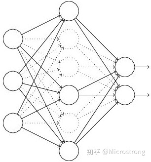
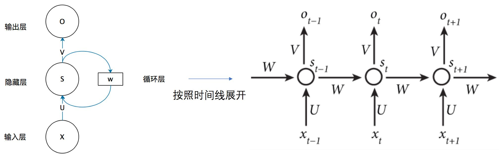
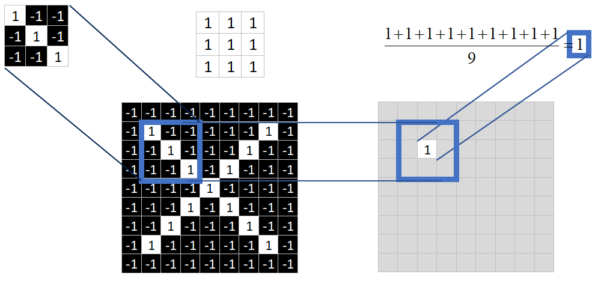
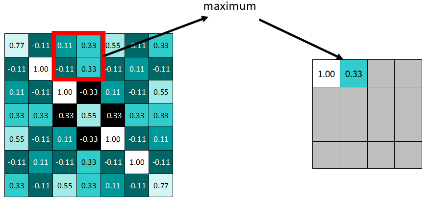
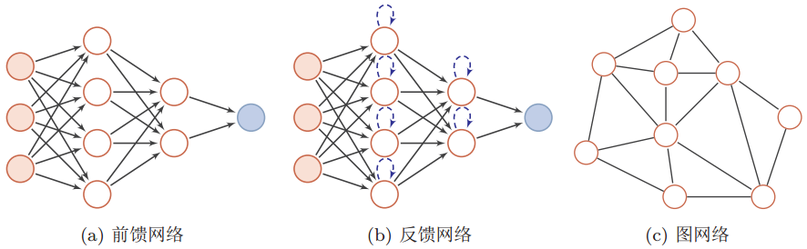
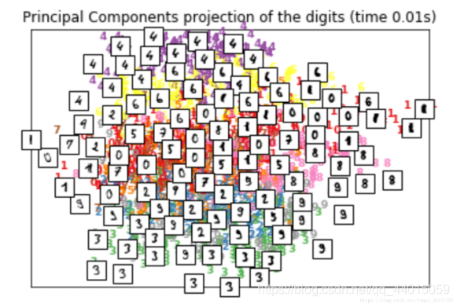

## 归纳偏置 Inductive Bias

https://www.zhihu.com/question/264264203/answer/830077823

在机器学习中，很多学习算法经常会对学习的问题做一些**假设**，这些假设就称为归纳偏置(Inductive Bias) 。归纳偏置这个译名可能不能很好地帮助理解，不妨拆解开来看：

- **归纳(Induction)**是自然科学中常用的两大方法之一(归纳与演绎, induction and deduction)，指的是从一些例子中寻找共性、泛化，形成一个比较通用的规则的过程；
- **偏置(Bias)**是指我们对模型的偏好。

因此，归纳偏置可以理解为，从现实生活中观察到的现象中归纳出一定的规则(heuristics)，然后对模型做一定的约束，从而可以起到“模型选择”的作用，即从假设空间中选择出更符合现实规则的模型。其实，贝叶斯学习中的“**先验(Prior)**”这个叫法，可能比“归纳偏置”更直观一些。

归纳偏置在机器学习中几乎无处不可见。老生常谈的“奥卡姆剃刀”原理，即希望学习到的模型复杂度更低，就是一种归纳偏置。另外，还可以看见一些更强的一些假设：KNN中假设特征空间中相邻的样本倾向于属于同一类；SVM中假设好的分类器应该最大化类别边界距离；等等。

在深度学习方面也是一样。以神经网络为例，各式各样的网络结构/组件/机制往往就来源于归纳偏置。在卷积神经网络中，我们假设特征具有局部性(Locality)的特性，即当我们把相邻的一些特征放在一起，会更容易得到“解”；在循环神经网络中，我们假设每一时刻的计算依赖于历史计算结果；还有注意力机制，也是基于从人的直觉、生活经验归纳得到的规则。

在自然语言处理领域赫赫有名的word2vec，以及一些基于共现窗口的词嵌入方法，都是基于分布式假设：A word’s meaning is given by the words that frequently appear close-by. 这当然也可以看作是一种归纳偏置；一些自然语言理解的模型中加入解析树，也可以类似地理解。都是为了选择“更好”的模型。

- CNN的inductive bias应该是locality和spatial invariance，即空间相近的grid elements有联系而远的没有，和空间不变性（kernel权重共享）
- RNN的inductive bias是sequentiality和time invariance，即序列顺序上的timesteps有联系，和时间变换的不变性（rnn权重共享）


## 随机失活正则化 dropout

[谈谈深度学习中的 Dropout 方法](https://zhuanlan.zhihu.com/p/61466723) 

https://zhuanlan.zhihu.com/p/38200980一定要看评论区

原理：在前向传播的时候，让某个神经元的激活值以一定的概率p停止工作，使模型泛化性更强，不会太依赖某些局部的特征。

优点

1. 取平均
   - dropout掉不同的隐层神经元就类似在训练不同的网络，随机删掉一半隐藏神经元导致网络结构已经不同。
   - 整个dropout过程就相当于对很多个不同的神经网络取平均
2. 减少神经元之间的共生关系
   - dropout使两个神经元不一定每次在一个网络出现，权值的更新不再依赖于有固定关系的隐含节点的共同作用
   - 增加泛化能力
   - dropout有点像L1、L2正则，减少权重使得网络对丢失特定神经元连接的鲁棒性提高。
3. 阻止过拟合。
   - 类似于性别在生物进化中的角色。性别的出现有性生物通过基因的各种组合，打破了大段基因之间的联合适应性（基因之间没有太大依赖），可以繁衍出适应新环境的变种，有效的避免环境改变时物种可能面临的灭绝。Dropout 也是如此，在每次训练中，每个节点都有消失的可能，所以每次神经元的合作都是全新的，不会产生依赖于某个神经元或某种结构的情况，表现在训练中就是不会只依赖数据的某个特征，大大增强了泛化能力。


### Dropout出现的原因

在机器学习的模型中，如果模型的参数太多，而训练样本又太少，训练出来的模型很容易产生过拟合的现象。在训练神经网络的时候经常会遇到过拟合的问题，过拟合具体表现在：模型在训练数据上损失函数较小，预测准确率较高；但是在测试数据上损失函数比较大，预测准确率较低。

过拟合是很多机器学习的通病。如果模型过拟合，那么得到的模型几乎不能用。为了解决过拟合问题，一般会采用模型集成的方法，即训练多个模型进行组合。此时，训练模型费时就成为一个很大的问题，不仅训练多个模型费时，测试多个模型也是很费时。

综上所述，训练深度神经网络的时候，总是会遇到两大缺点：

1. 容易过拟合
2. 费时

Dropout可以比较有效的缓解过拟合的发生，在一定程度上达到正则化的效果。


### Dropout具体工作流程

输入是x输出是y，正常的流程是：我们首先把x通过网络前向传播，然后把误差反向传播以决定如何更新参数让网络进行学习。使用Dropout之后，过程变成如下：

首先随机（临时）删掉网络中一半的隐藏神经元，输入输出神经元保持不变（图中虚线为部分临时被删除的神经元）



然后把输入x通过修改后的网络前向传播，然后把**得到的损失结果通过修改的网络反向传播**。一小批训练样本执行完这个过程后，**在没有被删除的神经元上按照随机梯度下降法更新对应的参数（w，b）**。

然后继续重复这一过程：

- 恢复被删掉的神经元（此时被删除的神经元保持原样，而没有被删除的神经元已经有所更新）
- 从隐藏层神经元中随机选择一个一半大小的子集临时删除掉（备份被删除神经元的参数）。
- 对一小批训练样本，先前向传播然后反向传播损失并根据随机梯度下降法更新参数（w，b） （没有被删除的那一部分参数得到更新，删除的神经元参数保持被删除前的结果）。

不断重复这一过程。


### Dropout在神经网络中的使用

在训练模型阶段（只能在此阶段使用），无可避免的，在训练网络的每个单元都要添加一道概率流程。

对应的公式变化如下：

- 没有Dropout的网络计算公式：
  $$
  \begin{aligned}
  z_{i}^{(l+1)} &=\mathbf{w}_{i}^{(l+1)} \mathbf{y}^{l}+b_{i}^{(l+1)}, \\
  y_{i}^{(l+1)} &=f\left(z_{i}^{(l+1)}\right) \text {. }
  \end{aligned}
  $$
  
- 采用Dropout的网络计算公式：
  $$
  \begin{aligned}
  r_{j}^{(l)} & \sim \operatorname{Bernoulli}(p), \\
  \widetilde{\mathbf{y}}^{(l)} &=\mathbf{r}^{(l)} * \mathbf{y}^{(l)}, \\
  z_{i}^{(l+1)} &=\mathbf{w}_{i}^{(l+1)} \widetilde{\mathbf{y}}^{l}+b_{i}^{(l+1)}, \\
  y_{i}^{(l+1)} &=f\left(z_{i}^{(l+1)}\right)
  \end{aligned}
  $$

上面公式中Bernoulli函数是为了生成概率r向量，也就是随机生成一个0、1的向量。

代码层面实现让某个神经元以概率p停止工作，其实就是让它的激活函数值以概率p变为0。比如我们某一层网络神经元的个数为1000个，其激活函数输出值为y1、y2、y3、......、y1000，我们dropout比率选择0.4，那么这一层神经元经过dropout后，1000个神经元中会有大约400个的值被置为0。

**注意：**经过上面屏蔽掉某些神经元，使其激活值为0以后，我们还需要对向量y1……y1000进行缩放。

首先明确下p的定义，如果p作为神经元抛弃的概率，那么训练模型时神经元乘以1/(1-p)或测试模型时候神经元乘以(1-p)；如果p作为神经元保留的概率，那么训练模型时候神经元乘以1/p或测试模型时神经元乘以p。

[**神经网络Dropout层中为什么dropout后还需要进行rescale？**](神经网络Dropout层中为什么dropout后还需要进行rescale？ - 小莲子的回答 - 知乎 https://www.zhihu.com/question/61751133/answer/794717140)

为了“在infer时不进行dropout‘“。

dropout是带有随机性的，如果infer也做的话，网络的输出就不稳定。同样一个样本，整体预测结果每次都可能变化。在infer不做dropout的前提下，保证训练和预测过程的分布一致，而对infer进行rescale。

**注意：**带有Dropout 层的神经网络只能在训练中使用，测试和实际使用时不能有 Dropout 操作，需要进行屏蔽。比如在pytorch中，就可以通过 net.eval() 语句和 net.train() 语句进行验证模式和训练模式的切换。


## 循环神经网络 RNN

### 基本循环神经网络

一个简单的循环神经网络如，它由输入层、一个隐藏层和一个输出层组成。

（PCA降维的特点在于使用矩阵分解求特征值的方式，**提取的是数据分布方差比较大的方向，提取的是主要成分**；隐藏层主要是点乘+非线性变换，目的是**特征的提取、转换**。）



如果把上面有W的那个带箭头的圈去掉，它就变成了最普通的**全连接神经网络**。

x是一个向量，它表示**输入层**的值（这里面没有画出来表示神经元节点的圆圈）；

s是一个向量，它表示**隐藏层**的值（这里隐藏层面画了一个节点，你也可以想象这一层其实是多个节点，节点数与向量s的维度相同）；

U是输入层到隐藏层的**权重矩阵**，o也是一个向量，它表示**输出层**的值；V是隐藏层到输出层的**权重矩阵**。

那么，现在我们来看看W是什么。**循环神经网络**的**隐藏层**的值s不仅仅取决于当前这次的输入x，还取决于上一次**隐藏层**的值s。**权重矩阵** W就是**隐藏层**上一次的值作为这一次的输入的权重。

$St$的值不仅仅取决于 $\mathrm{Xt}$ ，还取决于$S_{t-1}$。
$$
\begin{aligned}
&O_{t}=g\left(V \cdot S_{t}\right) \\
&S_{t}=f\left(U \cdot X_{t}+W \cdot S_{t-1}\right)
\end{aligned}
$$
**式1**是**输出层**的计算公式，输出层是一个**全连接层**，也就是它的每个节点都和隐藏层的每个节点相连。V是输出层的**权重矩阵**，g是**激活函数**。

式2是隐藏层的计算公式，它是**循环层**。U是输入x的权重矩阵，W是上一次的值$S_{t-1}$作为这一次的输入的**权重矩阵**，f是**激活函数**。

从上面的公式我们可以看出，**循环层**和**全连接层**的区别就是**循环层**多了一个**权重矩阵** W。


### 双向循环神经网络

之前介绍的循环神经网络模型都是假设当前时间步是由前面的较早时间步的序列决定的，因此它们都将信息通过隐藏状态从前往后传递。

有时候，当前时间步也可能由后⾯面时间步决定。例如，当我们写下一个句子时，可能会根据句子后面的词来修改句子前面的用词。双向循环神经网络通过增加从后往前传递信息的隐藏层来更灵活地处理这类信息。


- 我们可以分别计算正向隐藏状态（→）和反向隐藏状态（←）
- 两个方向的隐藏层的连接方式是 concat 拼接起来，蕴含了两个方向的信息 ，根据上图可以想成一个信息往上传，一个信息往下传。
- 不同方向上的隐藏单元个数也可以不同。

双向循环神经网络的好处：比如 X 1 到 X T 是一句话，本来我们只考虑了一个方向，即前面的字对后面的字影响。如果是双向的，那么每个字都会受到前面的字和后面的字的影响。

实践证明，双向带来了更多得参数，效果未必会好。双向RNN是很常见的，但是否适用还需要实践来看效果。

小结：

- 双向循环神经网络在每个时间步的隐藏状态同时取决于**该时间步之前和之后的子序列（包括当前时间步的输入）**。


### 深度循环神经网络

含有多个隐藏层的循环神经网络，也称作深度循环神经网络。

有L个隐藏层的深度循环神经网络，每个隐藏状态不不断传递至当前层的下一时间步和当前时间步的下一层。


- 具体来说就是，将X1输入到第一个循环神经元H1，这个rnn神经元可以是GRU也可以是LSTM，这里的H1是第一个时间步输出的隐藏状态，其将作为第二个时间步的输入隐藏状态，隐藏状态就这样一直往上传，直到HT。每个Hi（i=1,2,3…T）之后都会接一个输出层output（Oi i=1,2,3…T)，这就是之前的单隐层RNN。


- 对于深度循环神经网络，只是将第一层的每个隐藏状态Hi（i=1,2,3…T），做为第二层的输入，最后。H的上标表示层数，下标表示时间步数。在第L层之后做输出。

深度循环网络不是越深越好，越深表示模型越复杂，对数据集的要求更高，内容更加抽象。所以参数的设置还要看实践和经验。

小结：

- 在深度循环神经网络中，**隐藏状态的信息不断传递至当前层的下一时间步和当前时间步的下一层**。


### 循环神经网络的训练算法 BPTT

**BackPropagation Through Time (BPTT)**经常出现用于学习递归神经网络（RNN）。

与前馈神经网络相比，RNN的特点是可以处理过去很长的信息。因此特别适合顺序模型。

BPTT扩展了普通的BP算法来适应递归神经网络。

BPTT算法是针对**循环层**的训练算法，它的基本原理和BP算法是一样的，也包含同样的三个步骤：

1. 前向计算每个神经元的输出值；
2. 反向计算每个神经元的**误差项**$E$值，它是误差函数`E`对神经元的**加权输入**的偏导数；
3. 计算每个权重的梯度。

最后再用**随机梯度下降**算法更新权重。


### RNN梯度爆炸和消失问题⭐️

梯度消失和梯度爆炸只会造成神经网络中较浅的网络的权重无法更新

这会造成哪些问题？

- 梯度消失会导致我们的神经网络中前面层的网络权重无法得到更新，也就停止了学习。
- 梯度爆炸会使得学习不稳定， 参数变化太大导致无法获取最优参数。
- 在深度多层感知机网络中，梯度爆炸会导致网络不稳定，最好的结果是无法从训练数据中学习，最坏的结果是由于权重值为NaN而无法更新权重。
- 在循环神经网络（RNN）中，梯度爆炸会导致网络不稳定，使得网络无法从训练数据中得到很好的学习，最好的结果是网络不能在长输入数据序列上学习。

[RNN梯度消失和爆炸的原因](https://zhuanlan.zhihu.com/p/28687529) 

==无论是梯度消失还是梯度爆炸，都是**源于网络结构太深**，造成网络权重不稳定，从本质上来讲是**因为梯度反向传播中的连乘效应。**== 

RNN在训练中很容易发生**梯度爆炸**和**梯度消失**，这导致训练时梯度不能在较长序列中一直传递下去，从而使RNN无法捕捉到长距离的影响。

通常来说，**梯度爆炸**更容易处理一些。因为梯度爆炸的时候，我们的程序会收到NaN错误。我们也可以设置一个梯度阈值，当梯度超过这个阈值的时候可以直接截取。

**梯度消失**更难检测，而且也更难处理一些。总的来说，我们有三种方法应对梯度消失问题：

1. 合理的初始化权重值。初始化权重，使每个神经元尽可能不要取极大或极小值，以躲开梯度消失的区域。
2. 使用relu代替sigmoid和tanh作为激活函数。
3. 使用其他结构的RNNs，比如长短时记忆网络（LTSM）和Gated Recurrent Unit（GRU），这是最流行的做法。

**为什么LSTM能解决梯度问题？** 

在阅读此篇文章[RNN 的梯度消失问题](https://zhuanlan.zhihu.com/p/44163528)之前，确保自己对LSTM的三门机制有一定了解， 参见[LSTM：RNN最常用的变体](https://zhuanlan.zhihu.com/p/44124492)

从上述中我们知道， RNN产生梯度消失与梯度爆炸的原因就在于
$$
\prod_{j=k+1}^{t} \frac{\delta S_{j}}{\delta S_{j-1}}
$$
如果我们能够将这一坨东西去掉， 我们的不就解决掉梯度问题了吗。 LSTM通过门机制来解决了这个问题。我们先从LSTM的三个门公式出发：

- 遗忘门：$f_{t}=\sigma\left(W_{f} \cdot\left[h_{t-1}, x_{t}\right]+b_{f}\right)$  
- 输入门： $i_{t}=\sigma\left(W_{i} \cdot\left[h_{t-1}, x_{t}\right]+b_{i}\right)$ 
- 输出门：$o_{t}=\sigma\left(W_{o} \cdot\left[h_{t-1}, x_{t}\right]+b_{0}\right)$ 
- 当前单元状态：$c_{t}: c_{t}=f_{t} \circ c_{t-1}+i_{t} \circ \tanh \left(W_{c} \cdot\left[h_{t-1}, x_{t}\right]+b_{c}\right)$ 
- 当前时刻的隐层输出：h_{t}=o_{t} \circ \tanh \left(c_{t}\right)

我们注意到， 首先三个门的激活函数是sigmoid， 这也就意味着这三个门的输出要么接近于0 ， 要么接近于1。这就使得$\frac{\delta c_{t}}{\delta c_{t-1}}=f_{t}, \quad \frac{\delta h_{t}}{\delta h_{t-1}}=o_{t}$ 是非0即1的，当门为1时， 梯度能够很好的在LSTM中传递，很大程度上减轻了梯度消失发生的概率， 当门为0时，说明上一时刻的信息对当前时刻没有影响， 我们也就没有必要传递梯度回去来更新参数了。所以， 这就是为什么通过门机制就能够解决梯度的原因： 使得单元间的传递$\frac{\delta S_{j}}{\delta S_{j-1}}$为0 或 1。


### `Pytorch RNN` 

标准RNN：
$$
h_{t}=\tanh \left(w_{i h} * x_{t}+b_{i h}+w_{h h} * h_{t-1}+b_{h h}\right)
$$
在PyTorch中的调用也非常简单，使用 `nn.RNN()` 即可调用，下面依次介绍其中的参数。

RNN() 里面的参数有

- input_size 表示输入 xt 的特征维度
- hidden_size 表示输出的特征维度
- num_layers 表示网络的层数
- nonlinearity 表示选用的非线性激活函数，默认是 ‘tanh’
- bias 表示是否使用偏置，默认使用
- batch_first 表示输入数据的形式，默认是 False，就是这样形式，(seq, batch, feature)，也就是将序列长度放在第一位，batch 放在第二位
- dropout 表示是否在输出层应用 dropout
- bidirectional 表示是否使用双向的 rnn，默认是 False。

接着再介绍网络接收的输入和输出。

网络会接收一个序列输入xt和记忆输入h0，xt的维度是（seq，batch，feature），分别表示序列长度、批量和输入的特征维度，h0也叫隐藏状态，它的维度是（layersdirection，batch，hidden），分别表示层数乘方向（如果是单向，就是1，如果是双向就是2）、批量和输出的维度。

网络会输出output和hn，output表示网络实际的输出，维度是（seq，batch， hiddendirection），分别表示序列长度、批量和输出维度乘上方向，hn表示记忆单元，维度是（layer*direction，batch，hidden），分别表示层数乘方向、批量和输出维度。

- 第一个要注意的地方就是网络的输入和前面讲过的卷积网络有些不同，因为卷积神经网络的输入将batch放在前面，而在循环神经网络中将batch放在中间，当然可以使用 batch_first=True让batch放在前面。
- 第二个要注意的地方就是网络的输出是（seq，batch，hidden*direction），这里direction=1或者2，前面也介绍过，如果是双向的网络结构，相当于网络从左往右计算一次，再从右往左计算一次，这样会有两个结果，将两个结果按最后一维拼接起来，就是上面的结果。
- 第三个要注意的地方就是隐藏状态的网络大小、输入和输出都是（layerdirection，batch，hidden），因为如果网络有多层，那么每一层都有一个新的记忆单元，而双向网络结构在每一层左右会有两个不同的记忆单元，所以维度的第一位是layerdirection。

```python
import torch
from torch.autograd import Variable
from torch import nn

# 构造一个序列，长为 6，batch 是 5， 特征是 100
x = Variable(torch.randn(6, 5, 100)) # 这是 rnn 的输入格式
rnn_seq = nn.RNN(100, 200)
# 访问其中的参数
print(rnn_seq.weight_hh_l0) #与h相乘的权重
print(rnn_seq.weight_ih_l0)  #与x相乘的权重
out, h_t = rnn_seq(x) # 使用默认的全 0 隐藏状态

# 自己定义初始的隐藏状态
h_0 = Variable(torch.randn(1, 5, 200))
out, h_t = rnn_seq(x, h_0)
print(out.shape,h_t.shape)
#输出：torch.Size([6, 5, 200]) torch.Size([1, 5, 200])
```


### 长短记忆网络 LSTM⭐️

`rnn = nn.LSTM(*arg,**kwargs)` 

LSTM在本质上和标准 RNN一样的，下面主要介绍两者的不同：

- **LSTM参数是RNN的四倍**

  因为LSTM中间比标准RNN多了三个线性变换，多的三个线性变换的权重拼在一起， 所以一共是 4 倍；同理，偏置也是4倍。

- **输入和输出多了一个记忆单元** 

[人人都能看懂的LSTM介绍及反向传播算法推导（非常详细）](https://zhuanlan.zhihu.com/p/83496936) 

所有递归神经网络都具有神经网络的链式重复模块。LSTM具有同样的结构，但是重复的模块拥有不同的结构，如下图所示。与RNN的单一神经网络层不同，这里有四个网络层，并且以一种非常特殊的方式进行交互。


1. LSTM--遗忘门


LSTM的第一步要决定从细胞状态中舍弃哪些信息。这一决定由所谓“遗忘门层“的S形网络层做出。它接收$h_{t-1}$和$x_t$，并且对细胞状态$C_{t-1}$中的每一个数来说输出值都介于0和1之间。1表示完全接受这个”，0表示“完全忽略这个”。整个公式意味着==根据**当前时间步输入**和**上一个时间步隐含状态h(t-1)**来决定**遗忘多少上一层的细胞状态所携带的过往信息**==。

2. LSTM--输入门


下一步就是要确定需要在细胞状态中保存哪些新信息。这里分成两部分。

第一部分，一个所谓”输入门层“的S形网络层确定哪些信息需要更新。第一个产生输入门值的公式，它和遗忘门公式几乎相同，区别只是在于它们之后要作用的目标上。这个公式意味着输入信息有多少需要进行过滤。

第二部分，一个tanh形网络层创建一个新的备选值向量——$\tilde{C}_{t}$，可以用来添加到细胞状态。第二个公式是与传统RNN的内部结构计算相同。

对于LSTM来讲，它**得到的是当前的细胞状态**，而不是像经典RNN一样得到的是隐含状态。

在下一步中我们将上面的两部分结合起来，产生对状态的更新。

3. LSTM--细胞状态更新


现在更新旧的细胞状态$C_{t-1}$更新到$C_t$。先前的步骤已经决定要做什么，我们只需要照做就好。

细胞更新的结构与计算公式非常容易理解，这里没有全连接层，只是将刚刚得到的遗忘门值与上一个时间步得到的C(t-1)相乘，再加上输入门门值与当前时间步得到的未更新C(t)相乘的结果。最终得到更新后的C(t)作为下一个时间步输入的一部分。整个细胞状态更新过程就是对遗忘门和输入门的应用。

4. LSTM--输出门


输出门部分的公式也是两个，第一个即是计算输出门的门值，它和遗忘门、输入门计算方式相同。

第二个即是使用这个门值产生隐含状态h(t)，它将作用在更新后的细胞状态C(t)上，并做tanh激活，最终得到h(t)作为下一时间步输入的一部分。

整个输出门的过程，就是为了产生隐含状态h(t).

**什么是Bi-LSTM？** 

Bi-LSTM即双向LSTM，它没有改变LSTM本身任何的内部结构，只是将LSTM应用两次且方向不同，再将两次得到的LSTM结果进行拼接作为最终输出。

Pytorch中LSTM工具的使用：

- 位置：在torch.nn工具包之中，通过torch.nn.LSTM可调用。


### 门控循环单元 GRU⭐️

https://zhuanlan.zhihu.com/p/32481747

门控循环单元 Gated Recurrent Unit（GRU）是LSTM 变种。

LSTM通过三个门函数输入门、遗忘门和输出门分别控制输入值、记忆值和输出值。

而GRU中只有两个门：更新门$z_t$和重置门$r_t$ 

如下图所示。更新门用于控制前一时刻的状态信息被带入到当前状态中的程度，更新门的值越大说明前一时刻的状态信息带入越多；重置门控制前一时刻状态有多少信息被写入到当前的候选集$\tilde{h}_{t}$上，重置门越小，前一状态的信息被写入的越少。这样做使得 GRU 比标准的 LSTM 模型更简单，因此正在变得流行起来。


GRU输入输出的结构与普通的RNN相似，其中的内部思想与LSTM相似。

与LSTM相比，GRU内部少了一个”门控“，参数比LSTM少，但是却也能够达到与LSTM相当的功能。考虑到硬件的**计算能力**和**时间成本**，因而很多时候我们也就会选择更加”实用“的GRU啦。

**Bi-GRU**

Bi-GRU与Bi-LSTM的逻辑相同，都是不改变其内部结构，而是将模型应用两次且方向不同，再将两次得到的LSTM结果进行拼接作为最终输出。

Pytorch中GRU工具的使用：

- 位置：在torch.nn工具包之中，通过torch.nn.GRU可调用。

nn.GRU类初始化主要参数解释:

    input_size: 输入张量x中特征维度的大小.
    hidden_size: 隐层张量h中特征维度的大小.
    num_layers: 隐含层的数量.
    bidirectional: 是否选择使用双向LSTM, 如果为True, 则使用; 默认不使用.
nn.GRU类实例化对象主要参数解释:  

- input: 输入张量x.
- h0: 初始化的隐层张量h.


### 注意力机制⭐️

什么是注意力

我们观察事物时，之所以能够快速判断一种事物（当然允许判断是错误的），是因为我们大脑能够很快把注意力放在事物最具有辨识度的部分从而作出判断，而并非是从头到尾的观察一遍事物后，才能有判断结果。正是基于这样的理论，就产生了注意力机制。

Attention-based Model其实就是一个**相似性的度量**，当前的输入与目标状态越相似，那么在当前的输入的权重就会越大，说明当前的输出越依赖于当前的输入。严格来说，**Attention并算不上是一种新的model，而仅仅是在以往的模型中加入attention的思想**，所以Attention-based Model或者Attention Mechanism是比较合理的叫法，而非Attention Model。

什么是注意力计算规则

它需要三个指定的输入Q(query), K(key), V(value)，然后通过计算公式得到注意力的结果，这个结果代表**query在key和value作用下的注意力表示**。==**当输入的Q=K=V时，称作自注意力计算规则**==。

常见的注意力计算规则

- 将Q，K进行纵轴拼接，做一次线性变化，再使用softmax处理获得结果最后与V做张量乘法。
  $$
  \operatorname{Attention}(Q, K, V)=\operatorname{Softmax}(\operatorname{Linear}([Q, K])) \cdot V
  $$

- 将Q，K进行纵轴拼接，做一次线性变化后再使用tanh函数激活，然后再进行内部求和，最后使用softmax处理获得结果再与V做张量乘法。
  $$
  \operatorname{Attention}(Q, K, V)=\operatorname{Softmax}(\operatorname{sum}(\tanh (\operatorname{Linear}([Q, K])))) \cdot V
  $$

- 将Q与K的转置做点积运算，然后除以一个缩放系数，再使用softmax处理获得结果最后与V做张量乘法。
  $$
  \operatorname{Attention}(Q, K, V)=\operatorname{Softmax}\left(\frac{Q \cdot K^{T}}{\sqrt{d_{k}}}\right) \cdot V
  $$

说明：当注意力权重矩阵和V都是三维张量且第一维代表为batch条数时，则做bmm运算。bmm是一种特殊的张量乘法运算。

什么是注意力机制:

- 注意力机制是注意力计算规则能够应用的深度学习网络的载体, 同时包括一些必要的全连接层以及相关张量处理, 使其与应用网络融为一体。使自注意力计算规则的注意力机制称为自注意力机制.

注意力机制的作用

在解码器端的注意力机制能够根据模型目标有效的聚焦编码器的输出结果，当其作为解码器的输入时提升效果。改善以往编码器输出是单一定长张量，无法存储过多信息的情况。

在编码器端的注意力机制主要解决表征问题，相当于特征提取过程，得到输入的注意力表示。一般使用自注意力(self-attention)。

注意力机制实现步骤

- 第一步：根据注意力计算规则，对Q，K，V进行相应的计算。
- 第二步：根据第一步采用的计算方法，如果是拼接方法，则需要将Q与第二步的计算结果再进行拼接，如果是转置点积，一般是自注意力，Q与V相同，则不需要进行与Q的拼接。
- 第三步：最后为了使整个attention机制按照指定尺寸输出，使用线性层作用在第二步的结果上做一个线性变换，得到最终对Q的注意力表示。

[知乎问题：深度学习attention机制中的Q,K,V分别是从哪来的？](https://www.zhihu.com/question/325839123) 

[超详细图解Self-Attention](https://zhuanlan.zhihu.com/p/410776234) 

[熬了一晚上，我从零实现了Transformer模型，把代码讲给你听](https://zhuanlan.zhihu.com/p/411311520) 


## 卷积神经网络CNN

[卷积神经网络设计理解](https://www.zhihu.com/question/39022858/answer/194996805) 

[卷积神经网络CNN完全指南终极版](https://zhuanlan.zhihu.com/p/27908027) 

CNN属于前馈神经网络，采用单向多层结构。其中每一层包含若干个神经元，同一层的神经元之间没有互相连接，层间信息的传送只沿一个方向进行。

### 导论

CNN真正能做的，只是起到一个特征提取器的作用。所以它的相关应用，都是建立在CNN对图像进行特征提取的基础上的。

如果按照每像素逐个比较肯定是不科学的，结果不对而且效率低下，因此提出其他匹配方法。

我们称之为patch匹配。

观察这两张X图，可以发现尽管像素值无法一一对应，但也存在着某些共同点。


如上图所示，两张图中三个同色区域的结构完全一致！

因此，我们就考虑，要将这两张图联系起来，无法进行全体像素对应，但是否能进行局部地匹配？

答案当然是肯定的。

相当于如果我要在一张照片中进行人脸定位，但是CNN不知道什么是人脸，我就告诉它：人脸上有三个特征，眼睛鼻子嘴巴是什么样，再告诉它这三个长啥样，只要CNN去搜索整张图，找到了这三个特征在的地方就定位到了人脸。

同理，从标准的X图中我们提取出三个**特征**（**feature**）


我们发现只要用这三个feature便可定位到X的某个局部。

feature在CNN中也被成为卷积核（filter），一般是3X3，或者5X5的大小。


### 卷积运算

取 feature里的（1，1）元素值，再取图像上蓝色框内的（1，1）元素值，二者相乘等于1。把这个结果1填入新的图中。


9个都计算完了就会变成这样。


接下来的工作是对右图九个值求平均，得到一个均值，将均值填入一张新的图中。

这张新的图我们称之为 **feature map** （**特征图**）



这个蓝色框我们称之为 “窗口”，窗口的特性呢，就是要会滑动。其实最开始，它应该在起始位置。

进行卷积对应相乘运算并求得均值后，滑动窗便开始向右边滑动。根据步长的不同选择滑动幅度。

比如，若步长 stride=1，就往右平移一个像素。

就这么移动到最右边后，返回左边，开始第二排。同样，若步长stride=1，向下平移一个像素；stride=2则向下平移2个像素。


好了,经过一系列卷积对应相乘，求均值运算后，我们终于把一张完整的feature map填满了。


feature map是每一个feature从原始图像中提取出来的“特征”。其中的值，越接近为**1**表示对应位置和feature的**匹配越完整**，越是接近-1，表示对应位置和feature的反面匹配越完整，而值接近**0**的表示对应位置没有任何匹配或者说**没有什么关联**。

一个feature作用于图片产生一张feature map，对这张X图来说，我们用的是3个feature，因此最终产生3个 feature map。


### 非线性激活

> 卷积层对原图运算多个卷积产生一组线性激活响应，而非线性激活层是对之前的结果进行一个非线性的激活响应。

在神经网络中用到最多的非线性激活函数是Relu函数，它的公式定义如下：

f(x)=max(0,x) 即，保留大于等于0的值，其余所有小于0的数值直接改写为0。

为什么要这么做呢？上面说到，卷积后产生的特征图中的值，越靠近1表示与该特征越关联，越靠近-1表示越不关联，而我们进行特征提取时，为了使得数据更少，操作更方便，就直接舍弃掉那些不相关联的数据。

如下图所示：>=0的值不变


### 池化层 pooling

[卷积神经网络CNN完全指南终极版（二）](https://zhuanlan.zhihu.com/p/28173972) 

卷积操作后，我们得到了一张张有着不同值的feature map，尽管数据量比原图少了很多，但还是过于庞大（比较深度学习动不动就几十万张训练图片），因此接下来的池化操作就可以发挥作用了，它最大的目标就是**减少数据量**。

池化分为两种，Max Pooling 最大池化、Average Pooling平均池化。顾名思义，最大池化就是取最大值，平均池化就是取平均值。

拿最大池化举例：选择池化尺寸为2x2，因为选定一个2x2的窗口，在其内选出最大值更新进新的feature map。




最终得到池化后的feature map。可明显发现数据量减少了很多。

**因为最大池化保留了每一个小块内的最大值，所以它相当于保留了这一块最佳匹配结果（因为值越接近1表示匹配越好）**。这也就意味着它不会具体关注窗口内到底是哪一个地方匹配了，而只关注是不是有某个地方匹配上了。这也就能够看出，**CNN能够发现图像中是否具有某种特征，而不用在意到底在哪里具有这种特征**。这也就能够帮助解决之前提到的计算机逐一像素匹配的死板做法。

到这里就介绍了CNN的基本配置---卷积层、Relu层、池化层。

在常见的几种CNN中，这三层都是可以堆叠使用的，将前一层的输入作为后一层的输出。比如：


也可以自行添加更多的层以实现更为复杂的神经网络。


### 全连接层

全连接层的形式和前馈神经网络（feedforward neural network）的形式一样，或者称为多层感知机（multilayer perceptron，MLP），纠结了很久要不要再具体介绍前馈神经网络，最终决定还是先假设读者朋友都已经有了这方面相关的知识，如果有需要的话我再单独写一篇文章介绍FNN。


全连接层要做的，就是对之前的所有操作进行一个总结，给我们一个最终的结果。

它最大的目的是对特征图进行维度上的改变，来得到每个分类类别对应的概率值。

全连接层，顾名思义就是全部都连接起来，让我们把它与卷积层对比起来看。

这么说来的话前面的卷积层肯定就不是全连接了，没错，卷积层采用的是**“局部连接”**的思想，回忆一下卷积层的操作，是用一个3X3的图与原图进行连接操作，很明显原图中只有一个3X3的窗口能够与它连接起来。

那除窗口之外的、未连接的部分怎么办呢？ 我们都知道，采用的是将窗口滑动起来的方法后续进行连接。这个方法的思想就是**“参数共享” ，**参数指的就是filter，用滑动窗口的方式，将这个filter值共享给原图中的每一块区域连接进行卷积运算。

敲一下黑板：局部连接与参数共享是卷积神经网络最重要的两个性质！

那么接下来再来看全连接神经网络。

还是拿9X9的输入原图做栗子，要进行全连接的话，那权值参数矩阵应该也是9x9才对，保证每一个值都有对应的权值参数来运算。（二者坐标直接一一对应）

还是回来看接下来的操作，得到了2X2的特征图后，对其应用全连接网络，再全连接层中有一个非常重要的函数----Softmax，它是一个分类函数，输出的是每个对应类别的概率值。比如：

【0.5，0.03，0.89，0.97，0.42，0.15】就表示有6个类别，并且属于第四个类别的概率值0.89最大，因此判定属于第四个类别。

注意:本例中因为只有两个类别X和O，而且数据量到此已经非常少了，因此直接将三个特征图改变维度直接变成一维的数据。（相当于全连接层的每个参数均为1）


（把3个`2*2`的特征图拉成了`12*1`的向量，后面应该跟一个权值矩阵，将这个`12*1`的向量变成`2*1`的向量，才能对应所谓的2分类）

展开的数据即为属于类别X的概率值，值大小也在对应X的线条粗细中表现出来了。

以上所有的操作都是对标准的原图X来进行的，因此最终分类显示即为X毋庸置疑。


### 神经网络的训练与优化

前面说了那么多，其实只是一个大致的框架的设计而已，里面的参数具体是多少则是需要训练的。

那么神经网络到底需要训练什么呢？

**训练的就是那些卷积核（filter）**。

针对这个识别X的例子，我们可以人为定义三个3X3的卷积核，便可实现对X的特征提取。但是在实际运用中，比如识别手写字母，几乎不可能存在标准的写法，每个人的字迹都完全不同，因此原来的那三个标准的卷积核就变得不再适用了，为了提高CNN模型的通用性（机器学习中的“**泛化能力**”），就需要对卷积核进行改写。经过成千上万的训练集来训练，每一次加入新的数据，都有可能对卷积核里的值造成影响。

那么具体的训练方法是什么呢？

就是赫赫有名的BP算法---**BackProp反向传播算法**。

在训练时，我们采用的训练数据一般都是带有标签label的图片。如果图片中的字母是X，则label=x，如果图片中的字母是A，则label=A。 标签能直观地反映图片。

在最开始，训练前，我们定义一个大小为3X3的卷积核，那么里面具体的值是多少，我们都不知道，但又不能为0吧，所以就用随机初始化法来进行赋值，卷积核获取到了一个随机值，便可以开始工作。

卷积神经网络便可以开始工作了，输入一张带有标签的图片（假设图片内容是字母X）。经网络识别后判断是X的概率为0.3。本来应该是1.0的概率，现在只有0.3，问题就很明显了，存在了很大的误差。

一种简单定义误差error的计算公式为$\text { error }=(\text { result }-\text { label })^2$

训练的终极目的就是使得这个误差最小，常用的方法是**梯度下降法**。

内部设计的具体复杂公式在此不多做叙述。

简单的说，要使得误差error最小，就是让卷积核里的参数w往梯度下降最小的反向改变。


### [[拓展]卷积神经网络设计理解](https://www.zhihu.com/question/39022858/answer/194996805) 


## 各种神经网络的辨析

https://www.cnblogs.com/Luv-GEM/p/10694471.html

[神经网络大全](https://blog.csdn.net/liutengjun_fudan/article/details/78286391)

梯度消失和梯度爆炸会发生在所有类型的神经网络中，只和网络层数有关

目前比较常用的神经网络结构有如下三种：

**前馈型神经网络**

整个网络中的信息是朝着一个方向传播的，==**没有反向的信息传播（和误差反向传播不是一回事）**==，可以用一个**有向无环图**来表示。前馈神经网络包括全连接前馈神经网络和卷积神经网络CNN。

前馈神经网络可以看做是一个函数，通过简单非线性函数的多次复合，实现输入空间到输出空间的复杂映射。

**反馈型神经网络**

反馈神经网络中神经元不但可以接收其他神经元的信号，而且可以接收自己的反馈信号。和前馈神经网络相比，反馈神经网络中的神经元**具有记忆功能，在不同时刻具有不同的状态**。反馈神经网络中的信息传播可以是单向也可以是双向传播，因此可以用一个**有向循环图或者无向图**来表示。

常见的反馈神经网络包括循环神经网络、Hopfield网络和玻尔兹曼机。

而为了进一步增强记忆网络的记忆容量，可以映入外部记忆单元和读写机制，用来保存一些网络的中间状态，称为记忆增强网络，比如神经图灵机。

**图型网络**

前馈神经网络和反馈神经网络的输入都可表示为向量或者向量序列，但实际应用中很多数据都是图结构的数据，比如**知识图谱、社交网络**和分子网络等。这时就需要用到图网络来进行处理。

图网络是定义在图结构数据上的神经网络，图中每个结点都由一个或者一组神经元组成。**结点之前的连接可以是有向的，也可以是无向的**。**每个结点可以收到来自相邻结点或自身的信息**。

以下是这三种神经网络结构的示意图：




## QA

### dropout作用是什么 

1. 取平均
   - dropout掉不同的隐层神经元就类似在训练不同的网络，随机删掉一半隐藏神经元导致网络结构已经不同。
   - 整个dropout过程就相当于对很多个不同的神经网络取平均
2. 减少神经元之间的共生关系
   - dropout使两个神经元不一定每次在一个网络出现，权值的更新不再依赖于有固定关系的隐含节点的共同作用
   - 增加泛化能力
   - dropout有点像L1、L2正则，减少权重使得网络对丢失特定神经元连接的鲁棒性提高。
3. 阻止过拟合。
   - 类似于性别在生物进化中的角色。性别的出现有性生物通过基因的各种组合，打破了大段基因之间的联合适应性（基因之间没有太大依赖），可以繁衍出适应新环境的变种，有效的避免环境改变时物种可能面临的灭绝。Dropout 也是如此，在每次训练中，每个节点都有消失的可能，所以每次神经元的合作都是全新的，不会产生依赖于某个神经元或某种结构的情况，表现在训练中就是不会只依赖数据的某个特征，大大增强了泛化能力。

### 谈谈dropout为什么有效？(提示：bagging，贝叶斯概率) 

给定数据D加上H中各种假设的先验概率的任何[初始知识](h的先验概率P（h）：它反映了我们在观察数据之前所掌握的关于h∈h是一个正确假设的任何背景知识；D的先验概率，P（D）：它反映了在不知道哪个假设成立的情况下，训练数据D被观察到的概率；条件概率，P（D | h）：它表示在假设h∈h成立的某个世界中观测数据D的概率)，我们得到以下符号：

- 后验概率，P（h | D）：它表示给定观测训练数据D时h保持不变的概率。这是机器学习研究人员感兴趣的数量。

Bagging分类器通过对训练样本的抽样实现抽样P(h | D)，可以有效降低模型的方差

- 定义k个不同的模型h
- 从训练集有替换采样构造 k 个不同的数据集D
- 然后在Di个训练集上训练模型hi

Dropout的目标是在指数级数量的神经网络上近似这个过程。

不过Dropout和Bagging有些不同

- 在Bagging的情况下，所有模型是独立的。在Dropout的情况下，模型是共享参数的，其中每个模型继承的父神经网络参数的不同子集。**参数共享使得在有限可用的内存下代表指数数量的模型变得可能**。
- 在Bagging的情况下，每一个模型在其相应训练集上训练到收敛。而Dropout则是在可能的子网络的一小部分训练单个步骤，参数共享导致剩余的子网络能有好的参数设定。


### 谈一下LSTM与GRU的异同 

使用门控机制学习长期依赖关系的基本思想和 LSTM一致，但还是有一些关键区别：

- GRU 有两个门（重置门与更新门），而 LSTM 有三个门（输入门、遗忘门和输出门）。 
- GRU 并不会控制并保留内部记忆（c_t），且没有 LSTM 中的输出门。 
- LSTM 中的输入与遗忘门对应于 GRU 的更新门，重置门直接作用于前面的隐藏状态。 
- 在计算输出时并不应用二阶非线性。 


### CNN具备怎样的特性，为什么对于视觉信号处理这么有效 

**局部连接**与**参数共享**是卷积神经网络最重要的两个性质。

目前已经证明，视觉皮层具有[层次结构](从视网膜传来的信号首先到达初级视觉皮层（primary visual  cortex），即V1皮层。V1皮层简单神经元对一些细节、特定方向的图像信号敏感。V1皮层处理之后，将信号传导到V2皮层。V2皮层将边缘和轮廓信息表示成简单形状，然后由V4皮层中的神经元进行处理，它颜色信息敏感。复杂物体最终在IT皮层（inferior temporal cortex）被表示出来。)。卷积神经网络可以看成是这种机制的简单模仿。它由多个卷积层构成，每个卷积层包含多个卷积核，用这些卷积核从左向右、从上往下依次扫描整个图像，得到称为特征图（feature  map）的输出数据。网络前面的卷积层捕捉图像局部、细节信息，有小的感受野，即输出图像的每个像素只利用输入图像很小的一个范围。后面的卷积层感受野逐层加大，用于捕获图像更复杂，更抽象的信息。经过多个卷积层的运算，最后得到图像在各个不同尺度的抽象表示。


### dropout层和激活函数层的顺序应该怎么设计，为什么 

dropout 则应当置于激活函数层之后。

dropout一般放在全连接层防止过拟合，提高模型返回能力，由于卷积层参数较少，很少有放在卷积层后面的情况，卷积层一般使用batch norm。而全连接层一般放在激活函数层之后


### 阅读代码401 CNN MNIST，最后一层输出可视化给你什么启示 

大部分不同类的样本已经能达到很好地聚类，并与其它类样本分离。

虽然还是能明显看到还有些样本未成功聚类，不过这说明识别率还有较大的提升空间。


### GRU、LSTM较RNN有什么区别，优劣势？

https://blog.csdn.net/sinat_28015305/article/details/109355828

LSTM:

- 与RNN的区别——门机制：遗忘门、输入门、输出门、细胞状态

- 优势：LSTM的门结构能够有效减缓长序列问题中可能出现的梯度消失或爆炸，虽然并不能杜绝这种现象，但在更长的序列问题上表现优于传统RNN。
- 缺点：由于内部结构相对较复杂，因此训练效率在同等算力下较传统RNN低很多。由于内部结构相对较复杂，因此训练效率在同等算力下较传统RNN低很多。

GRU

- 与RNN的区别——门机制：重置门、更新门

- 优势：GRU和LSTM作用相同，在捕捉长序列语义关联时，能有效抑制梯度消失或爆炸，效果都优于传统RNN且计算复杂度相比LSTM要小。
- 缺点：GRU仍然不能完全解决梯度消失问题，同时其作用RNN的变体，有着RNN结构本身的一大弊端，即不可并行计算，这在数据量和模型体量逐步增大的未来，是RNN发展的关键瓶颈。


### Tranaformer中，Attention部分的Q、K、V三组向量怎么得到的

其来源是X与矩阵的乘积，**本质上都是X的线性变换**。Self-Attention 的输入用矩阵 **X** 进行表示，则可以使用线性变阵矩阵 **WQ**, **WK**, **WV** 计算得到 **Q**, **K**, **V**。


### 1x1 卷积核有什么作用？在哪些经典的cv backbones中使用过？

[浅析CV中的1x1卷积的“前世今生”](https://blog.csdn.net/weixin_44119362/article/details/109724570) 

1维卷积核在网络中经常用到，总结一下它的用途就是

- 在不改变特征图尺寸的前提下，去改变通道数(升维降维)

  卷积核的个数就对应输出的通道数（channels），卷积后的的 featuremap 通道数是与卷积核的个数相同的。所以1x1卷积的featuremap没有变，通过控制Channel的个数，改变了channels这一个维度，达到升维或降维的效果。

  对Channel降维时，1x1卷积可以看作一个cross channel的Pooling操作。

  当输入为6x6x32时，有16个1x1卷积核的时候，1x1卷积的形式是1x1x16，此时输出为6x6x16。此时可以发现每个featuremap的channel从32变成了16，相当于降维。当1x1卷积核的个数大于于输入channels数量时，即升维。

- 增强了网络局部模块的抽象表达能力，即构造更复杂的卷积核进行卷积。

- 在不增加感受野的情况下，**让网络加深**，从而引入更多的非线性。

  这句话的真正意思是：增加一层1x1xChannel的卷积层，网络深度增加了一层，引入了channel个权重，但是并没有改变featuremap的大小。感受野如果不是1x1，一直是5x5，那么几层之后featuremap就越来越小，无法使网络做的很深。

- 在哪些经典的cv backbones中使用过

  VGG、ResNet


## 项目

[CNN+pytorch理论与实践（一）— 张量操作](https://zhuanlan.zhihu.com/p/45497796) 

[CNN+pytorch理论与实践（二）— 代码详解](https://zhuanlan.zhihu.com/p/45500657) 

**t-SNE 是一种非线性降维算法，非常适用于高维数据降维到 2 维或者 3 维，进行可视化**。在实际应用中，t-SNE很少用于降维，主要用于可视化，可能的原因有以下几方面：

- 当我们发现数据需要降维时，一般是**特征间存在高度的线性相关性**，此时我们一般使用线性降维算法，比如PCA。**即使是特征之间存在非线性相关，也不会先使用非线性降维算法降维之后再搭配一个线性的模型，而是直接使用非线性模型**；
- 一般 t-SNE 都将数据降到 2 维或者 3 维进行可视化，但是数据降维降的维度一般会大一些，比如需要降到 20 维，**t-SNE 算法使用自由度为 1 的 t 分布很难做到好的效果**，而关于如何选择自由度的问题，目前没有研究；
- t-SNE 算法的**计算复杂度很高**，另外它的**目标函数非凸**，**可能会得到局部最优解**；

在可视化的应用中，t-SNE的效果要好于 PCA，下面是对手写数字可视化的一个结果对比，上面的图是 PCA 降维到2维的结果，下面是 t-SNE算法的结果。对可视化的效果衡量，无非是两方面：相似的数据是不是离得近，不相似的数据是不是离得远。从这两方面来讲，t-SNE的效果要明显优于 PCA。



