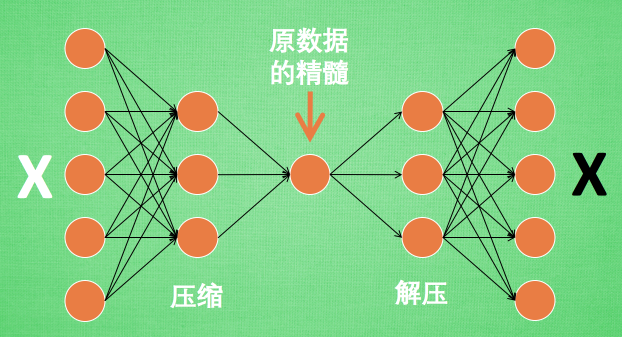
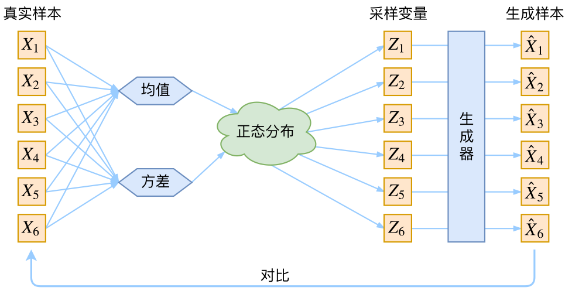

## 判别模型 VS 生成模型

生成模型和判别模型，==二者目的都是在**使后验概率最大化**，**判别式是直接对后验概率建模**，但是**生成模型通过贝叶斯定理这一“桥梁”使问题转化为求联合概率**==。

在机器学习中任务是从属性X预测标记Y，判别模型求的是P(Y|X)，即后验概率；而生成模型最后求的是P(X,Y)，即联合概率。

从本质上来说：

**判别模型之所以称为“判别”模型**，是因为其根据X“判别”Y；

而**生成模型之所以称为“生成”模型**，是因为其预测的根据是联合概率P(X,Y)，而联合概率可以理解为“生成”(X,Y)样本的概率分布（或称为 依据）；具体来说，机器学习已知X，从Y的候选集合中选出一个来，可能的样本有(X,Y_1), (X,Y_2), (X,Y_3),……，(X,Y_n),实际数据是如何“生成”的依赖于P(X,Y)，那么最后的预测结果选哪一个Y呢？那就选“生成”概率最大的那个吧~

[机器学习“判定模型”和“生成模型”有什么区别？](https://www.zhihu.com/question/20446337/answer/256466823) 

## 自编码 Autoencoder

[什么是自编码 Autoencoder](https://zhuanlan.zhihu.com/p/24813602) 

自编码是一种神经网络的形式

### 压缩与解压

假设刚刚那个神经网络是这样，对应上刚刚的图片，可以看出图片其实是经过了压缩，再解压的这一道工序。当压缩的时候，原有的图片质量被缩减，解压时用信息量小却包含了所有关键信息的文件恢复出原本的图片。为什么要这样做呢？

原来有时神经网络要接受大量的输入信息，比如输入信息是高清图片时，输入信息量可能达到上千万，让神经网络直接从上千万个信息源中学习是一件很吃力的工作。所以，何不压缩一下，提取出原图片中的最具代表性的信息，缩减输入信息量，再把缩减过后的信息放进神经网络学习。这样学习起来就简单轻松了。

自编码就能在这时发挥作用。通过将原数据白色的X 压缩，解压成黑色的X，然后通过对比黑白X，求出预测误差，进行反向传递，逐步提升自编码的准确性。训练好的自编码中间这一部分就是能总结原数据的精髓。

可以看出，从头到尾，我们只用到了输入数据X，并没有用到 X 对应的数据标签，所以也可以说自编码是一种非监督学习。到了真正使用自编码的时候，通常只会用到自编码前半部分。

### 编码器 Encoder

这部分也叫作 encoder 编码器。编码器能得到原数据的精髓，然后我们只需要再创建一个小的神经网络学习这个精髓的数据，不仅减少了神经网络的负担，而且同样能达到很好的效果。

这是一个通过自编码整理出来的数据，它能从原数据中总结出每种类型数据的特征，如果把这些特征类型都放在一张二维的图片上，每种类型都已经被很好的用原数据的精髓区分开来。如果你了解 PCA 主成分分析，再提取主要特征时，自编码和它一样，甚至超越了 PCA。换句话说，自编码可以像 PCA 一样 给特征属性降维。

## 变分自编码器 VAE

https://kexue.fm/archives/5253 

### 分布变换

通常我们会拿VAE跟GAN比较，的确，它们两个的目标基本是一致的——**希望构建一个从隐变量Z生成目标数据X的模型，但是实现上有所不同**。更准确地讲，它们是假设了Z服从某些常见的分布（比如正态分布或均匀分布），然后希望训练一个模型X=g(Z)，这个模型能够将原来的概率分布映射到训练集的概率分布，也就是说，它们的**目的都是进行分布之间的变换**。

==生成模型的难题就是判断生成分布与真实分布的相似度，因为我们只知道两者的采样结果，不知道它们的分布表达式==。

那现在假设ZZ服从标准的正态分布，那么我就可以从中采样得到若干个$Z_{1}, Z_{2}, \ldots, Z_{n}$，然后对它做变换得到$\hat{X}_{1}=g\left(Z_{1}\right), \hat{X}_{2}=g\left(Z_{2}\right), \ldots, \hat{X}_{n}=g\left(Z_{n}\right)$，我们怎么判断这个通过$g$构造出来的数据集，它的分布跟我们目标的数据集分布是不是一样的呢？有读者说不是有KL散度吗？当然不行，因为KL散度是根据两个概率分布的表达式来算它们的相似度的，然而目前我们并不知道它们的概率分布的表达式，我们只有一批从构造的分布采样而来的数据$\left\{\hat{X}_{1}, \hat{X}_{2}, \ldots, \hat{X}_{n}\right\}$，还有一批从真实的分布采样而来的数据$\left\{X_{1}, X_{2}, \ldots, X_{n}\right\}$（也就是我们希望生成的训练集）。我们只有样本本身，没有分布表达式，当然也就没有方法算KL散度。

虽然遇到困难，但还是要想办法解决的。GAN的思路很直接粗犷：既然没有合适的度量，那我干脆把这个度量也用神经网络训练出来吧。就这样，WGAN就诞生了。而VAE则使用了一个精致迂回的技巧。

### VAE慢谈

#### 经典回顾

首先我们有一批数据样本$\left\{X_{1}, \ldots, X_{n}\right\}$，其整体用XX来描述，我们本想根据$\left\{X_{1}, \ldots, X_{n}\right\}$得到$X$的分布$p(X)$，如果能得到的话，那我直接根据$p(X)$来采样，就可以得到所有可能的$X$了（包括$\left\{X_{1}, \ldots, X_{n}\right\}$以外的），这是一个终极理想的生成模型了。当然，这个理想很难实现，于是我们将分布改一改：
$$
p(X)=\sum_{Z} p(X \mid Z) p(Z)
$$
这里我们就不区分求和还是求积分了，意思对了就行。此时$p(X \mid Z)$就描述了一个由$Z$来生成$X$的模型，而我们假设$Z$服从标准正态分布，也就是$p(Z)=\mathcal{N}(0, I)$。如果这个理想能实现，那么我们就可以先从标准正态分布中采样一个$Z$，然后根据$Z$来算一个$X$，也是一个很棒的生成模型。接下来就是结合自编码器来实现重构，保证有效信息没有丢失，再加上一系列的推导，最后把模型实现。框架的示意图如下：

看出了什么问题了吗？如果像这个图的话，我们其实完全不清楚：究竟经过重新采样出来的$Z_k$，是不是还对应着原来的$X_k$，所以我们如果直接最小化$\mathcal{D}\left(\hat{X}_{k}, X_{k}\right)^{2}$（这里$\mathcal{D}$代表某种距离函数）是很不科学的，而事实上你看代码也会发现根本不是这样实现的。也就是说，很多教程说了一大通头头是道的话，然后写代码时却不是按照所写的文字来写，可是他们也不觉得这样会有矛盾～

#### VAE初现

#### 分布标准化

**VAE还让所有的$p(Z|X)$都向标准正态分布看齐**，这样就防止了噪声为零，同时保证了模型具有生成能力。怎么理解“保证了生成能力”呢？如果所有的$p(Z|X)$都很接近标准正态分布$\mathcal{N}(0, I)$，那么根据定义
$$
p(Z)=\sum_{X} p(Z \mid X) p(X)=\sum_{X} \mathcal{N}(0, I) p(X)=\mathcal{N}(0, I) \sum_{X} p(X)=\mathcal{N}(0, I)
$$
这样我们就能达到我们的先验假设：$p(Z)$是标准正态分布。然后我们就可以放心地从$\mathcal{N}(0, I)$中采样来生成图像了。

为了使模型具有生成能力，vae要求每个$p(Z_x)$都向正态分布看齐

#### 重参数技巧

### 后续分析

#### 本质是什么

VAE的本质是什么？VAE虽然也称是AE（AutoEncoder）的一种，但它的做法（或者说它对网络的诠释）是别具一格的。在VAE中，它的Encoder有两个，一个用来计算均值，一个用来计算方差，这已经让人意外了：Encoder不是用来Encode的，是用来算均值和方差的，这真是大新闻了，还有均值和方差不都是统计量吗，怎么是用神经网络来算的？

事实上，我觉得==VAE从让普通人望而生畏的变分和贝叶斯理论出发，最后落地到一个具体的模型中，虽然走了比较长的一段路，但最终的模型其实是很接地气的==：**它本质上就是在我们常规的自编码器的基础上，对encoder的结果（在VAE中对应着计算均值的网络）加上了“高斯噪声”，使得结果decoder能够对噪声有鲁棒性；而那个额外的KL loss（目的是让均值为0，方差为1），事实上就是相当于对encoder的一个正则项，希望encoder出来的东西均有零均值。**

那另外一个encoder（对应着计算方差的网络）的作用呢？它是用来==动态调节噪声的强度==的。直觉上来想，**当decoder还没有训练好时（重构误差远大于KL loss），就会适当降低噪声（KL loss增加），使得拟合起来容易一些（重构误差开始下降）；反之，如果decoder训练得还不错时（重构误差小于KL loss），这时候噪声就会增加（KL loss减少），使得拟合更加困难了（重构误差又开始增加），这时候decoder就要想办法提高它的生成能力了。**

说白了，重构的过程是希望没噪声的，而KL loss则希望有高斯噪声的，两者是对立的。所以，VAE跟GAN一样，内部其实是包含了一个对抗的过程，只不过它们两者是混合起来，共同进化的。从这个角度看，VAE的思想似乎还高明一些，因为在GAN中，造假者在进化时，鉴别者是安然不动的，反之亦然。当然，这只是一个侧面，不能说明VAE就比GAN好。GAN真正高明的地方是：它连度量都直接训练出来了，而且这个度量往往比我们人工想的要好（然而GAN本身也有各种问题，这就不展开了）。

从这个讨论中，我们也可以看出，当然，每个$p(Z|X)$是不可能完全精确等于标准正态分布，否则$p(Z|X)p$就相当于跟$X$无关了，重构效果将会极差。最终的结果就会是，$p(Z|X)$保留了一定的XX信息，重构效果也还可以，并且$p(Z)=\sum_{X} p(Z \mid X) p(X)=\sum_{X} \mathcal{N}(0, I) p(X)=\mathcal{N}(0, I) \sum_{X} p(X)=\mathcal{N}(0, I)$近似成立，所以同时保留着生成能力。

#### 正态分布

#### 变分在哪里

一句话，VAE的名字中“变分”，是因为它的推导过程用到了KL散度及其性质。

因为$K L(p(x) \| q(x))$实际上是一个泛函，要对泛函求极值就要用到变分法，当然，这里的变分法只是普通微积分的平行推广，还没涉及到真正复杂的变分法。而VAE的变分下界，是直接基于KL散度就得到的。所以直接承认了KL散度的话，就没有变分的什么事了。

#### 条件VAE

## 生成对抗网络 GANs

https://zhuanlan.zhihu.com/p/33752313

### GAN基本思想

GAN全称对抗生成网络，顾名思义是生成模型的一种，而它的训练则是处于一种对抗博弈状态中的。下面举例来解释一下GAN的基本思想。

GAN的感性认识

> 假如你是一名篮球运动员，你想在下次比赛中得到上场机会。
> 于是在每一次训练赛之后你跟教练进行沟通：
>
> *你：教练，我想打球*
> *教练：（评估你的训练赛表现之后）... 算了吧*
> *（你通过跟其他人比较，发现自己的运球很差，于是你苦练了一段时间）*
>
> *你：教练，我想打球*
> *教练：... 嗯 还不行*
> *（你发现大家投篮都很准，于是你苦练了一段时间的投篮）*
>
> *你：教练，我想打球*
> *教练： ... 嗯 还有所欠缺*
> *（你发现你的身体不够壮，被人一碰就倒，于是你去泡健身房）*
>
> *......*
>
> *通过这样不断的努力和被拒绝，你最终在某一次训练赛之后得到教练的赞赏，获得了上场的机会。*
> *值得一提的是在这个过程中，所有的候选球员都在不断地进步和提升。因而教练也要不断地通过对比场上球员和候补球员来学习分辨哪些球员是真正可以上场的，并且要“观察”得比球员更频繁。随着大家的成长教练也会会变得越来越严格。*

### GAN的基本结构

GAN的主要结构包括一个**生成器**G（Generator）和一个**判别器**D（Discriminator）。

在上面的例子中的球员就相当于生成器，我们需要他在球场上能有好的表现。而球员一开始都是初学者，这个时候就需要一个教练员来指导他们训练，告诉他们训练得怎么样，直到真的能够达到上场的标准。而这个教练就相当于判别器。

下面我们举另外一个手写字的例子来进行进一步窥探GAN的结构。

我们现在拥有大量的手写数字的数据集，我们希望通过GAN生成一些能够以假乱真的手写字图片。主要由如下两个部分组成：

1. 定义一个模型来作为生成器（图三中蓝色部分Generator），能够输入一个向量，输出手写数字大小的像素图像。
2. 定义一个分类器来作为判别器（图三中红色部分Discriminator）用来判别图片是真的还是假的（或者说是来自数据集中的还是生成器中生成的），输入为手写图片，输出为判别图片的标签。

### GAN的基本原理

[GAN原理简单讲解即代码实现](https://blog.csdn.net/qq_39777550/article/details/108312126) 

GAN的基本原理其实非常简单，这里以生成图片为例进行说明。假设我们有两个网络，G（Generator）和D（Discriminator）。正如它的名字所暗示的那样，它们的功能分别是：

- G是一个生成图片的网络，它接收一个随机的噪声z，通过这个噪声生成图片，记做G(z)。
- D是一个判别网络，判别一张图片是不是“真实的”。它的输入参数是x，x代表一张图片，输出D(x)代表x为真实图片的概率，如果为1，就代表100%是真实的图片，而输出为0，就代表不可能是真实的图片。

在训练过程中，生成网络G的目标就是尽量生成真实的图片去欺骗判别网络D。而D的目标就是尽量把G生成的图片和真实的图片分别开来。这样，G和D构成了一个动态的“博弈过程”。

最后博弈的结果是什么？在最理想的状态下，G可以生成足以“以假乱真”的图片G(z)。对于D来说，它难以判定G生成的图片究竟是不是真实的，因此D(G(z)) = 0.5。

这样我们的目的就达成了：我们得到了一个生成式的模型G，它可以用来生成图片。

下面详细介绍一下过程：

1. 第一阶段：固定「判别器D」，训练「生成器G」
   我们使用一个还 OK 判别器，让一个「生成器G」不断生成“假数据”，然后给这个「判别器D」去判断。一开始，「生成器G」还很弱，所以很容易被揪出来。
   但是随着不断的训练，「生成器G」技能不断提升，最终骗过了「判别器D」。
   到了这个时候，「判别器D」基本属于瞎猜的状态，判断是否为假数据的概率为50%。
2. 第二阶段：固定「生成器G」，训练「判别器D」
   当通过了第一阶段，继续训练「生成器G」就没有意义了。这个时候我们固定「生成器G」，然后开始训练「判别器D」。
   「判别器D」通过不断训练，提高了自己的鉴别能力，最终它可以准确的判断出所有的假图片。
   到了这个时候，「生成器G」已经无法骗过「判别器D」。
3. 循环阶段一和阶段二
   通过不断的循环，「生成器G」和「判别器D」的能力都越来越强。
   最终通过动态博弈我们得到了一个效果非常好的「生成器G」，我们就可以用它来生成我们想要的图片了。

代码化之后：

- 第一部分：固定判别器D，训练生成器G使其尽可能减小生成样本与真实样本之间的差距；
- 第二部分：固定生成器G，训练判别器D，使用较小的学习率来判别器的参数，让D尽可能准确地区分出正确样本和生成的样本；
- 接下去开始循环执行两个部分。
- 每达到一定次数以后，使用较小的学习率来更新生成器的参数
- 最终目标是通过动态博弈得到一个优秀的生成器G，让判别器D对G生成样本和正确样本的区分处于瞎猜状态（判断是否为正确样本的概率为0.5）。

**GAN步骤** 

1. 生成器接收随机数并返回图像。
2. 将生成的图像与从实际数据集中获取的图像流一起馈送到鉴别器中。
3. 鉴别器接收真实和假图像并返回概率，0到1之间的数字，1表示真实性的预测，0表示假。

目的是把接收到的真实的图片识别出是图片的概率为1，把生成的图片识别为是图片的概率为0。这样就可以通过把生成器生成的图片识别为假，来训练生成器生成以假乱真的图片的能力。

**训练GAN的技巧** 

- 在开始训练发生器之前预先识别鉴别器将建立更清晰的梯度。
- 训练Discriminator时，保持Generator值不变。训Generator时，保持Discriminator值不变。这使网络能够更好地了解它必须学习的梯度。
- GAN被制定为两个网络之间的游戏，重要（并且很难！）保持它们的平衡。如果生成器或鉴别器太好，GAN可能很难学习。
- GAN需要很长时间才能训练。在单个GPU上，GAN可能需要数小时，在单个CPU上，GAN可能需要数天。

### GAN的训练方式

前面已经定义了一个生成器（Generator）来生成手写数字，一个判别器（Discrimnator）来判别手写数字是否是真实的，和一些真实的手写数字数据集。那么我们怎样来进行训练呢？

#### 关于生成器

对于生成器，输入需要一个n维度向量，输出为图片像素大小的图片。因而首先我们需要得到输入的向量。

> Tips: 这里的生成器可以是任意可以输出图片的模型，比如最简单的全连接神经网络，又或者是反卷积网络等。这里大家明白就好。

这里输入的向量我们将其视为携带输出的某些信息，比如说手写数字为数字几，手写的潦草程度等等。由于这里我们对于输出数字的具体信息不做要求，只要求其能够最大程度与真实手写数字相似（能骗过判别器）即可。所以我们使用随机生成的向量来作为输入即可，这里面的随机输入最好是满足常见分布比如均值分布，高斯分布等。

> Tips: 假如我们后面需要获得具体的输出数字等信息的时候，我们可以对输入向量产生的输出进行分析，获取到哪些维度是用于控制数字编号等信息的即可以得到具体的输出。而在训练之前往往不会去规定它。

#### 关于判别器

对于判别器不用多说，往往是常见的判别器，输入为图片，输出为图片的真伪标签。

> Tips: 同理，判别器与生成器一样，可以是任意的判别器模型，比如全连接网络，或者是包含卷积的网络等等。

#### 如何训练

上面进一步说明了生成器和判别器，接下来说明如何进行训练。

基本流程如下：

- 初始化判别器D的参数$\theta_{d}$和生成器G的参数$\theta_{g}$ 。
- 从真实样本中采样$m$个样本$\left\{x^{1}, x^{2}, \ldots x^{m}\right\}$ ，从先验分布噪声中采样$m$个噪声样本$\left\{z^{1}, z^{2}, \ldots z^{m}\right\}$并通过生成器获取$m$个生成样本$\left\{\tilde{x}^{1}, \tilde{x}^{2}, \ldots, \tilde{x}^{m}\right\}$。固定生成器G，训练判别器D尽可能好地准确判别真实样本和生成样本，尽可能大地区分正确样本和生成的样本。
- **循环k次更新判别器之后，使用较小的学习率来更新一次生成器的参数**，训练生成器使其尽可能能够减小生成样本与真实样本之间的差距，也相当于尽量使得判别器判别错误。
- 多次更新迭代之后，最终理想情况是使得判别器判别不出样本来自于生成器的输出还是真实的输出。亦即最终样本判别概率均为0.5。

> Tips: 之所以要训练k次判别器，再训练生成器，是因为要先拥有一个好的判别器，使得能够教好地区分出真实样本和生成样本之后，才好更为准确地对生成器进行更新。更直观的理解可以参考下图：

> 注：图中的**黑色虚线**表示真实的样本的分布情况，**蓝色虚线**表示判别器判别概率的分布情况，**绿色实线**表示生成样本的分布。 $Z$ 表示噪声，$Z$ 到 $x$表示通过生成器之后的分布的映射情况。
>
> 我们的目标是使用生成样本分布（绿色实线）去拟合真实的样本分布（黑色虚线），来达到生成以假乱真样本的目的。
>
> 可以看到在**（a）**状态处于最初始的状态的时候，生成器生成的分布和真实分布区别较大，并且判别器判别出样本的概率不是很稳定，因此会先训练判别器来更好地分辨样本。
> 通过多次训练判别器来达到**（b）**样本状态，此时判别样本区分得非常显著和良好。然后再对生成器进行训练。
> 训练生成器之后达到**（c）**样本状态，此时生成器分布相比之前，逼近了真实样本分布。
> 经过多次反复训练迭代之后，最终希望能够达到**（d）**状态，生成样本分布拟合于真实样本分布，并且判别器分辨不出样本是生成的还是真实的（判别概率均为0.5）。也就是说我们这个时候就可以生成出非常真实的样本啦，目的达到。

### 训练相关理论基础

就是交叉熵变形，[Loss Functions | Generative Adversarial Networks | Google Developers](http://link.zhihu.com/?target=https%3A//developers.google.com/machine-learning/gan/loss) 这个blog里提到了的。另外这篇文章证明了GAN用cross entropy和JS divergence是等价的。I. Goodfellow, J. Pouget-Abadie, M. Mirza, B. Xu, D. Warde-Farley, S. Ozair, A. Courville, and Y. Bengio. Generative adversarial nets. In Advances in neural information processing systems, pages 2672–2680, 2014.

### 总结

本文大致介绍了GAN的整体情况。但是对于GAN实际上还有更多更完善的理论相关描述，进一步了解可以看相关的论文。并且在GAN一开始提出来的时候，实际上针对于不同的情况也有存在着一些不足，后面也陆续提出了不同的GAN的变体来完善GAN。

通过一个判别器而不是直接使用损失函数来进行逼近，更能够自顶向下地把握全局的信息。比如在图片中，虽然都是相差几像素点，但是这个像素点的位置如果在不同地方，那么他们之间的差别可能就非常之大。

比如上图10中的两组生成样本，对应的目标为字体2，但是图中上面的两个样本虽然只相差一个像素点，但是这个像素点对于全局的影响是比较大的，但是单纯地去使用使用损失函数来判断，那么他们的误差都是相差一个像素点，而下面的两个虽然相差了六个像素点的差距（粉色部分的像素点为误差），但是实际上对于整体的判断来说，是没有太大影响的。但是直接使用损失函数的话，却会得到6个像素点的差距，比上面的两幅图差别更大。而如果使用判别器，则可以更好地判别出这种情况(不会拘束于具体像素的差距)。

总之GAN是一个非常有意思的东西，现在也有很多相关的利用GAN的应用，比如利用GAN来生成人物头像，用GAN来进行文字的图片说明等等。后面我也会使用GAN来做一些简单的实验来帮助进一步理解GAN。

最后附上论文中的GAN算法流程，通过上面的介绍，这里应该非常好理解了。

## VAE和GANs的辨析

[VAE、GAN和流模型的区别和联系：对生成模型家族的分析](https://zhuanlan.zhihu.com/p/116775904) 

[GAN 和 VAE 的本质区别是什么？为什么两者总是同时被提起？](GAN 和 VAE 的本质区别是什么？为什么两者总是同时被提起？ - 知乎 https://www.zhihu.com/question/317623081) 

> ❝ 一种常见的分类方法可以将机器学习模型分为**「判别式」**和**「生成式」**两种。判别式模型如KNN、SVM、决策树等，强调直接从数据中学习决策函数；而生成式模型如HMM、Bayes等，则强调学习数据生成的规律（分布）从而更好地对数据进行表征建模。 生成式模型由于能够学习数据的隐含特征表示，因此在近些年得到了长足的发展，在机器学习领域愈来愈重要。本文主要介绍常见的生成模型，并着重分析VAE、GAN和流模型这三者的区别和联系。
> ❞

目前主流的生成模型主要有4大类：

- 基于自回归（autogressive）的模型，如翻译模型、语言模型；
- 变分自编码器（variational autoencoder, VAE）；
- 生成对抗网络（Generative adversarial net, GAN）；
- 流模型（Flow-based model）。

其中除了自回归比较容易理解外，VAE、GAN和流模型这三大类方法有很明显的区别，也有着千丝万缕的联系。

首先，三者都是生成模型，就是说从训练数据来建模真实的数据分布，然后反过来再用学到的这个模型和分布去生成、建模新的数据。

**相同点**

- 生成数据的模式都是用了随机噪声（如常用的就是高斯分布）。
- 在建模分布时，都需要度量噪声和训练数据的分布差异。

**不同点** 

### 不同点1：建模的方式（理念）不同

VAE里面z到x的depencence是随机的，而GAN里是确定性的。这使得VAE的inference相对来说是well-defined的而GAN的inferernce相对来说是病态的。

这个建模上的区别也是来自于两者建模目的的不同。GAN就是为了生成新图片，而VAE除此之外，更想做的事情是建模数据的分布以及学到数据的隐含表示。

对于建模数据的分布，通常来说也就是density estimation，虽然VAE和GAN都有在x的空间上定义概率密度，但GAN定义的密度更难计算。density estimation可以用来做比如anomaly/outlier detection进而做分类什么的。

流模型则直接从原始问题出发，建立训练数据和生成数据之间的概率关系（这种概率关系是量化的、准确的），然后用可逆的神经网络来训练。它在建模上的最大特点是z和x之间的关系是确定性的而且是一对一的关系

### **不同点2：训练方式不同**

训练上的区别在于loss不同。

VAE最大化ELBO，其目的是要做最大似然估计，最大似然估计等价于最小化KL，但这个KL不是数据和噪声的KL，而是model给出的$p(x)$和数据所展示的$p(x)$之间的KL。

GAN则最小化Jensen-Shannon Divergence，这个JS也是model给出的$p(x)$和数据所展示的$p(x)$之间的。

流模型训练也非常直接，也是最大似然估计。只不过因为流模型用的是可逆神经网络，因此，相比于其他两者，学习inference即学习隐含表示非常容易，直接把x用逆函数过一遍就好了不需要额外train一个inference model，而且能直接计算$p(x)$，所以方便了density estimation，也方便了training因为可以直接用MLE来train（ELBO只是likelihood的lower bound，而且需要一个inference model，但VAE没法直接MLE）。代价就是模型设计比较麻烦，因为要保证可逆而且逆函数可以算，还要有足够的灵活度/表示能力。

从效果上三类方法殊途同归，经过了多年发展，都取得了不错的进展。

最后说一下比较有意思的事：

VAE、GAN、Flow (NICE)三种模型都是2013-2014年提出来的（VAE是13年放到arXiv上的，后来中了NIPS；GAN也同时中了NIPS，而NICE最早是14年的一个ICLR workshop）。最后的发展情况是：GAN最火，VAE次之，Flow模型似乎总是要火不火。但是从理论上来看，分明是Flow模型最接近问题的本质。也许是因为flow太难了，计算资源太大了？

