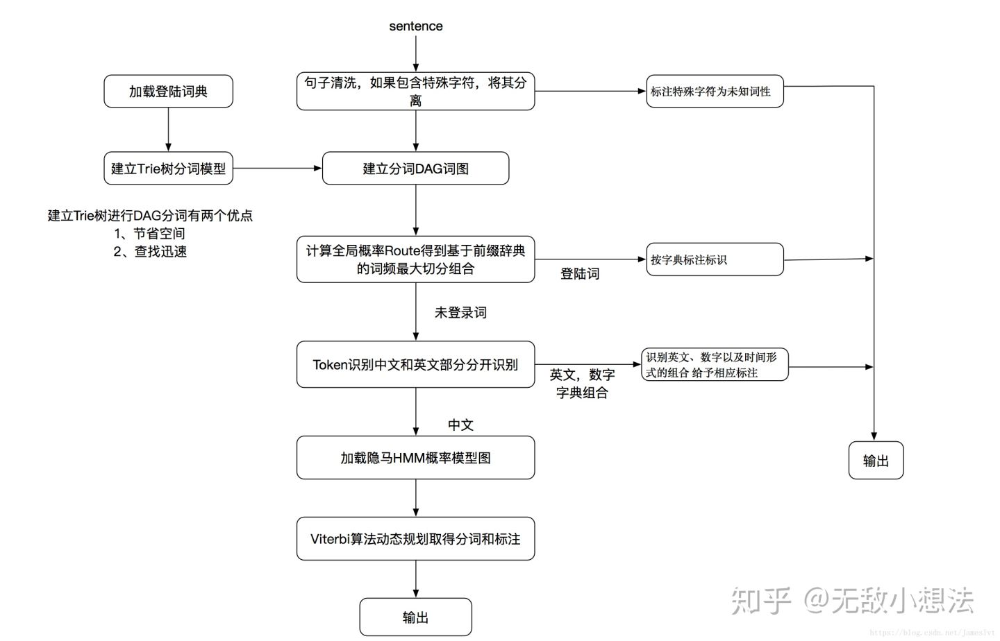

## N-gram 语言模型

### 什么是n-gram模型

N-Gram是一种基于统计语言模型的算法。它的基本思想是将文本里面的内容按照字节进行大小为N的滑动窗口操作，形成了长度是N的字节片段序列。

每一个字节片段称为gram，对所有gram的出现频度进行统计，并且按照事先设定好的阈值进行过滤，形成关键gram列表，也就是这个文本的向量特征空间，列表中的每一种gram就是一个特征向量维度。

该模型基于这样一种假设，第N个词的出现只与前面N-1个词相关，而与其它任何词都不相关，整句的概率就是各个词出现概率的乘积。这些概率可以通过直接从语料中统计N个词同时出现的次数得到。常用的是二元的Bi-Gram和三元的Tri-Gram。


### n-gram模型用于评估语句是否合理

如果我们有一个由 m 个词组成的序列（或者说一个句子），我们希望算得概率$p\left(w_{1}, w_{2}, \ldots, w_{m}\right)$，根据链式规则，可得
$$
p\left(w_{1}, w_{2}, \ldots, w_{m}\right)=p\left(w_{1}\right) * p\left(w_{2} \mid w_{1}\right) * p\left(w_{3} \mid w_{1}, w_{2}\right) \ldots \ldots p\left(w_{m} \mid w_{1}, \ldots, w_{m-1}\right)
$$
这个概率显然并不好算，不妨利用**马尔科夫链的假设，即当前这个词仅仅跟前面几个有限的词相关**，***因此也就不必追溯到最开始的那个词，这样便可以大幅缩减上述算式的长度***。即
$$
p\left(w_{1}, w_{2}, \ldots, w_{m}\right)=p\left(w_{i} \mid w_{i-n+1, \ldots, w_{i-1}}\right)
$$
这个马尔科夫链的假设为什么好用？我想可能是在现实情况中，大家通过真实情况将n=1，2，3，....这些值都试过之后，得到的真实的效果和时间空间的开销权衡之后，发现能够使用。

下面给出一元模型，二元模型，三元模型的定义：

当 n=1, 一个一元模型（unigram model)即为 ：
$$
P\left(w_{1}, w_{2}, \cdots, w_{m}\right)=\prod_{i=1}^{m} P\left(w_{i}\right)
$$
当 n=2, 一个二元模型（bigram model)即为 ：
$$
P\left(w_{1}, w_{2}, \cdots, w_{m}\right)=\prod_{i=1}^{m} P\left(w_{i} \mid w_{i-1}\right)
$$
当 n=3, 一个三元模型（trigram model)即为
$$
P\left(w_{1}, w_{2}, \cdots, w_{m}\right)=\prod_{i=1}^{m} P\left(w_{i} \mid w_{i-2} w_{i-1}\right)
$$


然后下面的思路就很简单了，在给定的训练语料中，利用贝叶斯定理，将上述的条件概率值（**因为一个句子出现的概率都转变为右边条件概率值相乘了**）都统计计算出来即可。下面会给出具体例子讲解。这里先给出公式：

对于bigram model而言，
$$
P\left(w_{i} \mid w_{i-1}\right)=\frac{C\left(w_{i-1} w_{i}\right)}{C\left(w_{i-1}\right)}
$$
对于 $n$-gram model而言，
$$
P\left(w_{i} \mid w_{i-n-1}, \cdots, w_{i-1}\right)=\frac{C\left(w_{i-n-1}, \cdots, w_{i}\right)}{C\left(w_{i-n-1}, \cdots, w_{i-1}\right)}
$$
对第一个进行解释，后面同理，如下：
$$
p\left(w_{i} \mid p\left(w_{i-1}\right)\right)=p\left(w_{i}, w_{i-1}\right) / p\left(w_{i-1}\right)=\\
\left(\operatorname{count}\left(w_{i}, w_{i-1}\right) / \operatorname{count}(A L L w o r d)\right) /\left(\operatorname{count}\left(w_{i-1}\right) / \operatorname{count}(A L L w o r d)\right)=\\
\operatorname{count}\left(w_{i}, w_{i-1}\right) / \operatorname{count}\left(w_{i-1}\right)
$$


### 二元语言模型判断句子是否合理

[自然语言处理中的N-Gram模型详解](https://blog.csdn.net/baimafujinji/article/details/51281816) 

假设现在有一个语料库，我们统计了下面的一些词出现的数量
$$
\begin{array}{llllllll}
\hline \text { i } & \text { want } & \text { to } & \text { eat } & \text { chinese} & \text {food} & \text { lunch } & \text { spend } \\
\hline 2533 & 927 & 2417 & 746 & \quad 158 & 1093 & \;\; 341 & \quad 278 \\
\hline
\end{array}
$$
下面的这些概率值作为已知条件：
$$
\begin{array}{lr}
P(\text { i }|<s>)=0.25 & P(\text { english|want })=0.0011 \\
P(\text { food|english })=0.5 & P(</ s>\mid \text { food })=0.68
\end{array}
$$
p(want|<s>) = 0.25

下面这个表给出的是基于Bigram模型进行计数之结果
$$
\begin{array}{lllllllll} 
& \text { i } & \text { want } & \text { to } & \text { eat } & \text { chinese } & \text { food } & \text { lunch } & \text { spend } \\
\hline \text { i } & 5 & 827 & 0 & 9 & 0 & 0 & 0 & 2 \\
\text { want } & 2 & 0 & 608 & 1 & 6 & 6 & 5 & 1 \\
\text { to } & 2 & 0 & 4 & 686 & 2 & 0 & 6 & 211 \\
\text { eat } & 0 & 0 & 2 & 0 & 16 & 2 & 42 & 0 \\
\text { chinese } & 1 & 0 & 0 & 0 & 0 & 82 & 1 & 0 \\
\text { food } & 15 & 0 & 15 & 0 & 1 & 4 & 0 & 0 \\
\text { lunch } & 2 & 0 & 0 & 0 & 0 & 1 & 0 & 0 \\
\text { spend } & 1 & 0 & 1 & 0 & 0 & 0 & 0 & 0
\end{array}
$$
例如，其中 第一行第二列 表示给定前一个词是 “i” 时，当前词为“want”的情况一共出现了827次。据此，我们便可以算得相应的频率分布表如下。
$$
\begin{array}{lllllllll}
\hline & \text { i } & \text { want } & \text { to } & \text { eat } & \text { chinese } & \text { food } & \text { lunch } & \text { spend } \\
\hline \text { i } & 0.002 & 0.33 & 0 & 0.0036 & 0 & 0 & 0 & 0.00079 \\
\text { want } & 0.0022 & 0 & 0.66 & 0.0011 & 0.0065 & 0.0065 & 0.0054 & 0.0011 \\
\text { to } & 0.00083 & 0 & 0.0017 & 0.28 & 0.00083 & 0 & 0.0025 & 0.087 \\
\text { eat } & 0 & 0 & 0.0027 & 0 & 0.021 & 0.0027 & 0.056 & 0 \\
\text { chinese } & 0.0063 & 0 & 0 & 0 & 0 & 0.52 & 0.0063 & 0 \\
\text { food } & 0.014 & 0 & 0.014 & 0 & 0.00092 & 0.0037 & 0 & 0 \\
\text { lunch } & 0.0059 & 0 & 0 & 0 & 0 & 0.0029 & 0 & 0 \\
\text { spend } & 0.0036 & 0 & 0.0036 & 0 & 0 & 0 & 0 & 0
\end{array}
$$
比如说，我们就以表中的p(eat|i)=0.0036这个概率值讲解，从表一得出“i”一共出现了2533次，而其后出现eat的次数一共有9次，p(eat|i)=p(eat,i)/p(i)=count(i,eat)/count(i)=9/2533 = 0.0036

下面我们通过基于这个语料库来判断s1=“<s> i want english food</s>” 与s2 = "<s> want i english food</s>"哪个句子更合理：通过例子来讲解是最人性化的，我在网上找了这么久发现这个例子最好：

**首先来判断p(s1)** 

P(s1)=P(i|\<s>)P(want|i)P(english|want)P(food|english)P(\</s>|food)

=0.25×0.33×0.0011×0.5×0.68=0.000031

**再来求p(s2)？** 

P(s2)=P(want|<s>)P(i|want)P(english|want)P(food|english)P(\</s>|food)

=0.25\*0.0022\*0.0011\*0.5\*0.68 = 0.00000002057

通过比较我们可以明显发现0.00000002057<0.000031,也就是说s1= "<s>i want english food</s>"更像人话。

再深层次的分析，我们可以看到这两个句子的概率的不同，主要是由于顺序`i want`还是`want i`的问题，根据我们的直觉和常用搭配语法，i want要比want i出现的几率要大很多。所以两者的差异，第一个概率大，第二个概率小，也就能说的通了。


### N-gram模型的一个常见应用

搜索引擎（Google或者Baidu）、或者输入法的猜想或者提示。你在用谷歌时，输入一个或几个词，**搜索框通常会以下拉菜单的形式给出几个像下图一样的备选，这些备选其实是在猜想你想要搜索的那个词串。**

再者，当你用输入法输入一个汉字的时候，输入法通常可以联系出一个完整的词，例如我输入一个“刘”字，通常输入法会提示我是否要输入的是“刘备”。通过上面的介绍，你应该能够很敏锐的发觉，这其实是以N-Gram模型为基础来实现的。

那么原理是什么呢？也就是我打入“我们”的时候，后面的“不一样”、”的爱“这些是怎么出来的，怎么排序的？

实际上是根据语言模型得出。假如使用的是二元语言模型预测下一个单词：

排序的过程就是：

p(”不一样“|"我们")>p(”的爱“|"我们")>p(”相爱吧“|"我们")>.......>p("这一家"|”我们“)，这些概率值的求法和上面提到的完全一样，数据的来源可以是用户搜索的log。


### n-gram的n大小对性能的影响

**n更大的时候**

n: 对下一个词出现的约束性信息更多，更大的辨别力，但是更稀疏，并且n-gram的总数也更多，为$V^n$个（V为词汇表的大小）

**n更小的时候** 

在训练语料库中出现的次数更多，更可靠的统计结果，更高的可靠性 ，但是约束信息更少

其中当N为特定值的时候，我们来看一下n-gram可能的总数，如下表：

词表中词的个数$|V| = 20,000$词
$$
\begin{array}{|c|l|}
\hline n & \text { 所有可能的n-gram的个数 } \\
\hline 2 \text { (bigrams) } & 400,000,000 \\
\hline 3 \text { (trigrams) } & 8,000,000,000,000 \\
\hline 4 \text { (4-grams) } & 1.6 \times 10^{17} \\
\hline
\end{array}
$$
对于上图，我用一个例子来进行解释，加入目前词汇表中就只有三个单词，”我爱你“，那么bigram的总数是$3^2$=9个，有”我我“，我爱，我你，爱爱，爱你，爱我，你你，你我，你爱这9个,所以对应上面的表示是bigrams是$20000^2$=400000000,trigrams=$20000^3$ = $8*10e12$ 


## HMM隐含马尔可夫模型

### 马尔可夫链概述

[马尔可夫链 （Markov Chain）是什么鬼](https://zhuanlan.zhihu.com/p/26453269) 

马尔可夫链是随机过程中很重要的概念。

#### 随机过程

顾名思义，它其实就是个**过程**，比如今天下雨，那么明天下不下雨呢？后天下不下雨呢？

从今天下雨到明天不下雨再到后天下雨，这就是个过程。

那么怎么预测N天后到底下不下雨呢？

这其实是可以利用公式进行计算的，随机过程就是这样一个工具，把整个过程进行量化处理，用公式就可以推导出来N天后的天气状况，下雨的概率是多少，不下雨的概率是多少。

**说白了，随机过程就是一些统计模型，利用这些统计模型可以对自然界的一些事物进行预测和处理**，比如天气预报，比如股票，比如市场分析，比如人工智能。它的应用还真是多了去了。

#### 马尔可夫链 Markov Chain

好了，终于可以来看看马尔可夫链 （Markov Chain）到底是什么了。

它是随机过程中的一种过程，到底是哪一种过程呢？好像一两句话也说不清楚，还是先看个例子吧。

先说说我们村智商为0的王二狗，人傻不拉几的，见人就傻笑，每天中午12点的标配，仨状态：吃，玩，睡。**这就是传说中的状态分布。**

你想知道他n天后中午12点的状态么？是在吃，还是在玩，还是在睡？这些状态发生的概率分别都是多少？ （知道你不想，就假装想知道吧~~学习真的好累~~）

先看个假设，他每个状态的转移都是有概率的，比如今天玩，明天睡的概率是几；今天玩，明天也玩的概率是几几，看图更清楚一点。


这个矩阵就是**转移概率矩阵P**，并且它是保持不变的，就是说第一天到第二天的转移概率矩阵跟第二天到第三天的转移概率矩阵是一样的。（这个叫时齐，不细说了，有兴趣的同学自行百度）。

有了这个矩阵，再加上已知的第一天的状态分布，就可以计算出第N天的状态分布了。


S1 是4月1号中午12点的的**状态分布矩阵** [0.6, 0.2, 0.2]，里面的数字分别代表吃的概率，玩的概率，睡的概率。

那么

- 4月2号的状态分布矩阵 S2 = S1 * P (俩矩阵相乘)。
- 4月3号的状态分布矩阵 S3 = S2 * P (看见没，跟S1无关，只跟S2有关)。
- 4月4号的状态分布矩阵 S4 = S3 * P (看见没，跟S1，S2无关，只跟S3有关)。
- ...
- 4月n号的状态分布矩阵 Sn = Sn-1 * P (看见没，只跟它前面一个状态Sn-1有关)。

总结：马尔可夫链就是这样一个任性的过程，**它将来的状态分布只取决于现在，跟过去无关**！

就把下面这幅图想象成是一个马尔可夫链吧。实际上就是一个随机变量随时间按照Markov性进行变化的过程。


附：S2 的计算过程


### 隐马尔可夫模型概念

[一站式解决：隐马尔可夫模型（HMM）全过程推导及实现](https://zhuanlan.zhihu.com/p/85454896) 

隐马尔可夫模型（Hidden Markov Model，HMM）是关于时序的概率模型，是一个生成模型，描述由一个隐藏的**[马尔科夫链](https://zhuanlan.zhihu.com/p/26453269)**随机生成不可观测的**状态序列**，每个状态生成一个观测，而由此产生一个**观测序列**

假设有4个盒子，每个盒子里面有不同数量的红、白两种颜色的球，具体如下表
$$
\begin{array}{|c|c|c|c|c|}
\hline \hline \text { 盒子编号 } & 1 & 2 & 3 & 4 \\
\hline \text { 红球数 } & 5 & 3 & 6 & 8 \\
\hline \text { 白球数 } & 5 & 7 & 4 & 2  \\
\hline \hline
\end{array}
$$
现在从这些盒子中抽取若干$T$个球，每次抽取后记录颜色，再放回原盒子，采样的规则如下：

开始时，按照一个**初始概率分布**随机选择第一个盒子，这里将第一个盒子用$z_1$表示。

将$z_1$的值用变量$q_i$表示。因为有4个盒子可共选择，所以$i \in\{1,2,3,4\}$。然后随机从该盒子中抽取一个球，使用$x$表示。

将 $x_1$ 的值用变量 $v_j$ 表示。因为只有两种球可供选择，所以$j \in\{1,2\}$ 。一共有4个箱子，2种球，结合前面的箱子的详细数据，可以得到从每一个箱子取到各种颜色球的可能性，用一个表格表示：
$$
\begin{array}{|l|l|l|}
\hline & v_{1} & v_{2} \\
\hline q_{1} & 0.5 & 0.5 \\
\hline q_{2} & 0.3 & 0.7 \\
\hline q_{3} & 0.6 & 0.4 \\
\hline q_{4} & 0.8 & 0.2 \\
\hline
\end{array}
$$
进一步，可以用一个矩阵（称为观测概率矩阵，也有资料叫做发射矩阵）来表示该表$B=\left[b_{i j}\right]_{4 \times 2}$

其中 $b_{ij}$ 表示在当前时刻给定$x_t = q_i$的条件下，$x_t = v_j$ 的概率：
$$
b_{i j}=P\left(x_{t}=v_{j} \mid z_{t}=q_{i}\right), \quad t=1,2, \ldots
$$
$t$表示当前的时刻，例如现在是第1时刻；然后是前面标注的**初始概率分布**，这个概率分布可以用一个向量（称作初始状态概率向量）来表示：$\pi=\left[\pi_{i}\right]_{4}^{T}$

其中的$\pi_i$表示$z_1$取各个值的概率：$\pi_{i}=P\left(z_{1}=q_{i}\right), \quad i=1,2,3,4$

例如该分布是均匀分布的话，对应的向量就是$\pi=\left[\begin{array}{llll}
0.25 & 0.25 & 0.25 & 0.25
\end{array}\right]^{T}$ 

记录抽取的球的颜色后将其放回，然后在按照如下规则选择下一个盒子（$z_2$）

- 如果当前是盒子1，则选择盒子2
- 如果当前是盒子2或3，则分布以概率0.4和0.6选择前一个或后一个盒子
- 如果当前是盒子4，则各以0.5的概率停留在盒子4或者选择盒子3

同样，也可以根据以上规则做出一个表格，其中首列表示当前盒子，首行表示下一个盒子
$$
\begin{array}{|c|c|c|c|c|}
\hline & q_{1} & q_{2} & q_{3} & q_{4} \\
\hline q_{1} & 0 & 1 & 0 & 0 \\
\hline q_{2} & 0.4 & 0 & 0.6 & 0 \\
\hline q_{3} & 0 & 0.4 & 0 & 0.6 \\
\hline q_{4} & 0 & 0 & 0.5 & 0.5 \\
\hline
\end{array}
$$
同样使用一个矩阵（称为状态转移矩阵）来表示上表，$A=\left[a_{i j}\right]_{4 \times 4}$

其中 $a_{ij}$表示在当前时刻处于状态$q_i$的条件下，到下一时刻转移到状态$q_j$的概率
$$
a_{i j}=P\left(z_{t+1}=q_{j} \mid z_{t}=q_{i}\right), \quad i=1,2,3,4 ; \quad j=1,2,3,4
$$
以上，生成过程的主要流程就介绍完了，简单概括就是：盒子，取球，盒子，取球……直到生成指定数量（ $T$ ）的数据后停止。

如果对这个过程还有不太理解的话，可以看看文章开头给出的关于马尔科夫链的链接现在，整理一下参数：有两个矩阵，一个向量：
$$
\begin{aligned}
A &=\left[a_{i j}\right]_{N \times N} \\
B &=\left[b_{i j}\right]_{N \times M} \\
\pi &=\left[\pi_{i}\right]_{N}^{T}
\end{aligned}
$$
其中 $N$ 表示隐变量$z$的状态数量， $M$ 表示观测变量$x$可能的取值数量，在后面的讨论中，用$\lambda$表示所有的参数。


### HMM原理讲解

[60分钟看懂HMM的基本原理](https://zhuanlan.zhihu.com/p/224770895) 

#### 直观描述

HMM模型，也叫做隐马尔科夫模型，是一种经典的机器学习序列模型，实现简单，计算快速，广泛用于**语音识别、中文分词**等**序列标注领域**。

下面通过一个村民看病的故事理解什么是HMM模型。

想象一个乡村诊所，村民的身体状况要么健康要么发烧，他们只有问诊所的医生才能知道是否发烧。

医生通过询问村民的感觉去诊断他们是否发烧。村民自身的感觉有正常、头晕或冷。

假设一个村民每天来到诊所并告诉医生他的感觉。村民的感觉只由他当天的健康状况决定。

村民的健康状态有两种：健康和发烧，但医生不能直接观察到，这意味着健康状态对医生是不可见的。

每天村民会告诉医生自己有以下几种由他的健康状态决定的感觉的一种：正常、冷或头晕。

于是医生会得到一个村民的==感觉观测序列==，例如这样：{正常，冷，冷，头晕，冷，头晕，冷，正常，正常}。但是村民的健康状态这个序列是需要由医生根据模型来推断的，是不可直接观测的。

这个村民看病的故事中由村民的==健康状态序列==和村民的==感觉观测序列==构成的系统就是一个隐马尔科夫模型(HMM)。

其中村民的健康状态序列构成一个马尔科夫链。其每个序列值只和前一个值有关，和其它值无关。由于这个马尔科夫链是隐藏的，不可以被直接观测到，

只能由其关联的村民的感觉序列来进行推断，因此叫做隐马尔科夫模型(HMM)。

#### HMM的两大假设 ⭐️

1. 马尔科夫性假设：t时刻的状态出现的概率只和t-1时刻的状态有关。
   $$
   P\left(X_{t} \mid X_{t-1} X_{t-2} \ldots \ldots . X_{1}\right)=P\left(X_{t} \mid X_{t-1}\right)
   $$

2. 齐次性假设：可以理解为时间平移不变性
   $$
   P\left(X_{t} \mid X_{t-1}\right)=P\left(X_{s} \mid X_{s-1}\right)
   $$
   如果 $X_{t}==X_{s}$ 且 $X_{t-1}==X_{s-1}$ 

3. **观测独立性假设**：某个时刻t的观测值只依赖于该时刻的状态值，与任何其它时刻的观测值和状态值无关。
   $$
   P\left(O_{t} \mid X_{t} X_{t-1} X_{t-2} \ldots \ldots . X_{1}, O_{t-1} O_{t-2} \ldots \ldots O_{1}\right)=P\left(O_{t} \mid X_{t}\right)
   $$

**齐次马尔科夫性假设**，即假设隐藏的马尔科夫链在任意时刻t的状态只依赖于其前一时刻的状态，与其它时刻的状态及观测无关，也与时刻t无关。

#### HMM的三要素 ⭐️

观察HMM的联合概率函数：
$$
\begin{gathered}
P\left(O_{1}, O_{2}, O_{3}, \ldots \ldots O_{T}, X_{1}, X_{2}, X_{3}, \ldots \ldots, X_{T}\right) \\
=P\left(X_{1}\right) P\left(O_{1} \mid X_{1}\right) \Pi_{t=2}^{T} P\left(X_{t} \mid X_{t-1}\right) P\left(O_{t} \mid X_{t}\right)
\end{gathered}
$$
可以看到只依赖于三种概率值参数
$$
P\left(X_{1}\right), P\left(X_{t} \mid X_{t-1}\right), P\left(O_{t} \mid X_{t}\right)
$$
分别是初始状态概率，状态值转移概率，观测值输出概率(发射概率)

这就是HMM的三要素，也就是HMM的全部参数，确定了这三种概率，HMM模型就完全确定下来了。

对于状态值取值和观测值取值为离散值的情况下，这三种概率可以表示为矩阵。

假定状态值可能的取值为$x_{1}, x_{2}, \ldots . ., x_{M}$，一共有M种可能取值。 观测值可能的取值为$o_{1}, o_{2}, \ldots \ldots, o_{N}$一共有N种可能取值。

则HMM的全部参数可以表示为三个矩阵，$\lambda=(\pi, A, B)$

- $\pi$叫做初始概率矩阵，是一个M维向量$\pi_{i}=P\left(x_{i}\right)$ 
- $A$叫做转移概率矩阵，是一个M×M维矩阵$A_{i j}=P\left(x_{j} \mid x_{i}\right)$ 
- $B$叫做发射概率矩阵，是一个M×N维矩阵$B_{i j}=P\left(o_{j} \mid x_{i}\right)$ 


#### HMM的三个基本问题 ⭐️

HMM模型相关的应用问题一般可以归结为这三个基本问题中的一个（HMM的三个基本问题充分显示了统计数学的暴力美学）：

- **评估问题（概率计算）**：已知模型参数$\lambda=(\pi, A, B)$，和观测序列$O_{1}, O_{2}, O_{3}, \ldots \ldots O_{T}$，**计算观测序列出现的概率**。 

  以村民看病问题为例，计算一个村民连续出现 {正常，冷，头晕}  感觉的概率。
  评估问题一般使用==**基于动态规划的前向算法或者后向算法**==进行解决，其中前向算法相对简单，容易理解一些。后向算法较难理解。
  设想有两个描述两人语音的HMM模型，那么给一个新的语音序列，利用前向算法或者后向算法就可以计算这个语音序列更可能是哪个人的。

- **学习问题（参数学习）**：已知模型参数$\lambda=(\pi, A, B)$和观测序列$O_{1}, O_{2}, O_{3}, \ldots \ldots O_{T}$计算该**观测序列**对应的**最可能的状态序列**。

  以村民看病问题为例，假设一个病人连续出现 {正常，冷，头晕}  的感觉，计算病人对应的最可能的健康状态序列。

  预测问题一般使用贪心近似算法或者维特比算法解决。其中贪心近似算法相对简单一些，但不一定能找到全局最优解。==**维特比算法可以基于局部最优找到全局最优，是一种动态规划算法**==。

- **预测问题（解码问题）**：模型参数$\lambda=(\pi, A, B)$未知，**推断模型参数**。

  有两种可能的场景，一种是监督学习的场景，已知诸多观测序列和对应的状态序列，推断模型参数，第二种是非监督学习的场景，只知道诸多观测序列，推断模型参数。监督学习的场景，学习方法相对简单。**非监督学习**的场景，一般使用**EM期望最大化方法**进行迭代求解。

**概括** 

隐含状态的转移概率矩阵**A**，可观测值转移矩阵**B**，状态的初始值$\lambda$。

前面标注的**初始概率分布**，这个概率分布可以用一个向量（称作初始状态概率向量）来表示：$\pi=\left[\pi_{i}\right]_{4}^{T}$

其中的$\pi_i$表示$z_1$取各个值的概率：$\pi_{i}=P\left(z_{1}=q_{i}\right), \quad i=1,2,3,4$ 

HMM是一个关于序列问题建模的算法，当前状态只受前一个状态的影响，可观测值是由内部的一个状态决定的。如果给定一批足够多的可观测值的数据，我们可以通过这些数据去**学习HMM模型（学习问题）**，通过这批已发生的事件的最大概率，用极大似然估计，求得HMM模型的参数$\lambda =(A,B,\pi )$。模型参数求出来后，模型就已经建好了，我们就可以**进行预测了（预测问题）**。给定一组观测状态$(x1,x2,x3....,xn)$我们可以用动态规划思路，从第一个状态算出一条到最后状态概率值最大的路径，就是最佳的状态转移过程，这就是Viterbi算法。

#### 概率计算 

**前向算法**和**后向算法** （与BP算法相似）

[隐马尔科夫模型（HMM）一前向与后向算法](https://zhuanlan.zhihu.com/p/27056207) 

#### 参数学习 

EM算法

[EM算法原理及推导](https://zhuanlan.zhihu.com/p/85236423) 

#### 解码问题

解决这个问题的算法叫做维特比（Viterbi）算法。

实际上它是一个**动态规划求解最优路径**的算法，这里的**最优路径对应成最大概率**。

Viterbi和[Dijkstra算法](https://so.csdn.net/so/search?q=Dijkstra算法&spm=1001.2101.3001.7020)看起来比较像，两者的区别:

1. Dijkstra算法适应范围更广。Viterbi算法用在特殊的有向无环图中，而Dijkstra算法可以用在大部分图结构中(有向无向、有环无环都可以)。
2. 搜索过程类似，但搜索顺序不同。Dijkstra**每步选择最短路**的结点处进行搜索，而Viterbi**按照拓扑顺序逐层搜索**。
3. Dijkstra是基于**贪心**思路的，而Viterbi是一种**动态规划**思路。


## `viterbi`解码与词性标注

[通俗讲解维特比算法](https://zhuanlan.zhihu.com/p/28274845) 

维特比算法说白了**就是动态规划实现最短路径**，只要知道“动态规划可以降低复杂度”这一点就能轻松理解维特比算法

> 维特比算法之所以重要，**是因为==凡是使用隐含马尔可夫模型描述的问题都可以用它来解码==**，包括今天的**数字通信、语音识别、机器翻译、拼音转汉字、分词**等。——《数学之美》

### 词性标注问题

首先介绍一下什么是词性标注问题，比如我们有一句已经分词好的句子。

**dog chase mouse**

那么我们就可以进行词性标注为：
$$
\begin{array}{l|l|l}
\hline \text { dog } & \text { chase } & \text { mouse } \\
\hline {\;\;nn} & {\quad vv} & {\quad nn}  \\
\hline
\end{array}
$$
其中nn为名词，vv为动词。通过上面例子，我们就很容易看出词性标注的任务。

那么我们来了一句话之后，比如我们的词性字典中有nn,vv,prp(代词)，我们怎么能够找到dog

chase mouse 所对应的词性标注呢，如果每一个单词有nn，vv，prp三种可能，那么将会有3\*3\*3=27种可能，我们如何去挑选呢？

如下图**：**


我们总共有27条路径，那么如何得到我们Dog chase mouse的最优路径呢？

我们至少可以遍历每一条路径，求出各自的概率值，然后挑选最大的即可，比如我们求第一条路径的时候，可以这么表示：


所求的路径对应如下图红色线条所示：


那么我们从上面可以知道，要求一个句子的最优词性标注，**我们至少可以遍历所有的路径，然后挑选概率值最大的那条路径即可**。

**但是问题来了！** 

给定模型，求给定长度为$T$的观测序列(这里指的就是Dog Chase Mouse)的概率，直接计算法的思路是枚举所有的长度$T$（**例子中是三个，Dog，Chase，Mouse总共三个单词**）的状态序列，计算该状态序列与观测序列的联合概率（**隐状态发射到观测**），对所有的枚举项求和即可。

在状态种类为N(例子中就是三个，NN，VV,PRP)的情况下，一共有$N^T$种排列组合，每种组合计算联合概率的计算量为T，总的复杂度为$O(TN^T)$​这并不可取。

于是维特比算法隆重登场了！！


### 维特比算法 ⭐️

好了，到现在为止，我们假定我们已经训练好了一个隐马尔可夫模型了（训练好的意思，也就是单词到词性的发射概率，词性与词性的转移概率都已经在训练数据中学习得到了），来了一句话，`Dog Chase Mouse`，我如何得到它的词性标注序列？

首先先上一个维特比算法流程图：


[中文分词原理理解+jieba分词详解（一）](https://zhuanlan.zhihu.com/p/65680803) 

举个例子：人生/如/梦境


图中的箭头为通过统计语料库而得到的对应的各分词位置BEMS（开始位置，结束位置，中间位置，单词）的条件概率。比如P(生|人)=0.17。有了这个图，维特比算法需要找到从Start到End之间的一条最短路径。对于在End之前的任意一个当前局部节点，我们需要得到到达该节点的最大概率δ，和记录到达当前节点满足最大概率的前一节点位置Ψ。

我们先用这个例子来观察Verterbi算法的过程，首先我们初始化有：

δ（人） = 0.26\*Ψ（人） = Start\*δ（人生）=0.44 \*Ψ（人生） = Start

对于节点“生”，它只有一个前向节点，因此有：

δ（生） =δ（人）P（生|人） =0.0442*Ψ（生） =人

对于节点“如”，就稍微有一点复杂，因为它有很多前向节点，我们要计算出到“如”的概率最大的路径：

δ（如）=max{δ（生）P（如|生），δ（人生）P（如|人生）} = max{0.01680,0.3168} = 0.3168*Ψ（如） = 人生

类似的方法可以用于其他节点如下：

δ（如梦）=δ（人生）P（如梦|人生）=0.242Ψ（如梦） = 人生

δ（梦）=δ（如）P（梦|如）=0.1996Ψ（梦） = 如

δ（境）=max{δ（梦）P（境|梦），δ（如梦）P（境|如梦）} = max{0.0359,0.0315} = 0.0359*Ψ（境） =梦

δ（梦境）=δ（如）P（梦境|如）=0.1585Ψ（梦境） = 如

最后我们看看最终节点End：

δ（End）=max{δ（梦境）P（End|梦境），δ（境）P（End|境）} = max{0.0396,0.0047} = 0.0396*Ψ（End） =梦境

由于最后的最优解为“梦境”，现在我们开始从后反推，将其串起来。

Ψ（End）=梦境——>Ψ（梦境）=如——>Ψ（如）=人生——>Ψ（人生）=start

最终得到的分词结果为“人生/如/梦境”


## 分词原理

[中文分词原理理解+jieba分词详解（二）](https://zhuanlan.zhihu.com/p/66904318) 



[海量数据处理之Tire树（字典树）](https://blog.csdn.net/ts173383201/article/details/7858598) 

Trie树，即字典树，又称单词查找树或键树，是一种树形结构，是一种哈希树的变种。典型应用是用于统计和排序大量的字符串（但不仅限于字符串），所以经常被搜索引擎系统用于文本词频统计。它的优点是：最大限度地减少无谓的字符串比较，查询效率比哈希表高。

    Trie的核心思想是空间换时间。
    利用字符串的公共前缀来降低查询时间的开销以达到提高效率的目的。

它有3个基本性质：

- 根节点不包含字符，除根节点外每一个节点都只包含一个字符。
- 从根节点到某一节点，路径上经过的字符连接起来，为该节点对应的字符串。
- 每个节点的所有子节点包含的字符都不相同。

**- 对于分词结果而言** 

**不采用HMM模型得到的结果**

In[17]: jieba.lcut('谢先招你好样的',HMM=False)

Out[17]: ['谢', '先', '招', '你', '好样', '的']

**采用HMM模型得到的结果**

In[18]: jieba.lcut('谢先招你好样的')

Out[18]: ['谢先招', '你', '好样', '的']

它的原理就是先采用jieba最大概率分词得到的结果为['谢', '先', '招', '你', '好样', '的']，然后对于单个词（**因为只可能是单个字的，因为如果不为单个字的，那说明就在字典中存在**），最后连成的buf，将buf进行HMM分词，最后将‘谢先招’分词得到的结果为：谢先招
最后得到的分词结果就如上所示：['谢先招', '你', '好样', '的']

**- 对于词性标注结果而言** 

**不采用HMM模型得到的结果**

Out[18]: posseg.lcut('谢先招是好样的',HMM=False)

Out[18]: [pair('谢', 'v'), pair('先', 'd'), pair('招', 'v'), pair('是', 'v'), pair('好样', 'd'), pair('的', 'uj')]

**采用HMM模型得到的结果**

Out[18]: posseg.lcut('谢先招是好样的')

Out[18]: [pair('谢先招', 'nr'), pair('是', 'v'), pair('好样', 'd'), pair('的', 'uj')]
它的原理也是先得到加载HMM模型得到的分词结果，然后对其分词结果（采用HMM模型）进行词性标注

**- 特例**

Out[18]: posseg.lcut('谢先招手是好样的',HMM=True)

Out[18]: [pair('谢先', 'nr'), pair('招手', 'v'), pair('是', 'v'), pair('好样', 'd'), pair('的', 'uj')]


## 分词应用

下面正式进入介绍jieba分词的相关内容：

### 分词特点

1. 支持三种分词模式： 
   - **精确模式**，试图将句子最精确地切开，适合文本分析；
   - **全模式**，把句子中所有的可以成词的词语都扫描出来, 速度非常快，但是不能解决歧义；
   - **搜索引擎模式**，在精确模式的基础上，对长词再次切分，提高召回率，适合用于搜索引擎分词。
2. 支持自定义词典
3. 支持繁体分词
4. MIT 授权协议

#### 自定义词典，载入词典

开发者可以指定自己自定义的词典，以便包含 jieba 词库里没有的词。虽然 jieba 有新词识别能力，但是自行添加新词可以保证更高的正确率

用法： jieba.load_userdict(file_name) # file_name 为文件类对象或自定义词典的路径

词典格式和 dict.txt 一样，一个词占一行；每一行分三部分：词语、词频（可省略）、词性（可省略），用空格隔开，顺序不可颠倒。file_name 若为路径或二进制方式打开的文件，则文件必须为 UTF-8 编码。

词频省略时使用自动计算的能保证分出该词的词频。

#### 调整词典

使用 add_word(word, freq=None, tag=None) 和 del_word(word) 可在程序中动态修改词典。

使用 suggest_freq(segment, tune=True) 可调节单个词语的词频，使其能（或不能）被分出来。

注意：自动计算的词频在使用 HMM 新词发现功能时可能无效。

如下示例：

\>>> print('/'.join(jieba.cut('如果放到post中将出错。', HMM=False)))

如果/放到/post/中将/出错/。

\>>> jieba.suggest_freq(('中', '将'), True)

\>>> print('/'.join(jieba.cut('如果放到post中将出错。', HMM=False)))

如果/放到/post/中/将/出错/。

\>>> print('/'.join(jieba.cut('「台中」正确应该不会被切开', HMM=False)))

「/台/中/」/正确/应该/不会/被/切开

\>>> jieba.suggest_freq('台中', True)

\>>> print('/'.join(jieba.cut('「台中」正确应该不会被切开', HMM=False)))

「/台中/」/正确/应该/不会/被/切开

#### 并行分词

原理：将目标文本按行分隔后，把各行文本分配到多个 Python 进程并行分词，然后归并结果，从而获得分词速度的可观提升

基于 python 自带的 multiprocessing 模块，目前暂不支持 Windows

用法：

jieba.enable_parallel(4) # 开启并行分词模式，参数为并行进程数

jieba.disable_parallel() # 关闭并行分词模式

例子：[https://github.com/fxsjy/jieba/blob/master/test/parallel/test_file.py](https://link.zhihu.com/?target=https%3A//github.com/fxsjy/jieba/blob/master/test/parallel/test_file.py)

实验结果：在 4 核 3.4GHz Linux 机器上，对金庸全集进行精确分词，获得了 1MB/s 的速度，是单进程版的 3.3 倍。

注意：并行分词仅支持默认分词器 jieba.dt 和 jieba.posseg.dt。

#### Tokenize：返回词语在原文的起止位置

注意，输入参数只接受 unicode

**l 默认模式**

result = jieba.tokenize(u'永和服装饰品有限公司')

for tk in result:

print("word %s\t\t start: %d \t\t end:%d" % (tk[0],tk[1],tk[2]))

word 永和 start: 0 end:2

word 服装 start: 2 end:4

word 饰品 start: 4 end:6

word 有限公司 start: 6 end:10

**l 搜索模式**

result = jieba.tokenize(u'永和服装饰品有限公司', mode='search')

for tk in result:

print("word %s\t\t start: %d \t\t end:%d" % (tk[0],tk[1],tk[2]))

word 永和 start: 0 end:2

word 服装 start: 2 end:4

word 饰品 start: 4 end:6

word 有限 start: 6 end:8

word 公司 start: 8 end:10

word 有限公司 start: 6 end:10

#### 命令行分词

使用示例：python -m jieba news.txt > cut_result.txt

#### 延迟加载机制

jieba 采用延迟加载，import jieba 和 jieba.Tokenizer() 不会立即触发词典的加载，一旦有必要才开始加载词典构建前缀字典。如果你想手工初始 jieba，也可以手动初始化。

import jieba

jieba.initialize() # 手动初始化（可选）

在 0.28 之前的版本是不能指定主词典的路径的，有了延迟加载机制后，你可以改变主词典的路径:

jieba.set_dictionary('data/dict.txt.big')

### 具体分词原理的实现

根据离线统计词典进行前缀词典的构建，如以”去北京大学玩”来进行切词，离线词典如下所示：

> 北京大学 2053 nt	大学 20025 n	去 123402 v	玩 4207 v	北京 34488 ns
>
> 北 17860 ns	京 6583 ns	大 144099 a	学 17482 n

**构建前缀词典**

首先是基于统计词典构造前缀词典，如统计词典中的词“北京大学”的前缀分别是“北”、“北京”、“北京大”；词“大学”的前缀是“大”。统计词典中所有的词形成的前缀词典如下所示，你也许会注意到“北京大”作为“北京大学”的前缀，但是它的词频却为0，这是为了便于后面有向无环图的构建。

得到的前缀词典如下：

> 北京大学 2053	北京大 0	大学 20025	去 123402	玩 4207
>
> 北京 34488	北 17860	京 6583	大 144099	学 17482

**有向无环图构建**

然后基于前缀词典，对输入文本进行切分，对于“去”，没有前缀，那么就只有一种划分方式；对于“北”，则有“北”、“北京”、“北京大学”三种划分方式；对于“京”，也只有一种划分方式；对于“大”，则有“大”、“大学”两种划分方式，依次类推，可以得到每个字开始的前缀词的划分方式。

在jieba分词中，对每个字都是通过在文本中的位置来标记的，因此可以构建一个以位置为key，相应划分的末尾位置构成的列表为value的映射，如下所示

> 0: [0]	1: [1,2,4]	2: [2]
>
> 3: [3,4]	4: [4]	5: [5]


**最大概率计算**

从上面有向无环图的构建可以看出，该文本切分的路径有多条，如何得到最合理的路径，接下来就是求最大概率路径问题，

> \# 路径1
>
> 0 -> 1 -> 2 -> 3 -> 4 -> 5
>
> \# 分词结果1
>
> 去 / 北 / 京 / 大 / 学 / 玩
>
> \# 路径2
>
> 0 -> 1 , 2 -> 3 -> 4 -> 5
>
> \# 分词结果2
>
> 去 / 北京 / 大 / 学 / 玩
>
> \# 路径3
>
> 0 -> 1 , 2 -> 3 , 4 -> 5
>
> \# 分词结果3
>
> 去 / 北京 / 大学 / 玩
>
> \# 路径4
>
> 0 -> 1 , 2 , 3 , 4 -> 5
>
> \# 分词结果4
>
> 去 / 北京大学 / 玩

因此，我们需要计算最大概率路径，也即按照这种方式切分后的分词结果的概率最大。在计算最大概率路径时，jieba分词采用从后往前这种方式进行计算。为什么采用从后往前这种方式计算呢？因为，我们这个有向无环图的方向是从前向后指向，对于一个节点，我们只知道这个节点会指向后面哪些节点，但是我们很难直接知道有哪些前面的节点会指向这个节点。

在采用动态规划计算最大概率路径时，每到达一个节点，它前面的节点到终点的最大路径概率已经计算出来

动态规划求解，需要满足两个条件：

- 重复子问题
- 最优子结构


### 对于未登录词的识别

那么jieba分词是如何对未登录词进行分词呢？采用的就是HMM模型进行解决的。

利用HMM模型进行分词，主要是将分词问题视为一个序列标注（sequence labeling）问题，其中，**句子为观测序列，分词结果为状态序列**。首先通过语料训练出HMM相关的模型，然后利用Viterbi算法进行求解，最终得到最优的状态序列，然后再**根据状态序列，输出分词结果**。


### **HMM模型参数训练**

**HMM模型的参数是如何训练出来**，此处可以参考jieba中Issue 模型的数据是如何生成的？ #7，如下是jieba的开发者的解释：

来源主要有两个，**一个是网上能下载到的1998人民日报的切分语料还有一个msr的切分语料**。**另一个是我自己收集的一些txt小说，用ictclas把他们切分（可能有一定误差）**，然后用python脚本统计词频。

要统计的主要有三个概率表：1)位置转换概率，即B（开头）,M（中间),E(结尾),S(独立成词）四种状态的转移概率；2）位置到单字的发射概率，比如P("和"|M)表示一个词的中间出现”和"这个字的概率；3) 词语以某种状态开头的概率，其实只有两种，要么是B，要么是S。

**基于HMM模型的分词流程** 

jieba分词会首先调用函数`cut(sentence)`，cut函数会先将输入句子进行解码，然后调用__cut函数进行处理。__cut函数就是jieba分词中实现HMM模型分词的主函数。`__cut`函数会首先调用viterbi算法，求出输入句子的隐藏状态，然后基于隐藏状态进行分词。

jieba分词实现Viterbi算法，是在`viterbi(obs, states, start_p, trans_p, emit_p)`函数中实现。viterbi函数会先计算各个初始状态的对数概率值，然后递推计算，每时刻某状态的对数概率值取决于上一时刻的对数概率值、上一时刻的状态到这一时刻的状态的转移概率、这一时刻状态转移到当前的字的发射概率三部分组成。


### 条件随机场 CRF

HMM隐马模型有个严重缺点是其存在**输出独立性假设**，由于HMM是单向的模型，不能将上下文的特征考虑进来，大大限制了特征的可用范围。CRF则没有这个限制，而是对所有特征进行全局归一化，进而全局的最优值。因此，在分词问题上，显然作为判别式模型的CRF相比HMM更具优越性。

HMM模型围绕的是一个关于序列X和Y的联合概率分布 ( , )，属于**生成式模型**，而条件随机场则围绕条件概率分布模型 ( | )展开，属于**判别式模型**，具体生成式和判别式模型的区别可以去网上自行学习脑补。这里我就不具体讲解其二者的区别，这里主要是实践二者的结果比较。

**模型大小对比：**

HMM相比CRF模型要小得多，我保存一个HMMjava对象也就2mb，但是CRF大致150mb，CRF囊括了HMM，因此它也强大得多，但是代价就是模型大，解码，训练都要慢一些。

为什么CRF更强大？这从原理上基本可以解释，如果你还记得HMM的3个参数，PI，A，B，其中pi是初始状态分布，A是转移概率，B是发射矩阵，也就是状态下的观测分布，最重要的区别就在于CRF可以考察当前序列位置状态下的前后观测分布，也就是说CRF能更利用数据的上下文信息

分词器 语料 总精确率 总召回率 总f值 备注

1HMMSeg 2 3.828388 3.938759 3.882353 一阶HMM

2HMMSeg 2 3.947924 3.94826 3.947588 二阶HMM

CRFSeg 2 4.28639 4.296123 4.290709 特征函数个数:875035

**最终得到的结果是CRF分词的结果要优于HMM模型（这里大家可能会问，既然CRF模型结果优于HMM模型，为什么jieba分词中偏偏用的是HMM模型，我想源作者可能会考虑到模型的性能吧，当然这只是我个人猜测）**

训练CRF的过程依然是通过万能的极大似然估计，具体算法形式如梯度下降法、IIS、拟牛顿法等。训练好CRF分词模型后，跟HMM一样， 可以通过Viterbi算法来进行全局的推理，从而得到最优的分词序列。这里同样不展开讲啦。总结一下，与HMM比，使用CRF进行分词有以下优点：

- **CRF可以使用输入文本的全局特征，而HMM只能看到输入文本在当前位置的局部特征**
- **CRF是判别式模型，直接对序列标注建模；HMM则引入了不必要的先验信息**


### jieba分词问题 ⭐️

**jieba分词为什么在求最大概率时采用反向的方式呢？**

因为我们这个有向无环图的方向是从前向后指向，对于一个节点，我们只知道这个节点会指向后面哪些节点，但是我们很难直接知道有哪些前面的节点会指向这个节点。

在采用动态规划计算最大概率路径时，每到达一个节点，它前面的节点到终点的最大路径概率已经计算出来。这个具体可以去看Verterbi算法的精妙之处。

**为什么jieba没有使用trie树作为前缀词典存储的数据结构？**

**对于get_DAG()函数来说，用Trie数据结构，特别是在Python环境，内存使用量过大。经实验，可构造一个前缀集合解决问题**。

该集合储存词语及其前缀，如set(['数', '数据', '数据结', '数据结构'])。在句子中按字正向查找词语，在前缀列表中就继续查找，直到不在前缀列表中或超出句子范围。大约比原词库增加40%词条。


## 文本读写

### open函数 

如果你想用python读取文件（如txt、csv等），第一步要用open函数打开文件。open()是python的内置函数，它会返回一个文件对象，这个文件对象拥有read、readline、write、close等方法。

open函数有两个参数：

```python
open('file','mode')
```

> 参数解释
> **file：**需要打开的文件路径
> **mode（可选）：**打开文件的模式，如只读、追加、写入等

**`with` 关键字**

在打开文件时，很多人通常直接用open('file')，这样并不酷。最好使用 `with` 关键字。优点是当子句体结束后文件会正确关闭，即使在某个时刻引发了异常。

```python
>>> with open('workfile') as f:
...     read_data = f.read()
>>> f.closed
True
```


## python常用字符串方法

这里需要注意的重要一点是，所有的字符串方法总是会返回新值，并不更改或操作原始字符串。

### **center( )**

center()方法对一个字符串进行对齐。使用指定的字符进行对齐(默认为空白)。

语法
str.center(length, fillchar), 其中 :

- length是字符串的长度[必需的]
- fillchar是指定对齐的字符[可选]

例子

```python
>>> sentence =algorithm
>>> sentence. center(15,＃）
###algorithm###
```

### **count( )**

count()方法会返回一个特定值在字符串中出现的次数。

语法
str.count(value, start, end), 其中 :

- value是要在字符串中进行搜索的子字符串[必需的]。
- start是在字符串中开始搜索指定值的起始索引[可选]
- end是在字符串中结束搜索指定值的结束索引[可选]

例子

```python
>>> sentence = ('She sel ls seashelLs by the seashore.The shells she sells are surely seashells" )
>>> sentence. count( " seashells')
2
>>>sentence. count( ' seashells',9, 25)
1
```

### **find( )**

find()方法会返回字符串中特定子字符串的最低索引。如果没有找到子字符串，则返回-1。

语法
str.find(value, start, end), 其中 :

- value 或 substring是要在字符串中搜索的值[必需的]
- start是在字符串中搜索指定值的起始索引[可选]
- end是在字符串中搜索指定值的结束索引[可选]

类型

rfind() : rfind() 方法类似于find(),只不过它返回的是子字符串的最高索引。

### **swapcase( )**

swapcase() 方法会返回字符串的一个副本，并将其所有大写字母转换为小写字母，反之亦然。

语法
string.swapcase()

### **startswith( ) 和 endswith( )**

如果字符串以指定的值开始，则startswith()方法会返回True;否则，返回False。

另一方面，如果字符串以指定的值结束，endswith()函数会返回True，否则，返回False。

语法
string.startswith(value, start, end)
string.endsswith(value, start, end)

- Value是要在字符串中查找的子字符串[必需的]
- start是在字符串中开始搜索指定值的起始索引[可选]
- end是在字符串中搜索指定值的结束索引[可选]

### **split( )**

split()方法会返回一个字符串中单词的列表 ，其中默认的分隔符是任意数量的空格。

语法
string.split(sep, maxsplit)

- sep:用于分割字符串的分隔符。如果没有指定任何内容，默认分隔符是空白[可选]
- maxsplit:表示分割的数量。默认值为-1，表示“所有出现的单词”[可选]

版本

rsplit():从右边开始分割字符串。


## 正则表达式

re模块是python独有的匹配字符串的模块，该模块中提供的很多功能是基于正则表达式实现的，而正则表达式是对字符串进行模糊匹配，提取自己需要的字符串部分，它对所有的语言都通用。注意：

- re模块是python独有的
- 正则表达式所有编程语言都可以使用
- re模块、正则表达式是对**字符串**进行操作

因为，re模块中的方法大都借助于正则表达式，故先学习正则表达式。

[python之re模块](https://www.cnblogs.com/shenjianping/p/11647473.html) 

### 常用方法

**re.compile（pattern，flags = 0 ）**

将正则表达式模式编译为正则表达式对象，可使用match()，search()以及下面所述的其他方法将其用于匹配。

```python
>>> prog = re.compile('\d{2}') # 正则对象

>>> prog.search('12abc')
<_sre.SRE_Match object; span=(0, 2), match='12'>
>>> prog.search('12abc').group() # 通过调用group()方法得到匹配的字符串,如果字符串没有匹配，则返回None。
'12'

>>> prog.match('123abc')
<_sre.SRE_Match object; span=(0, 2), match='12'>
>>> prog.match('123abc').group()
'12'
```

**re.search（pattern，string，flags = 0 ）**

扫描字符串以查找正则表达式模式产生匹配项的第一个位置 ，然后返回相应的match对象。`None`如果字符串中没有位置与模式匹配，则返回；否则返回false。请注意，这与在字符串中的某个点找到零长度匹配不同。

```python
#在这个字符串进行匹配，只会匹配一个对象
>>> re.search('\w+','abcde').group()
'abcde'
>>> re.search('a','abcde').group()
'a'
```

**re.match（pattern，string，flags = 0 ）**

如果字符串开头的零个或多个字符与正则表达式模式匹配，则返回相应的匹配对象。None如果字符串与模式不匹配，则返回；否则返回false。请注意，这与零长度匹配不同。

```python
# 同search,不过在字符串开始处进行匹配，只会匹配一个对象
>>> re.match('a','abcade').group()
'a'
>>> re.match('\w+','abc123de').group()
'abc123de'
>>> re.match('\D+','abc123de').group() #非数字
'abc'
```

**re.fullmatch（pattern，string，flags = 0 ）**

如果整个字符串与正则表达式模式匹配，则返回相应的match对象。None如果字符串与模式不匹配，则返回；否则返回false。请注意，这与零长度匹配不同。

```python
>>> re.fullmatch('\w+','abcade').group()
'abcade'
>>> re.fullmatch('abcade','abcade').group()
'abcade'
```

**re.split（pattern，string，maxsplit = 0，flags = 0 ）**

通过出现模式来拆分字符串。如果在pattern中使用了捕获括号，那么模式中所有组的文本也将作为结果列表的一部分返回。如果maxsplit不为零，则最多会发生maxsplit分割，并将字符串的其余部分作为列表的最后一个元素返回。

```python
>>> re.split('[ab]', 'abcd') # 先按'a'分割得到''和'bcd',在对''和'bcd'分别按'b'分割
['', '', 'cd']
>>> re.split(r'\W+', 'Words, words, words.')
['Words', 'words', 'words', '']
>>> re.split(r'(\W+)', 'Words, words, words.')
['Words', ', ', 'words', ', ', 'words', '.', '']
>>> re.split(r'\W+', 'Words, words, words.', 1)
['Words', 'words, words.']
>>> re.split('[a-f]+', '0a3B9', flags=re.IGNORECASE)
['0', '3', '9']
```

如果分隔符中有捕获组，并且该匹配组在字符串的开头匹配，则结果将从空字符串开始。字符串的末尾也是如此：

```python
>>> re.split(r'(\W+)', '...words, words...')
['', '...', 'words', ', ', 'words', '...', '']
```


## QA

### 讲一下利用HMM分词原理

利用HMM模型进行分词，主要是将分词问题视为一个序列标注（sequence labeling）问题，其中，**句子为观测序列，分词结果为状态序列**。首先通过语料训练出HMM相关的模型，然后利用Viterbi算法进行求解，最终得到最优的状态序列，然后再**根据状态序列，输出分词结果**。

HMM是一个关于序列问题建模的算法，当前状态只受前一个状态的影响，可观测值是由内部的一个状态决定的。如果给定一批足够多的可观测值的数据，我们可以通过这些数据去学习HMM模型（学习问题），通过这批已发生的事件的最大概率，用极大似然估计，求得HMM模型的参数$\lambda =(A,B,\pi )$。模型参数求出来后，模型就已经建好了，我们就可以进行预测了（预测问题）。给定一组观测状态$(x1,x2,x3....,xn)$我们可以用动态规划思路，从第一个状态算出一条到最后状态概率值最大的路径，就是最佳的状态转移过程，这就是Viterbi算法。


在分词时对序列进行标注，用BMES规则标注，B：代表开头字符，M：代表中间字符，E：代表结尾字符，S：代表单独存在的字符

隐含状态的转移概率矩阵**A**，可观测值转移矩阵**B**，状态的初始值$\lambda$​。前面标注的**初始概率分布**，这个概率分布可以用一个向量（称作初始状态概率向量）来表示：$\pi=\left[\pi_{i}\right]_{4}^{T}$，其中的$\pi_i$表示$z_1$取各个值的概率：$\pi_{i}=P\left(z_{1}=q_{i}\right), \quad i=1,2,3,4$。

当对分词进行HMM建模时，BMES当作隐状态，隐含状态的转移概率矩阵**A**大小为[4,4]。可观测值为中文句子，可观测值转移矩阵**B**，大小为[4,出现汉字总个数]。

首先是模型的学习，如何获取参数$\lambda =(A,B,\pi )$，对一些列已经分好的文章，我们可以通过每个词的长度来辨别标注的内容。如果是单个字的肯定是S，如果是两个字的是BE，大于两个字的是B[(M)*(n-2)]E。这样就可以通过统计的方法来得到$\lambda =(A,B,\pi )$，统计每个隐含状态BMES之间的转移次数转换成概率得到A，和每个隐含状态推导出中文字的次数转换成概率得到B，初始状态就更好得到了，只需要单独计数BMES出现的频率就好了。

模型构建好后，就要进行预测了，那就是Veterbi的算法过程。由Viterbi算法得到状态序列，也就可以根据状态序列得到分词结果。其中状态以B开头，离它最近的以E结尾的一个子状态序列或者单独为S的子状态序列，就是一个分词。以”去北京大学玩“的隐藏状态序列”SBMMES“为例，则分词为”S / BMME / S“，对应观测序列，也就是”去 / 北京大学 / 玩”。

注：序列标注，就是将输入句子和分词结果当作两个序列，**句子为观测序列**，**分词结果为状态序列**，当完成状态序列的标注，也就得到了分词结果。


### 利用re

使用正则将字符串“罗志祥202004月真的很倒霉，替蒋凡d挡了36489点伤害“中，连续5个以上数字替换成*符号

```python
s = “罗志祥202004月真的很倒霉，替蒋凡d挡了36489点伤害“
re.sub(r'[0-9]{5,}', '*', s, flags=re.I|re.M)
```


