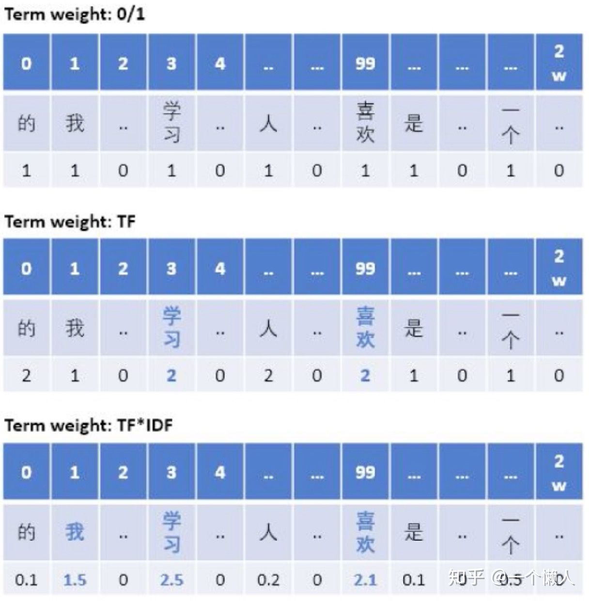
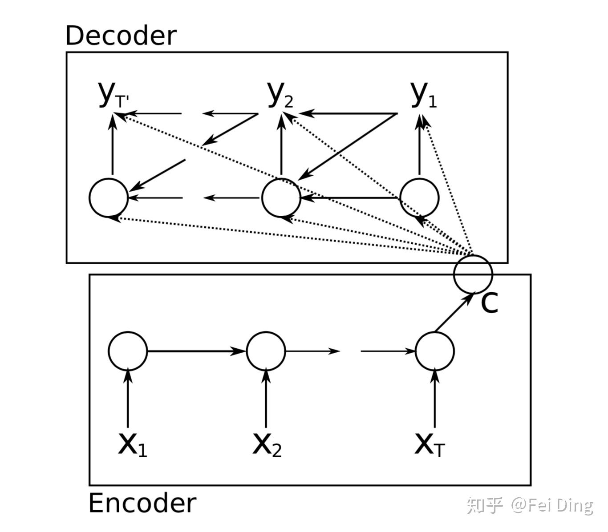
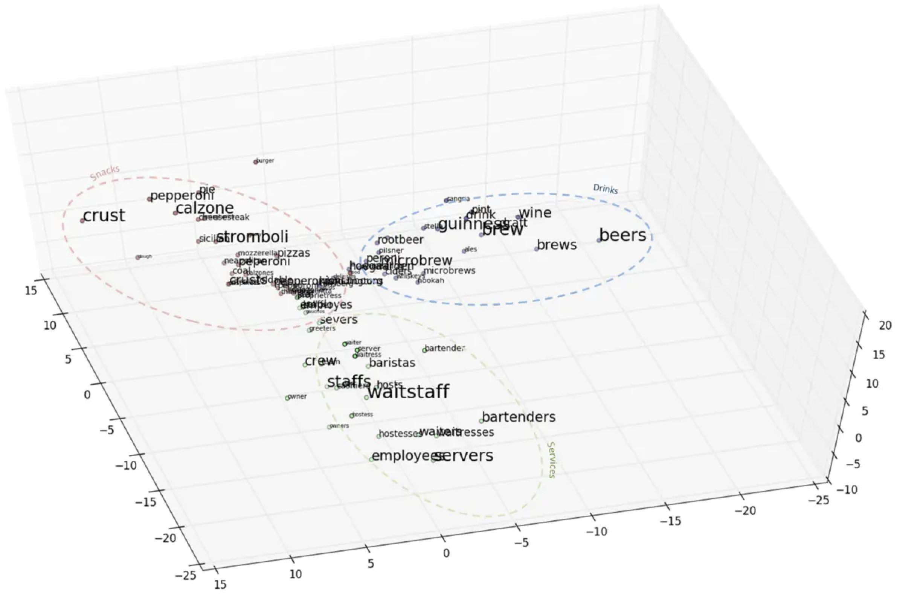
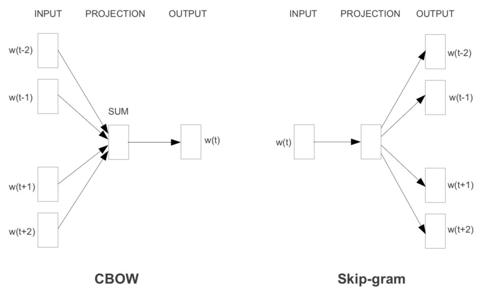
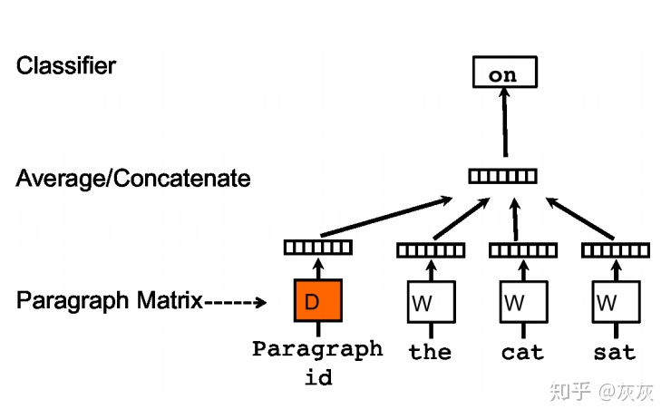
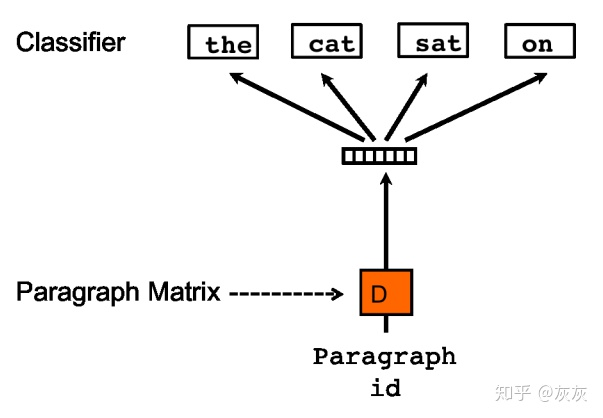
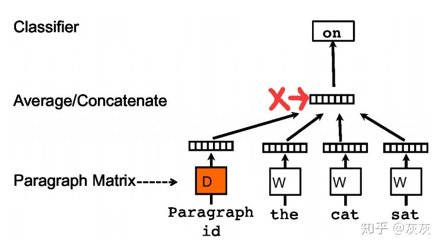

## TF-IDF

[TF-IDF与余弦相似度](https://zhuanlan.zhihu.com/p/32826433) 

> 在文本挖掘的预处理中，向量化之后一般都伴随着TF-IDF的处理，那么什么是TF-IDF，为什么一般我们要加这一步预处理呢？这里就对TF-IDF的原理做一个总结。

注：NLP处理步骤: 1.分词（代表：jieba)----2.向量化(包括字符向量化、词向量化、拼音向量化、词性向量化等，代表：word2vec,glove)----3.进一步分析 

**文本向量化特征的不足**

在将文本分词并向量化后，我们可以得到词汇表中每个词在各个文本中形成的词向量，我们将下面4个短文本做了词频统计：

```python
corpus=["I come to China to travel", 
        "This is a car polupar in China",          
        "I love tea and Apple ",   
        "The work is to write some papers in science"] 

#不考虑停用词，处理后得到的词向量如下：

[[0 0 0 1 1 0 0 0 0 0 0 0 0 0 0 2 1 0 0]
 [0 0 1 1 0 1 1 0 0 1 0 0 0 0 1 0 0 0 0]
 [1 1 0 0 0 0 0 1 0 0 0 0 1 0 0 0 0 0 0]
 [0 0 0 0 0 1 1 0 1 0 1 1 0 1 0 1 0 1 1]]
```

如果我们直接将统计词频后的19维特征做为文本分类的输入，会发现有一些问题。比如第一个文本，我们发现"come","China"和“Travel”各出现1次，而“to“出现了两次。似乎看起来这个文本与”to“这个特征更关系紧密。但是实际上”to“是一个非常普遍的词，几乎所有的文本都会用到，因此虽然它的词频为2，但是重要性却比词频为1的"China"和“Travel”要低的多。如果我们的向量化特征仅仅用词频表示就无法反应这一点。因此我们需要进一步的预处理来反应文本的这个特征，而这个预处理就是TF-IDF。


### 原理

> TF-IDF(term frequency=inverse document frequency)是⼀种⽤于**资讯检索与文本挖掘**的常⽤**加权技术**。TF-IDF是⼀种统计方法，⽤以评估⼀字词对于⼀个文件集或⼀个语料库中的其中⼀份⽂件的重要程度。**字词的重要性随着它在⽂件中出现的次数成正比增加，但同时会随着它在语料库中出现的频率成反比下降**。TF-IDF加权的各种形式常备搜索引擎应⽤，作为文件与用户查询之间相关程度的度量或评级。

设想现在我们正在阅读新闻，如何最快速的了解新闻的主旨？毫无疑问--关键词。TF-IDF就具有这样的能力：**提取关键词**。

**1.1 TF**

假设⼀个词在一篇文章中出现的次数越多，那么它就越“紧扣主题”。以本文为例，我们可以统计词频(TF)，不难发现“TF-IDF”,“应用”、“原理”是出现频率很高的词，后文称keywords。这符合我们的假设，但是有些词却出现的次数更多，如：的、是、有等。这类词语没有明确意义，我们称为停顿词(Stopwords)。 如果单纯按照词频算关键词，你会发现几乎所有的文章都是stopwords的词频最高。换句话说， 像这种”万金油”，是没有区分度的词语，不能很好的起到将文章分类的作用。

此外，抛开停用词，如果该文档中的几个词出现的频率一样，也不意味着，作为关键词，它们的重要性是一致的。比如这篇⽂文档中，“TF-IDF”、“意义”、“文档”这三个词的词频出现的次数一样多，但因为“意义”是很常见的词，相对而言，“TF-IDF”、“文档”不那么常见。即使它们的词频一样，我们也有理由认为，“TF-IDF”和“文档”的重要性大于“意义”，也就是使，在关键词排序上，“TF-IDF”和“文档”也应该排在“意义”的前面。

所以，我们需要一个重要性调整系数，衡量一个词是不是常见词。如果某个词比较少见，但是它在这篇文章中多次出现，那么它很可能就反映了这篇文章的特性，正是我们所需要的关键词。这时就需要祭出逆文档频率(IDF)来解决词语权重的问题。

**1.2 IDF**

⽤用统计学语言表达，就是在词频的基础上，要对每个词分配一个“重要性”权重。最常见的词 （"的"、"是"、"在"）给予最小的权重，较常见的词（"中国"）给予较小的权重，较少见的词 （"蜜蜂"、"养殖"）给予较大的权重。这个权重叫做"逆⽂档频率"（Inverse Document Frequency，缩写为IDF），它的大小与一个词的常见程度成反比。 

知道了"词频"（TF）和"逆文档频率"（IDF）以后，将这两个值相乘，就得到了一个词的TF-IDF 值。某个词对文章的重要性越高，它的TF-IDF值就越大。所以，排在最前面的几个词，就是这篇文章的关键词。

**1.3 公式化表示**

对于在某一特定文件里的词语来说，它的重要性可表示为：
$$
T F_{i, j}=\frac{n_{i, j}}{\sum_{k} n_{k, j}}
$$

$$
\text { 词频 }(\mathrm{TF})=\frac{\text { 某个词在文章中的出现次数 }}{\text { 文章的总词数 }}
$$

以上式子中是该词在文件中的出现次数而分母则是在文件中所有字词的出现次数之和。

逆向文件频率（inverse document frequency，idf）是一个词语普遍重要性的度量。某一特定词语的idf，可以由总文件数目除以包含该词语之文件的数目，再将得到的商取对数得到：
$$
I D F_{i}=\log \frac{|D|}{\left|j: t_{i} \in d_{j}\right|}
$$

$$
逆文档频率 $(\mathrm{IDF})=\log \left(\frac{\text { 语料库的文档总数 }}{\text { 包今该词的文档数 }+1}\right)
$$

其中： 

$|D|$：语料库中的文件总数

$\left|j: t_{i} \in d_{j}\right|$：包含词语的文件数目（即$n_{i, j} \neq 0$的文件数目）如果该词语不在语料库中， 就会导致分母为零，因此一般情况下使用$1+\left|j: t_{j} \in d_{j}\right|$。如果一个词越常见，那么分母就越大，逆向文件频率就越小越接近0。log表示对得到的值取对数。

然后：
$$
T F-I D F=T F_{i, j} \times I D F_{i}
$$
某一特定文件内的高词语频率，以及该词语在整个文件集合中的低文件频率，可以产生出⾼高权重的tf-idf。因此，tf-idf倾向于过滤掉常见的词语，保留重要的词语。

**1.4 应用**

我们通过Google搜索结果数为例，将含有中文“的”结果数15.8亿作为整个语料库大小，计算一些关键词和停用词的TF-IDF值。为了计算简便，假设全文分词后一共500词，则结果如下：
$$
\begin{array}{|l|l|c|c|c|} 
\hline & {\text { 包含该词的文章(百万) }} & \text { IDF } & \text { TF } & \text { TF-IDF } \\
\hline \text { TF-IDF } & 0.497 & 3.502 & 0.018 & 0.063 \\
\hline \text { 原理 } & 24.4 & 1.811 & 0.008 & 0.014 \\
\hline \text { 应用 } & 82.8 & 1.280 & 0.008 & 0.010 \\
\hline \text { 是 } & 363 & 0.638 & 0.028 & 0.018 \\
\hline \text { 有 } & 482 & 0.515 & 0.026 & 0.013 \\
\hline \text { 的 } & 1580 & 0.000 & 0.008 & 0.000 \\
\hline
\end{array}
$$
TF-IDF的优点是计算简单，利于理解，性价比极高。但是它也有缺陷，首先单纯依据文章中的TF来衡重要性，忽略了位置信息。如段⾸首，句首一般权重更高；其次，有的文章可能关键词只出现1-2次，但可能通篇都是围绕其进行阐述和解释，所以单纯靠TF仍然不能解决所有的情况。

**1.5 用scikit-learn进行TF-IDF预处理**

在scikit-learn中，有两种方法进行TF-IDF的预处理。

- 第一种方法是在用CountVectorizer类向量化之后再调用TfidfTransformer类进行预处理。

- 第二种方法是直接用TfidfVectorizer完成向量化与TF-IDF预处理。

首先我们来看第一种方法，CountVectorizer+TfidfTransformer的组合，代码如下：

```python
from sklearn.feature_extraction.text import TfidfTransformer  
from sklearn.feature_extraction.text import CountVectorizer  

corpus = ["I come to China to travel", 
          "This is a car polupar in China", 
          "I love tea and Apple ", 
          "The work is to write some papers in science"] 

vectorizer = CountVectorizer()

transformer = TfidfTransformer()
tfidf = transformer.fit_transform(vectorizer.fit_transform(corpus))  
print(tfidf)
```

第二种方法，现在我们用TfidfVectorizer一步到位，代码如下：

```python
from sklearn.feature_extraction.text import TfidfVectorizer
tfidf2 = TfidfVectorizer()
re = tfidf2.fit_transform(corpus)
print(re)
```

输出的各个文本各个词的TF-IDF值和第一种的输出完全相同。大家可以自己去验证一下。

由于第二种方法比较的简洁，因此在实际应用中推荐使用，一步到位完成向量化，TF-IDF与标准化。


### 余弦定律

余弦相似性通过测量两个向量的夹角的余弦值来度量它们之间的相似性。0度角的余弦值是1，而其他任何角度的余弦值都不大于1；并且其最小值是-1。从而两个向量之间的角度的余弦值确定两个向量是否大致指向相同的方向。两个向量有相同的指向时，余弦相似度的值为1；两个向量夹角为90°时，余弦相似度的值为0；两个向量指向完全相反的方向时，余弦相似度的值为-1。这 结果是与向量的长度无关的，仅与向量的指向方向相关。余弦相似度通常用于正空间，因此给出的值为0到1之间。

注意这上下界对任何维度的向量空间中都适用，而且余弦相似性最常用于高维正空间。例如在信息检索中，每个词项被赋予不同的维度，而一个文档由一个向量表示，其各个维度上的值对应于该词项在文档中出现的频率。余弦相似度因此可以给出两篇文档在其主题方面的相似度。

两个向量间的余弦值可以通过使用欧几里得点积公式求出：
$$
a \cdot b=|a| \cdot|b| \cos \theta
$$
给定两个属性向量和 ，其余相似性由点积和向量长度给出，如下所示：
$$
\text { similarity }=\cos (\theta)=\frac{A \cdot B}{|A||B|}=\frac{\sum_{i=1}^{n} A_{i} \times B_{i}}{\sqrt{\sum_{i=1}^{n}\left(A_{i}\right)^{2}} \times \sqrt{\sum_{i=1}^{n}\left(B_{i}\right)^{2}}}
$$
这里的$A_i$和$B_i$分别代表向量$A$和$B$的各分量。

给出的相似性范围从-1到1：

- -1意味着两个向量指向的方向正好截然相反
- 1表示它们的指向是完全相同的
- 0通常表示它们之间是独立的

而在这之间的值则表示中间的相似性或相异性。 对于文本匹配，属性向量$A$和$B$通常是文档中的词频向量。余弦相似性，可以被看作是在比较过程中把文件长度正规化的方法。

在信息检索的情况下，由于一个词的频率（TF-IDF权）不能为负数，所以这两个⽂文档的余弦相似性范围从0到1。并且，两个词的频率向量之间的角度不能大于90°。

由此，我们就得到了“找出相似文章”的一种算法：

1. 使⽤用TF-IDF算法，找出两篇文章的关键词；
2. 每篇文章各取出若干个关键词（比如20个），合并成一个集合，计算每篇文章对于这个集合中的词的词频（为了避免文章长度的差异，可以使用相对词频）；
3. 生成两篇文章各自的词频向量；
4. 计算两个向量的余弦相似度，值越大就表示越相似。

“余弦相似度”是一种非常有用的算法，只要是计算两个向量的相似程度，都可以采用它。


## 词袋模型BoW应用

> BoW和TF-IDF以及Word2vec的关系是啥？
>
> word2vec考虑了词序，尤其是word2vec的CBOW考虑了通过上下文预测中心词汇，不过word2vec是局部特征多一些。而BOW和TF-IDF都是侧重于词频概率，不考虑顺序。

### 词袋模型 Bag-of-words

BoW(Bag-of-words) 词袋模型是n-gram语法模型的特例1元模型。

该模型**忽略掉文本的语法和语序等要素，将其仅仅看作是若干个词汇的集合，文档中每个单词的出现都是独立的**。BoW使用一组无序的单词(words)来表达一段文字或一个文档。将所有词语装进一个袋子里，**不考虑其词法和语序**的问题，即**每个词语都是独立的**，就可以构成一个词袋。


下面给出两个简单的文本文档如下：

> John likes to watch movies. Mary likes too.
> John also likes to watch football games.

基于上述两个文档中出现的单词，构建如下一个词典 (dictionary)：

> {"John": 1, "likes": 2,"to": 3, "watch": 4, "movies": 5,"also": 6, "football": 7, "games": 8,"Mary": 9, "too": 10}

上面的词典中包含10个单词, 每个单词有唯一的索引, 那么每个文本我们可以使用一个10维的向量来表示。对应的下标与映射数组的下标相匹配，其值为该词语出现的次数。如下：

> [1, 2, 1, 1, 1, 0, 0, 0, 1, 1]
> [1, 1, 1, 1, 0, 1, 1, 1, 0, 0]

向量的维度根据词典中不重复词的个数确定

**向量中每个元素顺序与原来文本中单词出现的顺序没有关系,与词典中的顺序一一对应**

**向量中每个数字是词典中每个单词在文本中出现的频率---即词频表示**


### 词袋模型的实现方式

以句子“我是一个喜欢学习的人，喜欢学习的人”为例，如图所示



第一种形式是：只要在词典中出现的词，无论出现多少次，在BOW向量中都只算成1次，未出现的词算0次,然后根据词典构造只有0/1的向量。

```python
from sklearn.feature_extraction.text import CountVectorizer
vectorizer = CountVectorizer(binary=True)
```

特点：只强调了出现词与未出现词的差异(在有些短文本分类中可能会表现很好)，对于出现词之间的差异未体现

改进方式：采用第二种方式的词频向量

第二种形式是：只要在词典中出现的词，出现多少次就算成多少次，未出现的词算0次，然后根据词典构造向量

代码实现：

```python
from sklearn.feature_extraction.text import CountVectorizer
vectorizer = CountVectorizer()
```

可能会出现的问题：长文本比短文本对每个单词有更高的出现次数，尽管他们可能在描述同一个主题，用单词计数会有偏差

改进方式：采用第三种方式的词频向量

第三种形式是：各文档中每个单词的出现次数除以该文档中所有单词的总数，也可以**对词频进行归一化**来降低这种影响

代码实现：

```python
from sklearn.feature_extraction.text import TfidfVectorizer
vectorizer = TfidfVectorizer(norm='l2', use_idf=False, sublinear_tf=True)
```

又出现新的问题：某些常用词在很多文章中都出现，如“我,的,是,中国,因为”等，这些高频词对表现文章主题无多大贡献，相反一些低频词如“蜜蜂，养殖，机床”等更能反映一篇文档的主题

改进方式：采用第四种方式的词频向量

第四种形式：

1. 去停用词：**可去掉一些无用的高频词** 

2. **在词频的基础上，给每个词分配一个权重(降低常用词的影响)**，训练集中很多文档中均出现的词(比如'中国')给予较小权重，只在很少文档中出现的词(比如"蜜蜂"、"养殖')给予较大权重，这个权重叫逆文档频率 idf（Inverse Document Frequency）

词频与权重相乘得到 tf–idf ，某个词对文章的重要性越高，它的TF-IDF值就越大。对应上图第三种方式

代码实现：

```python
from sklearn.feature_extraction.text import TfidfVectorizer
vectorizer = TfidfVectorizer(stop_words=['你','我','它'],max_df=0.9, use_idf=True, sublinear_tf=True, smooth_idf=True)
# 注意：中文一般在外部去完停用词再用TfidfVectorizer，max_df参数可以辅助去除部分不在停用词表中的无用高频词
```

### 第五种改进方式

又出现新的问题：

如果文档很多，整个文集中不同单词的数量非常大，而单个文档使用的单词数量远远少于总体词袋单词个数。tf-idf向量维度会非常大而且每个向量中大多数的值为 0 。此时词袋模型得到的向量是高维稀疏数据。

注意：tf–idf不会减小向量维度，也不会减少向量中0的个数，只是将词的重要性（之前是出现次数表示特征重要性大小）以一种更合理的方式重新计算了

改进方式：**采用词的分布式表示**，如**Word2Vec**,Glove等

代码实现(以Word2Vec为例)：

```python
from gensim.models import Word2Vec
# 引入数据集 
raw_sentences = ["the quick brown fox jumps over the lazy dogs", "yoyoyo you go home now to sleep"]
# 切分词汇,变为list of list格式 
sentences= [s.encode('utf-8').split() for s in sentences]
# 构建模型 
model = Word2Vec(sentences, min_count=1)
```

又出现新的问题：

word2vec更多学到的是具备相似上下文的词，学习的向量和真正语义还有差距。比如 “他的技术水平很好”，“他的技术水平很差”相似度也很高。

改进方式：不在此篇讨论范围


### 词袋模型实战 ⭐️

**加载训练集、测试集**

```python
from sklearn import datasets
twenty_train = datasets.load_files("./data/20news-bydate/20news-bydate-train")
twenty_test = datasets.load_files("./data/20news-bydate/20news-bydate-test")
```

API解释

> `sklearn.datasets.load_files(container_path, description=None, categories=None, load_content=True, shuffle=True, encoding=None, decode_error='strict', random_state=0)`
> \- container_path: container_folder的路径；
> \- load_content = True: 是否把文件中的内容加载到内存；
> \- encoding = None: 编码方式。当前文本文件的编码方式一般为“utf-8”，如果不指明编码方式（encoding=None），那么文件内容将会按照bytes处理，而不是unicode处理。
> 返回值：Bunch Dictionary-like object.主要属性有
> \- data: 原始数据；
> \- filenames: 每个文件的名字；
> \- target: 类别标签（从0开始的整数索引）；
> \- target_names: 类别标签的具体含义（由子文件夹的名字category_1_folder等决定）

#### 将文本文件变成数字的特征表示(词袋模型)

*1)使用CountVectorizer构建词频向量*

CountVectorizer 支持单词或者连续字符的 N-gram 模型的计数,利用scipy.sparse 矩阵只在内存中保存特征向量中非 0元素位置以节省内存

```python
from sklearn.feature_extraction.text import CountVectorizer
count_vect = CountVectorizer(stop_words="english",decode_error='ignore')  # 创建词频转换器
X_train_counts = count_vect.fit_transform(twenty_train.data)  # 转换训练集
X_train_counts.shape
```

*2)转化为TF-IDF特征向量*

用TfidfTransformer将词频向量转为Tfidf形式

```python
from sklearn.feature_extraction.text import TfidfTransformer
tfidf_transformer = TfidfTransformer()
X_train_tfidf = tfidf_transformer.fit_transform(X_train_counts)
X_train_tfidf.shape

(2257, 35788)  # 2257个文档,35788个不重复词
```

#### 分类器训练

*朴素贝叶斯*

**1-正常流程** 

```python
from sklearn.naive_bayes import MultinomialNB
clf = MultinomialNB()
clf.fit(X_train_tfidf, twenty_train.target)
docs_new = ['God is love','OpenGL on the GPU is fast']
X_new_counts = count_vect.transform(docs_new)  #计算词频
X_new_tfidf = tfidf_transformer.transform(X_new_counts)  #计算TF-IDF
y_pred = clf.predict(X_new_tfidf)
for doc, category in zip(docs_new, y_pred):  #category是数字
    print(("%r => %s")%(doc, twenty_train.target_names[category]))
# 结果
# 'God is love' => soc.religion.christian
# 'OpenGL on the GPU is fast' => comp.graphics
```

**2-使用管道流水化**

使用管道后，测试集不用一步步重复训练集的预处理，直接管道处理了

```python
from sklearn.pipeline import Pipeline
text_clf = Pipeline([
  ('vect',CountVectorizer(stop_words="english",decode_error='ignore')),
  ('tfidf',TfidfTransformer()),
  ('clf',MultinomialNB()),])
text_clf = text_clf.fit(twenty_train.data,twenty_train.target)  #训练集
text_clf.score(twenty_test.data, twenty_test.target)  #测试集
# 0.81691449814126393  # 朴素贝叶斯的分类准确率
```

*线性核SVM*

大数据量下用SGDClassifier形式的SVC

```python
from sklearn.linear_model import SGDClassifier
from sklearn import metrics

text_clf_2 = Pipeline([('vect', CountVectorizer(stop_words='english',decode_error='ignore')), #去停用词
                      ('tfidf', TfidfTransformer()),
                      ('clf',SGDClassifier(loss = 'hinge', penalty = 'l2', alpha = 1e-3, max_iter = 5, random_state = 42)),
                      ])
text_clf_2.fit(twenty_train.data, twenty_train.target)
# text_clf_2.score(twenty_test.data, twenty_test.target)
y_pred = text_clf_2.predict(twenty_test.data)
metrics.accuracy_score(twenty_test.target, y_pred)

# 结果
0.82355284121083383  # 准确率有所提升 
```

#### report报告

各类别的精确度，召回率，F值等

```python
print(metrics.classification_report(twenty_test.target, y_pred, target_names = twenty_test.target_names))  # 要加print
```

$$
\begin{array}{rccccc} 
& \text { precision } & \text { recall fl-score } & \text { support } \\
\text { alt. atheism } & 0.71 & 0.71 & 0.71 & 319 \\
\text { comp. graphics } & 0.81 & 0.69 & 0.74 & 389 \\
\text { comp. os. ms-windows.misc } & 0.72 & 0.79 & 0.75 & 394 \\
\text { comp. sys. ibm. pc. hardware } & 0.72 & 0.66 & 0.69 & 392 \\
\text { comp. sys. mac. hardware } & 0.82 & 0.83 & 0.82 & 385 \\
\text { comp. windows. x } & 0.86 & 0.77 & 0.81 & 395 \\
\text { misc. forsale } & 0.81 & 0.87 & 0.84 & 390 \\
\text { rec. autos } & 0.91 & 0.90 & 0.90 & 396 \\
\text { rec. motorcycles } & 0.93 & 0.97 & 0.95 & 398 \\
\text { rec. sport. baseball } & 0.89 & 0.91 & 0.90 & 397 \\
\text { rec. sport. hockey } & 0.87 & 0.98 & 0.92 & 399 \\
\text { sci. crypt } & 0.85 & 0.96 & 0.90 & 396 \\
\text { sci. electronics } & 0.80 & 0.63 & 0.70 & 393 \\
\text { sci.med } & 0.90 & 0.86 & 0.88 & 396 \\
\text { sci. space } & 0.84 & 0.96 & 0.90 & 394 \\
\text { talk. politics. guns } & 0.70 & 0.93 & 0.80 & 364 \\
\text { talk. politics. misc } & 0.89 & 0.56 & 0.69 & 310 \\
\text { talk.religion. misc } & 0.81 & 0.39 & 0.53 & 251 \\
\\
\text { avg t total } & 0.83 & 0.82 & 0.82 & 7532
\end{array}
$$

#### 画混淆矩阵

```python
print(metrics.confusion_matrix(twenty_test.target, y_pred))
```

**网格搜索进行超参数优化**

> CountVectorizer()中的n-gram
> TfidfTransformer()中的use_idf
> SGClassifier()中的惩罚系数alpha

```python
from sklearn.model_selection import GridSearchCV
parameters = {
            'vect__ngram_range':[(1,1), (1,2)],
             'tfidf__use_idf':(True, False),
             'clf__alpha':(1e-2, 1e-3)
             }
# text_clf_2: SVC的pipeline,n_jobs=-1, 5折交叉验证
gs_clf = GridSearchCV(text_clf_2, parameters, n_jobs = -1, cv=5)  
grid_result = gs_clf.fit(twenty_train.data, twenty_train.target)
print("Best: %f \nusing %s" % (grid_result.best_score_, grid_result.best_params_)) # best_params_：<class 'dict'>

Best: 0.906399 
using {'tfidf__use_idf': True,  'vect__ngram_range': (1, 2),  'clf__alpha': 0.01}
```

#### 随机搜索进行超参数优化

```python
from sklearn.model_selection import RandomizedSearchCV
import numpy as np
parameters = {
            'vect__ngram_range':[(1,1),(1,2),(2,2)],
             'tfidf__use_idf':(True,False),
             'clf__alpha':(1e-1,1e-2,1e-3,1e-4,1e-5)
             }
rs_clf = RandomizedSearchCV(text_clf_2, parameters,n_jobs = -1, cv=5)
rs_result = rs_clf.fit(twenty_train.data, twenty_train.target)
print("Best: %f \nusing %s" % (rs_result.best_score_, rs_result.best_params_))

Best: 0.924783 
using {'clf__alpha': 1e-05, 'tfidf__use_idf': True, 'vect__ngram_range': (1, 2)}
```

#### 网格搜索增加超参数

已确定TfidfTransformer里的参数use_idf=True会更好。

**增加**：

> CountVectorizer里的max_df： 按 比例 或 绝对数量 删除df超过max_df的词
> CountVectorizer里的max_features: 选择tf最大的max_features个特征
> TfidfTransformer里的norm：数据标准化
> SGDClassifier里的penalty：惩罚项
> SGDClassifier里的n_iter：迭代次数

**重要的参数**：

> clf\__alpha
> clf\__penalty
> vect\__max_df
> vect\__ngram_range

超参数中，带#的可以不调

```python
from sklearn.model_selection import GridSearchCV
from sklearn.linear_model import SGDClassifier
from sklearn.pipeline import Pipeline

text_clf_3 = Pipeline([
    ('vect', CountVectorizer()),
    ('tfidf', TfidfTransformer()),
    ('clf', SGDClassifier()), 
]) 

parameters = {
    'vect__max_df': (0.5, 0.75, 1.0),
    'vect__max_features': (None, 10000, 50000,60000),  #
    'vect__ngram_range': [(1, 1), (1, 2),(2,2)],  
    'tfidf__norm': ('l1', 'l2'), #
    'clf__alpha': (0.0001, 0.00001, 0.000001,0.0000001),
    'clf__penalty': ('l2', 'elasticnet'),
    'clf__max_iter': (10, 50, 80),  #
}
# text_clf_2: SVC的pipeline,n_jobs=-1，5折交叉验证
gs_clf = GridSearchCV(text_clf_3, parameters, n_jobs = -1, cv=5) 
grid_result = gs_clf.fit(twenty_train.data, twenty_train.target)
print("Best: %f \nusing %s" % (grid_result.best_score_, grid_result.best_params_))
```

```python
Best: 0.931766 
using {'vect__ngram_range': (1, 2), 'clf__alpha': 1e-07, 'vect__max_df': 0.75, 'vect__max_features': None, 'clf__n_iter': 50, 'clf__penalty': 'elasticnet', 'tfidf__norm': 'l1'
```


## 什么是表示学习 Representation Learning?

机器学习算法的work与否不仅仅取决于算法的正确选用，也取决于数据的质量和有效的表示（representation）。针对不同类型的数据（text，image，video），不同的表示可能会导致有效信息的缺失或是曝露，这决定了算法能否有效地解决问题。

表征学习的目的是对复杂的原始数据化繁为简，**把原始数据的无效的或者冗余的信息剔除，把有效信息进行提炼，形成特征**（feature）。

特征提取可以人为地手工处理，也可以**借助特定的算法自动提取**。Roughly Speaking， 前者为特征工程，后者为**表征学习**（Representation Learning）。如果数据量较小，我们可以根据自身的经验和先验知识，人为地设计出合适的特征，用作下游的任务，比如分类；但数据量很大且复杂时，则需要依赖自动化的表征学习。

表征学习同样在人工智能领域有着相当重要的地位。 我们已经知道人类的信息处理过程与长期记忆和短期记忆密切相关。短期记忆是短期存储的记忆，长期记忆就是我们大脑中长期存储的知识，就像在图书馆中存储的海量文献。根据这个简单的信息处理模型，再加上计算机更快的计算速度和海量的存储空间，人工智能应该比人类更为强大才是。但至少到目前，我们看到的情况并非如此。这其中一个重要的原因就是我们还未能破解人类大脑究竟是如何对数据进行编码，和对知识进行存储的。

处理外界信息的第一步就是要将其编码，投影到某一空间。比如说，当人类仅需要几个例子就可以区分猫和狗的不同，而机器却需要大量数据训练时，我们不由得想要探寻：人类是如何对图像进行编码的？他提取了哪些特征可以通过少量样本进行学习？为什么人类学习的知识更灵活，可以在更多方面应用，而机器学习的模型通用性往往很差？这正是**表征学习探索的关注点：寻找对数据更好的表示方式**。

机器学习方法的效果非常依赖于数据的表示（或称为特征）的选择。表征学习领域一直关注如何更好地学习到有意义的、优越的数据表示方法。

Bengio为表征学习下的定义是：

> learning representations of the data that make it easier to extract useful information when building classifiers or other predictors

从该定义可以看出，**表征学习需要和下游的任务比如分类放在一起考虑**，这一点对如何评价表征学习的性能也是至关重要的。这是因为如何客观地评价一个表征的好坏是困难的，因为距离我们最终学习的目标还隔着分类器等其他机器学习的任务。

> AI must fundamentally understand the world around us, and we argue that this can only be achieved if it can learn to identify and disentangle the underlying explanatory factors hidden in the observed milieu of low-level sensory data.

为了获得一个好的表征，构建模型的时候需要正确考虑一些对不同目标通用的先验知识，但如何将这些先验形式化为一种评价准则仍然是一个开放的问题。比如Bengio的文章中列出了一部分的先验如下：

1. Smoothness：记待估计的表征函数为f，x≈y→f(x)≈f(y)；仅仅依靠对目标函数的光滑性假设做估计，就要求数据尽可能覆盖目标函数的空间。
2. Multiple explanatory factors：数据由不同的解释性因子决定，这些因子之间应该尽量解耦（disentangle），该先验催生了近期以VAE为首的研究热点。
3. Hierarchical organization of explanatory factors：越抽象的概念在越高层，这是与我们对周围的世界的描述是相符的。
4. Semi-supervised learning：表征在无监督和有监督学习中可以起到共享统计优势的作用。
5. Shared factors across tasks：学习到的表征可以不同的任务中都有效；如Multi-Task， Transfer Learning 和 Domain Adaptation。
6. Manifolds：表征应该满足高维空间中的低维流形特点，简单来说，表征聚集在维数远低于原始空间的流形， 如Auto-Encoder。
7. Natural clustering：不同类的数据分布在分散的流形上，并且不同类的数据的线性插值处在低密度区域。
8. Temporal and spatial coherence：对于sequence中连续或者是空间上接近的观察倾向于在类别概念具有相同的值，或者是仅仅在流形上有微小变化。
9. Sparsity：稀疏的表征，即大部分特征都是0，或者在观测数据上的微小扰动对大部分特征是没影响的。可通过非线性操作（强制为0），惩罚梯度的Jacobian等实现。
10. Simplicity of factor dependencies：good high-level representations，因子间的依赖关系简单，典型的是线性依赖，比如很多物理学定律。


根据不同的数据类型，主要可分为如下几个研究部分：

### Text的表征学习

**词向量Word2vec**

NLP (自然语言处理)中最细粒度的是 词语，词语组成句子，句子再组成段落、文档。那么如何有效地表征词语，即word embedding需要解决的问题。神经网络词向量 Word2vec的核心是**上下文的表示以及上下文与目标词之间的关系的建模**。构建上下文与目标 词之间的关系，最自然的一种思路就是使用语言模型。从历史上看，早期的词向量只是神经网络语言模型的副产品。

**Sequence的表征**

比如经典的seq2seq模型：



encoder将输入序列编码为句向量$c$，然后到进行decoder进行解码。

然而仅仅word进行充分而强大的encoding（包含非常精准丰富的特征）并不够很好地解决所有NLP任务， 比如在QA、自然语言推理（NLI）、对话等任务中，有更加复杂的句间关系需要考虑。如果只针对一个下游任务来设计网络结构的话，将会导致同一个模型，换个不同的task就不work了。此时，Google的Bidirectional Encoder Representations from Transformers (BERT)（GPT其实原理也差不多）开辟了新的方向，为多个NLP任务在考虑词级，句子级别和句间关系的情况下pretrain一个通用的模型，在获取该表征之后，只需要在不同的NLP任务中添加一个轻量级的输出层，如单层MLP，即可。


### Image的表征学习

代表的算法大致可分为三个研究方向：

- **监督学习 Supervised learning**，需要大量的标注数据来训练神经网络模型，利用模型的预测和数据的真实标签的cross-entropy损失进行反向传播，完成模型训练之后，移除最后一层fc层，把模型的输出作为数据的Representation。
- **无监督学习 Unsupervised learning**，如主成分分析(PCA)及自编码器（Autoencoder）通过对输入数据进行维度压缩，从而抛弃和合并冗余的信息，选择出最关键的浓缩信息。
- **自监督学习 Self-Supervised Learning**，利用大规模的无标注的数据，选择合适的辅助任务（pretext）和自身的监督信号，通过这种构造的监督信号对网络进行训练，从而可以学习到对下游任务有价值的Representation。

> 无监督表示学习方法，是指在不存在人工标注信息的数据下，通过学习提取出图像内在的representation。
>
> 这个representation又是什么呢？简单理解就是分类、分割、检测等任务Encoder后获取到feature map，类似于元学习和mutitask中学到的一个公有特征，只要学好了这个公有特征，那么根据具体的任务，具体的数据，只需要稍加迁移，就能够在目标数据目标任务中有着姣好的表现。
>
> 所以说它的优势也体现在两点：
>
> 1. 更快，具体的下游任务是在学习好的representation的基础上进行的，而不是从头开始训练；更准，表示学习是在大数据集上进行的，能够从更多的数据学习到图像的representation，相对于目标域数据的规模，大数据是优势。
> 2. 泛化性好，同样是由于表示学习的数据集由于没有人工标注，所以首先可以做到很大，其次类别也不受人工标注的限制，更接近从自然世界学习特征，任何目标域的数据都不存在严重的domain gap。


## word2vec ⭐️

[[NLP] 秒懂词向量Word2vec的本质](https://zhuanlan.zhihu.com/p/26306795) 

> 1. Xin Rong 的论文：『word2vec Parameter Learning Explained』：
>    ！重点推荐！
>    理论完备由浅入深非常好懂，且直击要害，既有 high-level 的 intuition 的解释，也有细节的推导过程
>    一定要看这篇paper！一定要看这篇paper！一定要看这篇paper！
> 2. 来斯惟的博士论文[『基于神经网络的词和文档语义向量表示方法研究』](https://arxiv.org/pdf/1611.05962.pdf)以及他的博客（网名：licstar）可以作为更深入全面的扩展阅读，这里不仅仅有 word2vec，而是把词嵌入的所有主流方法通通梳理了一遍。
> 3. 几位大牛在知乎的回答：『word2vec 相比之前的 Word Embedding 方法好在什么地方？』
>    刘知远、邱锡鹏、李韶华等知名学者从不同角度发表对 Word2vec 的看法，非常值得一看

学习目标

1. 提纲挈领地讲解 word2vec 的理论精髓
2. 学会用gensim训练词向量，并寻找相似词


### 什么是 Word2Vec

在聊 Word2vec 之前，先聊聊 NLP (自然语言处理)。NLP 里面，最细粒度的是词语，词语组成句子，句子再组成段落、篇章、文档。所以处理 NLP 的问题，首先就要拿词语开刀。

举个简单例子，判断一个词的词性，是动词还是名词。用机器学习的思路，我们有一系列样本(x,y)，这里 x 是词语，y 是它们的词性，我们要构建 f(x)->y 的映射，但这里的数学模型 f（比如神经网络、SVM）只接受数值型输入，而 NLP 里的词语，是人类的抽象总结，是符号形式的（比如中文、英文、拉丁文等等），所以需要把它们转换成数值形式，或者说**把词语嵌入到一个数学空间里，这种嵌入方式，就叫词嵌入（word embedding)，而 Word2Vec就是词嵌入（ word embedding) 的一种**。

大部分的有监督机器学习模型，都可以归结为：

> f(x)->y

在 NLP 中，把 x 看做一个句子里的一个词语，y 是这个词语的上下文词语，那么这里的 f，便是 NLP 中经常出现的『语言模型』（language model）。这个模型的目的，就是判断 (x,y) 这个样本，是否符合自然语言的法则，更通俗点说就是：词语x和词语y放在一起，是不是人话。

Word2vec 正是来源于这个思想，但它的最终目的，不是要把 f 训练得多么完美，而是只关心模型训练完后的副产物——模型参数（这里**特指神经网络的权重**），并将这些参数，作为输入 x 的某种向量化的表示，这个向量便叫做——词向量（这里看不懂没关系，下一节我们详细剖析）。

我们来看个例子，如何用 Word2vec 寻找相似词：

- 对于一句话：『她们 夸 吴彦祖 帅 到 没朋友』，如果输入 x 是『吴彦祖』，那么 y 可以是『她们』、『夸』、『帅』、『没朋友』这些词
- 现有另一句话：『她们 夸 我 帅 到 没朋友』，如果输入 x 是『我』，那么不难发现，这里的上下文 y 跟上面一句话一样
- 从而 f(吴彦祖) = f(我) = y，所以大数据告诉我们：我 = 吴彦祖（完美的结论）

顾名思义，Word2Vec就是把单词转换成向量。它本质上是一种单词聚类的方法，是实现单词语义推测、句子情感分析等目的一种手段。

选取训练后的单词向量的其中任意3个维度，放到坐标系中展示，会发现语义相似的词汇在空间坐标中的位置会十分接近，而语义无关的词之间则相距较远。这种性质可以用来对单词和句子进行更加泛化的分析。




### Skip-gram 和 CBOW 模型

上面我们提到了语言模型

- 如果是**用一个词语作为输入，来预测它周围的上下文**，那这个模型叫做『Skip-gram 模型』
- 而如果是**拿一个词语的上下文作为输入，来预测这个词语本身**，则是 『CBOW 模型』

#### Skip-gram 和 CBOW 的简单情形

我们先来看个最简单的例子。上面说到， y 是 x 的上下文，所以 y 只取上下文里一个词语的时候，语言模型就变成：

> 用当前词 x 预测它的下一个词 y

但如上面所说，一般的数学模型只接受数值型输入，这里的 x 该怎么表示呢？ 显然不能用 Word2vec，因为这是我们训练完模型的产物，现在我们想要的是 x 的一个原始输入形式。

答案是：**one-hot encoder**

所谓 one-hot encoder，其思想跟特征工程里处理类别变量的 one-hot 一样，本质上是用一个只含一个 1、其他都是 0 的向量来唯一表示词语。

举个例子，假设全世界所有的词语总共有 V 个，这 V 个词语有自己的先后顺序，假设『吴彦祖』这个词是第1个词，『我』这个单词是第2个词，那么『吴彦祖』就可以表示为一个 V 维全零向量、把第1个位置的0变成1，而『我』同样表示为 V 维全零向量、把第2个位置的0变成1。这样，每个词语都可以找到属于自己的唯一表示。

OK，那我们接下来就可以看看 Skip-gram 的网络结构了，x 就是上面提到的 one-hot encoder 形式的输入，y 是在这 V 个词上输出的概率，我们希望跟真实的 y 的 one-hot encoder 一样。


首先说明一点：**隐层的激活函数其实是线性的**，相当于没做任何处理（这也是 Word2vec 简化之前语言模型的独到之处），我们要训练这个神经网络，用**反向传播算法**，本质上是*链式求导*，在此不展开说明了，

当模型训练完后，最后得到的其实是**神经网络的权重**，比如现在输入一个 x 的 one-hot encoder: [1,0,0,…,0]，对应刚说的那个词语『吴彦祖』，则在输入层到隐含层的权重里，只有对应 1 这个位置的权重被激活，这些权重的个数，跟隐含层节点数是一致的，从而这些权重组成一个向量 vx 来表示x，而因为每个词语的 one-hot encoder 里面 1 的位置是不同的，所以，这个向量 vx 就可以用来唯一表示 x。

***注意：上面这段话说的就是 Word2vec 的精髓！！\***

此外，我们刚说了，输出 y 也是用 V 个节点表示的，对应V个词语，所以其实，我们把输出节点置成 [1,0,0,…,0]，它也能表示『吴彦祖』这个单词，但是激活的是隐含层到输出层的权重，这些权重的个数，跟隐含层一样，也可以组成一个向量 vy，跟上面提到的 vx 维度一样，并且可以看做是**词语『吴彦祖』的另一种词向量**。而这两种词向量 vx 和 vy，正是 Mikolov 在论文里所提到的，『输入向量』和『输出向量』，一般我们用『输入向量』。

需要提到一点的是，这个词向量的维度（与隐含层节点数一致）一般情况下要远远小于词语总数 V 的大小，所以 Word2vec 本质上是一种**降维**操作——把词语从 one-hot encoder 形式的表示降维到 Word2vec 形式的表示。


#### Skip-gram 更一般的情形

上面讨论的是最简单情形，即 y 只有一个词，当 y 有多个词时，网络结构如下：


> 可以看成是 单个x->单个y 模型的并联，cost function 是单个 cost function 的累加（取log之后）

#### CBOW 更一般的情形

跟 Skip-gram 相似，只不过:

> Skip-gram 是预测一个词的上下文，而 CBOW 是用上下文预测这个词

网络结构如下


跟 Skip-gram 的模型并联不同，这里是输入变成了多个单词，所以要对输入处理下（一般是求和然后平均），输出的 cost function 不变


### Word2vec 的训练trick

相信很多初次踩坑的同学，会跟我一样陷入 Mikolov 那篇论文里提到的 hierarchical softmax 和 negative sampling 里不能自拔，但其实，它们并不是 Word2vec 的精髓，只是它的训练技巧，但也不是它独有的训练技巧。 Hierarchical softmax 只是 softmax 的一种近似形式，而 negative sampling 也是从其他方法借鉴而来。

为什么要用训练技巧呢？ 如我们刚提到的，Word2vec 本质上是一个语言模型，它的输出节点数是 V 个，对应了 V 个词语，本质上是一个多分类问题，但实际当中，词语的个数非常非常多，会给计算造成很大困难，所以需要用技巧来加速训练。

- hierarchical softmax 本质是把 N 分类问题变成 log(N)次二分类
- negative sampling 本质是预测总体类别的一个子集


### 扩展

很多时候，当我们面对林林总总的模型、方法时，我们总希望总结出一些本质的、共性的东西，以构建我们的知识体系，比如[『分类和回归的本质』](https://mp.weixin.qq.com/s/U4gXkyGySUoQPT22HR8H5g)原创性地梳理了分类模型和回归模型的本质联系；比如在词嵌入领域，除了 Word2vec之外，还有基于共现矩阵分解的 GloVe 等等词嵌入方法。

深入进去我们会发现，神经网络形式表示的模型（如 Word2vec），跟共现矩阵分解模型（如 GloVe），有理论上的相通性，这里推荐阅读来斯惟博士在他的博士论文附录部分，证明了 **Skip-gram 模型和 GloVe 的 cost fucntion 本质上是一样的**。是不是一个很有意思的结论？ 所以在实际应用当中，这两者的差别并不算很大，尤其在很多 high-level 的 NLP 任务（如句子表示、命名体识别、文档表示）当中，经常把词向量作为原始输入，而到了 high-level 层面，差别就更小了。

鉴于词语是 NLP 里最细粒度的表达，所以词向量的应用很广泛，既可以执行词语层面的任务，也可以作为很多模型的输入，执行 high-level 如句子、文档层面的任务，包括但不限于：

- 计算相似度——寻找相似词、信息检索
- 作为 SVM/LSTM 等模型的输入——中文分词、命名体识别
- 句子表示——情感分析
- 文档表示——文档主题判别

最新的语言模型 Bert 也借鉴了 Word2vec 的 CBOW 模式

[[NLP] 从语言模型看Bert的善变与GPT的坚守](https://zhuanlan.zhihu.com/p/66409688) 


### 实战

上面讲了这么多理论细节，其实在真正应用的时候，只需要调用 Gensim （一个 Python 第三方库）的接口就可以。但对理论的探究仍然有必要，你能更好地知道参数的意义、模型结果受哪些因素影响，以及举一反三地应用到其他问题当中，甚至更改源码以实现自己定制化的需求。

这里我们将使用 Gensim 和 NLTK 这两个库，来完成对生物领域的相似词挖掘，将涉及：

- 解读 Gensim 里 Word2vec 模型的参数含义
- 基于相应语料训练 Word2vec 模型，并评估结果
- 对模型结果调优


### QA

Q1. gensim 和 google的 word2vec 里面并没有用到onehot encoder，而是初始化的时候直接为每个词随机生成一个N维的向量，并且把这个N维向量作为模型参数学习；所以word2vec结构中不存在文章图中显示的将V维映射到N维的隐藏层。

A1. 其实，本质是一样的，加上 one-hot encoder 层，是为了方便理解，因为这里的 N 维随机向量，就可以理解为是 V 维 one-hot encoder 输入层到 N 维隐层的权重，或者说隐层的输出（因为隐层是线性的）。

每个 one-hot encoder 里值是 1 的那个位置，对应的 V 个权重被激活，其实就是『从一个V*N的随机词向量矩阵里，抽取某一行』。学习 N 维向量的过程，也就是优化 one-hot encoder 层到隐含层权重的过程


Q2. hierarchical softmax 获取词向量的方式和原先的其实基本完全不一样，我初始化输入的也不是一个onehot，同时我是直接通过优化输入向量的形式来获取词向量？如果用了hierarchical 结构我应该就没有输出向量了吧？

A2. 初始化输入依然可以理解为是 one-hot，同上面的回答；确实是只能优化输入向量，没有输出向量了。


Q3. 是否一定要用Huffman tree?

A3. 未必，比如用完全二叉树也能达到O(log(N))复杂度。但 Huffman tree 被证明是更高效、更节省内存的编码形式，所以相应的权重更新寻优也更快。 

举个简单例子，高频词在Huffman tree中的节点深度比完全二叉树更浅，比如在Huffman tree中深度为3，完全二叉树中深度为5，则更新权重时，Huffmantree只需更新3个w，而完全二叉树要更新5个，当高频词频率很高时，算法效率高下立判


## 嵌入表示

[万物皆Embedding，从经典的word2vec到深度学习基本操作item2vec](https://zhuanlan.zhihu.com/p/53194407) 

介绍深度学习的基本操作Embedding，以及从word2vec到item2vec的模型原理。

### embedding

**什么是embedding？为什么说embedding是深度学习的基本操作？**

简单来说，**embedding就是用一个低维的向量表示一个物体**，可以是一个词，或是一个商品，或是一个电影等等。**embedding向量的性质是能使距离相近的向量对应的物体有相近的含义**，比如 Embedding(复仇者联盟)和Embedding(钢铁侠)之间的距离就会很接近，但 Embedding(复仇者联盟)和Embedding(乱世佳人)的距离就会远一些。

除此之外Embedding甚至还具有数学运算的关系，比如Embedding（马德里）-Embedding（西班牙）+Embedding(法国)≈Embedding(巴黎)

**从另外一个空间表达物体，甚至揭示了物体间的潜在关系**，上次体会这样神奇的操作还是在学习傅里叶变换的时候，从某种意义上来说，Embedding方法甚至具备了一些本体论的哲学意义。

言归正传，**Embedding能够用低维向量对物体进行编码还能保留其含义的特点非常适合深度学习**。在传统机器学习模型构建过程中，我们经常使用one hot encoding对离散特征，特别是id类特征进行编码，但由于one hot encoding的维度等于物体的总数，比如阿里的商品one hot encoding的维度就至少是千万量级的。这样的编码方式对于商品来说是极端稀疏的，甚至用multi hot encoding对用户浏览历史的编码也会是一个非常稀疏的向量。而**深度学习的特点以及工程方面的原因使其不利于稀疏特征向量的处理（这里希望大家讨论一下为什么?）**。因此如果能把物体编码为一个低维稠密向量再喂给DNN，自然是一个高效的基本操作。

### word2vec与embedding

**使embedding空前流行的word2vec**

对word的vector表达的研究早已有之，但让embedding方法空前流行，我们还是要归功于google的word2vec。我们简单讲一下word2vec的原理，这对我们之后理解AirBnB对loss function的改进至关重要。

既然我们要训练一个对word的语义表达，那么训练样本显然是一个句子的集合。假设其中一个长度为T的句子为$w_1,w_2,...,w_T$ 。这时我们假定每个词都跟其相邻的词的关系最密切，换句话说每个词都是由相邻的词决定的（CBOW模型的动机），或者每个词都决定了相邻的词（Skip-gram模型的动机）。

如下图，CBOW的输入是$w_t$周边的词，预测的输出是$w_t$，而Skip-gram则反之，经验上讲Skip-gram的效果好一点，所以本文从Skip-gram模型出发讲解模型细节。

word2vec的两种模型结构CBOW和Skip-gram：



**那么到底什么是我们通常意义上所说的词向量$v_w$呢？**

其实就是我们上面所说的输入向量矩阵$W_{V\times N}$中每一行对应的权重向量。于是这个权重矩阵自然转换成了word2vec的lookup table。


### word2vec与item2vec

在word2vec诞生之后，embedding的思想迅速从NLP领域扩散到几乎所有机器学习的领域，我们既然可以对一个序列中的词进行embedding，那自然可以对用户购买序列中的一个商品，用户观看序列中的一个电影进行embedding。而广告、推荐、搜索等领域用户数据的稀疏性几乎必然要求在构建DNN之前对user和item进行embedding后才能进行有效的训练。

具体来讲，如果item存在于一个序列中，item2vec的方法与word2vec没有任何区别。而如果我们摒弃序列中item的空间关系，在原来的目标函数基础上，自然是不存在时间窗口的概念了，取而代之的是item set中两两之间的条件概率。


### QA ⭐️

**1.为什么说深度学习的特点不适合处理特征过于稀疏的样本？**

1. 深度学习是有着大量参数的模型，特征过于稀疏会导致维度爆炸。
2. 特征过于稀疏导致模型过于依赖个别特征从而过拟合。
3. 深入梯度下降的过程的话，会发现如果特征过于稀疏会导致整个网络收敛过慢，因为每次更新只有极少数的权重会得到更新。

**2.我们能把输出矩阵中的权重向量当作词向量吗？**

多分类问题的训练过程中，从输出层的上一层到输出层，会发现输出层类似于one-hot层(打个比方，最可能的那个类可能是0.98...)。也就是说，当把输出层反转过来当作是输入层时，输出层的上一层就是embedding层。

**3.为什么在计算word similarity的时候，我们要用cosine distance，我们能够用其他距离吗？**

在每次预测词c是否词w的上下文词的时候，是看这个词c和词w的内积是否是最大的。这里计算的是内积，所以用cosine距离比较合适一些。


## Gensim: Word2vec实战

如果在以词为基本单元输入的自然语言处理任务中，都避免不了使用词的表示，词的表示有很多种，这里主要介绍的就是词向量，word2vec是目前比较通用的训练词向量的工具，使用Gensim模块，可以使词向量的训练变的简单，那么我们知道对于word2vec来说，不论的Skip-Gram models还是CBOW models，它们的输入以及输出都是以单词为基本单位的，只是它们对应的输入以及输出不一样：

1. Skip-Gram models：输入为单个词，输出目标为多个上下文单词；
2. CBOW models：输入为多个上下文单词，输出目标为一个单词；

我们从上面可以看出，无论是Skip-Gram models还是CBOW models基本的单元都是词，那么我们获取到的语料，必须要经过分词处理以后才能用于词向量的训练语料。

### 数据的处理

这里我选用维基百科作为词向量模型的训练语料，如果还不知道怎么去处理维基百科数据，可以参考[维基百科简体中文语料的提取](https://zhuanlan.zhihu.com/p/39960476)这篇文章，为了效率，我选择了个小的语料，当然对于词向量的训练，语料越大训练出来的结果越好

得到的中文语料以后，最重要的就是要进行分词的操作了，这里使用jieba分词工具对语料进行精确模式的分词：

```python3
import jieba.analyse
import codecs

#以写的方式打开原始的简体中文语料库
f=codecs.open('zhwiki_jian_zh.txt','r',encoding="utf8")
#将分完词的语料写入到wiki_jian_zh_seg-189.5.txt文件中
target = codecs.open("wiki_jian_zh_seg-189.5.txt", 'w',encoding="utf8")

print('open files')
line_num=1
line = f.readline()

#循环遍历每一行，并对这一行进行分词操作
#如果下一行没有内容的话，就会readline会返回-1，则while -1就会跳出循环
while line:
    print('---- processing ', line_num, ' article----------------')
    line_seg = " ".join(jieba.cut(line))
    target.writelines(line_seg)
    line_num = line_num + 1
    line = f.readline()

#关闭两个文件流，并退出程序
f.close()
target.close()
exit()
```

### 训练模型

有了分好词的语料，我们就可以通过Gensim模块中的word2vec函数来训练语料。

```python3
import logging
import os.path
import sys
import multiprocessing
from gensim.models import Word2Vec
from gensim.models.word2vec import LineSentence

#程序的入口
#1.如果当前脚本文件做模块供其他程序使用的话，不会执行if __name__ == '__main__':中的内容
#2.如果直接执行当前的额脚本文件的话，执行if __name__ == '__main__':中的内容
if __name__ == '__main__':

    #1.os.path.basename('g://tf/code') ==>code
    #2.sys.argv[0]获取的是脚本文件的文件名称
    program = os.path.basename(sys.argv[0])
    #指定name，返回一个名称为name的Logger实例
    logger = logging.getLogger(program)
    #1.format: 指定输出的格式和内容，format可以输出很多有用信息，
    #%(asctime)s: 打印日志的时间
    #%(levelname)s: 打印日志级别名称
    #%(message)s: 打印日志信息
    logging.basicConfig(format='%(asctime)s: %(levelname)s: %(message)s')
    logging.root.setLevel(level=logging.INFO)
    #打印这是一个通知日志
    logger.info("running %s" % ' '.join(sys.argv))
    # check and process input arguments
    if len(sys.argv) < 4:
        print (globals()['__doc__'] % locals())
        sys.exit(1)
    #inp:分好词的文本
    #outp1:训练好的模型
    #outp2:得到的词向量
    inp, outp1, outp2 = sys.argv[1:4]
    '''
    LineSentence(inp)：格式简单：一句话=一行; 单词已经过预处理并被空格分隔。
    size：是每个词的向量维度； 
    window：是词向量训练时的上下文扫描窗口大小，窗口为5就是考虑前5个词和后5个词； 
    min-count：设置最低频率，默认是5，如果一个词语在文档中出现的次数小于5，那么就会丢弃； 
    workers：是训练的进程数（需要更精准的解释，请指正），默认是当前运行机器的处理器核数。这些参数先记住就可以了。
    sg ({0, 1}, optional) – 模型的训练算法: 1: skip-gram; 0: CBOW
    alpha (float, optional) – 初始学习率
    iter (int, optional) – 迭代次数，默认为5
    '''
    model = Word2Vec(LineSentence(inp), size=400, window=5, min_count=5, workers=multiprocessing.cpu_count())
    model.save(outp1)
    #不以C语言可以解析的形式存储词向量
    model.wv.save_word2vec_format(outp2, binary=False)
```

这里有一些训练词向量的调参技巧：

1. 选择的训练word2vec的语料要和要使用词向量的任务相似，并且越大越好，论文中实验说明**语料比训练词向量的模型更加的重要**，所以要尽量收集大的且与任务相关的语料来训练词向量；
2. 语料小（小于一亿词，约 500MB 的文本文件）的时候用 Skip-gram 模型，语料大的时候用 CBOW 模型；
3. 设置迭代次数为三五十次，维度至少选 50，常见的词向量的维度为256、512以及处理非常大的词表的时候的1024维；

通过下面命令来执行Python文件：

```python3
python word2vec_model.py seg_filename model_name word2vec.vector
```

1. word2vec_model.py：存放训练代码的Python文件；
2. seg_filename：分好词的训练语料；
3. model_name：训练好的模型的名称；
4. word2vec.vector：得到的词向量；

对于本例来说：

```python3
python word2vec_model.py wiki_jian_zh_seg-189.5.txt wiki_zh_jian_text.model wiki_zh_jian_text.vector
```

### 测试模型

有了词向量我们就可以使用词向量来做一些自然语言处理的任务了。那在这之前，我们需要测试一个模型是否训练成功。

```python3
from gensim.models import Word2Vec

en_wiki_word2vec_model = Word2Vec.load('wiki_zh_jian_text.model')

testwords = ['金融','上','股票','跌','经济']
for i in range(5):
    res = en_wiki_word2vec_model.most_similar(testwords[i])
    print (testwords[i])
    print (res)

'''
result:
    金融
        [('金融业', 0.7712020874023438), ('房地产', 0.7530461549758911), ('银行业', 0.7478024959564209), ('保险业', 0.7240537405014038), ('金融机构', 0.7114974856376648), ('投资银行', 0.7104595899581909), ('证券', 0.7046274542808533), ('信贷', 0.7021963596343994), ('金融服务', 0.6956385374069214), ('公共事业', 0.6882480382919312)]
'''
```


## Doc2Vec

[基于Doc2vec训练句子向量](https://zhuanlan.zhihu.com/p/36886191) 

### Doc2vec原理

前文总结了Word2vec训练词向量的细节，讲解了一个词是如何通过word2vec模型训练出唯一的向量来表示的。那接着可能就会想到，有没有什么办法能够将一个句子甚至一篇短文也用一个向量来表示呢？答案是肯定有的，构建一个句子向量有很多种方法，今天我们接着word2vec来介绍下Doc2vc，看下Doc2vec是怎么训练一个句子向量的。

许多机器学习算法需要的输入是一个固定长度的向量，当涉及到短文时，最常用的固定长度的向量方法是词袋模型（bag-of-words）。尽管它很流行，但是词袋模型存在两个主要的缺点：一个是词袋模型忽略词序，如果两个不同的句子由相同的词但是顺序不同组成，词袋模型会将这两句话定义为同一个表达；另一个是词袋模型忽略了句法，这样训练出来的模型会造成类似‘powerful‘，‘strong’和‘Paris’的距离是相同的，而其实‘powerful’应该相对于’Paris‘距离’strong‘更近才对。

Doc2vec又叫Paragraph Vector是Tomas Mikolov基于word2vec模型提出的，其具有一些优点，比如不用固定句子长度，接受不同长度的句子做训练样本，Doc2vec是一个无监督学习算法，该算法用于预测一个向量来表示不同的文档，该模型的结构潜在的克服了词袋模型的缺点。

Doc2vec模型是受到了word2vec模型的启发，word2vec里预测词向量时，预测出来的词是含有词义的，比如上文提到的词向量’powerful’会相对于’Paris’离’strong‘距离更近，在Doc2vec中也构建了相同的结构。所以Doc2vec克服了词袋模型中没有语义的去缺点。假设现在存在训练样本，每个句子是训练样本。和word2vec一样，Doc2vec也有两种训练方式，一种是PV-DM（Distributed Memory Model of paragraph vectors）类似于word2vec中的CBOW模型，如图一：



另一种是PV-DBOW（Distributed Bag of Words of paragraph vector类似于Word2vec中的skip-gram模型，如图二：



在Doc2vec中，每一句话用唯一的向量来表示，用矩阵D的某一列来代表。每一个词也用唯一的向量来表示，用矩阵W的某一列来表示。以PV-DM模型为例，如图三：



每次从一句话中滑动采样固定长度的词，取其中一个词作预测词，其他的作输入词。输入词对应的词向量word vector和本句话对应的句子向量Paragraph vector作为输入层的输入，将本句话的向量和本次采样的词向量相加求平均或者累加构成一个新的向量X，进而使用这个向量X预测此次窗口内的预测词。

Doc2vec相对于word2vec不同之处在于，在输入层，增添了一个新的句子向量Paragraph vector，Paragraph vector可以被看作是另一个词向量，它扮演了一个记忆，词袋模型中，因为每次训练只会截取句子中一小部分词训练，而忽略了除了本次训练词以外该句子中的其他词，这样仅仅训练出来每个词的向量表达，句子只是每个词的向量累加在一起表达的。正如上文所说的词袋模型的缺点，忽略了文本的词序问题。而Doc2vec中的Paragraph vector则弥补了这方面的不足，它每次训练也是滑动截取句子中一小部分词来训练，Paragraph Vector在同一个句子的若干次训练中是共享的，所以同一句话会有多次训练，每次训练中输入都包含Paragraph vector。它可以被看作是句子的主旨，有了它，该句子的主旨每次都会被放入作为输入的一部分来训练。这样每次训练过程中，不光是训练了词，得到了词向量。同时随着一句话每次滑动取若干词训练的过程中，作为每次训练的输入层一部分的共享Paragraph vector，该向量表达的主旨会越来越准确。Doc2vec中PV-DM模型具体的训练过程和word2vec中的CBOW模型训练方式相同，在之前我写的基于Word2vec训练词向量（一）里有详细介绍，这里就不在重复。

训练完了以后，就会得到训练样本中所有的词向量和每句话对应的句子向量，那么Doc2vec是怎么预测新的句子Paragraph vector呢？其实在预测新的句子的时候，还是会将该Paragraph vector随机初始化，放入模型中再重新根据随机梯度下降不断迭代求得最终稳定下来的句子向量。不过在预测过程中，模型里的词向量还有投影层到输出层的softmax weights参数是不会变的，这样在不断迭代中只会更新Paragraph vector，其他参数均已固定，只需很少的时间就能计算出带预测的Paragraph vector。

### 代码实现

### 总结

Doc2vec是基于Word2vec基础上构建的，相比于Word2vec，Doc2vec不仅能训练处词向量还能训练处句子向量并预测新的句子向量。Doc2vec模型结构相对于Word2vec，不同点在于**在输入层上多增加了一个Paragraph vector句子向量，该向量在同一句下的不同的训练中是权值共享的，这样训练出来的Paragraph vector就会逐渐在每句子中的几次训练中不断稳定下来，形成该句子的主旨**。这样就训练出来了我们需要的句子向量。

在预测新的句子向量时，是需要重新训练的，此时该模型的词向量和投影层到输出层的soft weights参数固定，只剩下Paragraph vector用梯度下降法求得，所以预测新句子时虽然也要放入模型中不断迭代求出，相比于训练时，速度会快得多。

本次使用的数据集为情感分析，且大多数样本偏向于好评，样本内容比较单一，所以训练出来的结果都是偏向于哪里好玩，好不好这类的意思，对于一些特定的问题之类的句子准确性还没有验证，目前用于情感分析还是可以的。下次会尝试使用新的数据集，调试参数看是否会取得更好的结果。


## 2016年前的文本表示回顾

[NLP中的文本表示方法](https://zhuanlan.zhihu.com/p/42310942) 

先回顾下数据挖掘和计算机视觉任务。数据挖掘中给定n个样本，每个样本有m个特征，这样组成了n×m的样本矩阵，然后丢给计算机中建好的模型进行回归或分类任务。计算机视觉中我们把图片的像素看作特征，每张图片看作hight×width×3的特征图，一个三维的矩阵来进入计算机进行计算。

在NLP任务中同样需要如此，我们要把文字表示成计算机能够运算的数字或向量。下面对文本表示方法进行梳理，一般称为词嵌入（Word Embedding）方法。词嵌入这个说法其实很形象，我们的做法就是把文本中的词嵌入到文本空间中，用一个向量来表示它。

### 离散表示

实际上one-hot，bow，n-gram，tf-idf这几个一般是结合在一起使用的，各自完成了特征抽取中的一个部分。

#### One-hot

One-hot表示很容易理解。在一个语料库中，给每个字/词编码一个索引，根据索引进行one-hot表示。

```text
John likes to watch movies. Mary likes too.
John also likes to watch football games.
```

如果只需要表示出上面两句话中的单词，可以只对其中出现过的单词进行索引编码：

```text
{"John": 1, "likes": 2, "to": 3, "watch": 4, "movies": 5, "also":6, "football": 7, 
"games": 8, "Mary": 9, "too": 10}
```

其中的每个单词都可以用one-hot方法表示：

```text
John: [1, 0, 0, 0, 0, 0, 0, 0, 0, 0]
likes: [0, 1, 0, 0, 0, 0, 0, 0, 0, 0]
...
```

当语料库非常大时，需要建立一个很大的字典对所有单词进行索引编码。比如100W个单词，每个单词就需要表示成100W维的向量，而且这个向量是很稀疏的，只有一个地方为1其他全为0。还有很重要的一点，这种表示方法无法表达单词与单词之间的相似程度，如`beautiful`和`pretty`可以表达相似的意思但是ont-hot法无法将之表示出来。

#### Bag of Words

词袋表示，也称为**计数向量表示**(Count Vectors)。文档的向量表示可以直接用单词的向量进行求和得到。

```text
John likes to watch movies. Mary likes too.  
-->> [1, 2, 1, 1, 1, 0, 0, 0, 1, 1]
John also likes to watch football games.     
-->> [1, 1, 1, 1, 0, 1, 1, 1, 0, 0]
```

横向来看我们把每条文本表示成了一个向量，纵向来看，不同文档中单词的个数又可以构成某个单词的词向量。如上文中的`"John"`纵向表示成`[1,1]`。

其具体实现可以采用`sklearn`中的`CountVectorizer`。

```text
count_vect = CountVectorizer(analyzer='word')
count_vect.fit(trainDF['text'])  #假定已经读进来了DataFrame，'text'列为文本列，
#每行为一条文本。此句代码基于所有语料库生成单词的词典。
xtrain_count =  count_vect.transform(train_x)
```

#### Bi-gram和N-gram

与词袋模型原理类似，Bi-gram将相邻两个单词编上索引，N-gram将相邻N个单词编上索引。

为 Bi-gram建立索引：

```text
{"John likes”: 1, 
"likes to”: 2, 
"to watch”: 3, 
"watch movies”: 4, 
"Mary likes”: 5, 
"likes too”: 6, 
"John also”: 7, 
"also likes”: 8,
"watch football": 9, 
"football games": 10}
```

这样，原来的两句话就可以表示为：

```text
John likes to watch movies. Mary likes too.  -->> [1, 1, 1, 1, 1, 1, 0, 0, 0, 0]
John also likes to watch football games.     -->> [0, 1, 1, 0, 0, 0, 1, 1, 1, 1]
```

这种做法的优点是考虑了词的顺序，但是缺点也很明显，就是造成了词向量的急剧膨胀。

#### TF-IDF

上面的词袋模型和Bi-gram、N-gram模型是基于计数得到的，而TF-IDF则是基于频率统计得到的。TF-IDF的分数代表了词语在当前文档和整个语料库中的相对重要性。TF-IDF 分数由两部分组成：第一部分是**词语频率**（Term Frequency），第二部分是**逆文档频率**（Inverse Document Frequency）。其中计算语料库中文档总数除以含有该词语的文档数量，然后再取对数就是逆文档频率。

```text
TF(t)= 该词语在当前文档出现的次数 / 当前文档中词语的总数
IDF(t)= log_e（文档总数 / 出现该词语的文档总数）
```

根据公式可以看出，TF 判断的是该字/词语是否是当前文档的重要词语，但是如果只用词语出现频率来判断其是否重要可能会出现一个问题，就是有些通用词可能也会出现很多次，如：`a、the、at、in`等。当然我们对文本进行预处理的时候一般会去掉这些所谓的`stopwords`，即停用词，但仍然会有很多通用词无法避免地出现在很多文档，而其实它们不是那么重要。

逆文档频率（IDF）用于判断是否在很多文档中都出现了此词语，即很多文档或所有文档中都出现的就是通用词。出现该词语的文档越多，IDF越小，其作用是抑制通用词的重要性。

将上述求出的 TF 和 IDF 相乘记得到词语在当前文档和整个语料库中的相对重要性。**TF-IDF与一个词在当前文档中的出现次数成正比，与该词在整个语料库中的出现次数成反比**

TF-IDF算法的优点是简单快速，结果比较符合实际情况。缺点是，单纯以"词频"衡量一个词的重要性，不够全面，有时重要的词可能出现次数并不多。而且，这种算法无法体现词的位置信息，出现位置靠前的词与出现位置靠后的词，都被视为重要性相同，这是不正确的。

可以使用`sklearn`中的`TfidfVectorizer`生成TF-IDF特征。

```python3
# word level tf-idf
tfidf_vect = TfidfVectorizer(analyzer='word', token_pattern=r'\w{1,}', max_features=5000)
tfidf_vect.fit(trainDF['text'])
xtrain_tfidf =  tfidf_vect.transform(train_x)

# ngram level tf-idf 
tfidf_vect_ngram = TfidfVectorizer(analyzer='word', token_pattern=r'\w{1,}', 
                                   ngram_range=(2,3), max_features=5000)
tfidf_vect_ngram.fit(trainDF['text'])
xtrain_tfidf =  tfidf_vect.transform(train_x)
```

#### 共现矩阵 Cocurrence matrix

首先解释下“共现”，即共同出现，如一句话中共同出现，或一篇文章中共同出现。这里给共同出现的距离一个规范——窗口，如果窗口宽度是2，那就是在当前词的前后各2个词的范围内共同出现。可以想象，其实是一个总长为5的窗口依次扫过所有文本，同时出现在其中的词就说它们共现。

```text
John likes to watch movies.
John likes to play basketball.
```

上面两句话设窗口宽度为1，则共现矩阵如下：
$$
\begin{array}{|c|c|c|c|c|c|c|c|}
\hline & \text { John } & \text { likes } & \text { to } & \text { watch } & \text { movies } & \text { play } & \text { basketball } \\
\hline \text { John } & 0 & 2 & 0 & 0 & 0 & 0 & 0 \\
\hline \text { likes } & 2 & 0 & 2 & 0 & 0 & 0 & 0 \\
\hline \text { to } & 0 & 2 & 0 & 1 & 0 & 1 & 0 \\
\hline \text { watch } & 0 & 0 & 1 & 0 & 1 & 0 & 0 \\
\hline \text { movies } & 0 & 0 & 0 & 1 & 0 & 0 & 0 \\
\hline \text { paly } & 0 & 0 & 1 & 0 & 0 & 0 & 1 \\
\hline \text { basketball } & 0 & 0 & 0 & 0 & 0 & 1 & 0 \\
\hline
\end{array}
$$
可以看到，当前词与自身不存在共现，共现矩阵实际上是对角矩阵。

实际应用中，我们用共现矩阵的一行（列）作为某个词的词向量，其向量维度还是会随着字典大小呈线性增长，而且存储共生矩阵可能需要消耗巨大的内存。一般配合PCA或SVD将其进行降维，如将原来 m×n 的矩阵降为 m×r的矩阵，其中 r<n，即将词向量的长度进行缩减。

[奇异值分解](https://zhuanlan.zhihu.com/p/29846048)的步骤。

### 分布式表示

离散表示虽然能够进行词语或者文本的向量表示，进而用模型进行情感分析或是文本分类之类的任务，但其不能表示词语间的相似程度或者词语间的类比关系。比如前面提到的`beautiful`和`pretty`，它们表达相近的意思，所以我们希望它们在整个文本的表示空间内挨得很近。一般认为词向量/文本向量之间的夹角越小，两个词相似度越高。
$$
\cos \theta=\frac{\vec{A} \cdot \vec{B}}{|\vec{A}| \times|\vec{B}|}
$$
离散表示如one-hot表示法无法表示上面的关系，引入分布式表示方法，其主要思想是**用周围的词表示该词**。

#### 神经网络语言模型 NNLM

**NNLM（Neural Network Language model）**，2003年提出了[A Neural Probabilistic Language Model](https://link.zhihu.com/?target=http%3A//www.jmlr.org/papers/volume3/bengio03a/bengio03a.pdf)，其用前n-1个词预测第n个词的概率，并用神经网络搭建模型。

目标函数：
$$
L(\theta)=\sum_{t} \log P\left(w_{t} \mid w_{t-n}, w_{t-n+1}, \ldots, w_{t-1}\right)
$$
使用非对称的前向窗口，长度为n-1，滑动窗口遍历整个语料库求和，使得目标概率最大化，其计算量正比于语料库大小。同时，预测所有词的概率总和应为1。
$$
\sum_{w \in\{\text { vocabulary }\}} P\left(w \mid w_{t-n+1}, \ldots, w_{t-1}\right)=1
$$
样本的一组输入是第n个词的前n-1个词的one-hot表示，目标是预测第n个词，输出层的大小是语料库中所有词的数量，然后sotfmax回归，使用反向传播不断修正神经网络的权重来最大化第n个词的概率。当神经网络学得到权重能够很好地预测第n个词的时候，输入层到映射层，即 这层，其中的权重Matrix C 被称为投影矩阵，输入层各个词的ont-hot表示法只在其对应的索引位置为1，其他全为0，在与Matrix C 矩阵相乘时相当于在对应列取出列向量投影到映射层。
$$
\text { Matrix } C=\left(\mathbf{w}_{\mathbf{1}}, \mathbf{w}_{\mathbf{2}}, \ldots, \mathbf{w}_{\mathbf{v}}\right)=\left|\begin{array}{ccc}
\left(w_{1}\right)_{1} & \left(w_{2}\right)_{1} & \ldots\left(w_{v}\right)_{1} \\
\left(w_{1}\right)_{2} & \left(w_{2}\right)_{2} & \ldots\left(w_{v}\right)_{2} \\
\vdots & \vdots & \vdots \\
\left(w_{1}\right)_{D} & \left(w_{2}\right)_{D} & \ldots\left(w_{v}\right)_{D}
\end{array}\right|
$$
此时的向量就是原词的分布式表示，其是稠密向量而非原来one-hot的稀疏向量了。

在后面的隐藏层将这n-1个稠密的词向量进行拼接，如果每个词向量的维度为D，则隐藏层的神经元个数为 (n-1)×D，然后接一个所有待预测词数量的全连接层，最后用softmax进行预测。

可以看到，在隐藏层和分类层中间的计算量应该是很大的，[word2vec](https://link.zhihu.com/?target=https%3A//arxiv.org/pdf/1301.3781.pdf)算法从这个角度出发对模型进行了简化。word2vec不是单一的算法，而是两种算法的结合：连续词袋模型（CBOW）和跳字模型（Skip-gram）。


#### CBOW

先来看下论文中给出的CBOW和Skip-gram模型的原理示意：


连续词袋模型在NNLM基础上有以下几点创新：

1. 取消了隐藏层，减少了计算量
2. 采用上下文划窗而不只是前文划窗，即用上下文的词来预测当前词
3. 投影层不再使用各向量拼接的方式，而是简单的求和平均

其目标函数为：
$$
J=\sum_{w \in \text { corpus }} P(w \mid \text { context }(w))
$$
可以看到，上面提到的取消隐藏层，投影层求和平均都可以一定程度上减少计算量，但输出层的数量在那里，比如语料库有500W个词那么隐藏层就要对500W个神经元进行全连接计算，这依然需要庞大的计算量。word2vec算法又在这里进行了训练优化。

**层级softmax**

先来了解下霍夫曼树。霍夫曼树是一棵特殊的二叉树，了解霍夫曼树之前先给出几个定义：

- 路径长度：在二叉树路径上的分支数目，其等于路径上结点数-1
- 结点的权：给树的每个结点赋予一个非负的值
- 结点的带权路径长度：根结点到该结点之间的路径长度与该节点权的乘积
- 树的带权路径长度：所有**叶子节点**的带权路径长度之和

霍夫曼树的定义为：在权为$w_{1}, w_{2}, \ldots, w_{n}$的$n$个叶子结点所构成的所有二叉树中，带权路径长度最小的二叉树称为**最优二叉树**或**霍夫曼树**。

可以看出，结点的权越小，其离树的根结点越远。

word2vec算法利用霍夫曼树，将平铺型softmax压缩成层级softmax，不再使用全连接。具体做法是根据文本的词频统计，将词频赋给结点的权。

在霍夫曼树中，叶子结点是待预测的所有词，在每个子结点处，用sigmoid激活后得到往左走的概率p，往右走的概率为1-p。最终训练的目标是最大化叶子结点处预测词的概率。

层级softmax的实现有点复杂，暂时先搞清楚大致原理~


#### 负例采样 Negative Sampling

负例采样的想法比较简单，假如有m个待预测的词，每次预测一个正样本词，其他的m-1个词均为负样本。一方面正负样本数差别太大，另一方面负样本中可能有很多不常用或者的词预测时概率基本为0，我们不想在计算它们的概率上面消耗资源。

比如现在待预测词有100W个，正常情况下我们分类的全连接层需要100W个神经元，我们可以根据词语的出现频率进行负例采样，一个正样本加上采样出的比如说999个负样本，组成1000个新的分类全连接层。

采样尽量保持了跟原样本一样的分布，具体做法是将[0,1]区间均分108份，然后根据词出现在语料库中的次数赋予每个词不同的份额。
$$
\operatorname{len}(w)=\frac{\operatorname{counter}(w)}{\sum_{u \in D} \operatorname{counter}(u)}
$$
然后在[0,1]区间掷骰子，落在哪个区间内就采样哪个样本。实际上，最终效果证明上式中取counter(w)的3/4次方效果最好，所以在应用中也是这么做的。


#### Skip-gram

skip-gram模型与CBOW模型相反，它是用当前词来预测上下文的词。也是用当前词的one-hot向量经过投影矩阵得到其稠密表示，然后预测其周围词的one-hot向量，即网络的输出有多个，但是投影层到分类层的权重。具体实现时，（暂时想法）搭好一个输出的网络之后，如果要预测周围的4个词，可以将y的one-hot表示分别作为输出，进行四次网络的正向传播，然后使其loss之和最小。


#### fasttext

[fasttext](https://link.zhihu.com/?target=https%3A//arxiv.org/pdf/1607.01759.pdf)的模型与CBOW类似，实际上，fasttext的确是由CBOW演变而来的。CBOW预测上下文的中间词，fasttext预测文本标签。与word2vec算法的衍生物相同，稠密词向量也是在训练神经网络的过程中得到的。

fasttext的输入是一段词的序列，即一篇文章或一句话，输出是这段词序列属于某个类别的概率，所以fasttext是用来做文本分类任务的（暂时了解来看是这样~~）。

fasttext中采用**层级softmax**做分类，这与CBOW相同。fasttext算法中还考虑了词的顺序问题，即**采用N-gram**，与之前介绍离散表示时的做法相同。如：今天天气非常不错，Bi-gram的表示就是：今天、天天、天气、气非、非常、常不、不错。

