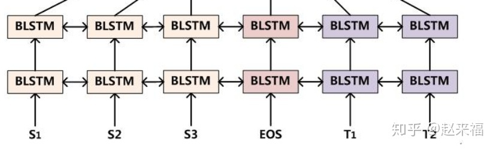
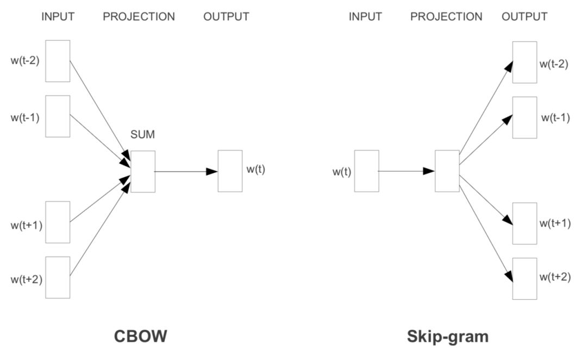
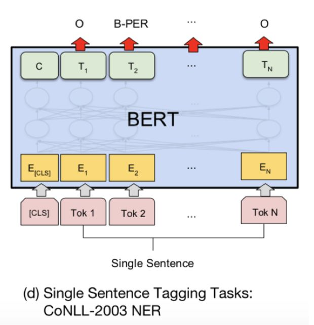

## ELMo  ⭐️

### 简介

**什么是一个好的词向量**

- 能够反映出语义和语法的复杂特征
- 能够准确的对不同上下文进行反应

作者提出了*deep contextualized word representation* 方法来解决以上两个问题

**deep contextualized 词向量的特点**

- **使用理念方面:**

  在原先的词向量模型中，每个词对应着一个向量，但是这个模型是根据一个句子赋予每个词汇向量。因此对于一个 n-tokens 的输入NLP任务模型，输入到NLP任务模型的是n个向量。这个论文中提出的方法，是在NLP模型的输入之前需要再加一个动态计算词向量的前向网络，我们称其为BiLMs，而这个前向网络是提前在一个大的数据集上训练好的，这个前向网络的输入是n个更初始的词向量。

- **训练具体信息:**
  关于这个网络更加详细的信息见第三节，简单来说，是一个多层的双向LSTMs结构，称其为BiLMs模型。

- **效果方面:**
  经过测试发现

  - BiLMs的较高层次的隐藏单元的向量很好的抓住了词汇的意义表示, 并且**在很多任务上不用再次对词向量进行调整就可以得到一个不错的结果.**
  - BiLMs的较低层次的隐藏单元的向量很好的抓住了词汇的语法信息，可以在例如词性标注的任务上发挥其作用。
  - 这种深度模型所带来的分层效果使得，将一套词向量应用于不同任务有了可能性。因为，每个任务所需要的信息多是不同的。在六个任务上进行了测试，都发现好于最佳结果。

- **CoVe向量**

  这里简单提一下这个词向量，因为下文中一直与它进行对比。这是一个利用翻译编码器去获取上下文词向量（也就是输入为句子，再对每个位置的词汇赋予词向量的这种动态的词向量赋予方式）。

总的来说，这种算法的特点是，每一个词语的表征都是整个输入语句的函数。

具体做法就是先在大语料上以language model为目标训练出bidirectional LSTM模型，然后利用LSTM产生词语的表征，ELMo故而得名(Embeddings from Language Models)。为了应用在下游的NLP任务中，一般先利用下游任务的语料库(注意这里忽略掉label)进行language model的微调，这种微调相当于一种domain transfer；然后才利用label的信息进行supervised learning。

ELMo表征是“深”的，就是说它们是biLM的所有层的内部表征的函数。这样做的好处是能够产生丰富的词语表征。

- 高层的LSTM的状态可以捕捉词语意义中和语境相关的那方面的特征，比如可以用来做语义的消歧
- 低层的LSTM可以找到语法方面的特征，比如可以做词性标注

如果把它们结合在一起，在下游的NLP任务中会体现优势。

### Related work

忽略

### Embeddings from Language Models

ELMo word representations are functions of the entire input sentence.

3.1 - 基本单元是一个两层的基于字符卷积的网络.

3.2 - 讲了内部状态的组合构成新的词汇向量表示.

3.4 - 讲了一些训练BiLMs的基本设置.

3.3 - 讲了如何将该BiLMs词汇向量模型添加到到实际NLP task

#### 3.1 双向语言模型

**关于双向** 

双向模型的公式如下:
$$
\begin{aligned}
&\sum_{k=1}^{N}\left(\log p\left(t_{k} \mid t_{1}, \ldots, t_{k-1} ; \Theta_{x}, \vec{\Theta}_{L S T M}, \Theta_{s}\right)\right. \\
&\left.\quad+\log p\left(t_{k} \mid t_{k+1}, \ldots, t_{N} ; \Theta_{x}, \overleftarrow{\Theta}_{L S T M} \Theta_{\dot{s}}\right)\right)
\end{aligned}
$$
从这个公式中我们就可以看出，向左和向右的LSTM是不同的，也就是说有两个LSTM单元。

$\theta_x$是输入的意思，输入的内容是最初始的词向量。$\theta_s$是输出内容，即LSTM在每个位置的 h。

h会再用作softmax的输入，来进行词汇选择权重赋予。

但是，$\theta_x$和$\theta_s$是相同的，意味着这两个单元的输出和输入都是相同的。单层的双向LSTM如下:

那么，这里设定第 j 层的第 k 个位置的forward LSTM(也就是右向LSTM)输出为
$$
\overrightarrow{\mathbf{h}}_{k, j}^{L M}
$$
那么，左向就是
$$
\overleftarrow{\mathbf{h}} \underset{k, j}{L M}
$$
Input，也就是最原始的词向量为
$$
\mathbf{x}_{k}^{L M}
$$
那么，这个最原始的词向量是怎么获得的呢？前面提到了，是通过字符卷积，大概是这个样子：

**关于深层**

首先要知道这是一个深层双向LSTMs网络，层数为L，大概的感觉如下:

这里展示的是一个双层，即L=2的情况.
也就是说，每个位置的输出在输入到下一位置的同时，也作为下一层的同一位置的输入.

#### 补充1：Character-CNN

首先要知道，基于字符的CNN到底是个什么样子，上面虽然有个简图，但是不详细.

在Character-Aware Neural Language Models的论文中，结构图如下：

这里我们主要关注最下面的卷积层次，对于一个单词，会有各种各样的卷积子，总共是2049个。而这2049并不是都能发挥很大的作用，因为 2049 个卷积子的长度是不同的，这篇论文中的最大长度是50。对于具体每个长度该有多少个卷积子并没有细说。

#### 补充2：CNN-softmax

首先 CNN-softmax 就是指利用上面的字符卷积网络，从词汇$w$生成词向量$e_w$，再与上下文词汇相乘$z_{w}=h^{T} \cdot C N N\left(\operatorname{chars}_{w}\right)=h^{T} \cdot e_{w}$ ，进行softmax计算$\operatorname{softmax}(w)=z_{w} / \sum_{i}^{N} z_{i}$的过程。

CNN-softmax动态的生成词向量，有如下几个优点：

- 避免了使用很大内存去记录词汇向量。大大减小了需要训练的参数，因为之前每个词汇的词向量都是参数。
- 可以赋予没有在训练库中出现的词汇合适的向量。

同时该方法有一些缺点：

- 函数是连续的，无法满足一些形状相似但是意义不一样的词汇的词向量生成。

改进方法：综合上面的方法和原有词向量法，即:

**赋予每个词汇一个短的词向量同时, 还要利用字符卷积**. 公式如下:
$$
z_{w}=h^{T} C N N\left(\operatorname{chars}_{w}\right)+h^{T} \operatorname{Mcorr}_{w}
$$
其中，是一个128维的短向量，是将128向量线性映射到真实向量长度的转换矩阵。

#### 3.2 ELMo

上面说到了，LSTM的每一层都有自己不同的代表的意义，所以对于不同的任务，每层参与表征的权重也就不同。因此，为了一般化，该方案设置一个通用词向量表征法，即利用每层状态的线性组合。
$$
\begin{aligned}
R_{k} &=\left\{\mathbf{x}_{k}^{L M}, \overrightarrow{\mathbf{h}}_{k, j}^{L M}, \overleftarrow{\mathbf{h}}_{k, j}^{L M} \mid j=1, \ldots, L\right\} \\
&=\left\{\mathbf{h}_{k, j}^{L M} \mid j=0, \ldots, L\right\}
\end{aligned}
$$
这是线性组合的单元集合。
$$
\mathbf{E L M o}_{k}^{\text {task }}=E\left(R_{k} ; \Theta^{\text {task }}\right)=\gamma^{\text {task }} \sum_{j=0}^{L} s_{j}^{\text {task }} \mathbf{h}_{k, j}^{L M}
$$
其中，s就是softmax-normalized weights，也就是加和为1的一组权重向量。这组权重不仅仅代表的是权重，因为每层LSTM内部状态，也就是 h 的分布是不同的，这个也可以用作layer normalization。

> PS : 原文中有关获取s值的方法的描述很简单：
>
> $s^{task}$ are softmax-normalized weights.
>
> 个人意见是，在每一层中多一个参数，我称之为s位，设第 i 层的s位为$s_i^{task}$，用来作为计算$s^{task}$的输入。计算方法是：$s_{i}^{t a s k}=e^{s_{i}} / \sum_{j}^{N} e^{s_{j}}$ 
>
> 因为这个$s^{task}$是一个模型的参数，是独立于词向量的，也就是说不会随着输入词的改变而改变。所以应该不会以每层的隐藏状态作为输入(因为每层的隐藏状态会随着词向量改变)。所以，在利用语言模型进行初始化的过程中，应该会将每层中的s标志位设置为相同的值，这样经过softmax转换后的值也是一样。

$\gamma$允许具体的task模型去放缩 ELMo 的大小。这个地方非常重要，作者在补充中进行了强调，在没有这个的情况下，只采用该模型的最后一层输出作为词向量的时候的效果甚至差于 baseline。这个重要的原因是，BiLM的内部表征和具体任务的表征的分布是不一样的。

#### 3.3 Using biLMs for supervised NLP tasks

**最简版使用方法**

将该词向量加到一般的任务的方法是：先固定一个权重，构成一个$E L M O_{t}^{\text {task }}$，然后联结$E L M O_{t}^{\text {task }}$和最初始词向量(也就是通过字符卷积获得的向量) 为$\left[x_{k} ; E L M O_{t}^{\text {task }}\right]$，再将这个向量输入到任务的RNN模型中去，最后在训练中一同训练权重因子。

**加强版**
我们可以在output处也加一个这样的向量,即$\left[h_{k} ; E L M O_{t}^{t a s k}\right]$，不同是，这里应该采用与输入$E L M O_{t}^{t a s k}$中不同的权重因子。

**终极版**

可以在ELMo模型中加入dropout，以及采用 L2 loss的方法来提升模型。

并且，这里的 L2 项的系数$\lambda$ 越大，越有取各层平均值的意思；越小，越可以发挥各个层之间的不同带来的效果，但是并不是说越小越好。

#### 3.4 预训练双向语言模型结构 ⭐️

现在进入真正重要的部分，也就是如何训练这个 ELMo 网络的问题。

**模型结构**

这里采用的还是语言模型去训练网络，并且这篇的模型是有借鉴先行研究的：

- Exploring the limits of language modeling.
- Character-Aware Neural Language Models

这两个先行研究都是基于字符卷积网络来做的，但是这其中有一个问题是字符卷积网络的低效问题，详细见[论文](https://zhuanlan.zhihu.com/p/37684922/From Characters to Words to in Between: Do We Capture Morphology?)。通过这篇论文我们也知道，能够实现最大效率利用字符共现来表达词义的网络就是 biLSTMs 网络，这也是为什么这个模型采用这个网络的原因。

但是不同于这两篇论文的是，本论文增加了

- 使得模型可以同时训练双向参数

- 增加 LSTMs 单元之间的残差连接(见笔记, 残差网络)。

简单说，就是一种简化训练，提升在深层网络下训练效率的方法。

并且, 这里使用的是 BIGLSTM，也就是说模型的 size 特别大。这个主要是从 Exploring the limits of language modeling 中学得的。

**模型参数**

最终的模型参数如下，这些参数的示意都在 (Exploring the limits of language modeling) 这篇文章中

- 是一个两层的LSTM，每层的LSTM cell拥有4096个单元(即hidden state) 和512维度映射(即lstm cell 的output)
- 从第一层到第二层存在一个残差连接
- context insensitive type representation uses 2048 character n-gram convolutional filters followed by two highway layers. 也就是说使用了2048个过滤器，来进行基于字符的卷积计算
- a linear projection down to a 512 representation. 也就是一直在说的各层输出的线性组合

最后的结果是，整个模型针对一个token，可以产生三个向量：原始、第一层以及第二层。

**其他**

另外一个重要的点，在各任务中对BiLMs进行fine tuning可以取得很好的效果。

#### 补充3：Projection layer

这个是LSTM中的一个特殊的结构，在最原始的网络中是没有这个的。

它是加在原始的LSTM的hidden state上的另外一個转换层，转换层的输出成为这个LSTM的output。hidden state 就是4096，经过转换之后的output维度就是512。

这个新的结构的 LSTM 叫做 LSTMP。

### Analysis

> ablation analysis:
>
> 这个其实就是控制变量法，我们的模型通过自动调整得到了大量参数，但是我们不知道那些参数更重要一些，因此我们通过设置有某变量的一组实验和无该变量的一组实验来进行比较，得出不同参数对应的重要度。
>
> 通过这样的实验，就可以使得开发者的注意力主要集中在重要的参数上。

**Alternate layer weighting schemes**

上面说过，L2 loss的系数$\lambda$给模型带来的影响，就是其值越大，最后的$E L M O_{t}^{t a s k}$越趋近于各层之间的平均值。

下面是对四个不同的构造进行的比较：

- 第一列是baseline模型，使用普通的词向量，例如 CoVe。
- 第二列是只使用了 BiLSTMs 最后一层输出的结果。
- 第三列是使用了各层次状态值平均的结果，倾向于平均，并非完全平均，$\lambda = 1$。
- 第四列是使用了各层次状态值加权和的结果，$\lambda = 0.001$。

其结果如下：
$$
\begin{array}{l|c|c|cc}
\text { Task } & \text { Baseline } & \text { Last Only } & \quad\quad\quad\quad\quad\quad\quad {\text { All layers }} \\
& & & \lambda=1 & \lambda=0.001 \\
\hline \hline \text { SQuAD } & 80.8 & 84.7 & 85.0 & \mathbf{8 5 . 2} \\
\text { SNLI } & 88.1 & 89.1 & 89.3 & \mathbf{8 9 . 5} \\
\text { SRL } & 81.6 & 84.1 & 84.6 & \mathbf{8 4 . 8}
\end{array}
$$
**Where to include ELMo?**

上面也提到了要在output的地方也加入 ELMo 来进行训练。但是这样做真的好嘛？本节针对这个进行了实验，实验结果如下：
$$
\begin{array}{l|r|r|r}
\text { Task } & {\begin{array}{l}
\text { Input } \\
\text { Only }
\end{array}} & \begin{array}{l}
\text { Input \& } \\
\text { Output }
\end{array} & {\begin{array}{c}
\text { Output } \\
\text { Only }
\end{array}} \\
\hline \hline \text { SQuAD } & 85.1 & \mathbf{8 5 . 6} & 84.8 \\
\text { SNLI } & 88.9 & \mathbf{8 9 . 5} & 88.7 \\
\text { SRL } & \mathbf{8 4 . 7} & 84.3 & 80.9
\end{array}
$$
证明确实是有效的

**What information is captured by the biLM’s representations?**

上面的模型比较是将ELMo的整个结果加入一个具体的NLP task，与其他模型比较，而在这一节是通过取 ELMo 的单层出来的词向量加入模型与其他不同的词向量加入模型进行对比。

注意：这里的模型并没有保证一致性，但是ELMo加入的模型设计简单，在这种情况下依然可以取得好结果，说明效果不是出自模型，而是出自向量。

- **Word sense disambiguation**

  语义消歧任务，这里使用了 SemCor3.0 这个预料库，这是一个标注了多义的预料库，库中的每个词汇都对应着 wordnet 的一个位置。

  基于该预料库进行计算的方法是，先利用 BiLMs 来计算出了语料库中所有的词汇向量表示。然后将位于wordnet相同位置的词汇的向量取了平均。测试的时候，对于一个给出的target word in a target sentence。利用 BiLM 得出结果后，利用训练时获得的每个wordnet位置中的词汇的初始向量，再利用 1近邻法求这个词汇可能的位置。这个模型本身可以说是非常简单了，只用到了 1-近邻。但是结果还是显示，有很高的F1值。如下图：
  $$
  \begin{array}{l|l}
  \text { Model } & \mathbf{F}_{1} \\
  \hline \hline \text { WordNet 1 st Sense Baseline } & 65.9 \\
  \text { Raganato et al. (2017a) } & 69.9 \\
  \text { Iacobacci et al. (2016) } & \mathbf{7 0 . 1} \\
  \hline \text { CoVe, First Layer } & 59.4 \\
  \text { CoVe, Second Layer } & 64.7 \\
  \hline \text { biLM, First layer } & 67.4 \\
  \text { biLM, Second layer } & 69.0
  \end{array}
  $$
  通过这个表也可以知道，第二层的语义信息要高于第一层。

- **POS tagging**

  上面的结果测试了 ELMo 表达语义的效果，接下来利用 POS tagging 检测其对语法的表达效果。
  这个是用向量作为输入进一个分类器，去分辨词性， 也可以说是非常简单了。其结果如下：
  $$
  \begin{array}{l|c}
  \text { Model } & \text { Acc. } \\
  \hline \hline \text { Collobert et al. (2011) } & 97.3 \\
  \text { Ma and Hovy (2016) } & 97.6 \\
  \text { Ling et al. (2015) } & \mathbf{9 7 . 8} \\
  \hline \text { CoVe, First Layer } & 93.3 \\
  \text { CoVe, Second Layer } & 92.8 \\
  \hline \text { biLM, First Layer } & 97.3 \\
  \text { biLM, Second Layer } & 96.8
  \end{array}
  $$
  可以说是灰常强了。顺便说下，这里用的训练数据是 Wall Street Journal portion of the Penn Treebank。

- **Implications for supervised tasks**

  不同层次的数据具有不同的意义这一点，使得其 ELMo work。

**Sample efficienc**

这个有点厉害，EMLo 真的是又快又强，堪称词向量界的大表哥.

- **快**
  在不加 ELMo 的情况下去训练 SRL model，达到最佳 F1 值要在 486 个epoch之后，但是在加了 ELMo 之后，只需要十个回合便超越了原来的 F1 值，降低了98%的时间消耗，神了。
- **强**
  在使用更少数据下便可以能够获得同样的效果。

## Transformer

[详解Transformer （Attention Is All You Need）](https://zhuanlan.zhihu.com/p/48508221) 

[Self-Attention和Transformer](https://luweikxy.gitbook.io/machine-learning-notes/self-attention-and-transformer) 

### 前言

BERT算法的最重要的部分便是本文中提出的Transformer的概念。

正如论文的题目所说的，Transformer中抛弃了传统的CNN和RNN，整个网络结构完全是由Attention机制组成。

更准确地讲，Transformer由且仅由self-Attenion和Feed Forward Neural Network组成。一个基于Transformer的可训练的神经网络可以通过堆叠Transformer的形式进行搭建，作者的实验是通过搭建编码器和解码器各6层，总共12层的Encoder-Decoder，并在机器翻译中取得了BLEU值得新高。

#### RNN的缺陷 

在没有Transformer以前，大家做神经机器翻译用的最多的是基于RNN的Encoder-Decoder模型：

Encoder-Decoder模型当然很成功，在2018年以前用它是用的很多的。而且也有很强的能力。但是RNN天生有缺陷，只要是RNN，就会有梯度消失问题，核心原因是有递归的方式，作用在同一个权值矩阵上，使得如果这个矩阵满足条件的话，其最大的特征值要是小于1的话，那就一定会出现梯度消失问题。后来的LSTM和GRU也仅仅能缓解这个问题

#### Transformer为何优于RNN 

Transformer中抛弃了传统的CNN和RNN，整个网络结构完全是由Attention机制组成。作者采用Attention机制的原因是考虑到RNN（或者LSTM，GRU等）的计算限制为是顺序的，也就是说RNN相关算法只能从左向右依次计算或者从右向左依次计算，这种机制带来了两个问题：

- 时间片$t$的计算依赖$t-1$时刻的计算结果，这样限制了模型的并行能力； 
- 顺序计算的过程中信息会丢失，尽管LSTM等门机制的结构一定程度上缓解了长期依赖的问题，但是对于特别长期的依赖现象，LSTM依旧无能为力。

Transformer的提出解决了上面两个问题

- 首先它使用了**Attention机制**，将序列中的任意两个位置之间的距离是缩小为一个常量；
- 其次它不是类似RNN的顺序结构，因此具有**更好的并行性，符合现有的GPU框架**。

论文中给出Transformer的定义是：Transformer is the first transduction model relying entirely on self-attention to compute representations of its input and output without using sequence aligned RNNs or convolution。

遗憾的是，作者的论文比较难懂，尤其是Transformer的结构细节和实现方式并没有解释清楚。尤其是论文中的$Q, V, K$究竟代表什么意思作者并没有说明。通过查阅资料，发现了一篇非常优秀的讲解Transformer的文章[Self-Attention和Transformer](https://luweikxy.gitbook.io/machine-learning-notes/self-attention-and-transformer)。

### Transformer模型架构

Transformer模型总体的样子如下图所示：总体来说，还是和Encoder-Decoder模型有些相似，左边是Encoder部分，右边是Decoder部分。

**Encoder**：输入是单词的Embedding，再加上位置编码，然后进入一个统一的结构，这个结构可以循环很多次（N次），也就是说有很多层（N层）。每一层又可以分成Attention层和全连接层，再额外加了一些处理，比如Skip Connection，做跳跃连接，然后还加了Normalization层。其实它本身的模型还是很简单的。

**Decoder**：第一次输入是前缀信息，之后的就是上一次产出的Embedding，加入位置编码，然后进入一个可以重复很多次的模块。该模块可以分成三块来看，第一块也是Attention层，第二块是cross Attention，不是Self-Attention，第三块是全连接层。也用了跳跃连接和Normalization。

**输出**：最后的输出要通过Linear层（全连接层），再通过softmax做预测。

再换用另一种简单的方式来解释Transformer的网络结构。

需要注意的上图的Decoder的第一个输入，就是output的前缀信息。

### Encoder模块

#### Self-Attention机制

我们把上图的网络简化一下，理论上Encoder和Decoder只有一个模块，那也算是Transformer。

那我们就来看下最简单的模型，它是怎样工作的。重点是看Encoder和Decoder里面的Attention机制是怎么运作的。

这个绿色的框（Encoder #1）就是Encoder里的一个独立模块。下面绿色的输入的是两个单词的embedding。这个模块想要做的事情就是想**把$x_1$转换为另外一个向量$r_1$**，这两个向量的维度是一样的。然后就一层层往上传。

转化的过程分成几个步骤，第一个步骤就是Self-Attention，第二个步骤就是普通的全连接神经网络。但是注意，**Self-Attention框里是所有的输入向量共同参与了这个过程，也就是说，$x_1$和$x_2$通过某种信息交换和杂糅，得到了中间变量$z_1$和$z_2$**。而全连接神经网络是割裂开的，$z_1$和$z_2$各自独立通过全连接神经网络，得到了$r_1$和$r_2$。

$x_1$和$x_2$互相不知道对方的信息，但因为在第一个步骤Self-Attention中发生了信息交换，所以**$r_1$和$r_2$各自都有从$x_1$和$x_2$得来的信息了**。

如果我们用**直觉的方式来理解Self-Attention**，假设左边的句子就是输入$x_{1}, x_{2}, \ldots, x_{14}$，然后通过Self-Attention映射为$z_{1}, z_{2}, \ldots, z_{14}$，**为什么叫Self-Attention呢，就是==一个句子内的单词，互相看其它单词对自己的影响力有多大==**。比如单词`it`，它和句子内其他单词最相关的是哪个，如果颜色的深浅来表示影响力的强弱，那显然我们看到对`it`影响力最强的就是`The`和`Animal`这两个单词了。所以**Self-Attention就是说，==句子内各单词的注意力，应该关注在该句子内其他单词中的哪些单词上==**。

具体注意力的不同强弱是怎么计算出来的呢？下面就讲解Self-Attention。

首先说下Attention和Self-Attention的区别

> Attention和self-attention的区别
>
> 以Encoder-Decoder框架为例，输入Source和输出Target内容是不一样的，比如对于英-中机器翻译来说，Source是英文句子，Target是对应的翻译出的中文句子，Attention发生在Target的元素Query和Source中的所有元素之间。
>
> Self Attention，指的不是Target和Source之间的Attention机制，而是Source内部元素之间或者Target内部元素之间发生的Attention机制，也可以理解为Target=Source这种特殊情况下的Attention。
>
> 两者具体计算过程是一样的，只是计算对象发生了变化而已。

下图就是Self-Attention的计算机制。已知输入的单词embedding，即$x_1$和$x_2$，想转换成$z_1$和$z_2$。

### Transformer特点

优点

- 每层计算**复杂度比RNN要低**。
- 可以进行**并行计算**。
- 从计算一个序列长度为n的信息要经过的路径长度来看, CNN需要增加卷积层数来扩大视野，RNN需要从1到n逐个进行计算，而Self-attention只需要一步矩阵计算就可以。Self-Attention可以比RNN**更好地解决长时依赖问题**。当然如果计算量太大，比如序列长度N大于序列维度D这种情况，也可以用窗口限制Self-Attention的计算数量。
- 从作者在附录中给出的栗子可以看出，Self-Attention**模型更可解释，Attention结果的分布表明了该模型学习到了一些语法和语义信息**。

缺点，在原文中没有提到缺点，是后来在Universal Transformers中指出的，主要是两点：

- 有些RNN轻易可以解决的问题Transformer没做到，比如复制String，或者推理时碰到的sequence长度比训练时更长（因为碰到了没见过的position embedding）

- 理论上：transformers不是computationally universal(图灵完备)，而RNN图灵完备。

  这种非RNN式的模型是非图灵完备的的，**无法单独完成NLP中推理、决策等计算问题**（包括使用transformer的bert模型等等）。

## 从word2vec, ELMo到BERT

[NLP的游戏规则从此改写？从word2vec, ELMo到BERT](https://zhuanlan.zhihu.com/p/47488095) 

每个人对于BERT的理解都不一样，本文试着从word2vec和ELMo的角度说说BERT。

### word2vec

说来也都是些俗套而乐此不疲一遍遍写的句子，2013年Google的word2vec一出，让NLP各个领域遍地开花，一时间好像不用上预训练的词向量都不好意思写论文了。而word2vec是什么呢？

模型：

显然就是一个“线性”语言模型。既然我们的目标是学习词向量，而且词向量在语义上要支持一些”线性的语义运算“，如”皇帝-皇后=男-女“（忽略武则天），那么使用一个线性模型自然足够了，跑的又快又能完成任务，非常优雅。

另外word2vec的一个精髓是把语言模型的那一套softmax加速方法也给顺便优化了，用一个看似开脑洞的“负采样”方法来代替传统的层级softmax和NCE做法。而这个名字高大上的“负采样”到底是什么呢？

**负采样**

我们知道对于训练语言模型来说，softmax层非常难算，毕竟你要预测的是当前位置是哪个词，那么这个类别数就等同于词典规模，因此动辄几万几十万的类别数，算softmax函数当然很费力啦。但是，如果我们的目标不在于训练一个精准的语言模型，而只是为了训练得到语言模型的副产物-词向量，那么其实只需要用这里隐含的一个计算代价更小的“子任务”就好啦。

想一想，给你10000张写有数字的卡片，让你找出其中的最大值，是不是特别费力？但是如果把里面的最大值事先抽出来，跟五张随机抽取的卡片混到一起，让你选出其中的最大值，是不是就容易多啦？

负采样就是这个思想，即不直接让模型从整个词表找最可能的词了，而是直接给定这个词（即正例）和几个随机采样的噪声词（即采样出来的负例），只要模型能从这里面找出正确的词就认为完成目标啦。所以这个想法对应的目标函数即：
$$
\log \sigma\left(v_{w_{O}}^{\prime}{ }^{\top} v_{w_{I}}\right)+\sum_{i=1}^{k} \mathbb{E}_{w_{i} \sim P_{n}(w)}\left[\log \sigma\left(-v_{w_{i}}^{\prime}{ }^{\top} v_{w_{I}}\right)\right]
$$
这里$v'_{wo}$是正例，$v'_{wi}$是随机采样出来的负例（采样k个），$\sigma$是sigmoid函数。然后即最大化正例的似然，最小化负例的似然。

这种负采样的思想被成功的应用在了BERT模型中，只不过粒度从词变成了句子。不要急，慢慢往后看～

### char-level与上下文

虽然2015年到2017年也有不少工作试图从char-level入手，另辟蹊径，摆脱预训练词向量的游戏规则，然而实测只是昙花一现，很快被怼了。不过，人们同时也意识到了char-level的文本中也蕴含了一些word-level的文本所难以描述的模式，因此一方面出现了可以学习到char-level特征的词向量FastText，另一方面在有监督任务中开始通过浅层CNN、HIghwayNet、RNN等网络引入char-level文本的表示。

不过，至此为止，词向量都是上下文无关的。也就是说，同一个词在不同的语境中总是相同的词向量，很明显这就导致词向量模型缺乏词义消歧（WSD）的能力。于是，**人们为了让词向量变得上下文相关，开始在具体的下游任务中基于词向量sequence来做encoding。**

最常见的encoding方法当然就是用RNN系的网络，除此之外还有成功的用深层CNN来encoding的工作（如文本分类，机器翻译，机器阅读理解），然而，Google说了，CNN也太俗了，我们要用全连接网络！（划掉）self-attention！于是就有了为NLP深度定制的Transformer模型，Transformer的提出是在机器翻译任务上，但是其在其他领域如检索式对话上也发挥了巨大的威力。

不过，既然发现在各个NLP任务中基本都有encoding的需要，那么为啥不在最开始就让词向量拥有上下文相关的能力呢？于是有了ELMo。

### ELMo

当然，实际上ELMo不是第一个试图产生上下文相关的词向量的模型，不过确是一个让你有充分理由放弃word2vec的模型（手动微笑），毕竟牺牲点推理速度换来辣么多的性能提升，大部分情况下超值呀～

ELMo在模型层上就是一个stacked bi-lstm（严格来说是训练了两个单向的stacked lstm），所以当然有不错的encoding能力。同时其源码实现上也支持用Highway Net或者CNN来额外引入char-level encoding。训练它的话自然也是语言模型标准的最大化似然函数，即
$$
\begin{aligned}
&\sum_{k=1}^{N}\left(\log p\left(t_{k} \mid t_{1}, \ldots, t_{k-1} ; \Theta_{x}, \vec{\Theta}_{L S T M}, \Theta_{s}\right)\right. \\
&\left.\quad+\log p\left(t_{k} \mid t_{k+1}, \ldots, t_{N} ; \Theta_{x}, \overleftarrow{\Theta}_{L S T M}, \Theta_{s}\right)\right)
\end{aligned}
$$
不过这个ELMo的亮点当然不在于模型层，而是其通过实验间接说明了在多层的RNN中，不同层学到的特征其实是有差异的，因此ELMo提出在预训练完成并迁移到下游NLP任务中时，要为原始词向量层和每一层RNN的隐层都设置一个可训练参数，这些参数通过softmax层归一化后乘到其相应的层上并求和便起到了weighting的作用，然后对“加权和”得到的词向量再通过一个参数来进行词向量整体的scaling以更好的适应下游任务。

> ps: 其实最后这个参数还是非常重要的，比如word2vec中，一般来说cbow和sg学出来的词向量方差差异比较大，这时那个方差跟适合下游任务后续层方差匹配的词向量就收敛更快，更容易有更好的表现

数学表达式如下
$$
\mathbf{E L M o}_{k}^{\text {task }}=E\left(R_{k} ; \Theta^{\text {task }}\right)=\gamma^{\text {task }} \sum_{j=0}^{L} s_{j}^{\text {task }} \mathbf{h}_{k, j}^{L M}
$$
其中L=2就是ELMo论文中的设定，j=0时代表原始词向量层，j=1是lstm的第一隐层，j=2是第二隐层。

$s_{j}^{task}$是参数被softmax归一化之后的结果（也就是说$s_{0}+s_{1}+\ldots+s_{L}=1$）。

通过这样的迁移策略，那些对词义消歧有需求的任务就更容易通过训练给第二隐层一个很大的权重，而对词性、句法有明显需求的任务则可能对第一隐层的参数学习到比较大的值（实验结论）。总之，这样便得到了一份”可以被下游任务定制“的特征更为丰富的词向量，效果比word2vec好得多也就不足为奇了。

不过话说回来，**ELMo的目标也仅仅是学习到上下文相关的、更强大的词向量，其目的依然是为下游任务提供一个扎实的根基，还没有想要弑君称王的意思**。

而我们知道，仅仅是对文本进行充分而强大的encoding（即得到每个词位非常精准丰富的特征）是远不够覆盖所有NLP任务的。在QA、机器阅读理解（MRC）、自然语言推理（NLI）、对话等任务中，还有很多更复杂的模式需要捕捉，比如句间关系。为此，下游任务中的网络会加入各种花式attention（参考NLI、MRC、Chatbot中的SOTA们）。

而随着捕捉更多神奇模式的需要，研究者们为每个下游任务定制出各种各样的网络结构，导致同一个模型，稍微一换任务就挂掉了，甚至在同一个任务的情况下换另一种分布的数据集都会出现显著的性能损失，这显然不符合人类的语言行为呀～要知道人类的generalization能力是非常强的，这就说明，或许现在整个NLP的发展轨迹就是错的，尤其是在SQuAD的带领下，穷尽各种trick和花式结构去刷榜，真正之于NLP的意义多大呢？

好像扯远了，不过所幸，这条越走越偏的道路终于被一个模型shutdown了，那就是Google发布的Bidirectional Encoder Representations from Transformers (BERT)。

### BERT ⭐️

这篇paper的最重要意义不在于用了什么模型，也不在于怎么训练的，而是它提出一种全新的游戏规则。

像之前说的，为每个NLP任务去深度定制泛化能力极差的复杂模型结构其实是非常不明智的，走偏了方向的。

既然ELMo相比word2vec会有这么大的提升，这就说明**预训练模型的潜力远不止为下游任务提供一份精准的词向量**，所以我们可不可以直接预训练一个龙骨级的模型呢？如果它里面已经充分的描述了字符级、词级、句子级甚至句间关系的特征，那么在不同的NLP任务中，只需要去为任务定制一个非常轻量级的输出层（比如一个单层MLP）就好了，毕竟模型骨架都已经做好了嘛。

而BERT正是做了这件事情，或者说，它真的把这件事情做成了，它作为一个general的龙骨级模型轻松的挑战了11个任务上的深度定制的模型。

所以它怎么完成的呢？

#### 深层双向的encoding

首先，它指出，对上下文相关的词向量的学习上，先前的预训练模型还不够！

虽然在下游有监督任务中，encoding的方式已经是花里胡哨非常充分了，**深度双向encoding基本成了许多复杂下游任务的标配（比如MRC, dialogue）**。

但是在预训练模型上，先前的最先进模型也只是基于传统的语言模型来做，**而传统的语言模型是单向的（数学上已经定义了）**，即
$$
p(s)=p(w 0) \cdot p(w 1 \mid w 0) \cdot p(w 2 \mid w 1, w 0) \cdot p(w 3 \mid w 2, w 1, w 0) \ldots p(w n \mid \text { context })
$$
**而且往往都很浅**（想象一下LSTM堆三层就train不动了，就要上各种trick了），比如ELMo。

另外，虽然ELMo有用双向RNN来做encoding，但是这两个方向的RNN其实是分开训练的，只是在最后在loss层做了个简单相加。这样就导致对于每个方向上的单词来说，在被encoding的时候始终是看不到它另一侧的单词的。而显然句子中有的单词的语义会同时依赖于它左右两侧的某些词，仅仅从单方向做encoding是不能描述清楚的。

**那么为什么不像下游监督任务中那样做真正的双向encoding呢？**

原因一想就很清楚了，毕竟传统的语言模型是以预测下一个词为训练目标的，然而如果做了双向encoding的话，那不就表示要预测的词已经看到了嘛╮(￣▽￣””)╭这样的预测当然没有意义了。所以，在BERT中，提出了使用一种新的任务来训练监督任务中的那种真正可以双向encoding的模型，这个任务称为Masked Language Model （Masked LM）。

#### Masked LM ⭐️

顾名思义，Masked LM就是说，我们不是像传统LM那样给定已经出现过的词，去预测下一个词，而是直接把整个句子的一部分词（随机选择）盖住（make it masked），这样模型不就可以放心的去做双向encoding了嘛，然后就可以放心的让模型去预测这些盖住的词是啥。这个任务其实最开始叫做cloze test（大概翻译成“完形填空测验”）。

这样显然会导致一些小问题。这样虽然可以放心的双向encoding了，但是这样在encoding时把这些盖住的标记也给encoding进去了╮(￣▽￣””)╭而这些mask标记在下游任务中是不存在的呀。。。那怎么办呢？对此，为了尽可能的把模型调教的忽略这些标记的影响，作者通过如下方式来告诉模型“这些是噪声是噪声！靠不住的！忽略它们吧！”，对于一个被盖住的单词：

- 有80%的概率用“[mask]”标记来替换
- 有10%的概率用随机采样的一个单词来替换
- 有10%的概率不做替换（虽然不做替换，但是还是要预测哈）

#### Encoder

在encoder的选择上，作者并没有用烂大街的bi-lstm，而是使用了可以做的更深、具有更好并行性的Transformer encoder来做。这样每个词位的词都可以无视方向和距离的直接把句子中的每个词都有机会encoding进来。另一方面我主观的感觉Transformer相比lstm更容易免受mask标记的影响，毕竟self-attention的过程完全可以把mask标记针对性的削弱匹配权重，但是lstm中的输入门是如何看待mask标记的那就不得而知了。

等下，直接用Transformer encoder显然不就丢失位置信息了嘛？难道作者这里也像Transformer原论文中那样搞了个让人怕怕的sin、cos函数编码位置？

并木有，作者这里很简单粗暴的直接去训练了一个position embedding ╮(￣▽￣””)╭ 这里就是说，比如我把句子截断到50的长度，那么我们就有50个位置嘛，所以就有50个表征位置的单词，即从位置0一直到位置49。。。然后给每个位置词一个随机初始化的词向量，再随它们训练去吧（很想说这特喵的也能work？太简单粗暴了吧。。。）。

另外，position embedding和word embedding的结合方式上，BERT里选择了直接相加。

最后，在深度方面，最终BERT完全版的encoder丧心病狂的叠加了24层的multi-head attention block（要知道对话里的SOTA模型DAM也才用了5层…）。。。而且每个block包含16抽头、1024隐单元╮(￣▽￣””)╭此处打出标语：money is all you need （划掉）

#### 学习句子与句对关系表示

像之前说的，在很多任务中，仅仅靠encoding是不足以完成任务的（这个只是学到了一堆token级的特征），还需要捕捉一些句子级的模式，来完成SLI、QA、dialogue等需要句子表示、句间交互与匹配的任务。

对此，BERT又引入了另一个极其重要却又极其轻量级的任务，来试图把这种模式也学习到。

**句子级负采样**

还记得小夕在前面word2vec章节说过的，word2vec的一个精髓是引入了一个优雅的负采样任务来学习词向量（word-level representation）嘛。那么如果我们把这个负采样的过程给generalize到sentence-level呢？这便是BERT学习sentence-level representation的关键啦。

BERT这里跟word2vec做法类似，不过构造的是一个句子级的分类任务。即首先给定的一个句子（相当于word2vec中给定context），它下一个句子即为正例（相当于word2vec中的正确词），随机采样**一个**句子作为负例（相当于word2vec中随机采样的词），然后在该sentence-level上来做二分类（即判断句子是当前句子的下一句还是噪声）。通过这个简单的句子级负采样任务，BERT就可以像word2vec学习词表示那样轻松学到句子表示啦。

**句子级表示**

等等，前面说了这么半天，还没有说句子该怎么表示呢。。。

BERT这里并没有像下游监督任务中的普遍做法一样，在encoding的基础上再搞个全局池化之类的，它首先在每个sequence（对于句子对任务来说是两个拼起来的句子，对于其他任务来说是一个句子）前面加了一个特殊的token，记为[CLS]，如图

> ps：这里的[sep]是句子之间的分隔符，BERT同时支持学习句对的表示，这里是[SEP]便是为了区分句对的切割点。

然后让encoder对[CLS]进行深度encoding，深度encoding的最高隐层即为整个句子/句对的表示啦。

这个做法乍一看有点费解，不过别忘了，Transformer是可以无视空间和距离的把全局信息encoding进每个位置的，而[CLS]作为句子/句对的表示是直接跟分类器的输出层连接的，因此其作为梯度反传路径上的“关卡”，当然会想办法学习到分类相关的上层特征啦。

另外，为了让模型能够区分里面的每个词是属于“左句子”还是“右句子”，作者这里引入了“segment embedding”的概念来区分句子。对于句对来说，就用embedding A和embedding B来分别代表左句子和右句子；而对于句子来说，就只有embedding A啦。这个embedding A和B也是随模型训练出来的。

> ps: 这做法跟position embedding一样感觉简单粗暴，实在很费解为什么BERT用在“quora question pairs”这种理论上需要网络保持对称的任务上依然能work，心情复杂

所以最终BERT每个token的表示由token原始的词向量token embedding、前文提到的position embedding和这里的segment embedding三部分相加而成，如图：

#### 简洁到过分的下游任务接口

真正体现出BERT这个模型是龙骨级模型而不再是词向量的，就是其到各个下游任务的接口设计了，或者换个更洋气的词叫迁移策略。

首先，既然句子和句子对的上层表示都得到了，那么当然对于文本分类任务和文本匹配任务（文本匹配其实也是一种文本分类任务，只不过输入是文本对）来说，只需要用得到的表示（即encoder在[CLS]词位的顶层输出）加上一层MLP就好了呀～

既然文本都被深度双向encoding了，那么做序列标注任务就只需要加softmax输出层就好了呀，连CRF都不用了呀～

让小夕更木有想到的是，在span抽取式任务如SQuAD上，把深度encoding和深度attention这俩大礼包省掉就算了，甚至都敢直接把输出层的pointer net给丢掉了？直接像DrQA那样傲娇的用两个线性分类器分别输出span的起点和终点？不多说了，已跪m(_ _)m

