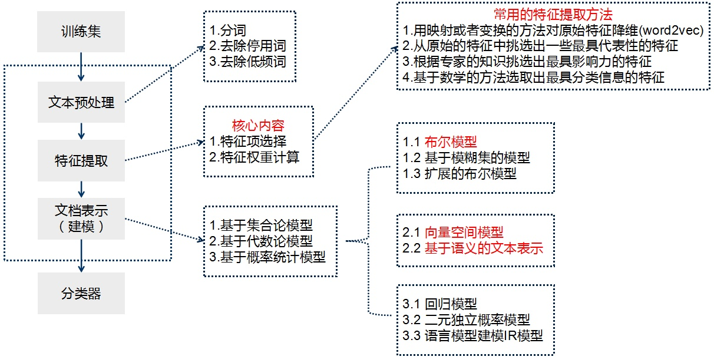

[分词之后的如何做特征选择_如何去实践一个完整的数据挖掘项目](https://blog.csdn.net/weixin_39889642/article/details/111652429) 

## 完成数据挖掘项目的步骤

### 机器学习项目

1. 抽象成数学问题(明确问题)
2. 获取数据
3. 特征预处理与特征选择
4. 训练模型与调优
5. 模型诊断
6. 模型融合(非必须)
7. 上线运行

大部分机器学习项目死在第1步和第2步，平时我们说的机器学习，指的是3、4、5这3步，实践中，其实最难的是业务理解这一步，业务理解OK了，后面的一切都有章可循。

### NLP项目

1. 获取语料

   已有语料：业务部门、公司积累大量的文本数据
   网上下载、抓取语料：可以通过爬虫自己去抓取一些数据，然后进行加工。

2. 语料预处理

   语料预处理大概会占到整个50%-70%的工作量，通过数据洗清、分词、词性标注、去停用词四个大的方面来完成语料的预处理工作。

   - 语料清洗：就是在语料中找到我们感兴趣的东西，把不感兴趣的视为噪音的内容清洗删除，如：对于爬取的网页内容，需要去除广告、标签、HTML、JS等代码和注解等。 
   - 分词：中文语料数据为一批短文本或长文本，如：句子、文章摘要、段落或整篇文章组成的一个集合。一般句子、段落之间的字、词语是连续的，有一定含义。
   - 词性标注：就是给每个词或者词语打词类标签，如形容词、动词、名词等。这样做可以让文本在后面的处理中融入更多有用的语言信息。如，常见的文本分类就不用关心词性问题，但是类似情感分析、知识推理却是需要的。 
   - 去停用词：停用词一般指对文本特征没有任何贡献作用的字词，比如标点符号、语气、人称等一些词。所以在一般性的文本处理中，分词之后，接下来一步就是去停用词。但是比如在情感分析中，语气词、感叹号是应该保留的，因为他们对表示语气程度、感情色彩有一定的贡献和意义。

3. 特征工程

   做完语料预处理之后，接下来需要考虑如何把分词之后的字和词语表示成计算机能够计算的类型。把中文分词的字符串转换成数字，有两种常用的表示模型分别是词袋模型和词向量。

   词袋模型(Bag of Word, BOW)，即不考虑词语原本在句子中的顺序，统计词频这只是最基本的方式，**TF-IDF** 是词袋模型的一个经典用法。

   词向量是将字、词语转换成向量矩阵的计算模型。目前为止最常用的词表示方法是 One-hot、 **Word2Vec**、Doc2Vec、WordRank 和 **FastText** 等。

4. 特征选择

5. 模型训练

6. 评价指标

   **F1 衡量：**表达出对查准率/查全率的不同偏好

   **准确率：**是针对我们预测结果而言的，它表示的是预测为正的样例中有多少是真正的正样例。

   **召回率：**是针对我们原来的样本而言的，它表示的是样本中的正例有多少被预测正确。

7. 模型上线应用

## 文本分类的流程

[文本分类总结](https://blog.csdn.net/sinat_25394043/article/details/104016768?ops_request_misc=%257B%2522request%255Fid%2522%253A%2522164976168316780357270227%2522%252C%2522scm%2522%253A%252220140713.130102334..%2522%257D&request_id=164976168316780357270227&biz_id=0&utm_medium=distribute.pc_search_result.none-task-blog-2~all~sobaiduend~default-1-104016768.142^v7^control,157^v4^control&utm_term=%E6%96%87%E6%9C%AC%E5%88%86%E7%B1%BB%E6%96%B9%E6%B3%95&spm=1018.2226.3001.4187) 

## TF-IDF + 逻辑回归

https://www.kaggle.com/code/datatattle/battle-of-ml-classification-models

## FastText

## word2vec + LSTM

https://www.kaggle.com/code/meisamraz/lstm-89-coronavirus-tweets-sentiment-analysis

https://www.kaggle.com/code/quentinfu/word2vec-and-lstm-98-accuracy/notebook

https://www.kaggle.com/code/guichristmann/lstm-classification-model-with-word2vec/notebook

## Bert

- 获取数据
- 构建分词器
- 创建输入管道
- 训练模型

